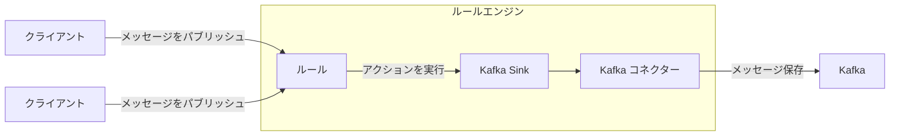
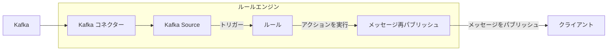

# データ統合

EMQXは、MQTTプロトコルを通じてIoTデバイスを接続し、リアルタイムでメッセージを送受信するMQTTメッセージングプラットフォームです。これを基盤として、EMQXのデータ統合は外部データシステムとの接続を導入し、デバイスと他の業務システムをシームレスに統合できるようにします。

データ統合では、SinkおよびSourceコンポーネントを使用して外部データシステムと接続します。SinkはMySQL、Kafka、HTTPサービスなどの外部データシステムへメッセージを送信するために使用され、SourceはMQTT、Kafka、GCP PubSubなどの外部データシステムからメッセージを受信するために使用されます。

この仕組みにより、EMQXは単なるIoTデバイス間のメッセージ送信を超え、デバイスが生成するデータを業務エコシステム全体に有機的に統合できます。IoTアプリケーションの適用シナリオを広げ、デバイスと業務システム間のやり取りを豊かで多様なものにします。

::: tip 注意

- EMQX v5.4.0以降、従来のデータブリッジはデータフローの方向に応じて分割され、SinkおよびSourceに名称変更されました。

- 現時点でEMQXがSourceとしてサポートする外部データシステムは以下の通りです：

  - MQTTサービス
  - Kafka
  - GCP PubSub

:::

本ページでは、SinkおよびSourceの動作原理、対応する外部データシステム、主な機能、管理方法について包括的に解説します。

## 動作原理

EMQXのデータ統合は標準搭載機能です。MQTTメッセージングプラットフォームとして、EMQXはMQTTプロトコルを介してIoTデバイスからデータを受信します。組み込みのルールエンジンの助けを借りて、受信データはルールエンジンに設定されたルールにより処理されます。ルールは処理済みデータを設定されたSink/Sourceを通じて外部データシステムに転送するアクションをトリガーします。ダッシュボード上の[Rules](./rule-get-started.md)や[Flowデザイナー](../flow-designer/introduction.md)を使って、コーディング不要で簡単にルール作成、アクションの紐付け、Sink/Sourceの作成が可能です。

### 組み込みルールエンジン

さまざまなIoTデバイスやシステムからのデータソースは、多種多様なデータ型やフォーマットを持ちます。EMQXはSQLルールに基づく強力な組み込みルールエンジンを備えており、データ処理と配信の中核コンポーネントです。ルールエンジンは条件判定、文字列操作、データ型変換、圧縮/解凍など幅広い機能を持ち、複雑なデータを柔軟に扱えます。

クライアントが特定イベントをトリガーしたりメッセージがEMQXに到達すると、ルールエンジンは事前定義されたルールに従いリアルタイムでデータを処理します。データ抽出、フィルタリング、付加情報付与、フォーマット変換などを行い、処理済みデータを指定されたSinkへ転送します。

ルールエンジンの詳細な動作は[ルールエンジン](./rules.md)章をご参照ください。

### Sink

Sinkはルールの[action](./rules.md)に追加されるデータ出力コンポーネントです。デバイスがイベントをトリガーしたりメッセージがEMQXに到着すると、システムは対応するルールをマッチングして実行し、データをフィルタリング・処理します。ルールエンジンで処理されたデータは指定されたSinkに転送されます。Sinkでは`${var}`や`${.var}`構文を用いてデータから変数を抽出し、動的にSQL文やデータテンプレートを生成するなどの処理を設定できます。その後、対応する[コネクター](./connector.md)を通じて外部データシステムにデータを送信し、メッセージの保存、データ更新、イベント通知などの操作を可能にします。



Sinkでサポートされる変数抽出構文は以下の通りです：

- `${var}`：ルールの出力結果から変数を抽出する構文です。例：`${topic}`。ネストされた変数を抽出したい場合はドット`.`を使い`${payload.temp}`のように記述します。抽出対象の変数が出力結果に含まれない場合は文字列`undefined`が返されます。
- `${.}`, `${.var}`：`${.}`はルールの出力結果すべてを含むJSON文字列を抽出し、`${.var}`は`${var}`と同じ意味です。

### Source

Sourceはデータ入力コンポーネントであり、ルールの[data source](./rule-sql-events-and-fields.md)として機能し、ルールのSQLで選択されます。

SourceはMQTTやKafkaなどの外部データシステムからメッセージをサブスクライブまたはコンシュームします。コネクターを通じて新しいメッセージが到着すると、ルールエンジンは対応するルールをマッチングして実行し、データをフィルタリング・処理します。処理済みデータは指定されたEMQXトピックにパブリッシュされ、クラウドコマンドの配信などの操作が可能になります。



## 対応統合

EMQXは以下の種類のデータシステムとのデータ統合をサポートしています：

**デフォルト**

- [MQTT](./data-bridge-mqtt.md)
- [Webhook](./webhook.md)/[HTTPServer](./data-bridge-webhook.md)

**クラウド**

- [Amazon Kinesis](./data-bridge-kinesis.md)
- [Azure EventHub](./data-bridge-azure-event-hub.md)
- [GCP PubSub](./data-bridge-gcp-pubsub.md)

**TSDB**

- [Apache IoTDB](./data-bridge-iotdb.md)
- [InfluxDB](./data-bridge-influxdb.md)
- [OpenTSDB](./data-bridge-opents.md)
- [TimescaleDB](./data-bridge-timescale.md)
- [Datalayers](./data-bridge-datalayers.md)

**SQL**

- [Cassandra](./data-bridge-cassa.md)
- [Microsoft SQL Server](./data-bridge-sqlserver.md)
- [MySQL](./data-bridge-mysql.md)
- [Oracle](./data-bridge-oracle.md)
- [PostgreSQL](./data-bridge-pgsql.md)
- [Lindorm](./lindorm)
- [Doris](./apache-doris)

**NoSQL**

- [ClickHouse](./data-bridge-clickhouse.md)
- [Couchbase](./data-bridge-couchbase.md)
- [DynamoDB](./data-bridge-dynamo.md)
- [Greptime](./data-bridge-greptimedb.md)
- [MongoDB](./data-bridge-mongodb.md)
- [Redis](./data-bridge-redis.md)
- [TDengine](./data-bridge-tdengine.md)
- [Elasticsearch](./elasticsearch.md)

**メッセージキュー**

- [Apache Kafka/Confluent](./data-bridge-kafka.md)
- [HStreamDB](./data-bridge-hstreamdb.md)
- [Pulsar](./data-bridge-pulsar.md)
- [RabbitMQ](./data-bridge-rabbitmq.md)
- [RocketMQ](./data-bridge-rocketmq.md)

**その他**

- [SysKeeper](./syskeeper.md)
- [Amazon S3](./s3.md)
- [Amazon S3 Tables](./s3-tables.md)
- [Azure Blob Storage](./azure-blob-storage.md)
- [Snowflake](./snowflake.md)
- [Disk Log](./disk-log.md)

## Sinkの特徴

Sinkは以下の機能により利便性を高め、データ統合のパフォーマンスと信頼性を向上させます。すべてのSinkがこれらの機能を完全に実装しているわけではありません。詳細は各Sinkのドキュメントをご参照ください。

### 非同期リクエストモード

非同期リクエストモードは、メッセージのパブリッシュ・サブスクライブ処理がSinkの実行速度に影響されないよう設計されています。ただし、非同期リクエストモードを有効にすると、サブスクライバーがメッセージを受信していても、まだ外部データシステムに書き込まれていない場合があります。

EMQXはデータ処理効率を高めるため、非同期リクエストモードをデフォルトで有効にしています。メッセージの配信タイミングをサブスクライバーや外部データシステムに厳密に求める場合は、非同期リクエストモードを無効にしてください。

`max_inflight`パラメータも非同期リクエスト時のメッセージ順序に影響します。一部のSinkにこのパラメータがあり、非同期モードで同一MQTTクライアントからのメッセージを順序通りに処理する必要がある場合は、この値を1に設定する必要があります。

### バッチモード

バッチモードは複数のデータエントリーをまとめて外部データ統合システムに書き込む機能です。バッチモードが有効になると、EMQXは各リクエストのデータ（単一エントリー）を一時的に蓄積し、一定時間経過または一定数のデータが蓄積された後にまとめて書き込みます（いずれも設定可能）。

**利点：**

- 書き込み効率の向上：単一メッセージ書き込みに比べ、バッチモードはデータベースシステムがメッセージをキャッシュまたは事前処理できるため、書き込み効率が向上します。
- ネットワークレイテンシの低減：バッチ書き込みはネットワーク送信回数を減らし、レイテンシを低減します。

**課題：**

書き込み遅延：設定された時間またはエントリー数に達するまでデータの書き込みが遅延します。これらの設定はパラメータで調整可能です。

### バッファキュー

バッファキューはSinkに一定のフォールトトレランスを提供し、データ安全性向上のため有効化が推奨されます。

各リソース接続（MQTT接続ではありません）にはバッファキュー長（容量サイズ）があり、これを超えたデータはFIFO原則に従い破棄されます。

#### バッファファイルの場所

Kafka Sinkの場合、ディスクキャッシュファイルは`data/kafka`にあります。その他のSinkでは`data/bufs`にあります。

実際の運用では、`data`ディレクトリを高性能ディスクにマウントすることでスループットを向上できます。

### プリペアドステートメント

MySQLやPostgreSQLなどのSQLデータベースでは、SQLテンプレートはフィールド変数を明示的に指定せずに事前処理実行されます。

SQLを直接実行する場合、トピックとペイロードを文字列型、QoSを整数型としてシングルクォートで明示的に指定する必要があります：

```sql
INSERT INTO msg(topic, qos, payload) VALUES('${topic}', ${qos}, '${payload}');
```

しかし、プリペアドステートメントをサポートするSinkでは、SQLテンプレートは必ずクォートなしのプリペアドステートメントを使用します：

```sql
INSERT INTO msg(topic, qos, payload) VALUES(${topic}, ${qos}, ${payload});
```

プリペアドステートメント技術はフィールド型を自動推論するだけでなく、SQLインジェクションを防止しセキュリティを強化します。

### フォールバックアクション

EMQX 5.9.0以降、任意のアクションに対してフォールバックアクションのセットを定義できます。プライマリアクションがメッセージ処理に失敗した場合、これらのフォールバックアクションがトリガーされます。この仕組みにより、メッセージを別のSinkや再パブリッシュアクションなどの二次ターゲットにリダイレクトし、データの信頼性と可観測性を向上させます。

フォールバックアクションの用途例：

- 失敗したメッセージをバックアップデータシステム（例：別のSink）に転送
- 失敗メッセージを監視トピックに再パブリッシュしトラブルシューティングやアラートに活用
- プライマリアクションの一時的な問題によるデータ損失を最小化

#### 主な特徴

- フォールバックアクションはプライマリアクションがメッセージ処理に失敗した場合のみトリガーされます。失敗には配信エラー、バッファオーバーフロー、リクエストTTL切れが含まれます。
- フォールバックアクションは自身の設定に関わらず常に非同期リクエストモードで動作します。
- 定義されたすべてのフォールバックアクションは同時にトリガーされます。EMQXは順次試行したり最初の成功で停止しません。
- フォールバックアクションは通常アクションと同じバッファリング機構を共有し、メッセージはリクエストTTLまたはバッファオーバーフローまでリトライされます。
- フォールバックアクションはさらにフォールバックアクションをトリガーしません。フォールバックアクション自身が失敗しても、その設定されたフォールバックはトリガーされません。
- フォールバックアクションによるメッセージ処理はプライマリアクションや元のルールのメトリクスに影響しません。

#### フォールバックアクションの定義例

HTTPアクション`my_http`に対してフォールバックアクションを定義し、既存のMQTTアクション`fallback`を利用する場合の設定例です：

```hcl
actions {
  http {
    my_http {
      fallback_actions = [
        {kind = reference, type = mqtt, name = fallback},
        {
          kind = republish,
          args {
            topic = "fallback/republish/topic"
            qos = 1
            payload = "${payload}"
          }
        }
      ]
      # その他の設定は省略
    }
  }
  mqtt {
    fallback {
      fallback_actions = [
        {kind = reference, type = mqtt, name = another_fallback}
      ]
      # その他の設定は省略
    }
  }
}
```

この例では：

- HTTPアクション`my_http`が失敗した場合、メッセージは以下に転送されます：
  - MQTTアクション`fallback`
  - トピック`fallback/republish/topic`へ再パブリッシュ
- `fallback`も失敗した場合、`fallback`に定義されたフォールバックアクション`another_fallback`はトリガーされません。フォールバックアクションは再帰的なチェーンをサポートしません。
- ただし、`fallback`が別ルールのプライマリアクションとしてトリガーされ失敗した場合は、そのフォールバック`another_fallback`が適用されます。

## Sinkの状態と統計情報

ダッシュボードでSinkの稼働状態や統計情報を確認し、正常に動作しているか把握できます。

### 稼働状態

Sinkは以下の状態を持ちます：

- `connecting`：ヘルスプローブが行われる前の初期状態で、ブリッジが外部データシステムへの接続を試行中
- `connected`：Sinkが正常に接続され稼働中。ヘルスプローブが失敗した場合、失敗の程度に応じて`connecting`または`disconnected`に遷移することがあります
- `disconnected`：ヘルスプローブに失敗し非正常状態。設定により自動的に再接続を試みる場合があります
- `stopped`：手動で無効化された状態
- `inconsistent`：クラスター内ノード間でSinkの状態に不整合がある状態

### 稼働統計

EMQXはデータ統合の稼働統計を以下のカテゴリで提供します：

- Matched（カウンター）
- Sent Successfully（カウンター）
- Sent Failed（カウンター）
- Dropped（カウンター）
- Late Reply（カウンター）
- Inflight（ゲージ）
- Queuing（ゲージ）


#### Matched

`matched`はSinkにルーティングされたリクエスト/メッセージの数をカウントします。状態に関わらずカウントされます。各メッセージは最終的に他のメトリクスで計上されるため、`matched = success + failed + inflight + queuing + late_reply + dropped`となります。

#### Sent Successfully

`success`は外部データシステムに正常に受信されたメッセージ数をカウントします。`retried.success`は`success`のサブカウントで、配信が少なくとも一度リトライされたメッセージ数を追跡します。したがって、`retried.success <= success`です。

#### Sent Failed

`failed`は外部データシステムへの受信に失敗したメッセージ数をカウントします。`retried.failed`は`failed`のサブカウントで、配信が少なくとも一度リトライされたメッセージ数を追跡します。したがって、`retried.failed <= failed`です。

#### Dropped

`dropped`は配信試行なしで破棄されたメッセージ数をカウントします。複数の具体的なカテゴリに分類され、それぞれ破棄理由を示します。計算式は`dropped = dropped.expired + dropped.queue_full + dropped.resource_stopped + dropped.resource_not_found`です。

- `expired`：キューイング中にメッセージのTTLが切れた
- `queue_full`：キューの最大サイズに達し、メモリオーバーフロー防止のため破棄
- `resource_stopped`：Sinkが停止中に配信を試みたメッセージ
- `resource_not_found`：Sinkが存在しない状態で配信を試みたメッセージ。まれに発生し、Sink削除時の競合状態が原因

#### Late Reply

`late_reply`はメッセージ送信を試みたが、基盤ドライバーからの応答がメッセージTTL切れ後に到着した場合にインクリメントされます。

::: tip
`late_reply`はメッセージの送信成功・失敗を示すものではなく不明な状態です。外部データシステムへの挿入に成功した可能性もあれば失敗、あるいは接続タイムアウトの可能性もあります。
:::

#### Inflight

`inflight`はバッファリング層で現在送信中で外部データシステムからの応答を待っているメッセージ数を示します。

#### Queuing

`queuing`はバッファリング層で受信済みだがまだ外部データシステムに送信されていないメッセージ数を示します。
