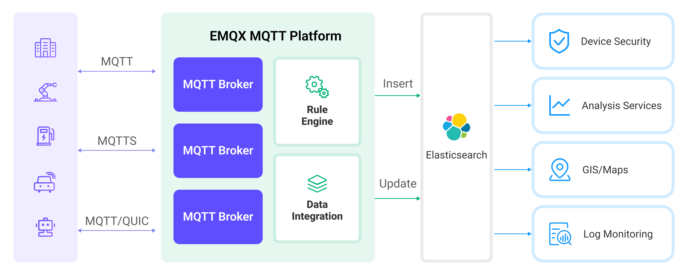

# ElasticsearchへのMQTTデータ取り込み

[Elasticsearch](https://www.elastic.co/elasticsearch/)は、分散型の検索およびデータ分析エンジンであり、多様なデータタイプに対して全文検索、構造化検索、および分析機能を提供します。EMQXとElasticsearchを統合することで、MQTTデータをElasticsearchにシームレスに取り込み、保存することが可能になります。この統合により、Elasticsearchの強力なスケーラビリティと分析機能を活用し、IoTアプリケーション向けに効率的かつスケーラブルなデータ保存および分析ソリューションを提供します。

本ページでは、EMQXとElasticsearch間のデータ統合について詳述し、ルールおよびSinkの作成方法について実践的なガイダンスを提供します。

## 動作概要

Elasticsearchとのデータ統合はEMQXの標準機能として提供されており、EMQXのデバイスアクセスおよびメッセージ転送機能とElasticsearchのデータ保存・分析機能を組み合わせています。簡単な設定により、MQTTデータのシームレスな統合が実現できます。



EMQXとElasticsearchは、リアルタイムのデバイスデータを効率的に収集・分析するためのスケーラブルなIoTプラットフォームを提供します。このアーキテクチャでは、EMQXがデバイスアクセス、メッセージ転送、データルーティングを担当するIoTプラットフォームとして機能し、Elasticsearchがデータ保存および分析プラットフォームとしてデータの保存、検索、分析を担います。

EMQXはルールエンジンとSinkを通じてデバイスデータをElasticsearchに転送し、Elasticsearchは強力な検索および分析機能を用いてレポートやチャートなどのデータ分析結果を生成し、Kibanaの可視化ツールを通じてユーザーに表示します。ワークフローは以下の通りです：

1. **デバイスメッセージのパブリッシュと受信**：IoTデバイスはMQTTプロトコルで接続し、特定のトピックにテレメトリや状態データをパブリッシュします。EMQXはこれを受信し、ルールエンジンで比較処理を行います。
2. **ルールエンジンによるメッセージ処理**：組み込みのルールエンジンを使用して、特定のトピックに基づくMQTTメッセージを処理します。ルールエンジンは対応するルールをマッチングし、データ形式の変換、特定情報のフィルタリング、コンテキスト情報の付加などの処理を行います。
3. **Elasticsearchへの書き込み**：ルールエンジンで定義されたルールがトリガーとなり、メッセージをElasticsearchに書き込む操作を実行します。Elasticsearch Sinkは柔軟な操作方法とドキュメントテンプレートを提供し、メッセージの特定フィールドを対応するインデックスに書き込みます。

デバイスデータがElasticsearchに書き込まれた後は、Elasticsearchの検索および分析機能を活用して以下のようなデータ処理が可能です：

1. **ログ監視**：IoTデバイスは大量のログデータを生成し、これをElasticsearchに送信して保存・分析できます。Kibanaなどの可視化ツールと連携し、デバイスの状態、稼働記録、エラーメッセージなどのリアルタイム情報をチャート化して表示可能です。これにより、開発者や運用者は潜在的な問題を迅速に特定・解決できます。
2. **地理情報（マップ）**：IoTデバイスは位置情報を生成することが多く、これをElasticsearchに保存できます。KibanaのMaps機能を使って、デバイスの位置情報を地図上に可視化し、追跡や分析が可能です。
3. **エンドポイントセキュリティ**：IoTデバイスのセキュリティログデータをElasticsearchに送信し、Elastic Securityと連携してセキュリティレポートを生成、デバイスのセキュリティ状況をリアルタイムで監視し、潜在的な脅威を検知・対応できます。

## 特長と利点

Elasticsearchとのデータ統合は、以下の特長と利点をビジネスにもたらします：

- **効率的なデータインデックス作成と検索**：ElasticsearchはEMQXからの大規模なリアルタイムメッセージデータを容易に処理可能です。強力な全文検索およびインデックス機能により、IoTメッセージデータの高速かつ効率的な検索・クエリが実現します。
- **データの可視化**：Elastic Stackの一部であるKibanaと連携し、IoTデータの強力なデータ可視化が可能となり、データの理解と分析を支援します。
- **柔軟なデータ操作**：EMQXのElasticsearch統合は、インデックス名、ドキュメントID、ドキュメントテンプレートの動的設定をサポートし、ドキュメントの作成、更新、削除を可能にします。これにより、より幅広いIoTデータ統合シナリオに対応できます。
- **スケーラビリティ**：ElasticsearchおよびEMQXはクラスターをサポートし、ノードを追加することで処理能力を容易に拡張でき、ビジネスの継続的な拡大を支援します。

## はじめる前に

このセクションでは、EMQXでElasticsearchデータ統合を作成する前に必要な準備作業として、Elasticsearchのインストールおよびインデックス作成について紹介します。

### 前提条件

- [ルール](./rules.md)の理解
- [データ統合](./data-bridges.md)の理解

### Elasticsearchのインストールとインデックス作成

EMQXはプライベートにデプロイされたElasticsearchおよびクラウド上のElasticと統合可能です。Elastic CloudまたはDockerを利用してElasticsearchインスタンスをデプロイできます。

1. Docker環境がない場合は、[Dockerをインストール](https://docs.docker.com/install/)してください。

2. X-Packセキュリティ認証を有効にしたElasticsearchコンテナを起動します。デフォルトのユーザー名は `elastic`、パスワードは `public` に設定します。

   ```bash
   docker run -d --name elasticsearch \
       -p 9200:9200 \
       -p 9300:9300 \
       -e "discovery.type=single-node" \
       -e "xpack.security.enabled=true" \
       -e "ELASTIC_PASSWORD=public" \
       docker.elastic.co/elasticsearch/elasticsearch:7.10.1
   ```

3. デバイスがパブリッシュするメッセージを保存するための `device_data` インデックスを作成します。Elasticsearchのユーザー名とパスワードは適宜置き換えてください。

   ```bash
   curl -u elastic:public -X PUT "localhost:9200/device_data?pretty" -H 'Content-Type: application/json' -d'
   {
     "mappings": {
       "properties": {
         "ts": { "type": "date" },
         "clientid": { "type": "keyword" },
         "payload": {
           "type": "object",
           "dynamic": true
         }
       }
     }
   }'
   ```

## コネクターの作成

Elasticsearch Sinkを追加する前に、Elasticsearchコネクターを作成する必要があります。

以下の手順は、EMQXとElasticsearchを同じローカルマシンで実行していることを前提としています。リモートで実行している場合は、設定を適宜調整してください。

1. ダッシュボードの **Integration** -> **Connectors** ページに移動します。
2. ページ右上の **Create** をクリックします。
3. コネクタータイプとして **Elasticsearch** を選択し、次へ進みます。
4. コネクター名を入力します。例として `my-elasticsearch` とします。名前は大文字・小文字・数字の組み合わせである必要があります。
5. デプロイ方法に応じてElasticsearch接続情報を入力します。
   - **URL**：ElasticsearchサービスのRESTインターフェースURLを `http://localhost:9200` のように入力します。
   - **Username**：Elasticsearchサービスのユーザー名を `elastic` と指定します。
   - **Password**：Elasticsearchサービスのパスワードを `public` と入力します。
6. ページ下部の **Create** ボタンをクリックしてコネクター作成を完了します。

これでコネクターが作成されました。次に、Elasticsearchに書き込むデータを指定するルールを作成します。

## Elasticsearch Sinkを用いたルールの作成

このセクションでは、EMQXでソースMQTTトピック `t/#` からのメッセージを処理し、処理結果を設定済みのSinkを通じてElasticsearchの `device_data` インデックスに書き込むルールの作成方法を示します。

1. ダッシュボードの **Integration** -> **Rules** ページに移動します。

2. 右上の **Create** をクリックします。

3. ルールIDに `my_rule` を入力し、SQLエディターに `t/#` トピックからのMQTTメッセージをElasticsearchに保存するルールSQLを入力します。ルールSQLは以下の通りです：

   ```sql
   SELECT
     clientid,
     timestamp as ts,
     payload
   FROM
       "t/#"
   ```

   ::: tip

   SQLに不慣れな場合は、**SQL Examples** と **Enable Debugging** をクリックしてルールSQLの結果を学習・テストできます。

   :::

4. **Add Action** をクリックし、**Action Type** ドロップダウンリストから `Elasticsearch` を選択します。**Action** ドロップダウンはデフォルトの `Create Action` のままにするか、既存のElasticsearchアクションを選択できます。この例では新しいSinkを作成し、ルールに追加します。

5. Sinkの名前と説明を入力します。

6. コネクタードロップダウンから先ほど作成した `my-elasticsearch` を選択します。ドロップダウン横のボタンをクリックすると、ポップアップで新しいコネクターを作成可能です。必要な設定パラメータは[コネクターの作成](#コネクターの作成)を参照してください。

7. JSON形式データ挿入用のドキュメントテンプレートを以下のように設定します：

   - **Action**：オプションの操作として `Create`、`Update`、`Delete` が選択可能です。

   - **Index Name**：操作対象のインデックス名またはインデックスエイリアス。`${var}` 形式のプレースホルダーが使用可能です。

   - **Document ID**：`Create` アクションでは任意、その他のアクションでは必須。インデックス内のドキュメントを一意に識別するID。`${var}` 形式のプレースホルダーが使用可能です。指定しない場合はElasticsearchが自動生成します。

   - **Routing**：ドキュメントを格納するインデックスのシャードを指定。空欄の場合はElasticsearchが決定します。

   - **Document Template**：カスタムドキュメントテンプレート。JSONオブジェクトに変換可能で、`${var}` 形式のプレースホルダーをサポートします。例：`{ "field": "${payload.field}"}` または `${payload}`。

   - **Max Retries**：書き込み失敗時の最大リトライ回数。デフォルトは3回。

   - **Overwrite Document**（`Create` アクション特有）：既存ドキュメントがある場合に上書きするかどうか。`No` の場合は書き込み失敗となります。

   - **Enable Upsert**（`Update` アクション特有）：更新対象のドキュメントが存在しない場合、挿入操作として扱い、指定ドキュメントを新規作成します。

   本例では、インデックス名を `device_data` に設定し、クライアントIDとタイムスタンプ `${clientid}_${ts}` の組み合わせをドキュメントIDとしています。ドキュメントにはクライアントID、現在のタイムスタンプ、メッセージ本文全体を格納します。ドキュメントテンプレートは以下の通りです：

   ```json
   {
     "clientid": "${clientid}",
     "ts": ${ts},
     "payload": ${payload}
   }
   ```

8. **フォールバックアクション（任意）**：メッセージ配信失敗時の信頼性向上のため、1つ以上のフォールバックアクションを定義できます。これらはプライマリSinkがメッセージ処理に失敗した場合にトリガーされます。詳細は[フォールバックアクション](./data-bridges.md#fallback-actions)を参照してください。
9. その他のパラメータはデフォルト値のままにします。
10. **Create** ボタンをクリックしてSink作成を完了します。新しいSinkが **Action Outputs** に追加されます。
11. ルール作成ページに戻り、**Create** ボタンをクリックしてルール全体の作成を完了します。

これでルールの作成が完了しました。**Rules** ページで新規作成したルールを確認でき、**Actions (Sink)** タブで新しいElasticsearch Sinkを確認できます。

また、**Integration** -> **Flow Designer** をクリックするとトポロジーを視覚的に確認できます。トポロジーは `t/#` トピックからのメッセージがルール `my_rule` によって解析され、Elasticsearchに書き込まれる流れを示しています。

## ルールのテスト

MQTTXを使用して `t/1` トピックにメッセージをパブリッシュします：

```bash
mqttx pub -i emqx_c -t t/1 -m '{"temp":24,"humidity":30}'
```

Sinkの動作統計を確認すると、ヒット数および送信成功数がそれぞれ +1 されていることがわかります。

`_search` APIを使ってインデックス内のドキュメント内容を確認し、`device_data` インデックスにデータが書き込まれているかをチェックします：

```bash
curl -X GET "localhost:9200/device_data/_search?pretty"
```

正しい応答結果は以下のようになります：

```json
  "took" : 1098,
  "timed_out" : false,
  "_shards" : {
    "total" : 1,
    "successful" : 1,
    "skipped" : 0,
    "failed" : 0
  },
  "hits" : {
    "total" : {
      "value" : 1,
      "relation" : "eq"
    },
    "max_score" : 1.0,
    "hits" : [
      {
        "_index" : "device_data",
        "_type" : "_doc",
        "_id" : "emqx_c_1705479455289",
        "_score" : 1.0,
        "_source" : {
          "clientid" : "emqx_c",
          "ts" : 1705479455289,
          "payload" : {
            "temperature": 24,
            "humidity": 30
          }
        }
      }
    ]
  }
}
```

<!-- ## 高度な設定-->

<!-- TODO -->
