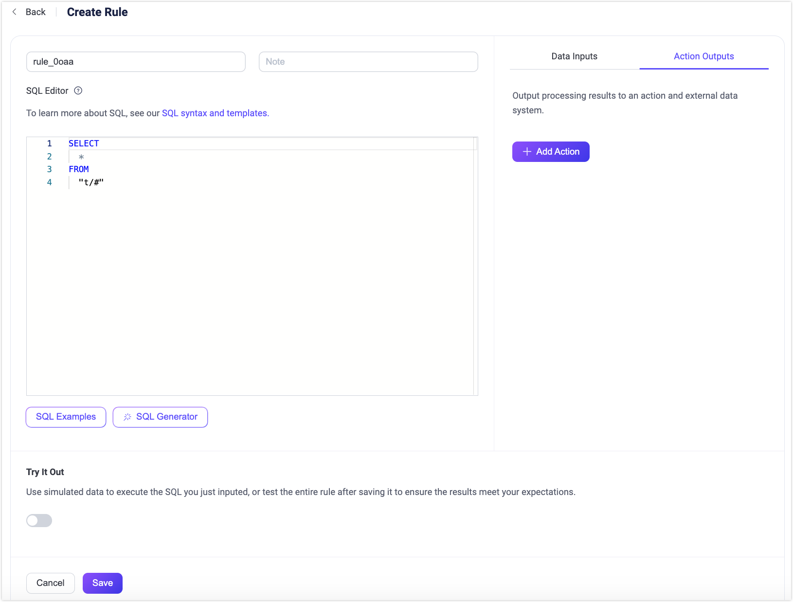
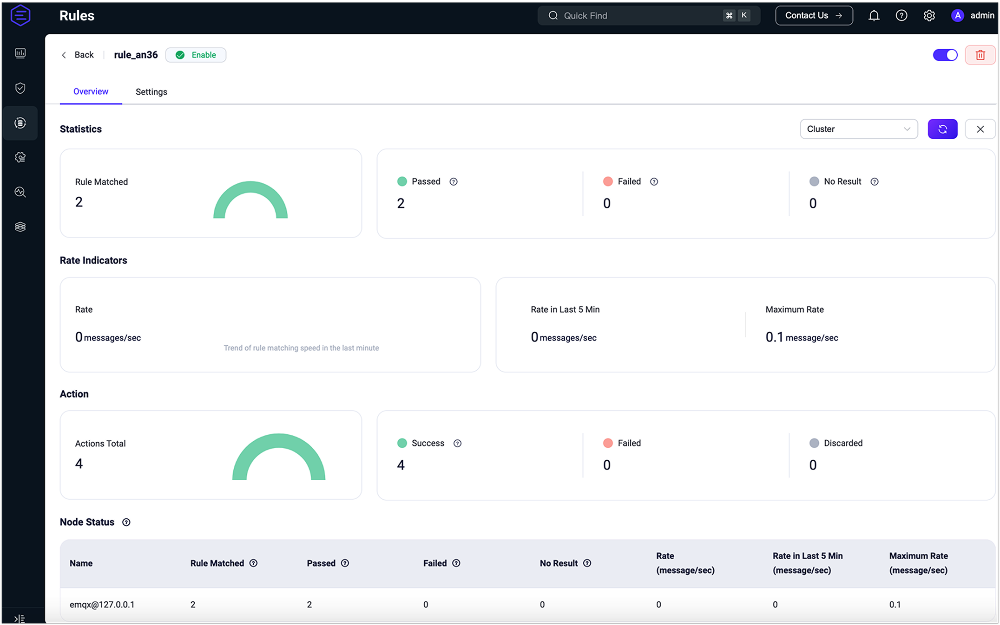
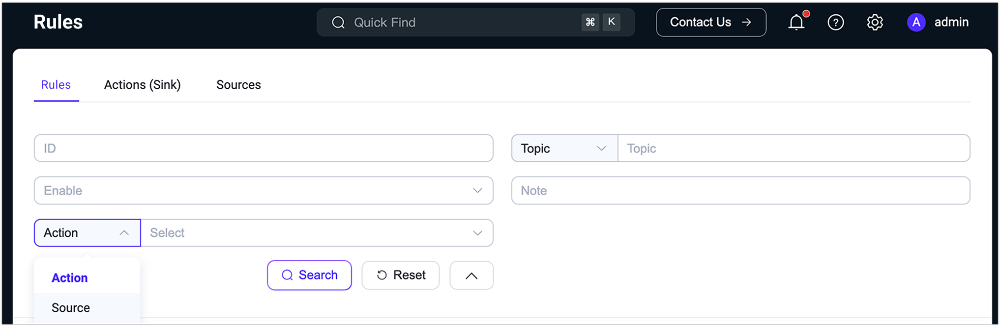
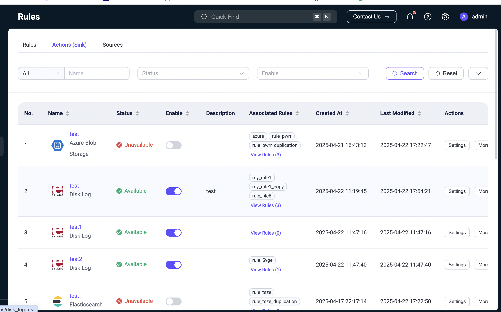
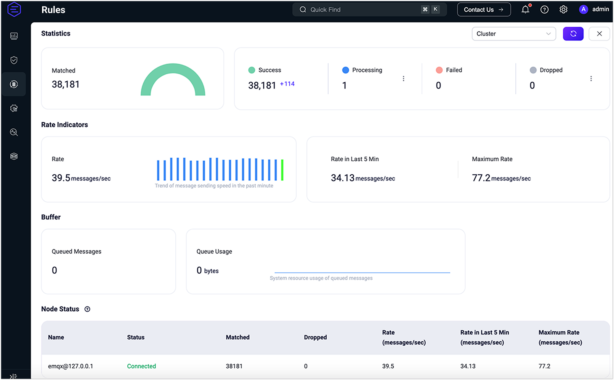

# ルールの作成

このページでは、EMQXダッシュボードを使用してデータ処理のルールを作成し、ルールにアクションを追加する方法について説明します。また、ルールのテスト方法や作成後のルールの確認方法も紹介します。

このページのデモでは、リパブリッシュアクションを例に取り、トピック `t/#` で受信したメッセージを処理し、トピック `a/1` にリパブリッシュするルールの作成方法を説明します。ただし、「コンソールへの結果出力」や「Sinksによる転送」についても[アクションの追加](#add-actions)で触れています。

## ルールSQLの定義
EMQXダッシュボードにログインし、左側のナビゲーションメニューから **Integration** -> **Rules** をクリックします。

**Rules** ページで **Create** ボタンをクリックすると、**Create Rule** ページに遷移します。ここでルールのデータソースを定義し、フィルタリングされたメッセージに対してどのようなアクションを実行するかを決定します。

ルール名を入力し、管理しやすいようにメモを追加してください。**SQL Editor** では、ビジネスニーズに合わせてデータソースを追加するためのステートメントをカスタマイズできます。このチュートリアルでは、デフォルト設定のままにしておきます。これは、`"t/#"` パターンにマッチするすべてのトピック（例：`t/a`、`t/a/b`、`t/a/b/c`など）に属するメッセージを選択して返します。

::: tip

このチュートリアルではメッセージのペイロードがJSON形式であることを前提としています。もし他の形式の場合は、[スキーマレジストリ](./schema-registry.md)を使ってデータ型を変換できます。

EMQXには豊富なSQLステートメントのサンプルが組み込まれており、**SQL Editor** 下の **SQL Examples** ボタンから参照可能です。SQLの構文や使用方法の詳細は[SQL Syntax](./rule-sql-syntax.md)をご覧ください。

:::



### SQLジェネレーター

EMQX 5.10.0以降、SQL EditorはAIを活用した自然言語によるSQL生成機能（SQLジェネレーター）をサポートしています。この機能により、自然言語で意図を記述すると、システムが適切なSQLステートメントを自動生成します。

SQLジェネレーターはデフォルトで有効です。ダッシュボード右上の **Settings** メニューからトグルスイッチで無効化できます。

利用手順は以下の通りです：

1. **Create Rule** ページの **SQL Editor** セクションに移動します。

2. エディタ下の **SQL Generator** ボタンをクリックして **Generate SQL with AI** ダイアログを開き、以下の項目を指定します：

   - **Task Description**（必須）：SQLに実行してほしい内容を自然言語で記述します。

     例：
     *「MQTTメッセージのメタデータから `clientid` を抽出し、ペイロードから `device_id` と `temperature` を抽出する。トピック `sensors/temperature` のメッセージで温度が30度を超える場合のみ適用する。」*

   - **Related Topics**（任意）：`sensors/temperature` のようなトピックフィルターを指定します。

   - **Input Example (JSON)**（任意だが推奨）：AIがデータ構造を理解しやすいように、サンプルのMQTTメッセージペイロードを提供します。
     例：

     ```json
     {
       "device_id": "sensor001",
       "temperature": 32.5,
       "unit": "C"
     }
     ```

   - **Output Example (JSON)**（任意）：期待する出力結果の形式を指定します。
     例：

     ```json
     {
       "clientid": "client_a1b2c3",
       "device_id": "sensor001",
       "temperature": 32.5
     }
     ```

     ::: tip

     入力・出力例を含めることで、生成されるSQLの精度が向上します。

     :::

3. **Generate** をクリックして生成されたSQLをプレビューします。

4. プレビュー画面では、

   - 生成されたSQLを確認・手動編集できます。
   - **Apply SQL** をクリックするとSQL Editorに挿入されます。
   - **Back to Form** をクリックすると入力内容を修正して再生成できます。

5. SQL Editorに挿入すると、SQLが自動的に表示され、さらに編集可能です。

#### 出力例

上記のタスクと入力例を使うと、生成されるSQLは以下のようになります。

```sql
SELECT
  clientid,
  payload.device_id AS device_id,
  payload.temperature AS temperature
FROM
  "sensors/temperature"
WHERE
  payload.temperature > 30
```

このルールは、`sensors/temperature` トピックのメッセージから `clientid`、`device_id`、`temperature` を抽出し、温度が30度を超える場合のみ対象とします。

#### SQLジェネレーターを使うべき場合

- EMQXのSQL構文に不慣れな場合
- ルールのプロトタイプを素早く作成したい場合
- 構造化されたJSONペイロードを扱う場合

より詳細なカスタマイズや構文オプションについては、[Rule SQL Syntax](./rule-sql-syntax.md)をご覧ください。

### SQLステートメントのテスト

SQLステートメントはシミュレートデータを使って実行テストできます。アクションを追加してルールを作成する前に、SQLの実行結果が期待通りか確認できます。これは任意のステップですが、EMQXルール初心者には推奨されます。ルール全体の実行テストを行いたい場合は、[ルールのテスト](#test-rules)を参照してください。

SQLステートメントをテストする手順は以下の通りです：

1. **Create Rule** ページで **Try It Out** トグルスイッチをオンにしてSQLテストを有効化します。
2. SQLに合致する **Data Source** を選択し、ルールの指定元（FROM句）と一致していることを確認します。
3. テストデータを入力します。データソースを選択すると、EMQXが **Client ID**、**Username**、**Topic**、**QoS**、**Payload** などのすべてのシミュレートデータフィールドにデフォルト値を提供します。必要に応じて適切な値に変更してください。
4. **Run Test** ボタンをクリックしてテストを実行します。正常に動作すれば **Test Passed** のメッセージが表示されます。


SQLの処理結果はJSON形式で **Output Result** セクションに表示されます。SQL処理結果のすべてのフィールドは、後続のアクション（組み込みアクションやSink）で `${key}` の形で参照可能です。フィールドの詳細は[SQL Data Sources and Fields](./rule-sql-events-and-fields.md)を参照してください。

このデモではペイロードがJSON形式であることを前提としていますが、実際には[スキーマレジストリ](./schema-registry.md)を使って他形式のメッセージも処理可能です。

次に、**Create Rule** ページ右側の **Add Action** ボタンをクリックして、ルールにさまざまなタイプのアクションを追加できます。

## アクションの追加

**Create Rule** ページで右側の **Add Action** ボタンをクリックすると、**Add Action** ページが表示されます。**Action** ドロップダウンリストから、リパブリッシュ、コンソール出力、データブリッジによる転送の3種類のアクションを選択できます。


### リパブリッシュアクションの追加

このセクションでは、トピック `t/#` で受信した元のメッセージを別のトピック `a/1` にリパブリッシュするアクションの追加方法を説明します。

**Add Action** ページで、**Type of Action** ドロップダウンから **Republish** を選択し、以下の設定を行ってから **Add** ボタンをクリックして確定します：

- **Topic**：転送先トピックを設定します。例では `"a/1"`。

- **QoS**：リパブリッシュするメッセージのQoSを設定します。例では `"0"`。

- **Retain**：このメッセージをリテインメッセージとして転送するかどうかを設定します。このチュートリアルではデフォルトの **false** のままにします。

- **Payload**：`${payload}` と入力し、リパブリッシュするメッセージのペイロードが元のメッセージと同じであることを示します。

- **MQTT 5.0 メッセージプロパティ**：トグルスイッチをクリックしてユーザープロパティやMQTTプロパティを必要に応じて設定できます。これにより、リパブリッシュメッセージに豊富なメタデータを付加できます。

  - **Payload Format Indicator**：メッセージのペイロードが特定の形式かどうかを示す値を入力します。`false` の場合は不定のバイト列とみなされ、`true` の場合はUTF-8エンコードされた文字データとみなされます。これによりMQTTクライアントやサーバーがメッセージ内容を効率的に解析できます。

  - **Message Expiry Interval**：秒単位でメッセージの有効期限を指定します。この時間を過ぎるとメッセージは無効とみなされます。

  - **Content Type**：リパブリッシュメッセージのペイロードのタイプや形式（MIMEタイプ）を指定します。例：`text/plain`（テキストファイル）、`audio/aac`（音声ファイル）、`application/json`（JSON形式のアプリケーションメッセージ）など。

  - **Response Topic**：レスポンスメッセージをパブリッシュする特定のMQTTトピックを指定します。例：`response/my_device`。

  - **Correlation Data**：レスポンスメッセージと元のリクエストメッセージを関連付けるための一意識別子やデータを入力します。例：リクエストIDやトランザクションIDなど。

- **Direct Dispatch**：トグルスイッチで直接ディスパッチを有効・無効にします。有効にすると、メッセージはサブスクライバーに直接ディスパッチされ、意図しない動作（追加ルールのトリガーや同一ルールの再帰的発火）を防止します。

**Create Rule** ページで下部の **Create** ボタンをクリックしてルール作成を完了します。このルールは **Rule** ページに新規エントリとして追加されます。

::: tip
リパブリッシュアクションは元のメッセージの配信を妨げません。例えば、トピック `"t/1"` のメッセージはルールによりトピック `"a/1"` にリパブリッシュされますが、同時に `"t/1"` のメッセージは `"t/1"` をサブスクライブしているクライアントにも配信され続けます。
:::

### コンソール出力アクションの追加

::: tip
コンソール出力アクションはデバッグ目的でのみ使用してください。本番環境で使用するとパフォーマンス問題を引き起こす可能性があります。
:::

コンソール出力アクションはルールの出力結果を確認するために使います。結果メッセージはコンソールまたはログファイルに出力されます。

- EMQXが `console` または `foreground` モードで起動している場合（Docker環境のデフォルトは `foreground`）、出力はコンソールに向けられます。
- systemd経由で起動している場合は、出力はジャーナルシステムにキャプチャされ、`journalctl` コマンドで確認可能です。

出力形式は以下の通りです：

```bash
[rule action] rule_id1
    Action Data: #{key1 => val1}
    Envs: #{key1 => val1, key2 => val2}
```

- `[rule action]` はリパブリッシュアクションがトリガーされたルールIDです。
- `Action Data` はルールの出力結果で、アクション実行時に渡されるデータやパラメータ（リパブリッシュアクション設定時のペイロード部分）を示します。
- `Envs` はリパブリッシュ時に設定される環境変数で、データソースやアクション実行に関連する内部情報を含みます。

### Sinksによる転送アクションの追加

処理結果をSinksを使って転送するアクションも追加可能です。ダッシュボードの **Type of Action** ドロップダウンリストから対象のSinkを選択するだけです。EMQXの各Sinkの詳細は[データ統合](./data-bridges.md)を参照してください。

## ルールのテスト

ルールエンジンはルールテスト機能を提供しており、シミュレートデータや実際のクライアントデータを使ってルールをトリガーし、ルールSQLを実行し、追加したすべてのアクションを実行して各ステップの結果を取得できます。

ルールをテストすることで、期待通りに動作するか検証でき、問題の早期発見・解決が可能です。これにより開発効率が向上し、本番環境での障害を回避できます。

### テスト手順

1. **Try It Out** スイッチをオンにし、テスト対象を **Rule** に設定します。テスト開始前にルールを保存しておく必要があります。
2. **Start Test** ボタンをクリックしてテストを開始します。ブラウザはルールがトリガーされるのを待ち、テスト結果を取得します。
3. ルールをトリガーしてテストします。以下の2つの方法があります：
   - **シミュレートデータを使う**：**Input Simulated Data** ボタンをクリックし、SQLに合致する **Data Source** を選択してルールの指定元（FROM句）と一致していることを確認します。EMQXはすべてのフィールド（**Client ID**、**Username**、**Topic**、**QoS**、**Payload**など）にデフォルト値を提供します。必要に応じて変更し、**Submit Test** ボタンをクリックして一度だけルールをトリガーします。
   - **実機デバイスのデータを使う**：ページを開いたままにし、実際のクライアントやMQTTクライアントツールでEMQXに接続し、対応するイベントを発生させてテストします。
4. テスト結果を確認します。ルールがトリガーされると、ダッシュボードに実行結果が出力され、各ステップの詳細な実行結果が表示されます。

### テスト例

[MQTTX](https://mqttx.app/)を使ってリパブリッシュアクションのルールをテストできます。クライアントを1つ作成し、そのクライアントでトピック `a/1` をサブスクライブし、トピック `t/1` にメッセージを送信します。ダイアログボックスにこのメッセージがトピック `a/1` にリパブリッシュされたことが表示されます。

MQTTXクライアントツールとEMQXの接続方法の詳細は、[MQTTX - Get Started](https://mqttx.app/docs/get-started)を参照してください。


対応して、ダッシュボードのテスト画面にはルール全体の実行結果が表示され、以下の内容が含まれます：

- 左側にはルールの実行記録が表示されます。ルールがトリガーされるたびに記録が生成され、クリックすると該当メッセージやイベントの詳細に切り替わります。
- 右側には選択したルールのアクション記録一覧が表示され、クリックするとアクションの実行結果やログが展開されます。

ルールSQLやアクションの実行に失敗した場合、該当のルール記録は失敗としてマークされます。記録を選択するとエラー情報を確認でき、トラブルシューティングに役立ちます。


上記例では、ルールが4回トリガーされ、3回は完全に成功し、4回目は **HTTP Server** アクションの実行失敗（ステータスコード302のレスポンス）が原因で失敗しています。

ルールテストの詳細な活用方法はブログ[データ統合の安定性向上：EMQXプラットフォームE2Eルールテストガイド](https://www.emqx.com/en/blog/emqx-platform-e2e-rule-testing-guide)を参照してください。

## ルールの確認

**Rules** ページには作成済みのすべてのルールが一覧表示されます。

一覧の各エントリには、ルールID、関連するソース、有効状態、アクション数などの基本情報が表示されます。ソースにカーソルを合わせると対応するSQLステートメントの詳細が表示されます。ルールの設定を変更するには、**Actions** 列の **Settings** をクリックします。**More** ボタンからルールの複製や削除も可能です。


また、[Flowデザイナー](../flow-designer/introduction.md)の **Integration** -> **Flow Designer** からもルールを確認できます。**Rules** ページで作成したルールとFlowデザイナーで作成したルールは完全に相互運用可能です。

ルールの統計情報やアクション実行情報を確認するには、**Rules** ページのルールID、または **Flows** ページのルール名をクリックします。


::: tip

ルールアクションの更新やデータソースの再定義を行うと、以下のページに表示される統計情報はリセットされ、新たに集計が開始されます。

:::



### ルールの検索

ルールが多数ある場合は、フィルター機能を使って表示したいルールを絞り込めます。ルールID、受信メッセージのトピックやワイルドカード、有効状態、ルールメモ、ルールに関連付けられたアクションやソースでフィルター可能です。



### アクション（Sink）とソースの確認

**Rule** ページの **Actions (Sink)** タブと **Sources** タブには、作成済みのすべてのアクション（Sink）とソースが表示されます。名前、接続状態、関連ルール、有効状態、作成日時、最終更新日時などの重要な情報が一覧で確認でき、列名横の矢印をクリックして並べ替えも可能です。

**Enable** 列のトグルスイッチでSinkやソースの有効・無効を切り替えられます。**Associated Rules** 列の **View Rules** をクリックすると、そのSinkやソースを含むルール一覧が表示され、データ統合設定の管理が容易になります。

**Action** 列からは、Sinkやソースの再接続や設定変更が可能です。**More** からは削除や、それらを使った新規ルール作成が行えます。

多数のSinkやソースがある場合は、フィルター機能で名前、状態、有効状態などで絞り込みが可能です。



Sinkやソースの統計情報やレート指標を確認するには、名前をクリックします。


