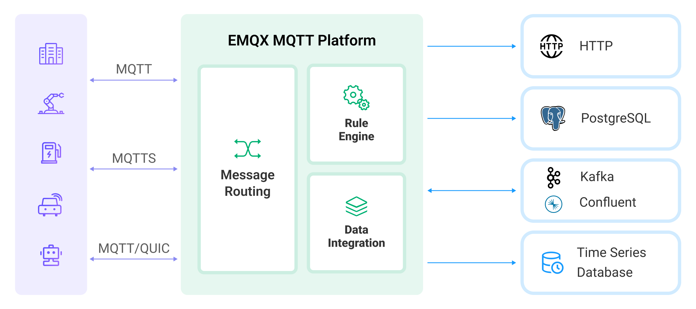

# ルールエンジン

EMQXは、データ処理のためのルールエンジン機能を提供しており、[データインテグレーション](./data-bridges.md)と連携してIoTデータの抽出、フィルタリング、強化、変換、保存を実現します。これにより、アプリケーション統合が加速され、ビジネスのイノベーションを促進します。



EMQXのルールエンジンは、特に受信メッセージの変換やルーティングに有効です。たとえば、不要なデータをフィルタリングし、変換を行い、特定のイベントや条件に基づいてアラートや通知をトリガーするルールを作成できます。

本章では、ルールエンジンの詳細とその機能について解説します。

## ルールエンジンの仕組み

ルールは、**データソース**からどのようにデータを取得し、**データ変換**を行い、その結果に対してどのような**アクション**を適用するかを指定します。


- **データソース**：ルールのデータソースはメッセージ、イベント、または外部データシステムが対象となります。ルールのSQLの`FROM`句でデータソースを指定し、`WHERE`句で処理対象となるメッセージに追加の制約を設定します。

  対応するデータソースの種類や`WHERE`句で参照可能なフィールドの詳細は、[データソースとフィールド](./rule-sql-events-and-fields.md)をご参照ください。

- **データ変換**：データ変換は入力メッセージを変換する処理を指します。SQLの`SELECT`部分で入力メッセージからデータを抽出・変換します。埋め込みSQLのサンプル文を用いて、出力メッセージにタイムスタンプを付加するなど高度な変換も可能です。

  文法や組み込みSQL関数の詳細は、[ルールSQLリファレンス](./rule-sql-syntax.md)および[組み込みSQL関数](./rule-sql-builtin-functions.md)をご覧ください。

- **アクション**：入力が指定されたルールに従って処理された後、そのSQL実行結果に対して1つ以上のアクションを定義できます。ルールエンジンは順次対応するアクションを実行し、処理結果をデータベースに保存したり、別のMQTTトピックに再パブリッシュしたりします。対応するアクションは以下の通りです。

  - [メッセージの再パブリッシュ](./rule-get-started.md#add-republish-action)：結果を指定したMQTTトピックにパブリッシュする。
  - [コンソール出力](./rule-get-started.md#add-console-output-action)：結果をコンソールやログに出力する。
  - [シンクへの転送](./data-bridges.md#add-forwarding-with-sinks-action)：結果をMQTTサービス、Kafka、PostgreSQLなどの外部データシステムに送信する。

EMQXダッシュボードでのルール作成手順については、[ルールの作成](./rule-get-started.md)をご参照ください。

## ルールSQLの例

ルールSQLは、ルールのデータソースを指定し、データ処理の手順を定義するために使用されます。以下はSQL文の例です。

```sql
SELECT
    payload.data as d
FROM
    "t/#"
WHERE
    clientid = 'foo'
```

上記SQL文の内容は以下の通りです。

- データソース：トピック`t/#`のメッセージ
- データ処理：送信元クライアントIDが`foo`の場合に、メッセージ内容の`data`フィールドを抽出し、新しい変数`d`に割り当てる

::: tip

`.`構文はデータがJSONまたはMap形式であることが前提です。別のデータ型の場合は、SQL関数を使ってデータ型変換を行う必要があります。

:::

ルールSQL文の形式や使い方の詳細は、[SQLマニュアル](./rule-sql-syntax.md)をご参照ください。

## ルールの典型的な適用シナリオ

- **アクション監視**：スマートホームのインテリジェントロック開発において、ネットワーク障害や電源切れ、破壊行為によりロックがオフラインになると機能異常が発生します。ルールでオフラインイベントを監視し、障害情報をアプリケーションサービスにプッシュすることで、アクセス層での即時障害検知が可能になります。
- **データフィルタリング**：コネクテッドビークルのトラック車両管理では、車両センサーが大量の運行データを収集・報告します。アプリケーションプラットフォームは車速が40km/hを超えた場合のみデータを必要とします。この場合、ルールで条件付きフィルタリングを行い、関連するデータのみを業務用メッセージキューに書き込みます。
- **メッセージルーティング**：スマート課金アプリケーションでは、端末が異なるトピックで業務種別を区別します。ルールを設定することで、課金関連メッセージを課金メッセージキューに振り分け、端末到着時に業務システムへ確認通知を送信します。非課金情報は別のメッセージキューに振り分けることで、業務メッセージのルーティング設定を実現します。
- **メッセージのエンコード/デコード**：他のパブリック/プライベートTCPプロトコルアクセスや産業用途などでは、ルール内のローカル処理機能（EMQX上でカスタム開発可能）を使ってバイナリや特殊フォーマットのメッセージ本文をエンコード/デコードします。メッセージをルール経由で外部計算リソース（サーバーレス関数など、ユーザー開発可能）にルーティングし、業務アプリケーションで扱いやすいJSON形式に変換することも可能です。これによりプロジェクト統合の難易度が下がり、迅速なアプリケーション開発・提供が促進されます。

## 主なメリット

EMQXのルールエンジン機能は、ユーザーに以下のメリットを提供します。

**データ処理の簡素化**

SQLライクな文法とストリーム処理機能により、カスタムコードや追加ツールなしでデータのフィルタリング、変換、配信を効率化します。

**リアルタイムの洞察とアクション**

特定条件に基づくアクションのトリガーにより、リアルタイムの洞察取得と適切な対応が可能になります。

**開発時間と労力の削減**

豊富な組み込み機能により、IoTアプリケーション開発のカスタムコードや保守負荷を軽減します。

**スケーラビリティと信頼性**

高スループットと多数の接続デバイスに対応できる設計で、性能や信頼性を損なうことなくIoTソリューションのスケールアップを可能にします。
