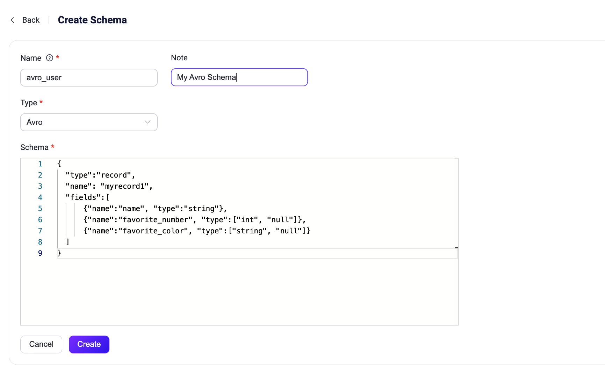

# スキーマレジストリの例 - Avro

このページでは、スキーマレジストリとルールエンジンがAvro形式のメッセージのエンコードおよびデコードをどのようにサポートするかを示します。

## デコードシナリオ

デバイスがAvroでエンコードされたバイナリメッセージをパブリッシュし、そのメッセージをルールエンジンでマッチングし、`name`フィールドに関連付けられたトピックに再パブリッシュする必要があります。トピックの形式は`avro_user/${name}`です。

例えば、`name`フィールドが`Shawn`のメッセージを`avro_user/Shawn`トピックに再パブリッシュする必要があります。

### スキーマの作成

ルールエンジンがAvroメッセージを正しくデコードまたはエンコードできるように、まずスキーマレジストリを使ってAvroメッセージの構造を定義するスキーマを登録する必要があります。

1. ダッシュボードの左ナビゲーションメニューから **Smart Data Hub** -> **Schema Registry** を選択します。

2. **Internal Schema** タブで **Create** をクリックします。

3. 以下のパラメータでAvroスキーマを作成します：

   - **Name**: `avro_user`。この名前はエンコード・デコード関数で使用されます。

   - **Type**: `Avro`

   - **Schema**:

     ```json
     {
       "type":"record",
       "name": "myrecord1",
       "fields":[
           {"name":"name", "type":"string"},
           {"name":"favorite_number", "type":["int", "null"]},
           {"name":"favorite_color", "type":["string", "null"]}
       ]
     }
     ```

4. **Create** をクリックします。



### ルールの作成
1. ダッシュボードのナビゲーションメニューから **Integration** -> **Rules** を選択します。

2. **Rules** ページで右上の **Create** をクリックします。

3. 先ほど作成したスキーマを使って、以下のルールSQL文を書きます：

   ```sql
   SELECT
     schema_decode('avro_user', payload) as avro_user, payload
   FROM
     "t/#"
   WHERE
     avro_user.name = 'Shawn'
   ```

   ここでのポイントは `schema_decode('avro_user', payload)` です：

   - `schema_decode` 関数は、`avro_user`スキーマに従ってペイロードの内容をデコードします。
   - `as avro_user` はデコードした値を変数 `avro_user` に格納します。

4. **Add Action** をクリックし、**Action** フィールドのドロップダウンリストから `Republish` を選択します。

5. **Topic** フィールドに再パブリッシュ先のトピックとして `avro_user/${avro_user.name}` と入力します。

6. **Payload** フィールドにメッセージ内容のテンプレートとして `${avro_user}` と入力します。

このアクションは、デコードしたメッセージをJSON形式でトピック `avro_user/${avro_user.name}` に送信します。`${avro_user.name}` は変数プレースホルダーで、実行時にデコードされたメッセージの `name` フィールドの値に置き換えられます。

### デバイス側コードの準備

ルールが作成されたら、テスト用にデータをシミュレートできます。

以下のコードはPython言語を使い、ユーザーメッセージを作成してバイナリデータにエンコードし、`t/1` トピックに送信します。詳細は[フルコード](https://gist.github.com/thalesmg/bbda65b400f35f8ab0f719b06cf875f6)を参照してください。

```python
def publish_msg(client):
    datum_w = avro.io.DatumWriter(SCHEMA)
    buf = io.BytesIO()
    encoder = avro.io.BinaryEncoder(buf)
    datum_w.write({"name": "Shawn", "favorite_number": 666, "favorite_color": "red"}, encoder)
    message = buf.getvalue()
    topic = "t/1"
    print("publish to topic: t/1, payload:", message)
    client.publish(topic, payload=message, qos=0, retain=False)
```

### ルール実行結果の確認
1) ダッシュボードで **Diagnose** -> **WebSocket Client** を選択します。
2) 現在のEMQXインスタンスの接続情報を入力します。
   - ローカルでEMQXを実行している場合はデフォルト値を使用できます。
   - 認証設定などEMQXのデフォルト設定を変更している場合は、ユーザー名やパスワードの入力が必要になることがあります。
3. **Connect** をクリックしてMQTTクライアントとしてEMQXインスタンスに接続します。
4. **Subscription** エリアの **Topic** フィールドに `avro_user/#` と入力し、**Subscribe** をクリックします。

5. Pythonの依存関係をインストールし、デバイス側コードを実行します：

   ```shell
   $ pip3 install avro paho-mqtt

   $ python3 avro_mqtt.py
   Connected with result code 0
   publish to topic: t/1, payload: b'\nShawn\x00\xb4\n\x00\x06red'
   ```

6. WebSocket側でトピック `avro_user/Shawn` のメッセージが受信されていることを確認します：

   ```json
   {"favorite_color":"red","favorite_number":666,"name":"Shawn"}
   ```

## エンコードシナリオ

デバイスがAvroでエンコードされたバイナリメッセージを期待してトピック `avro_out` をサブスクライブします。ルールエンジンはそのようなメッセージをエンコードし、関連トピックにパブリッシュします。

### スキーマの作成

[デコードシナリオ](#デコードシナリオ)で説明したのと同じスキーマを使用します。

### ルールの作成

1. ダッシュボードのナビゲーションメニューから **Integration** -> **Rules** を選択します。

2. **Rules** ページで右上の **Create** をクリックします。

3. 先ほど作成したスキーマを使って、以下のルールSQL文を書きます：

   ```sql
   SELECT
     schema_encode('avro_user', json_decode(payload)) as avro_user
   FROM
     "avro_in"
   ```

   ここでのポイントは `schema_encode('avro_user', json_decode(payload))` です：

   - `schema_encode` 関数は、`avro_user`スキーマに従ってペイロードの内容をエンコードします。
   - `as avro_user` はエンコードした値を変数 `avro_user` に格納します。
   - `json_decode(payload)` は、ペイロードが一般的にJSONエンコードされたバイナリであるため、`schema_encode` の入力にMap型が必要なため使います。

4. **Add Action** をクリックし、**Action** フィールドのドロップダウンリストから `Republish` を選択します。

5. **Topic** フィールドに再パブリッシュ先のトピックとして `avro_out` と入力します。

6. **Payload** フィールドにメッセージ内容のテンプレートとして `${avro_user}` と入力します。

このアクションは、Avroエンコードされたメッセージをトピック `avro_out` に送信します。`${avro_user}` は変数プレースホルダーで、実行時に `schema_encode` の結果（バイナリ値）に置き換えられます。

### デバイス側コードの準備

ルールが作成されたら、テスト用にデータをシミュレートできます。

以下のコードはPython言語を使い、Userメッセージを受信してデコードし、内容を表示します。詳細は[フルコード](https://gist.github.com/thalesmg/02046f89e9ceb70b9806dc98e6ed8b55)を参照してください。

```python
def on_message(client, userdata, msg):
    datum_r = avro.io.DatumReader(SCHEMA)
    buf = io.BytesIO(msg.payload)
    decoder = avro.io.BinaryDecoder(buf)
    decoded_payload = datum_r.read(decoder)
    print(msg.topic+" "+str(decoded_payload))
```

### ルール実行結果の確認

1) ダッシュボードで **Diagnose** -> **WebSocket Client** を選択します。
2) 現在のEMQXインスタンスの接続情報を入力します。
   - ローカルでEMQXを実行している場合はデフォルト値を使用できます。
   - 認証設定などEMQXのデフォルト設定を変更している場合は、ユーザー名やパスワードの入力が必要になることがあります。

3. **Connect** をクリックしてMQTTクライアントとしてEMQXインスタンスに接続します。

4. **Publish** エリアの **Topic** フィールドに `avro_in` と入力し、**Payload** フィールドに以下のメッセージを入力します：

   ```json
   {"favorite_color":"red","favorite_number":666,"name":"Shawn"}
   ```

5. **Publish** をクリックします。

6. Pythonの依存関係をインストールし、デバイス側コードを実行します：

   ```shell
   $ pip3 install avro paho-mqtt
   
   $ python3 avro_mqtt_sub.py
   Connected with result code 0
   msg payload b'\nShawn\x00\xb4\n\x00\x06red'
   avro_out {'name': 'Shawn', 'favorite_number': 666, 'favorite_color': 'red'}
   ```
