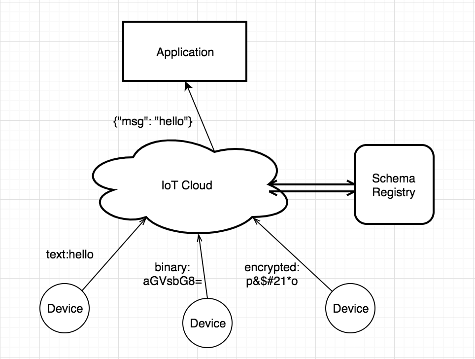
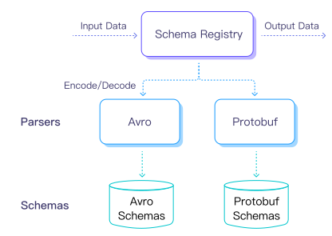

# スキーマレジストリ

EMQX スキーマレジストリは、MQTT メッセージのペイロードのエンコード、デコード、および検証のためのスキーマを定義・管理する機能を提供します。ルールはスキーマレジストリの関数を呼び出して、Avro や Protobuf といったバイナリペイロードをルールエンジンが処理可能なデータにデコードしたり、処理済みデータを下流システム向けにエンコードしたり、JSON データを JSON スキーマに対して検証したりできます。

デバイスと下流アプリケーションが異なるフォーマットでデータをやり取りする場合にスキーマレジストリを利用します。スキーマ定義やカスタムコーデックの設定を一元管理することで、各ルールやアプリケーションで変換ロジックを個別に実装することなく、一貫したフォーマットでメッセージを処理できます。

以下の図はスキーマレジストリの利用例です。複数のデバイスが異なるフォーマットでデータを報告し、スキーマレジストリがそれらを統一された内部フォーマットにデコードしてからバックエンドアプリケーションに転送しています。



## 対応スキーマタイプ

EMQX スキーマレジストリは以下の内部スキーマタイプをサポートしています。

| スキーマタイプ | 説明 | 例 |
| --- | --- | --- |
| [Avro](https://avro.apache.org) | [Mapフォーマット](#rule-engine-internal-data-format-map) のデータを Avro バイナリデータにエンコードし、Avro バイナリデータを Map フォーマットにデコードします。 | [スキーマレジストリの例 - Avro](./schema-registry-example-avro.md) |
| [Protobuf](https://developers.google.com/protocol-buffers/) | Map フォーマットのデータを Protobuf バイナリデータにエンコードし、Protobuf バイナリデータを Map フォーマットにデコードします。 | [スキーマレジストリの例 - Protobuf](./schema-registry-example-protobuf.md) |
| [JSON Schema](https://json-schema.org/) | 入力された JSON データやルールエンジンで生成された JSON データが JSON スキーマに準拠しているかを検証します。 | [スキーマレジストリの例 - JSON Schema](./schema-registry-example-json.md) |
| 外部 HTTP サーバー | カスタムコーデックロジックを実装した HTTP サービスにペイロードのエンコード・デコード処理を委譲します。 | [スキーマレジストリの例 - 外部 HTTP サーバー](./schema-registry-example-external-http.md) |

外部 HTTP サーバーと外部スキーマレジストリは異なる統合です。外部 HTTP サーバーは内部スキーマタイプの一つで、エンコード・デコード処理をカスタム HTTP サービスに委譲します。一方、外部スキーマレジストリは別途設定し、ルール処理時に設定された Confluent スキーマレジストリから Avro スキーマを取得します。詳細は[外部スキーマレジストリ](#external-schema-registry)をご覧ください。

### JSON Schema サポート

EMQX 6.0.4 以降、スキーマレジストリは JSON Schema draft-03、draft-04、draft-06、draft 2019-09、draft 2020-12 をサポートしています。EMQX は `$schema` フィールドの値に基づいて JSON Schema のバージョンを選択します。`$schema` が省略された場合は draft-06 が使用されます。

完全な例や各ドラフトの制限事項については、[スキーマレジストリの例 - JSON Schema](./schema-registry-example-json.md)をご参照ください。

## アーキテクチャ設計

EMQX は、パブリッシュされたメッセージがスキーマ仕様に準拠しているかのエンコード、デコード、検証にスキーマを利用できます。Avro や Protobuf などの組み込みエンコードフォーマットのスキーマテキストを管理します。

スキーマ API はスキーマ名による追加、照会、削除操作を提供するため、エンコード・デコード時にはスキーマ名を指定する必要があります。



一般的なユースケースは、ルールエンジンからスキーマレジストリが提供するエンコード・デコードインターフェースを呼び出し、その結果のデータを後続のアクションの入力として利用することです。

エンコード呼び出しの例：

```erlang
schema_encode(SchemaName, Map) -> Bytes
```

デコード呼び出しの例：

```erlang
schema_decode(SchemaName, Bytes) -> Map
```

JSON エンコードされた MQTT メッセージのデータをエンコードする際は、スキーマ関数でエンコードする前に `json_decode` 関数で Map 内部フォーマットにデコードする必要があります。例：

```erlang
schema_encode(SchemaName, json_decode(JSONData)) -> Bytes
```

JSON データがスキーマに準拠しているかをエンコード前またはデコード後に検証する場合は、以下のスキーマ検証例を使用します。

```erlang
schema_check(SchemaName, Map | Bytes) -> Boolean
```

## スキーマレジストリとルールエンジン

EMQX のメッセージ処理層は、メッセージング、ルールエンジン、データ変換の3つに分けられます。

EMQX の PUB/SUB システムはメッセージを指定されたトピックにルーティングします。ルールエンジンはデータに対するビジネスルールを柔軟に設定し、メッセージをルールにマッチさせて対応するアクションを指定します。データフォーマット変換はルールマッチング処理の前に行われ、データをルールマッチングに参加可能な Map フォーマットに変換してからマッチングを行います。


### ルールエンジン内部データフォーマット（Map）

ルールエンジン内部で使用されるデータフォーマットは Erlang の Map です。元のデータがバイナリやその他の形式の場合は、上記の `schema_decode` や `json_decode` といったコーデック関数で Map に変換する必要があります。JSON オブジェクトに非常に似ています。

Map は `#{key => value}` の形式のキー・バリュー型データ構造です。例えば、`user = #{id => 1, name => "Steve"}` は `id` が `1`、`name` が `"Steve"` の `user` Map を定義しています。

SQL 文は `.` 演算子を提供し、ネストされた Map フィールドの抽出や追加が可能です。以下は SQL 文での Map 操作例です。

```sql
SELECT user.id AS my_id
```

この SQL 文のフィルター結果は `#{my_id => 1}` となります。

### JSON コーデック

ルールエンジンの SQL 文は JSON 形式の文字列のエンコード・デコードをサポートしています。JSON 文字列を Map フォーマットに変換する SQL 関数は `json_decode()` と `json_encode()` です。

```sql
SELECT json_decode(payload) AS p FROM "t/#" WHERE p.x = p.y
```

上記の SQL 文は、ペイロードの内容が JSON 文字列 `{"x": 1, "y": 1}` で、トピックが `t/a` の MQTT メッセージにマッチします。

`json_decode(payload) as p` は JSON 文字列を以下の Map データ構造にデコードし、`WHERE` 句で `p.x` と `p.y` としてフィールドを利用可能にします。

```erlang
#{
  p => #{
    x => 1,
    y => 1
  }
}
```

**注意:** `AS` 句はデコードしたデータをキーに割り当てるために必須で、後続の操作で利用可能にします。

## 外部スキーマレジストリ

EMQX 5.8.1 以降、外部 Confluent スキーマレジストリ（CSR）の設定をサポートしています。この機能により、ルール処理時に外部レジストリから動的にスキーマを取得し、効率的なメッセージのエンコード・デコードが可能になります。

### ダッシュボードでの外部スキーマレジストリ作成

EMQX ダッシュボードから直接外部スキーマレジストリを設定でき、スキーマ統合の管理が容易です。

EMQX ダッシュボードの **Smart Data Hub** -> **Schema Registry** に移動し、スキーマページの **External** タブを選択します。

右上の **Create** ボタンをクリックし、以下の項目を設定します。

- **Name**: エンコード・デコード関数で使用する外部スキーマレジストリ名を入力します。
- **Type**: 外部スキーマレジストリのタイプを選択します。現在は `Confluent` のみ対応しています。
- **URL**: Confluent スキーマレジストリのエンドポイントを入力します。
- **Authentication**: `Basic auth` を選択した場合は、外部レジストリにアクセスするための認証情報（ユーザー名とパスワード）を入力します。

設定が完了したら **Create** をクリックします。

### 設定ファイルによる外部スキーマレジストリの設定

EMQX の設定ファイルで外部 Confluent スキーマレジストリを設定することも可能です。以下は設定例です。

```hcl
schema_registry {
  external {
    my_external_registry {
      type = confluent
      url = "https://confluent.registry.url:8081"
      auth {
        username = "myuser"
        password = "secret"
      }
    }
  }
}
```

この例では、

- `my_external_registry` は外部スキーマレジストリに割り当てた名前です。
- `type = confluent` は外部レジストリのタイプを指定しています。
- `url` は Confluent スキーマレジストリのエンドポイントです。
- `auth` は外部レジストリにアクセスするための認証情報（ユーザー名とパスワード）です。

### ルールエンジンでの外部スキーマレジストリの利用

外部レジストリを設定すると、EMQX ルールエンジンで外部レジストリに格納されたスキーマを使ってペイロードのエンコード・デコードを行う関数を利用できます。

以下の関数は設定済みの外部 CSR を利用します。

```sql
avro_encode('my_external_registry', payload, my_schema_id)
avro_decode('my_external_registry', payload, my_schema_id)
schema_encode_and_tag('my_local_avro_schema', 'my_external_registry', payload, 'my_subject')
schema_decode_tagged('my_external_registry', payload)
```

#### 関数利用例

以下の例では、次の値と変数名を使用しています。

- `my_external_registry`: EMQX で外部レジストリに割り当てた名前
- `my_schema_id`: CSR に登録されたスキーマ ID（CSR では常に整数）
- `my_local_avro_schema`: EMQX にローカル登録された Avro スキーマ名
- `my_subject`: CSR で定義されたサブジェクト名

##### `avro_encode`

`avro_encode` は外部レジストリのスキーマ ID を使ってペイロードをエンコードします。スキーマは実行時に動的に取得され、以降の処理でキャッシュされます。Confluent スキーマレジストリではスキーマ ID は整数です。

::: tip 注意

エンコード時のペイロードはルールエンジンの内部データフォーマットであるデコード済み Map である必要があります。これが例で `json_decode` を使う理由です。

:::

例：

```sql
select
  -- 123 は CSR に登録されたスキーマ ID
  avro_encode('my_external_registry', json_decode(payload), 123) as encoded
from 't'
```

##### `avro_decode`

この関数は外部レジストリの指定されたスキーマ ID に基づいて Avro ペイロードをデコードします。スキーマは実行時に動的に取得され、以降の処理でキャッシュされます。

例：

```sql
select
  -- 123 は CSR に登録されたスキーマ ID
  avro_decode('my_external_registry', payload, 123) as decoded
from 't'
```

##### `schema_encode_and_tag`

この関数はローカル登録された Avro スキーマ、外部 CSR スキーマ名、サブジェクトを使って、（すでに内部 Map フォーマットの）ペイロードをエンコードし、結果のペイロードにスキーマ ID タグを付与します。スキーマ ID はローカルスキーマを CSR に登録した際のものです。

例：

```sql
select
  schema_encode_and_tag(
    'my_local_avro_schema',
    'my_external_registry',
    json_decode(payload),
    'my_subject'
  ) as encoded
from 't'
```

##### `schema_decode_tagged`

この関数は CSR 名を使って、スキーマ ID タグ付きのペイロードをデコードします。

```sql
select
  schema_decode_tagged(
    'my_external_registry',
    payload
  ) as decoded
from 't'
```
