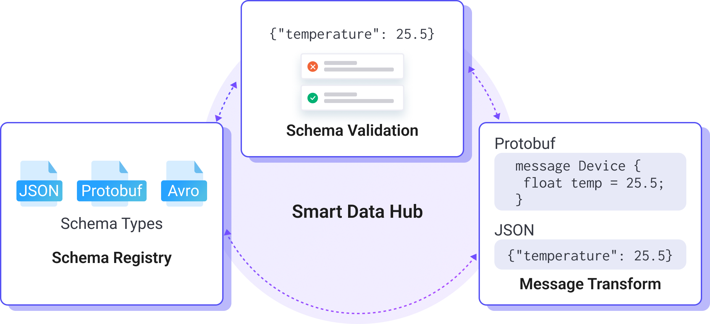

# Smart Data Hub

EMQXのSmart Data Hubは、インテリジェントなデータ処理のためのオールインワンソリューションです。MQTTデータストリームの管理を簡素化し、効率的に行うことを目的としています。Smart Data Hubを使用することで、スキーマの管理、データの検証、リアルタイムのデータ変換を容易に実行できます。データ検証やメッセージ変換のいずれの場合でも、このプラットフォームは自動化された効率的なデータ管理を可能にします。

## 主な機能

Smart Data Hubは以下の主要な機能を提供します。

- **[スキーマレジストリ](./schema-registry.md)**：データスキーマの作成、修正、削除を行い、データ形式と基準の一貫性を確保します。
- **[スキーマ検証](./schema-validation.md)**：事前定義されたスキーマに基づいて受信データを検証し、フォーマットエラーやデータ不整合を防止します。
- **[メッセージ変換](./message-transformation.md)**：リアルタイムでデータメッセージを変換し、様々なアプリケーションシナリオに適したMQTTデータのフォーマットやマッピングを行います。

