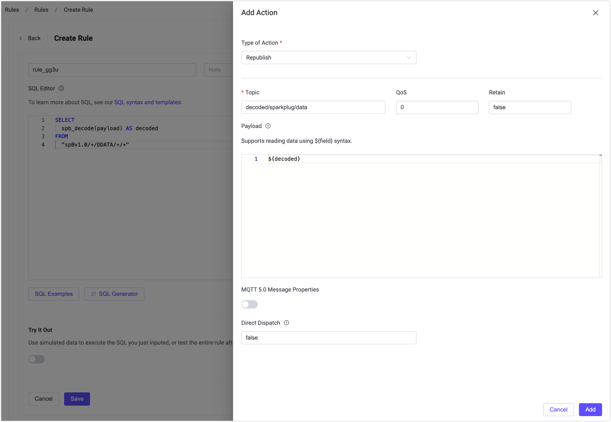

# Sparkplug B

[Sparkplug](https://www.eclipse.org/tahu/spec/sparkplug_spec.pdf) は、[Eclipse Foundation の TAHU プロジェクト](https://www.eclipse.org/tahu/)によって開発されたオープンソース仕様であり、MQTT のための明確に定義されたペイロードおよび状態管理システムを提供することを目的としています。主な目的は、産業用IoT分野における相互運用性と一貫性を実現することです。

Sparkplug エンコーディングスキームのバージョンB（Sparkplug B）は、監視制御およびデータ収集（SCADA）システム、リアルタイム制御システム、およびデバイス向けの MQTT ネームスペースを定義しています。メトリクス、プロセス変数、デバイスの状態情報を含む構造化データ形式を簡潔かつ処理しやすい形式でカプセル化することで、標準化されたデータ伝送を保証します。Sparkplug B を利用することで、組織は運用効率を向上させ、データのサイロ化を回避し、MQTT ネットワーク内のデバイス間でシームレスな通信を可能にします。

本ページでは、EMQX における Sparkplug B の実装方法について、データ形式、機能、実用例を交えて解説します。

## Sparkplug B データ形式

Sparkplug B は、データ通信の標準化のために明確に定義されたペイロード構造を利用します。コア部分では、[Protocol Buffers（Protobuf）](https://developers.google.com/protocol-buffers) を用いて Sparkplug メッセージを構造化し、軽量で効率的かつ柔軟なデータ交換を実現しています。

EMQX は、[スキーマレジストリ](./schema-registry.md) 機能を通じて Sparkplug B を高度にサポートしています。スキーマレジストリを使うことで、Sparkplug B を含むさまざまなデータ形式のカスタムエンコーダーおよびデコーダーを作成可能です。レジストリに[適切な Sparkplug B スキーマ](https://github.com/eclipse/tahu/blob/46f25e79f34234e6145d11108660dfd9133ae50d/sparkplug_b/sparkplug_b.proto)を定義すれば、EMQX のルールエンジン内で `schema_decode` および `schema_encode` 関数を使って指定フォーマットに準拠したデータのアクセスや操作が可能です。

さらに、EMQX は Sparkplug B に対する組み込みサポートも提供しており、この特定のフォーマットに関してはスキーマレジストリを使用する必要がありません。`spb_encode` と `spb_decode` 関数が EMQX に標準搭載されており、ルールエンジン内での Sparkplug B メッセージのエンコードおよびデコードを簡素化しています。

:::: tip

以前の `sparkplug_encode` および `sparkplug_decode` 関数は、`bytes_value` の扱いが Sparkplug 仕様と互換性がなかったため非推奨となりました。
代わりに、更新された `spb_encode` および `spb_decode` 関数をご利用ください。

::::

## Sparkplug B 関数

EMQX は、Sparkplug B データのエンコードおよびデコード用に 2 つのルールエンジン SQL 関数 `spb_encode` と `spb_decode` を提供しています。
[実用例](#examples-for-using-spb_decode-and-spb_encode)では、これらの関数をさまざまなシナリオでどのように使うかを解説しています。

Sparkplug B のエンコード・デコード関数は、ルールエンジンの柔軟性と `jq` 関数の組み合わせにより、多様な処理に利用可能です。ルールエンジンおよび `jq` 関数の詳細は以下のページをご参照ください。

* [ルールの作成](./rule-get-started.md)
* [ルールエンジン SQL 言語](./rule-sql-syntax.md)
* [ルールエンジンの JQ 関数](./rule-sql-jq.md)
* [JQ プログラミング言語の完全な説明](https://stedolan.github.io/jq/manual/)

### spb_decode

`spb_decode` 関数は、Sparkplug B メッセージをデコードするために使います。例えば、Sparkplug B エンコードされたメッセージの内容に基づいて特定のトピックに転送したり、メッセージを何らかの形で変更したい場合に利用します。生の Sparkplug B エンコードされたペイロードを、より扱いやすい形式に変換し、さらに処理や解析が可能になります。

使用例：

```sql
select
  spb_decode(payload) as decoded
from t
```

上記の例では、`payload` はデコードしたい生の Sparkplug B メッセージを指します。

[Sparkplug B Protobuf スキーマ](https://github.com/emqx/emqx/blob/039e27a153422028e3d0e7d517a521a84787d4a8/lib-ee/emqx_ee_schema_registry/priv/sparkplug_b.proto) を参照するとメッセージ構造の詳細がわかります。

### spb_encode

`spb_encode` 関数は、データを Sparkplug B メッセージにエンコードするために使います。これは、Sparkplug B メッセージを MQTT クライアントやシステムの他のコンポーネントに送信したい場合に特に有用です。

使用例：

```sql
select
  spb_encode(json_decode(payload)) as encoded
from t
```

上記の例では、`payload` は Sparkplug B メッセージにエンコードしたいデータを指します。

## Sparkplug B エイリアスマッピング

Sparkplug B 仕様では、デバイスがオンラインになる際（NBIRTH / DBIRTH メッセージ送信時）に各メトリクスに数値の `alias` を割り当てることができます。以降のデータ更新（NDATA / DDATA メッセージ）では、メッセージサイズとネットワークオーバーヘッドを削減するために、完全なメトリクス名（`name`）の代わりに `alias` のみをパブリッシュすることが可能です。

このエイリアスのみの更新を正しく解釈するためには、受信側が Sparkplug B セッション状態を管理し、各エイリアスを元のメトリクス名に解決できる必要があります。

実際には、EMQX は Sparkplug B データの中央処理および配信ハブとして機能します。ルールエンジンを用いて、EMQX はデコード済みデータを標準 MQTT クライアントやデータプラットフォームなどの非 Sparkplug B クライアントに転送します。これらの下流システムは通常 Sparkplug B の状態管理を実装していないため、エイリアスのみのデータは扱いにくいです。

EMQX 6.0.2 以降、`spb_decode` 関数は Sparkplug B のエイリアスマッピングをサポートするよう強化されました。この強化により、EMQX はデコード時にメトリクス名を自動的に復元し、下流システムが扱いやすいデータを生成します。

### Sparkplug B エイリアスマッピングの仕組み

エイリアスマッピングが有効な場合、EMQX は以下のように Sparkplug B メッセージを処理します。

1. **NBIRTH / DBIRTH メッセージの処理**

   クライアントが NBIRTH または DBIRTH メッセージをパブリッシュすると、EMQX はペイロード内のメトリクスを調べ、`alias` と `name` の両方が定義されているメトリクスのエイリアスマッピングを記録します。

2. **セッションごとのマッピング管理**

   エイリアスマッピングは MQTT クライアントのセッション単位で管理され、Sparkplug B のセマンティクスに従います。

   - ノードレベルメトリクス（NBIRTH / NDATA）とデバイスレベルメトリクス（DBIRTH / DDATA）は別々に管理されます。
   - 異なるクライアント間のマッピングは完全に分離され、干渉しません。

3. **`spb_decode` 出力の強化**

   ルールエンジンが NDATA または DDATA メッセージに対して `spb_decode` を呼び出し、かつメトリクスに `alias` はあるが `name` がない場合、EMQX は記録済みのマッピングを使って対応するメトリクス名を自動復元します。

   その結果、デコードされたメッセージには常に明確で読みやすいメトリクス名が含まれ、ルール処理、変換、転送に適した形式となります。

4. **セッション終了時のクリーンアップ**

   クライアントが切断されると、そのクライアントに関連付けられたエイリアスマッピングは削除されます。EMQX はセッション終了後に Sparkplug B 状態を保持または復元しません。

### エイリアスマッピングの設定

エイリアスマッピングはデフォルトで有効です。EMQX による Sparkplug B メトリクスエイリアスの追跡および復元を無効にしたい場合は、設定ファイルで以下のように設定してください。

```hocon
schema_registry {
  sparkplugb {
    enable_alias_mapping = false
  }
}
```

> **注意**:
>
> - エイリアスマッピングは、エイリアスマッピング有効時に受信した NBIRTH / DBIRTH メッセージからのみ作成されます。
> - クライアントがすでにバースメッセージを送信済みの場合、エイリアスマッピングを適用するには再接続して NBIRTH / DBIRTH を再送信する必要があります。

### エイリアスマッピングの例

以下の例では、EMQX ダッシュボードと MQTTX を使って、エイリアスのみの DDATA メッセージをフルメトリクス名を含む JSON データに変換し、非 Sparkplug B クライアントに転送する方法を示します。

#### 目的

- **Sparkplug B デバイス**：DBIRTH で `name + alias` を宣言し、DDATA では `alias` のみをパブリッシュ。
- **EMQX**：`spb_decode` を使ってメトリクス名を自動復元。
- **下流サブスクライバー**：Sparkplug B の知識なしで標準 JSON メッセージを受信。

#### 前提条件

- EMQX 6.0.2 以降で Sparkplug B エイリアスマッピングが有効（`enable_alias_mapping = true`）
- [MQTTX](https://mqttx.app/)

#### ステップ 1: EMQX ダッシュボードでルール作成

1. ダッシュボード左メニューから **Integration** -> **Rules** をクリック。

2. **+ Create** をクリックして新規ルール作成画面へ。

3. **SQL Editor** に以下を入力：

   ```sql
   SELECT
     spb_decode(payload) AS decoded
   FROM "spBv1.0/+/DDATA/+/+"
   ```

   > **補足**:
   >
   > - このルールはすべての Sparkplug B DDATA メッセージにマッチします。
   > - `spb_decode(payload)` はペイロードをデコードし、エイリアスマッピング有効時はエイリアスからメトリクス名を自動復元します。

4. **+ Add Action** をクリックしてアクションを追加。

5. アクションタイプに **Republish** を選択。

6. アクション設定：

   - **Topic**: `decoded/sparkplug/data`
   - **Payload**: `${decoded}`

7. **Add** をクリック。

8. **Save** をクリックしてルール作成完了。

   

#### ステップ 2: MQTTX でサブスクライバー準備

1. MQTTX を開き、EMQX ブローカーへの新規接続を作成。

2. トピック `decoded/sparkplug/data` をサブスクライブ。

このサブスクライバーは、プレーンな JSON データを期待する**非 Sparkplug B クライアント**を表します。

#### ステップ 3: MQTTX で Sparkplug B デバイスをシミュレート

以下のペイロードは読みやすさのため論理的な JSON で示しています。実際のパブリッシュ時は Sparkplug B Protobuf エンコード（Base64）を使用してください。

1. DBIRTH（エイリアス宣言）をトピック `spBv1.0/group1/DBIRTH/eon1/device1` に送信。

   **論理ペイロード（例）**

   ```json
   {
     "metrics": [
       {
         "name": "Device/Temperature",
         "alias": 0,
         "datatype": 9,
         "value": 72.5
       },
       {
         "name": "Device/Pressure",
         "alias": 1,
         "datatype": 9,
         "value": 101.3
       }
     ]
   }
   ```

   > **補足**:
   >
   > - Sparkplug B 仕様では `datatype` は符号なし整数で定義され、値 `9` は Float データ型を表します。
   > - EMQX はこの時点でエイリアスと名前のマッピングを記録します。
   > - このステップは DDATA 送信前に必ず実行してください。

2. DDATA（エイリアスのみ）をトピック `spBv1.0/group1/DDATA/eon1/device1` に送信。

   **論理ペイロード（例）**

   ```json
   {
     "metrics": [
       { "alias": 0, "value": 73.1 },
       { "alias": 1, "value": 100.9 }
     ]
   }
   ```

#### ステップ 4: デコード結果の確認

MQTTX でトピック `decoded/sparkplug/data` をサブスクライブしていると、以下のようなメッセージを受信します。

```json
{
  "metrics": [
    {
      "alias": 0,
      "name": "Device/Temperature",
      "value": 73.1
    },
    {
      "alias": 1,
      "name": "Device/Pressure",
      "value": 100.9
    }
  ]
}
```

以下の点が確認できます。

- 元の DDATA メッセージには `name` が含まれていません。
- `spb_decode` により自動的に以下が復元されています：
  - `"Device/Temperature"`
  - `"Device/Pressure"`
- 下流のサブスクライバーは Sparkplug B の状態管理やエイリアス解釈を行う必要がありません。

## `spb_decode` と `spb_encode` の使用例

このセクションでは、`spb_decode` と `spb_encode` 関数を使った Sparkplug B メッセージの処理例を示します。紹介する例は可能な処理のごく一部です。

以下の構造を持つ Sparkplug B エンコード済みメッセージを受け取るシナリオを想定します。

```json
{
  "timestamp": 1678094561521,
  "seq": 88,
  "metrics": [
    {
      "timestamp": 1678094561525,
      "name": "counter_group1/counter1_1sec",
      "int_value": 424,
      "datatype": 2
    },
    {
      "timestamp": 1678094561525,
      "name": "counter_group1/counter1_5sec",
      "int_value": 84,
      "datatype": 2
    },
    {
      "timestamp": 1678094561525,
      "name": "counter_group1/counter1_10sec",
      "int_value": 42,
      "datatype": 2
    },
    {
      "timestamp": 1678094561525,
      "name": "counter_group1/counter1_run",
      "int_value": 1,
      "datatype": 5
    },
    {
      "timestamp": 1678094561525,
      "name": "counter_group1/counter1_reset",
      "int_value": 0,
      "datatype": 5
    }
  ]
}
```

### データ抽出

デバイスからトピック `my/sparkplug/topic` でメッセージを受け取り、`counter_group1/counter1_run` メトリクスだけを JSON 形式で別トピック `interesting_counters/counter1_run_updates` に転送したい場合の例です。EMQX ダッシュボードでルールを作成し、[MQTTX](https://mqttx.app/) クライアントツールで動作確認する手順を示します。

#### ダッシュボードでルール作成

1. EMQX ダッシュボードを開き、左ナビゲーションメニューから **Integration** -> **Rules** をクリック。**+ Create** をクリックしてルール作成画面へ。

2. **SQL Editor** に以下を入力：

   ```sql
   FOREACH
   jq('
         .metrics[] |
         select(.name == "counter_group1/counter1_run")
      ',
      spb_decode(payload)) AS item
   DO item
   FROM "my/sparkplug/topic"
   ```

   ここで、`jq` 関数はメトリクス配列を反復処理し、名前が `"counter_group1/counter1_run"` のメトリクスだけを抽出しています。

   ::: tip

   Sparkplug B 仕様では、データは変化時のみ送信することが推奨されているため、ペイロードにすべてのメトリクスが含まれるわけではありません。指定した名前のメトリクスが存在しない場合、このルールは何も出力しません。

   :::

3. 右側の **+ Add Action** をクリックし、アクションタイプから `Republish` を選択。リパブリッシュ先トピックに `interesting_counters/counter1_run_updates` を入力し、ペイロードに `${item}` を指定。**Add** をクリック。

4. **Create Rule** ページで **Create** をクリック。ルール一覧に作成したルールが表示されます。

#### ルールのテスト

MQTTX クライアントツールを使って、Sparkplug B メッセージをトピック `my/sparkplug/topic` にパブリッシュし、変換された JSON メッセージがトピック `interesting_counters/counter1_run_updates` に転送されることを確認します。

1. MQTTX クライアントを開き、EMQX ブローカーに接続。詳細は [MQTTX クライアント](../../get-started/messaging/publish-and-subscribe.md) を参照。

2. 新規サブスクリプションを作成し、トピック `interesting_counters/counter1_run_updates` をサブスクライブ。

3. メッセージ送信欄にトピック `my/sparkplug/topic` を入力し、ペイロードタイプを `Base64` に設定。

4. 以下の Base64 エンコード済み Sparkplug B メッセージをペイロード欄に貼り付け。これは前述の Sparkplug メッセージ例のエンコード版です。

   ```
   CPHh67HrMBIqChxjb3VudGVyX2dyb3VwMS9jb3VudGVyMV8xc2VjGPXh67HrMCACUKgDEikKHGNvdW50ZXJfZ3JvdXAxL2NvdW50ZXIxXzVzZWMY9eHrseswIAJQVBIqCh1jb3VudGVyX2dyb3VwMS9jb3VudGVyMV8xMHNlYxj14eux6zAgAlAqEigKG2NvdW50ZXJfZ3JvdXAxL2NvdW50ZXIxX3J1bhj14eux6zAgBVABEioKHWNvdW50ZXJfZ3JvdXAxL2NvdW50ZXIxX3Jlc2V0GPXh67HrMCAFUAAYWA
   ```

5. 送信ボタンをクリック。

   正常に動作すれば、以下のような JSON 形式のメッセージを受信できます。

   ```json
   {
       "timestamp":1678094561525,
       "name":"counter_group1/counter1_run",
       "int_value":1,
       "datatype":5
   }
   ```

### データ更新

誤ったメトリクス `counter_group1/counter1_run` を Sparkplug B エンコード済みペイロードから削除してから転送したい場合の例です。

[データ抽出](#データ抽出)の例と同様に、EMQX ダッシュボードで以下のルールを作成し、リパブリッシュアクションを設定します。

```sql
FOREACH
jq('
   # ペイロードを保存
   . as $payload |
   # 削除対象のメトリクス名を保存
   "counter_group1/counter1_run" as $to_delete |
   # $to_delete と異なる名前のメトリクスだけを抽出
   [ .metrics[] | select(.name != $to_delete) ] as $updated_metrics |
   # 新しいメトリクス配列でペイロードを更新
   $payload | .metrics = $updated_metrics
   ',
   spb_decode(payload)) AS item
DO spb_encode(item) AS updated_payload
FROM "my/sparkplug/topic"
```

このルールでは、`spb_decode` でメッセージをデコードし、`jq` で `counter_group1/counter1_run` のメトリクスを除外しています。`DO` 節で `spb_encode` を使って再度エンコードしています。

リパブリッシュアクションのペイロードには `${updated_payload}` を指定してください。これは更新済みの Sparkplug B エンコード済みメッセージの変数名です。

同様に、メトリクスの値を更新したい場合も `spb_decode` と `spb_encode` を使って以下のように実現可能です。例えば、`counter_group1/counter1_run` の値を 0 に更新する例：

```sql
FOREACH
jq('
   # ペイロードを保存
   . as $payload |
   # 更新対象のメトリクス名を保存
   "counter_group1/counter1_run" as $to_update |
   # $to_update の名前を持つメトリクスの値を更新
   [
     .metrics[] |
     if .name == $to_update
        then .int_value = 0
        else .
     end
   ] as $updated_metrics |
   # 新しいメトリクス配列でペイロードを更新
   $payload | .metrics = $updated_metrics
   ',
   spb_decode(payload)) AS item
DO spb_encode(item) AS item
FROM "my/sparkplug/topic"
```

また、新しいメトリクス `counter_group1/counter1_new` を値 42 で追加したい場合は以下のようにします。

```sql
FOREACH
jq('
   # ペイロードを保存
   . as $payload |
   # 既存のメトリクスを保存
   $payload | .metrics as $old_metrics |
   # 新しいメトリクス値
   {
     "name": "counter_group1/counter1_new",
     "int_value": 42,
     "datatype": 5
   } as $new_value |
   # 新旧メトリクス配列を結合
   ($old_metrics + [ $new_value ]) as $updated_metrics |
   # 新しいメトリクス配列でペイロードを更新
   $payload | .metrics = $updated_metrics
   ',
   spb_decode(payload)) AS item
DO spb_encode(item) AS item
FROM "my/sparkplug/topic"
```

### メッセージのフィルタリング

`counter_group1/counter1_run` メトリクスの値が 0 より大きい場合のみメッセージを転送したい場合の例です。

```sql
FOREACH
jq('
   # ペイロードを保存
   . as $payload |
   # フィルタ対象のメトリクス名を保存
   "counter_group1/counter1_run" as $to_filter |
   .metrics[] | select(.name == $to_filter) | .int_value as $value |
   # $to_filter の値が 0 以下ならメッセージを破棄
   if $value > 0 then $payload else empty end
   ',
   spb_decode(payload)) AS item
DO spb_encode(item) AS item
FROM "my/sparkplug/topic"
```

このルールでは、`jq` 関数が条件に合わない場合は空配列を返すため、ルールに接続されたアクションは何もトリガーされません。

### メッセージの分割

Sparkplug B エンコード済みメッセージを複数のメッセージに分割し、メトリクス配列の各メトリクスを個別の Sparkplug B エンコード済みメッセージとしてリパブリッシュしたい場合は以下のルールを使います。

```sql
FOREACH
jq('
   # ペイロードを保存
   . as $payload |
   # 各メトリクスごとに1件のメッセージを出力
   .metrics[] |
        . as $metric |
        # 現在のメトリクスだけを含む配列に置換
        $payload | .metrics = [ $metric ]
   ',
   spb_decode(payload)) AS item
DO spb_encode(item) AS output_payload
FROM "my/sparkplug/topic"
```

このルールでは、`jq` 関数が複数のアイテムを含む配列を出力します。ルールに接続されたすべてのアクションは配列の各アイテムごとにトリガーされます。リパブリッシュアクションのペイロードには `${output_payload}` を指定してください。これは `DO` 節でエンコード済みメッセージに割り当てた名前です。

### メッセージ分割と内容に応じたトピック送信

Sparkplug B エンコード済みメッセージを分割しつつ、メトリクス名に基づいて異なるトピックに送信したい場合の例です。例えば、出力トピック名を `"my_metrics/"` とメトリクス名の連結で構成したい場合、以下のようにします。

```sql
FOREACH
jq('
   # ペイロードを保存
   . as $payload |
   # 各メトリクスごとに1件のメッセージを出力
   .metrics[] |
        . as $metric |
        # 現在のメトリクスだけを含む配列に置換
        $payload | .metrics = [ $metric ]
   ',
   spb_decode(payload)) AS item
DO
spb_encode(item) AS output_payload,
first(jq('"my_metrics/" + .metrics[0].name', item)) AS output_topic
FROM "my/sparkplug/topic"
```

リパブリッシュアクションの設定では、トピック名に `${output_topic}` を指定してください。これは `DO` 節で出力トピック名に割り当てた変数です。ペイロードには `${output_payload}` を指定します。

`jq` 関数の呼び出しは `DO` 節内で `first` 関数でラップされており、最初の（かつ唯一の）出力オブジェクトを取得しています。
