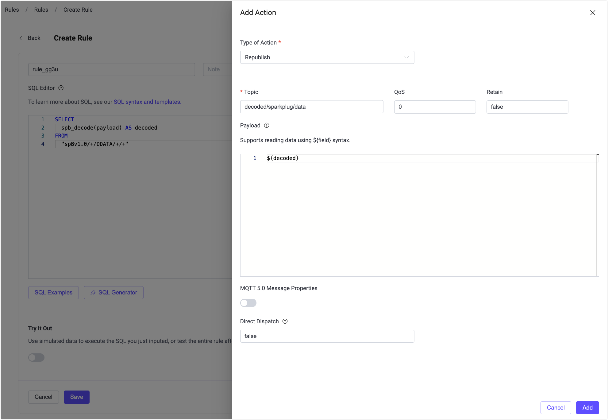

# Sparkplug B

[Sparkplug](https://www.eclipse.org/tahu/spec/sparkplug_spec.pdf) は、[Eclipse FoundationのTAHUプロジェクト](https://www.eclipse.org/tahu/)によって開発されたオープンソースの仕様で、MQTTのための明確に定義されたペイロードおよび状態管理システムを提供することを目的としています。主な目的は、産業用IoT分野における相互運用性と一貫性を実現することです。

SparkplugエンコーディングスキームのバージョンB（Sparkplug B）は、監視制御およびデータ収集（SCADA）システム、リアルタイム制御システム、およびデバイス向けのMQTTネームスペースを定義します。メトリクス、プロセス変数、デバイスの状態情報を含む構造化されたデータ形式を簡潔かつ処理しやすい形でカプセル化することで、標準化されたデータ伝送を保証します。Sparkplug Bを利用することで、組織は運用効率を向上させ、データのサイロ化を回避し、MQTTネットワーク内のデバイス間でシームレスな通信を可能にします。

本ページでは、EMQXにおけるSparkplug Bの実装方法について、データ形式、機能、および実用例を含めて解説します。

## Sparkplug B データ形式

Sparkplug Bは、データ通信を標準化するために明確に定義されたペイロード構造を利用します。コアには、Sparkplugメッセージの構造化に[Protocol Buffers（Protobuf）](https://developers.google.com/protocol-buffers)を採用しており、軽量で効率的かつ柔軟なデータ交換を実現しています。

EMQXは、[スキーマレジストリ](./schema-registry.md)機能を通じてSparkplug Bを高度にサポートしています。スキーマレジストリを使うことで、Sparkplug Bを含むさまざまなデータ形式のカスタムエンコーダーおよびデコーダーを作成可能です。レジストリに[適切なSparkplug Bスキーマ](https://github.com/eclipse/tahu/blob/46f25e79f34234e6145d11108660dfd9133ae50d/sparkplug_b/sparkplug_b.proto)を定義することで、EMQXのルールエンジン内で`schema_decode`および`schema_encode`関数を使い、指定フォーマットに準拠したデータのアクセスや操作が行えます。

さらに、EMQXはSparkplug Bに対する組み込みサポートも提供しており、この特定のフォーマットに対してはスキーマレジストリを使う必要がありません。`spb_encode`および`spb_decode`関数がEMQXに標準搭載されており、ルールエンジン内でSparkplug Bメッセージのエンコード・デコードを簡単に行えます。

:::: tip

以前の`sparkplug_encode`および`sparkplug_decode`関数は、`bytes_value`の扱いがSparkplug仕様と互換性がなかったため非推奨となりました。  
代わりに、更新された`spb_encode`および`spb_decode`関数をご利用ください。

::::

## Sparkplug B 関数

EMQXはSparkplug Bデータのエンコードおよびデコード用に、ルールエンジンSQL関数`spb_encode`と`spb_decode`を提供しています。[実用例](#examples-for-using-spb_decode-and-spb_encode)では、これらの関数をさまざまなシナリオで使う方法を解説しています。

Sparkplug Bのエンコード・デコード関数は、ルールエンジンとその`jq`関数の柔軟性により、多様な処理に利用可能です。ルールエンジンおよび`jq`関数の詳細については、以下のページをご参照ください。

* [ルール作成](./rule-get-started.md)
* [ルールエンジンSQL言語](./rule-sql-syntax.md)
* [ルールエンジンJQ関数](./rule-sql-jq.md)
* [JQプログラミング言語の完全な説明](https://stedolan.github.io/jq/manual/)

### spb_decode

`spb_decode`関数はSparkplug Bメッセージのデコードに使用します。例えば、Sparkplug Bエンコードされたメッセージの内容に基づいて特定のトピックへ転送したり、メッセージを何らかの形で変更したい場合に利用します。生のSparkplug Bエンコードペイロードを、より扱いやすい形式に変換し、さらに処理や解析が可能になります。

使用例：

```sql
select
  spb_decode(payload) as decoded
from t
```

上記の例では、`payload`はデコードしたい生のSparkplug Bメッセージを指します。

[Sparkplug B Protobufスキーマ](https://github.com/emqx/emqx/blob/039e27a153422028e3d0e7d517a521a84787d4a8/lib-ee/emqx_ee_schema_registry/priv/sparkplug_b.proto)を参照すると、メッセージ構造の詳細が理解できます。

### spb_encode

`spb_encode`関数はデータをSparkplug Bメッセージにエンコードするために使用します。MQTTクライアントやシステムの他のコンポーネントにSparkplug Bメッセージを送信する際に特に有用です。

使用例：

```sql
select
  spb_encode(json_decode(payload)) as encoded
from t
```

上記の例では、`payload`はSparkplug Bメッセージにエンコードしたいデータを指します。

## Sparkplug B エイリアスマッピング

`alias`はSparkplug Bメトリクスの数値識別子です。デバイスがオンラインになると、NBIRTHまたはDBIRTHメッセージ内で各メトリクスの`name`と`alias`を宣言します。その後のNDATAまたはDDATAメッセージでは、デバイスは完全なメトリクス名の代わりに`alias`のみを送信でき、メッセージサイズとネットワークオーバーヘッドを削減します。

エイリアスはSparkplug Bセッション内でのみ意味を持つため、受信側はエイリアスのみのデータを解釈するためにエイリアスから名前へのマッピングが必要です。このマッピングは、対応するNBIRTHまたはDBIRTHメッセージで宣言されたメトリクス名と各エイリアスを関連付けます。

EMQXはSparkplug Bデータをデコードしてルール処理を行い、結果を標準MQTTクライアントやデータプラットフォームなどの非Sparkplug Bクライアントへ転送できます。これらの下流システムは通常Sparkplug Bセッション状態を保持しないため、エイリアスのみのメトリクスを自力で解決できません。EMQX 6.0.2以降、EMQXはエイリアスマッピングをサポートしています。現在のMQTTクライアントセッションに対応するマッピングがある場合、`spb_decode`はデコード時にエイリアスのみのメトリクスに不足しているメトリクス名を追加します。

::: warning 重要なお知らせ

EMQX 6.3.0以降、EMQXはMQTTクライアントが直接パブリッシュしたメッセージに対してのみエイリアスマッピングを保持します。MQTTブリッジや他の内部経路を通じて取り込まれたメッセージはエイリアスマッピングを作成・使用しません。そのため、これらの経路で受信したエイリアスのみのNDATAまたはDDATAメッセージに対しては、`spb_decode`はメトリクス名を復元しません。

:::

### Sparkplug B エイリアスマッピングの動作

エイリアスマッピングが有効な場合、EMQXはSparkplug Bメッセージを以下のように処理します。

1. **NBIRTH / DBIRTHメッセージの処理**

   MQTTクライアントがNBIRTHまたはDBIRTHメッセージを直接パブリッシュすると、EMQXはペイロード内のメトリクスを調べ、`alias`と`name`の両方が定義されているメトリクスのエイリアスから名前へのマッピングを記録します。

2. **セッションごとのマッピング管理**

   エイリアスマッピングはMQTTクライアントのセッションごとに管理され、Sparkplug Bの意味論に従います。

   - ノードレベルのメトリクス（NBIRTH / NDATA）とデバイスレベルのメトリクス（DBIRTH / DDATA）は別々に追跡されます。
   - 異なるクライアントのマッピングは完全に分離され、互いに干渉しません。

3. **`spb_decode`出力の強化**

   ルールエンジンがNDATAまたはDDATAメッセージに対して`spb_decode`を呼び出し、メトリクスに`alias`はあるが`name`がない場合、EMQXは現在のMQTTクライアントセッションに記録されたマッピングを使って対応するメトリクス名を復元します。

   現セッションに該当するマッピングがなければ、`spb_decode`はメトリクス名を追加せずにメッセージをデコードします。

4. **セッション終了時のクリーンアップ**

   クライアントが切断されると、そのセッションに関連付けられたエイリアスマッピングは削除されます。EMQXはセッション終了後にSparkplug Bの状態を保持または復元しません。

### エイリアスマッピングの設定

エイリアスマッピングはデフォルトで有効です。EMQXがSparkplug Bメトリクスメトリクスのエイリアスを追跡・復元しないようにする場合は、設定ファイルで無効化できます。

```hocon
schema_registry {
  sparkplugb {
    enable_alias_mapping = false
  }
}
```

> **注意**:
>
> - エイリアスマッピングは、エイリアスマッピングが有効な状態でMQTTクライアントが直接パブリッシュしたNBIRTH / DBIRTHメッセージからのみ作成されます。
> - クライアントがすでにバースメッセージを送信済みの場合、エイリアスマッピングを適用するには再接続してNBIRTH / DBIRTHを再度パブリッシュする必要があります。

### エイリアスマッピングの例

この例では、EMQXダッシュボードとMQTTXを使い、エイリアスのみのDDATAメッセージを完全なメトリクス名を含むJSONデータに変換し、非Sparkplug Bクライアントへ転送する方法を示します。

#### 目的

- **Sparkplug Bデバイス**：DBIRTHで`name + alias`を宣言し、DDATAでは`alias`のみをパブリッシュ。
- **EMQX**：`spb_decode`を使いメトリクス名を自動復元。
- **下流のサブスクライバー**：Sparkplug Bの知識なしで標準JSONメッセージを受信。

#### 前提条件

- EMQX 6.0.2以降、Sparkplug Bエイリアスマッピングが有効（`enable_alias_mapping = true`）
- DBIRTHとDDATAメッセージを同じ直接MQTTクライアント接続でパブリッシュ
- [MQTTX](https://mqttx.app/) の利用

#### ステップ1：EMQXダッシュボードでルール作成

1. ダッシュボード左メニューの**Integration** -> **Rules**をクリック。

2. **+ Create**をクリックして新規ルール作成画面へ。

3. **SQL Editor**に以下を入力：

   ```sql
   SELECT
     spb_decode(payload) AS decoded
   FROM "spBv1.0/+/DDATA/+/+"
   ```

   > **補足**:
   >
   > - ルールはすべてのSparkplug B DDATAメッセージにマッチします。
   > - `spb_decode(payload)`はペイロードをデコードし、エイリアスマッピングが有効な場合はエイリアスからメトリクス名を自動復元します。

4. **+ Add Action**をクリックし、アクションを追加。

5. アクションタイプに**Republish**を選択。

6. アクション設定：

   - **Topic**: `decoded/sparkplug/data`
   - **Payload**: `${decoded}`

7. **Add**をクリック。

8. **Save**をクリックしてルール作成完了。

   

#### ステップ2：MQTTXでサブスクライバー準備

1. MQTTXを開き、EMQXブローカーへの新規接続を作成。

2. トピック`decoded/sparkplug/data`をサブスクライブ。

このサブスクライバーは、プレーンなJSONデータを期待する**非Sparkplug Bクライアント**を表します。

#### ステップ3：MQTTXでSparkplug Bデバイスをシミュレート

以下のペイロードは読みやすさのため論理的なJSONで示しています。実際のメッセージ送信時はSparkplug B Protobufエンコード（Base64）を使用してください。

1. DBIRTH（エイリアス宣言）をトピック`spBv1.0/group1/DBIRTH/eon1/device1`に送信。

   **論理ペイロード（例）**

   ```json
   {
     "metrics": [
       {
         "name": "Device/Temperature",
         "alias": 0,
         "datatype": 9,
         "value": 72.5
       },
       {
         "name": "Device/Pressure",
         "alias": 1,
         "datatype": 9,
         "value": 101.3
       }
     ]
   }
   ```

   > **補足**:
   >
   > - Sparkplug Bでは`datatype`は符号なし整数で定義されており、値`9`はSparkplug B仕様でFloat型を表します。
   > - この時点でEMQXはエイリアスから名前へのマッピングを記録します。
   > - このステップはDDATA送信前に必ず実施してください。

2. DDATA（エイリアスのみ）をトピック`spBv1.0/group1/DDATA/eon1/device1`に送信。

   **論理ペイロード（例）**

   ```json
   {
     "metrics": [
       { "alias": 0, "value": 73.1 },
       { "alias": 1, "value": 100.9 }
     ]
   }
   ```

#### ステップ4：デコード結果の確認

MQTTXの`decoded/sparkplug/data`サブスクライバーは以下を受信します。

```json
{
  "metrics": [
    {
      "alias": 0,
      "name": "Device/Temperature",
      "value": 73.1
    },
    {
      "alias": 1,
      "name": "Device/Pressure",
      "value": 100.9
    }
  ]
}
```

以下が確認できます。

- 元のDDATAメッセージには`name`が含まれていませんでした。
- `spb_decode`が自動的に以下を復元しました：
  - `"Device/Temperature"`
  - `"Device/Pressure"`
- 下流のサブスクライバーはSparkplug Bの状態を保持したり、エイリアスを解釈する必要がありません。

## `spb_decode` と `spb_encode` の使用例

このセクションでは、`spb_decode`および`spb_encode`関数を使ったSparkplug Bメッセージ処理の実用例を示します。ここで示す例は可能な操作の一部に過ぎません。

以下の構造を持つSparkplug Bエンコードメッセージを例に考えます。

```json
{
  "timestamp": 1678094561521,
  "seq": 88,
  "metrics": [
    {
      "timestamp": 1678094561525,
      "name": "counter_group1/counter1_1sec",
      "int_value": 424,
      "datatype": 2
    },
    {
      "timestamp": 1678094561525,
      "name": "counter_group1/counter1_5sec",
      "int_value": 84,
      "datatype": 2
    },
    {
      "timestamp": 1678094561525,
      "name": "counter_group1/counter1_10sec",
      "int_value": 42,
      "datatype": 2
    },
    {
      "timestamp": 1678094561525,
      "name": "counter_group1/counter1_run",
      "int_value": 1,
      "datatype": 5
    },
    {
      "timestamp": 1678094561525,
      "name": "counter_group1/counter1_reset",
      "int_value": 0,
      "datatype": 5
    }
  ]
}
```

### データ抽出

デバイスから`my/sparkplug/topic`トピックでメッセージを受け取り、その中の`counter_group1/counter1_run`メトリクスだけを抽出して、JSON形式で`interesting_counters/counter1_run_updates`トピックに転送したい場合の例です。以下はEMQXダッシュボードでルールを作成し、[MQTTX](https://mqttx.app/)でテストする手順です。

#### ダッシュボードでルール作成

1. EMQXダッシュボードを開き、左メニューの**Integration** -> **Rules**をクリック。**+ Create**をクリックしてルール作成画面へ。

2. **SQL Editor**に以下を入力：

   ```sql
   FOREACH
   jq('
         .metrics[] |
         select(.name == "counter_group1/counter1_run")
      ',
      spb_decode(payload)) AS item
   DO item
   FROM "my/sparkplug/topic"
   ```

   ここで、`jq`関数はメトリクス配列を走査し、名前が`counter_group1/counter1_run`のメトリクスだけを抽出します。

   ::: tip

   Sparkplug B仕様では、値が変化したときのみデータを送信することが推奨されているため、指定した名前のメトリクスが配列に存在しない場合は、このルールは何も出力しません。

   :::

3. ページ右側の**+ Add Action**をクリックし、アクションタイプから`Republish`を選択。リパブリッシュ先トピックに`interesting_counters/counter1_run_updates`を入力し、ペイロードに`${item}`を設定。**Add**をクリック。

4. ルール作成画面に戻り、**Create**をクリック。ルール一覧に作成したルールが表示されます。

#### ルールのテスト

MQTTXクライアントツールを使い、Sparkplug Bメッセージを`my/sparkplug/topic`にパブリッシュし、`interesting_counters/counter1_run_updates`トピックにJSON形式で転送されることを確認します。

1. MQTTXクライアントを開き、EMQXブローカーに接続します。MQTTXの詳細は[MQTTXクライアント](../../get-started/messaging/publish-and-subscribe.md)を参照してください。

2. 新規サブスクリプションを作成し、トピック`interesting_counters/counter1_run_updates`をサブスクライブ。

3. メッセージ送信エリアでトピックに`my/sparkplug/topic`を入力し、ペイロードタイプを`Base64`に設定。

4. 以下のBase64エンコードされたSparkplug Bメッセージをペイロード欄に貼り付けます。これは前述のSparkplugメッセージ例をエンコードしたものです。

   ```
   CPHh67HrMBIqChxjb3VudGVyX2dyb3VwMS9jb3VudGVyMV8xc2VjGPXh67HrMCACUKgDEikKHGNvdW50ZXJfZ3JvdXAxL2NvdW50ZXIxXzVzZWMY9eHrseswIAJQVBIqCh1jb3VudGVyX2dyb3VwMS9jb3VudGVyMV8xMHNlYxj14eux6zAgAlAqEigKG2NvdW50ZXJfZ3JvdXAxL2NvdW50ZXIxX3J1bhj14eux6zAgBVABEioKHWNvdW50ZXJfZ3JvdXAxL2NvdW50ZXIxX3Jlc2V0GPXh67HrMCAFUAAYWA
   ```

5. 送信ボタンをクリック。

   正常に動作すれば、以下のようなJSON形式のメッセージが受信されます。

   ```json
   {
       "timestamp":1678094561525,
       "name":"counter_group1/counter1_run",
       "int_value":1,
       "datatype":5
   }
   ```

### データ更新

`counter_group1/counter1_run`という誤ったメトリクスをSparkplug Bエンコードペイロードから削除してからメッセージを転送したい場合の例です。

[データ抽出](#データ抽出)の例と同様に、EMQXダッシュボードで以下のようなルールを作成し、リパブリッシュアクションを設定します。

```sql
FOREACH
jq('
   # ペイロードを保存
   . as $payload |
   # 削除対象のメトリクス名を保存
   "counter_group1/counter1_run" as $to_delete |
   # $to_deleteと異なるメトリクスだけを抽出
   [ .metrics[] | select(.name != $to_delete) ] as $updated_metrics |
   # 新しいメトリクス配列でペイロードを更新
   $payload | .metrics = $updated_metrics
   ',
   spb_decode(payload)) AS item
DO spb_encode(item) AS updated_payload
FROM "my/sparkplug/topic"
```

このルールでは、`spb_decode`でメッセージをデコードし、`jq`で指定したメトリクスを除外しています。`DO`節で`spb_encode`を使い再度エンコードしています。

リパブリッシュアクションのペイロードには`${updated_payload}`を指定してください。これは更新済みのSparkplug Bエンコードメッセージの名前です。

同様に、メトリクス`counter_group1/counter1_run`の値を0に更新したい場合は、以下のルールを使えます。

```sql
FOREACH
jq('
   # ペイロードを保存
   . as $payload |
   # 更新対象のメトリクス名を保存
   "counter_group1/counter1_run" as $to_update |
   # $to_updateのメトリクスの値を0に更新
   [
     .metrics[] |
     if .name == $to_update
        then .int_value = 0
        else .
     end
   ] as $updated_metrics |
   # 新しいメトリクス配列でペイロードを更新
   $payload | .metrics = $updated_metrics
   ',
   spb_decode(payload)) AS item
DO spb_encode(item) AS item
FROM "my/sparkplug/topic"
```

また、新しいメトリクス`counter_group1/counter1_new`を値42で追加したい場合は、以下のルールを使えます。

```sql
FOREACH
jq('
   # ペイロードを保存
   . as $payload |
   # 既存のメトリクスを保存
   $payload | .metrics as $old_metrics |
   # 新しいメトリクス値
   {
     "name": "counter_group1/counter1_new",
     "int_value": 42,
     "datatype": 5
   } as $new_value |
   # 新しいメトリクス配列を作成
   ($old_metrics + [ $new_value ]) as $updated_metrics |
   # ペイロードを更新
   $payload | .metrics = $updated_metrics
   ',
   spb_decode(payload)) AS item
DO spb_encode(item) AS item
FROM "my/sparkplug/topic"
```

### メッセージのフィルタリング

メトリクス`counter_group1/counter1_run`の値が0より大きいメッセージだけを転送したい場合、以下のルールを使えます。

```sql
FOREACH
jq('
   # ペイロードを保存
   . as $payload |
   # フィルタ対象のメトリクス名を保存
   "counter_group1/counter1_run" as $to_filter |
   .metrics[] | select(.name == $to_filter) | .int_value as $value |
   # $to_filterの値が0以下なら空、そうでなければペイロードを出力
   if $value > 0 then $payload else empty end
   ',
   spb_decode(payload)) AS item
DO spb_encode(item) AS item
FROM "my/sparkplug/topic"
```

このルールでは、`jq`関数が指定メトリクスの値が0以下の場合は空配列を出力します。つまり、値が0以下のメッセージはルールに接続されたアクションへ転送されません。

### メッセージの分割

Sparkplug Bエンコードメッセージを複数のメッセージに分割し、メトリクス配列の各メトリクスを個別のSparkplug Bエンコードメッセージとしてリパブリッシュしたい場合、以下のルールで実現できます。

```sql
FOREACH
jq('
   # ペイロードを保存
   . as $payload |
   # 各メトリクスごとに1メッセージ出力
   .metrics[] |
        . as $metric |
        # 現在のメトリクスだけをmetrics配列に設定
        $payload | .metrics = [ $metric ]
   ',
   spb_decode(payload)) AS item
DO spb_encode(item) AS output_payload
FROM "my/sparkplug/topic"
```

このルールでは、`jq`関数が複数のアイテムを含む配列を出力します（metrics配列に複数アイテムがある場合）。ルールに接続されたすべてのアクションは配列の各アイテムごとにトリガーされます。リパブリッシュアクションのペイロードには`${output_payload}`を設定してください。これは`DO`節で割り当てたSparkplug Bエンコードメッセージの名前です。

### メッセージを分割し、内容に応じてトピックへ送信

Sparkplug Bエンコードメッセージを分割しつつ、例えばメトリクス名に基づいて各メッセージを異なるトピックに送信したい場合、以下のようにトピック名を動的に生成できます。ここでは出力トピック名を`"my_metrics/"`とメトリクス名の連結で構成します。

```sql
FOREACH
jq('
   # ペイロードを保存
   . as $payload |
   # 各メトリクスごとに1メッセージ出力
   .metrics[] |
        . as $metric |
        # 現在のメトリクスだけをmetrics配列に設定
        $payload | .metrics = [ $metric ]
   ',
   spb_decode(payload)) AS item
DO
spb_encode(item) AS output_payload,
first(jq('"my_metrics/" + .metrics[0].name', item)) AS output_topic
FROM "my/sparkplug/topic"
```

リパブリッシュアクションのトピック名には`${output_topic}`を設定してください。これは`DO`節で出力トピック名として割り当てたものです。ペイロードは`${output_payload}`を設定します。

`jq`関数の呼び出しは`DO`節内で`first`関数でラップされ、最初の（かつ唯一の）出力オブジェクトを取得しています。
