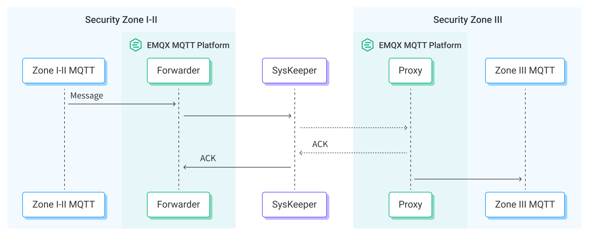

# Nari SysKeeper を介した MQTT データのブリッジ

Nari SysKeeper 2000 はネットワーク物理分離装置です。セキュリティ管理システムとして、特に重要インフラや企業のITシステムなど高レベルのセキュリティ対策が求められる分野で広く利用されています。EMQX は異なるプロダクションゾーンに展開された EMQX クラスター間のデータブリッジをサポートしています。プロダクションゾーンはセキュリティレベル I～III の3段階に分けられ、セキュリティゾーン I-II はより安全で管理された領域を示し、セキュリティゾーン III は制限の少ない領域であり、パブリック向けサービスとより安全な内部領域の橋渡しを行います。通常、セキュリティゾーン I-II と III は相互に隔離されています。データブリッジを通じて、MQTT メッセージはセキュリティゾーン I-II と III 間の一方向の SysKeeper ネットワークゲートを通過し、異なるセキュリティゾーンの別の EMQX クラスターとブリッジされます。

本ページでは、EMQX と Nari SysKeeper 間のデータ統合について包括的に紹介し、データ統合の作成および検証の実践的な手順を提供します。

## 動作原理

Nari SysKeeper データブリッジは EMQX の標準機能であり、MQTT のリアルタイムデータキャプチャとブリッジ機能を SysKeeper の強力なセキュリティ分離能力と組み合わせています。組み込みの[ルールエンジン](./rules.md)コンポーネントを通じて、SysKeeper を介した EMQX ブリッジのプロセスを簡素化し、複雑なコーディングを不要にします。

以下の図は、EMQX と SysKeeper 間のデータブリッジの典型的なアーキテクチャを示しています。



パススルー動作は、セキュリティゾーン I-II とセキュリティゾーン III に展開された2つの EMQX クラスター間の一方向データブリッジとして捉えられ、以下のワークフローで動作します。

1. **SysKeeper プロキシの作成**: セキュリティゾーン III の EMQX 上に SysKeeper プロキシを作成します。SysKeeper プロキシは SysKeeper フォワーダーからのメッセージを受信するための特別な TCP リスナーを起動します。
2. **メッセージのパブリッシュと受信**: 電力システム内の様々なデバイスは直接 EMQX に接続するか、[NeuronEX](https://www.emqx.com/en/products/neuronex) のようなゲートウェイを介して MQTT プロトコルに変換し、EMQX に正常に接続します。これらのデバイスは稼働状況、計測値、またはトリガーされたイベントに基づき MQTT メッセージを送信します。EMQX はこれらのメッセージを受信すると、ルールエンジン内でマッチング処理を開始します。
3. **メッセージデータの処理**: メッセージが到着するとルールエンジンを通過し、EMQX に定義されたルールに従って処理されます。ルールは、どのメッセージを SysKeeper を介して別の EMQX クラスターにブリッジするかを事前定義された条件に基づいて決定します。データ処理操作が指定されている場合は、データ形式の変換、特定情報のフィルタリング、メッセージへの追加コンテキストの付加などが適用されます。
4. **SysKeeper フォワーダーを介した転送**: ルールからの結果は SysKeeper フォワーダーを通じて送信され、SysKeeper 分離装置を経由してセキュリティゾーン III の EMQX に作成された SysKeeper プロキシに到達し、メッセージがセキュリティゾーン III に取り込まれます。SysKeeper プロキシが利用不可の場合、EMQX はメッセージの損失を防ぐためにインメモリのメッセージバッファを提供します。データは一時的にバッファに保持され、メモリ過負荷を防ぐためにディスクにオフロードされることもあります。ただし、データ統合や EMQX ノードが再起動されるとデータは保持されませんのでご注意ください。
5. **データの活用**: セキュリティゾーン III では、MQTT メッセージは元の形式で再パブリッシュされ、ビジネスはルールエンジンやデータ統合を用いてさらなる処理を行うことができます。

## はじめる前に

このセクションでは、Dashboard で Nari SysKeeper データブリッジを作成する前に完了すべき準備について説明します。

### 前提条件

- EMQX のデータ統合に関する[ルール](./rules.md)の知識
- [データ統合](./data-bridges.md)に関する知識
- Nari SysKeeper 装置の基本概念および動作原理の理解

### セキュリティゾーン III で Nari SysKeeper プロキシを起動する

Nari SysKeeper を介して MQTT メッセージを送信するには、ゾーン III でデータプロキシを有効化し、ゾーン I-II の SysKeeper フォワーダーからの接続を受け取る必要があります。

ここでは、セキュリティゾーン III で Nari SysKeeper プロキシを起動する方法を紹介します。

1. Dashboard にアクセスし、**Integration** -> **Connector** をクリックします。

2. ページ右上の **Create** をクリックし、**SysKeeper Proxy** を選択して **Next** をクリックします。

3. コネクターの名前を入力します。名前は大文字・小文字の英字または数字の組み合わせとしてください。例：`my_sysk_proxy`

4. **Listen Address** を `0.0.0.0:9002` に設定します。SysKeeper プロキシは TCP リスナーを起動します。ポートが他のプロセスで使用されていないこと、ファイアウォールがこのポートへのアクセスを許可していることを確認してください。

5. 他の設定項目はデフォルトのままにします。

6. **Create** ボタンをクリックします。

これでセキュリティゾーン III に Nari SysKeeper プロキシが作成されました。次に Nari SysKeeper フォワーダーを作成します。

## コネクターを作成する

このセクションでは、セキュリティゾーン I-II で SysKeeper プロキシへの接続を転送する Nari SysKeeper フォワーダー用コネクターの設定方法を説明します。

1. EMQX Dashboard にアクセスし、**Integration** -> **Connector** をクリックします。

2. ページ右上の **Create** をクリックし、**SysKeeper Forwarder** を選択して **Next** をクリックします。

3. コネクターの名前を入力します。名前は大文字・小文字の英字または数字の組み合わせとしてください。例：`my_sysk`

4. **Server** に SysKeeper プロキシサーバーのアドレスを設定します。例：`172.17.0.1:9002`

   - `172.17.0.1` は SysKeeper がセキュリティゾーン III 用に設定した仮想IPアドレスです。
   - ポート `9002` はセキュリティゾーン III の EMQX SysKeeper プロキシがリッスンしているポートです。

5. **Create** をクリックする前に、**Test Connectivity** をクリックしてコネクターが SysKeeper プロキシに接続できるかテストできます。

6. **Create** をクリックしてコネクターの作成を完了します。ポップアップダイアログで **Back to Connector List** をクリックするか、**Create Rule** をクリックしてルールおよび SysKeeper に転送するデータを指定する Sink を作成できます。詳細は [Create a Rule and Sink](#create-a-rule-and-sink) を参照してください。

## SysKeeper Forwarder Sink を使ったルールの作成

このセクションでは、EMQX でソース MQTT トピック `t/#` からのメッセージを処理し、処理結果を設定済みの SysKeeper Forwarder Sink を通じて別の EMQX クラスターの SysKeeper プロキシに送信するルールの作成方法を説明します。

1. EMQX Dashboard にアクセスし、**Integration -> Rules** をクリックします。

2. ページ右上の **Create** をクリックします。

3. ルールIDを入力します。例：`my_rule`

4. SQL エディターに以下のステートメントを入力します。これはトピックパターン `t/#` にマッチする MQTT メッセージを転送します。

   ```sql
   SELECT
     *
   FROM
     "t/#"
   
   ```

   ::: tip

   初心者の方は、**SQL Examples** をクリックし、**Enable Test** を有効にして SQL ルールを学習・テストできます。

   :::

5. + **Add Action** ボタンをクリックして、ルールがトリガーされた際に実行されるアクションを定義します。このアクションにより、EMQX はルールで処理したデータを SysKeeper に送信します。

6. **Type of Action** ドロップダウンリストから `SysKeeper Forwarder` を選択します。**Action** ドロップダウンはデフォルトの `Create Action` のままにします。既に Sink を作成済みの場合はそれを選択できますが、ここでは新しい Sink を作成します。

7. Sink の名前を入力します。名前は大文字・小文字の英字および数字の組み合わせとしてください。

8. **Connector** ドロップダウンから先ほど作成した `my_sysk` を選択します。

9. 以下の設定情報を入力します。

   - **Topic**: 再パブリッシュするメッセージのトピック。プレースホルダーが利用可能です。例：`${topic}`
   - **QoS**: 再パブリッシュするメッセージの QoS（サービス品質）
   - **Message Template**: 再パブリッシュするメッセージのペイロードテンプレート。プレースホルダーが利用可能です。例：`${payload}`

10. **フォールバックアクション（任意）**: メッセージ配信失敗時の信頼性向上のため、1つ以上のフォールバックアクションを定義できます。これらはプライマリ Sink がメッセージ処理に失敗した場合に実行されます。詳細は [Fallback Actions](./data-bridges.md#fallback-actions) をご参照ください。

11. **Create** をクリックして Sink の作成を完了します。**Create Rule** ページに戻ると、**Action Outputs** タブに新しい Sink が表示されます。

12. **Create Rule** ページで設定内容を確認し、**Create** ボタンをクリックしてルールを生成します。

これでルールが正常に作成され、**Rule** ページに新しいルールが表示されます。**Actions(Sink)** タブをクリックすると、新しい SysKeeper Forwarder が確認できます。

**Integration** -> **Flow Designer** をクリックするとトポロジーが表示され、トピック `t/#` のメッセージがルール `my_rule` によって解析され、SysKeeper Forwarder を通じてパブリッシュされていることが確認できます。

## ルールのテスト

Dashboard に組み込まれた WebSocket クライアントを使って、SysKeeper Forwarder Sink とルールの動作をテストできます。

1. セキュリティゾーン III で、Dashboard の左ナビゲーションメニューから **Diagnose** -> **WebSocket Client** をクリックします。

2. 現在の EMQX インスタンスへの接続情報を入力します。

   - ローカルで EMQX を実行している場合はデフォルト値を使用できます。
   - 認証設定を変更している場合は、ユーザー名やパスワードを入力してください。

3. **Connect** をクリックしてクライアントを EMQX インスタンスに接続します。

4. このクライアントでトピック `t/test` をサブスクライブします。

5. セキュリティゾーン I-II で、上記と同様の手順でパブリッシュ用のクライアントを作成します。

6. パブリッシュエリアに以下を入力します。

   - **Topic**: `t/test`

   - **Payload**:

     ```json
     {
       "hello": "I am from the Security Zone I-II"
     }
     ```

   - **QoS**: `1`

7. **Publish** をクリックしてメッセージを送信します。

8. セキュリティゾーン III で、すべてが正しく設定されていればクライアントがこのメッセージを受信するのが確認できます。
