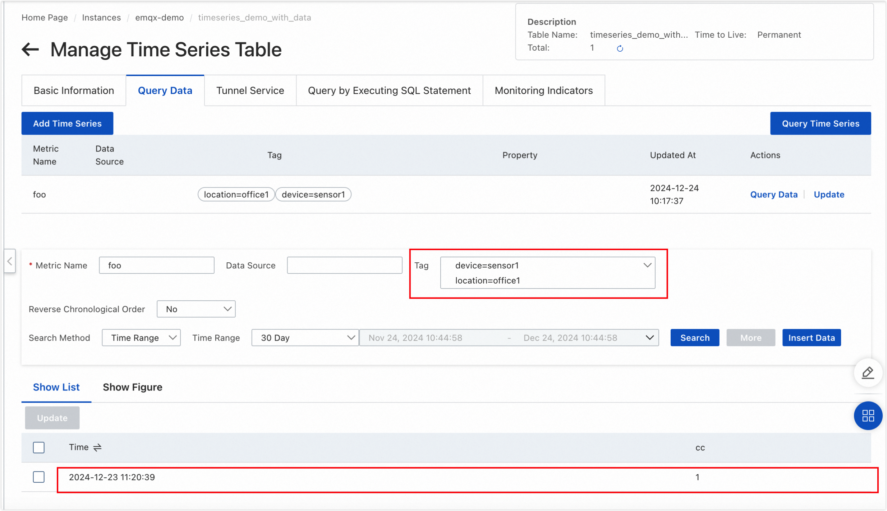

# MQTTデータをTablestoreに取り込む

[Tablestore](https://www.alibabacloud.com/en/product/table-store/pricing?spm=a3c0i.29367734.6737026690.8.78847d3fcEhuVv&_p_lc=1)は、IoTシナリオに最適化されたスケーラブルでサーバーレスなデータベースです。時系列データ、構造化データ、半構造化データを管理するためのワンストップソリューションであるIoTstoreを提供しています。IoT、車載ネットワーク、リスク管理、メッセージング、レコメンデーションシステムなどのシナリオに最適です。Tablestoreはコスト効率の高い高性能なデータストレージを提供し、ミリ秒単位のクエリや検索、柔軟なデータ分析機能を備えています。EMQXはTablestore Cloud、Tablestore OSS、Tablestore Enterpriseとシームレスに統合し、IoTユースケースにおける効率的なデータ管理を可能にします。

## 動作概要

EMQXにおけるTablestoreデータ統合は、EMQXのリアルタイムデータキャプチャおよび送信機能と、Tablestoreの高性能なデータストレージおよび分析機能を組み合わせています。組み込みの[ルールエンジン](./rules.md)を活用することで、EMQXからTablestoreへのデータ取り込みと保存のプロセスを簡素化し、複雑なコーディングを不要にします。EMQXはルールエンジンとSinkを介してIoTデバイスのデータをTablestoreに転送し、効率的な保存と分析を実現します。

データが保存されると、Tablestoreはレポートやチャートなどの強力な分析ツールを提供し、これらはTablestoreの可視化機能を通じてユーザーに提示されます。

以下の図は、エネルギー貯蔵シナリオにおけるEMQXとTablestore間の典型的なデータ統合アーキテクチャを示しています。


EMQXとTablestoreは、エネルギー消費データをリアルタイムに効率的に収集・分析するための拡張可能なIoTプラットフォームを提供します。このアーキテクチャでは、EMQXがIoTプラットフォームとしてデバイス接続、メッセージ送受信、データルーティングを担当し、Tablestoreがデータストレージおよび分析プラットフォームとして機能します。ワークフローは以下の通りです。

1. **メッセージのパブリッシュと受信**：エネルギー貯蔵デバイスや産業用IoTデバイスはMQTTプロトコルを通じてEMQXに正常に接続し、電力消費量、入出力電力などの情報を含むエネルギー消費データを定期的にMQTTプロトコルでパブリッシュします。EMQXがこれらのメッセージを受信すると、ルールエンジン内でマッチング処理を開始します。
2. **メッセージデータの処理**：組み込みのルールエンジンを使用して、特定のソースからのメッセージをトピックマッチングに基づいて処理できます。メッセージが到着するとルールエンジンを通過し、対応するルールとマッチングしてメッセージデータを処理します。これにはデータ形式の変換、特定情報のフィルタリング、コンテキスト情報によるメッセージの付加などが含まれます。
3. **Tablestoreへのデータ取り込み**：ルールエンジンで定義されたルールがトリガーとなり、メッセージをTablestoreに書き込む操作が実行されます。Tablestore Sinkは設定可能なフィールドを提供し、書き込むデータ形式を柔軟に定義でき、メッセージの特定フィールドをTablestoreの対応するメジャメントやフィールドにマッピングします。

エネルギー消費データがTablestoreに書き込まれた後、以下のような分析が可能です。

- Grafanaなどの可視化ツールに接続し、データに基づくチャートを生成してエネルギー貯蔵データを表示する。
- 監視やアラートのために業務システムに接続し、エネルギー貯蔵デバイスの状態を監視する。

## 特長と利点

Tablestoreデータ統合は以下の特長と利点を提供します。

- **効率的なデータ処理**：EMQXは大量のIoTデバイス接続とメッセージスループットを処理でき、Tablestoreはデータの書き込み、保存、クエリに優れた性能を発揮します。IoTシナリオのデータ処理要件を満たしつつ、システムに過度な負荷をかけません。
- **メッセージ変換**：メッセージはEMQXのルールを通じて幅広い処理や変換が可能で、Tablestoreへの書き込み前に柔軟に加工できます。
- **スケーラビリティ**：EMQXとTablestoreはいずれもクラスター拡張に対応しており、ビジネスの成長に応じて柔軟に水平拡張が可能です。
- **豊富なクエリ機能**：Tablestoreは最適化された関数、演算子、インデックス技術を備え、タイムスタンプ付きデータの効率的なクエリと分析を実現し、IoT時系列データから価値ある洞察を正確に抽出します。
- **効率的なストレージ**：Tablestoreは高圧縮率のエンコーディング方式を採用し、ストレージコストを大幅に削減します。また、データ種別ごとに保存期間をカスタマイズでき、不必要なデータがストレージを占有するのを防ぎます。

## はじめる前に

このセクションでは、Tablestoreデータ統合を作成する前に必要な準備について説明します。データベースインスタンスの作成や時系列テーブルの作成・管理が含まれます。

::: tip

現時点では、Tablestoreとのデータ統合はTimeSeriesモデルのみをサポートしています。そのため、以下の手順はTimeSeriesモデルのデータ統合に焦点を当てています。

:::

### 前提条件

進める前に以下を確認してください。

- EMQXデータ統合の[ルール](./rules.md)の理解
- EMQXにおける[データ統合](./data-bridges.md)の仕組みの知識

### 時系列テーブルの作成

1. [Tablestoreコンソール](https://account.alibabacloud.com/login/login.htm)にログインします。
2. 時系列モデルのインスタンスを作成します。インスタンス名を例えば `emqx-demo` とします。インスタンス作成の詳細は[Tablestore公式ドキュメント](https://www.alibabacloud.com/help/en/tablestore/product-overview/activate-service-and-create-a-instance)を参照してください。
3. **インスタンス管理**ページに移動します。
4. **インスタンス詳細**タブで**時系列テーブル**を選択し、**時系列テーブルの作成**ボタンをクリックします。
5. 時系列テーブル情報を設定し、テーブル名を例えば `timeseries_demo_with_data` と入力し、**確認**をクリックします。


### 時系列テーブルの管理

先ほど作成した時系列テーブルを管理するには、テーブル名をクリックして**時系列テーブル管理**ページに入ります。そこから、ビジネス要件に応じて以下の操作が可能です。

1. **データクエリ**タブをクリックします。

2. **時系列の追加**をクリックします。

   ::: tip

   このステップは任意です。時系列テーブルがまだ存在しない場合、Tablestoreはデータ書き込み時に自動的に作成します。そのため、この例では時系列の手動操作は示していません。

   :::


## コネクターの作成

このセクションでは、SinkをTablestoreサーバーに接続するためのコネクター作成方法を説明します。

以下の手順はEMQXとTablestoreをローカルマシンで実行していることを前提としています。リモートで実行している場合は設定を適宜調整してください。

1. EMQXダッシュボードに入り、**Integration** -> **Connectors**をクリックします。
2. ページ右上の**Create**をクリックします。
3. **Create Connector**ページで**Tablestore**を選択し、**Next**をクリックします。
4. **Configuration**ステップで以下を設定します。
   - コネクター名を入力します。英数字の組み合わせで、例：`my_tablestore`。
   - Tablestoreサーバー接続情報を入力します。
     - **Endpoint**：TablestoreインスタンスのアクセスURLを入力します。Tablestoreコンソールのインスタンス詳細ページで確認できます。デプロイ方法に応じてURLを入力してください。例：パブリックネットワークの場合 `https://emqx-demo.cn-hangzhou.ots.aliyuncs.com`。
     - **Instance Name**：接続するTablestoreインスタンス名。例：`emqx-demo`。
     - **Access Key ID**：Tablestore認証に使用するアクセスキーID。Alibaba Cloudが発行する安全なアクセス用キーです。
     - **Access Key Secret**：アクセスキーIDに紐づく認証用シークレット。
     - **Storage Model Type**：現在は `TimeSeries` のみサポート。
   - TLSパラメータを設定します。TablestoreはHTTPSエンドポイントを使用するためTLSはデフォルトで有効です。追加のTLS設定は不要です。TLS接続オプションの詳細は[外部リソースアクセスのTLS有効化](../../guides/network/overview.md#enabling-tls-for-external-resource-access)を参照してください。
5. **Create**をクリックする前に、**Test Connectivity**をクリックしてコネクターがTablestoreサーバーに接続可能かテストできます。
6. ページ下部の**Create**をクリックしてコネクター作成を完了します。ポップアップダイアログで**Back to Connector List**をクリックするか、**Create Rule**をクリックしてルールとSinkの作成を続け、Tablestoreに転送するデータを指定します。詳細は[Tablestore Sink付きルールの作成](#create-a-rule-with-tablestore-sink)を参照してください。

## Tablestore Sink付きルールの作成

このセクションでは、EMQXでソースMQTTトピック `t/#` からのメッセージを処理し、設定したSinkを通じてTablestoreに送信するルールの作成方法を示します。

1. EMQXダッシュボードで左メニューの**Integration** -> **Rules**をクリックします。

2. ページ右上の**Create**をクリックします。

3. ルール作成ページでルールIDに `my_rule` を入力します。

4. **SQL Editor**でルールを設定します。例えば、トピック `t/#` のMQTTメッセージをTablestoreに保存したい場合、以下のSQL構文を使用できます。

   ::: tip

   独自のSQL構文を指定する場合は、後で設定するSinkのデータ形式に含まれる全ての変数が`SELECT`部分に含まれていることを確認してください。

   :::

   ```sql
   SELECT
     *
   FROM
     "t/#"
   ```

   注：初心者の場合は**SQL Examples**をクリックし、**Enable Test**でSQLルールを学習・テストできます。

5. + **Add Action**ボタンをクリックし、ルールがトリガーするアクションを定義します。このアクションにより、EMQXはルールで処理したデータをTablestoreに送信します。

6. **Type of Action**ドロップダウンリストから `Alibaba Tablestore` を選択します。**Action**はデフォルトの `Create Action` のままにします。既に作成済みのSinkがあれば選択可能ですが、この例では新規Sinkを作成します。

7. Sink名を入力します。英数字の組み合わせで指定してください。

8. **Connector**ドロップダウンから先ほど作成した `my_tablestore` を選択します。新規コネクターはドロップダウン横のボタンから作成可能です。設定パラメータは[コネクターの作成](#create-a-connector)を参照してください。

9. 以下のフィールドを設定します。

   - **Data Source**：EMQXがメッセージを取得するデータソース。処理対象データの起点となる特定トピックやデータストリームを指定します。

   - **Table Name**：データを保存するTablestoreテーブル名。先ほど作成したテーブル名を入力します。`${table}`のような変数を使って動的に指定することも可能です。

   - **Measurement**：Tablestoreで使用するメジャメント名。通常は論理的なデータのカテゴリやグルーピングを示します。例：`temperature_readings`や`sensor_data`。`${measurement}`のような変数も使用可能です。

   - **Storage Model Type**：Tablestoreのデータ保存モデルタイプ。現在は時系列データに最適化された `timeseries` のみサポート。

   - **Tags**：Tablestoreの各データエントリーに関連付けるキー・バリュー形式のタグ。メタデータやラベルとして利用し、クエリやフィルタリングを容易にします。**Add**をクリックして複数定義可能です。例：

     | Key        | Value     |
     | ---------- | --------- |
     | `location` | `office1` |
     | `device`   | `sensor1` |

   - **Fields**：Tablestoreに送信するデータのフィールドリスト。各フィールドはTablestoreテーブルのカラムにマッピングされます。**Add**をクリックして以下を追加します。
     - **Column**：Tablestoreのカラム名。`${column_name}`のような変数で定義可能で、後述のメッセージペイロードのフィールドと対応させます。
     - **Message value**：カラムに割り当てる値。`${value}`のような動的参照、`true`（ブール値）、`1.3`（数値）、バイナリデータなどが指定可能です。
     - **Is Int**：カラムが数値型の場合、EMQXはデフォルトで浮動小数点型としてTablestoreに挿入します。整数値として挿入したい場合はこのフラグを`true`に設定します。設定ファイル経由では`${isint}`のような変数で動的指定も可能です。
     - **Is Binary**：カラムがバイナリの場合、EMQXはデフォルトで文字列型として挿入します。バイナリデータとして挿入するにはこのフラグを`true`に設定します。設定ファイル経由では`${isbinary}`のような変数で動的指定も可能です。

   - **Timestamp**：Tablestoreに記録するタイムスタンプ。マイクロ秒単位の整数値で指定します。固定値、文字列 `"NOW"`（メッセージ処理時にEMQXが現在時刻を動的に埋め込む）、`${microsecond_timestamp}`のような変数で動的指定が可能です。

   - **Meta Update Model**：Tablestoreのメタデータ更新戦略を定義します。
     - `MUM_IGNORE`：メタデータ更新を無視し、競合があっても変更しません。
     - `MUM_NORMAL`：通常のメタデータ更新を行います。メタデータが存在しない場合は動的に作成し、既存のメタデータと競合する場合は上書きされる可能性があります。

10. **フォールバックアクション（任意）**：メッセージ配信失敗時の信頼性向上のため、1つ以上のフォールバックアクションを定義できます。これらはプライマリSinkがメッセージ処理に失敗した場合にトリガーされます。詳細は[フォールバックアクション](./data-bridges.md#fallback-actions)を参照してください。

11. **詳細設定（任意）**：[詳細設定](#advanced-configurations)を参照してください。

12. **Create**をクリックする前に、**Test Connectivity**をクリックしてSinkがTablestoreサーバーに接続可能かテストできます。

13. **Create**をクリックしてSink作成を完了します。ルール作成ページに戻ると、**Action Outputs**タブに新しいSinkが表示されます。

14. ルール作成ページで設定内容を確認し、**Create**をクリックしてルールを生成します。

これでルールの作成が完了し、**Rule**ページに新しいルールが表示されます。**Actions(Sink)**タブをクリックすると、新しいTablestore Sinkが確認できます。

また、**Integration** -> **Flow Designer**をクリックしてトポロジーを確認できます。トピック `t/#` のメッセージがルール `my_rule` によって解析され、Tablestoreに送信・保存されている様子がわかります。

## ルールのテスト

1. MQTTXを使ってトピック `t/1` にメッセージを送信し、オンライン／オフラインイベントをトリガーします。

   ```bash
   mqttx pub -i emqx_c -t t/1 -m '{ "table": "timeseries_demo_with_data", "measurement": "foo", "microsecond_timestamp": 1734924039271024, "column_name": "cc", "value": 1}'
   ```

2. Sinkの稼働状況を確認し、新規の受信メッセージと送信メッセージが1件ずつあることを確認します。

3. [Tablestoreコンソール](https://account.alibabacloud.com/login/login.htm?spm=5176.12901015-2.0.0.1a364b84fgwsH6)にアクセスし、データがTablestoreに書き込まれているか確認します。

   - **Metric Name**にメジャメント名（このデモでは`foo`）を入力します。
   - **Tag**に `location=office1` と `device=sensor1` をクエリ条件として入力し、**Search**をクリックします。

   

## 詳細設定

このセクションでは、TablestoreコネクターとSinkの詳細設定オプションについて説明します。ダッシュボードでコネクターやSinkを設定する際、**Advanced Settings**に移動して以下のパラメータをニーズに合わせて調整できます。

| **フィールド**           | **説明**                                                                                                         | **推奨値** |
| ----------------------- | ---------------------------------------------------------------------------------------------------------------- | ---------- |
| Buffer Pool Size        | EMQXとTablestore間の出力タイプブリッジでデータフローを管理するために割り当てられるバッファワーカープロセスの数を指定します。これらのワーカーはデータを一時的に保存・処理し、ターゲットサービスへの送信を最適化します。Ingress（入力）データのみを扱うSinkでは適用されないため、この場合は「0」に設定可能です。 | `16`       |
| Request TTL             | リクエストTTL（Time To Live）は、リクエストがバッファに入ってから有効とみなされる最大秒数を指定します。この時間を超えてバッファ内にあるか、送信後にTablestoreから適時の応答やアックが得られない場合、リクエストは期限切れと見なされます。 | `45`       |
| Health Check Interval   | SinkがTablestoreへの接続状態を自動的にヘルスチェックする間隔（秒）を指定します。                                   | `15`       |
| Max Buffer Queue Size   | Tablestore Sinkの各バッファワーカーがバッファリング可能な最大バイト数を指定します。バッファワーカーはデータを一時保存し、効率的なデータフローを実現します。システム性能やデータ転送要件に応じて調整してください。 | `256`      |
| Batch Size              | EMQXからTablestoreへ一度に転送可能なデータバッチのサイズを指定します。サイズを調整することでデータ転送の効率と性能を最適化できます。 | `1`        |
| Query Mode              | メッセージ送信の最適化のため、`asynchronous`（非同期）または`synchronous`（同期）クエリモードを選択できます。非同期モードではTablestoreへの書き込みがMQTTメッセージのパブリッシュ処理をブロックしませんが、クライアントがメッセージをTablestore到着前に受信する可能性があります。 | `Async`    |
| Inflight Window         | 「インフライトクエリ」とは、開始されたがまだ応答やアックを受け取っていないクエリを指します。SinkがTablestoreと通信する際に同時に存在可能な最大インフライトクエリ数を制御します。<br/>**Query Mode**が`async`のとき、このパラメータは特に重要です。同一MQTTクライアントからのメッセージを厳密に順序処理したい場合は、値を1に設定してください。 | `100`      |
