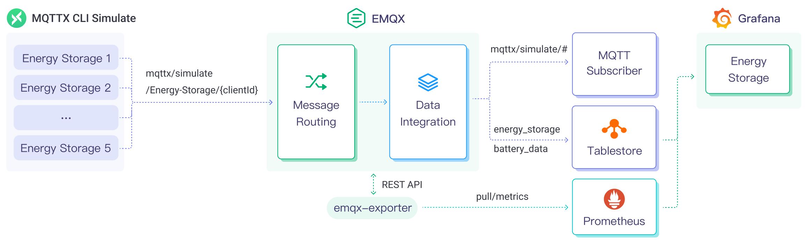
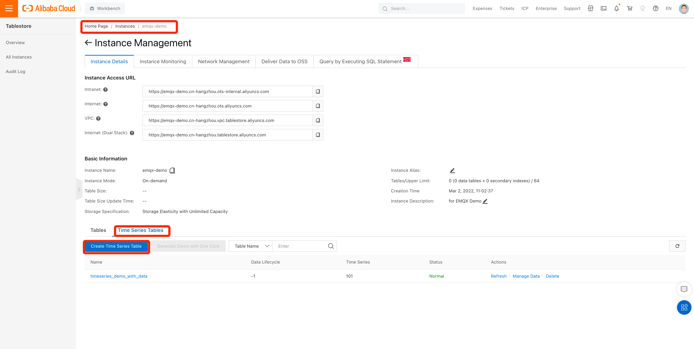
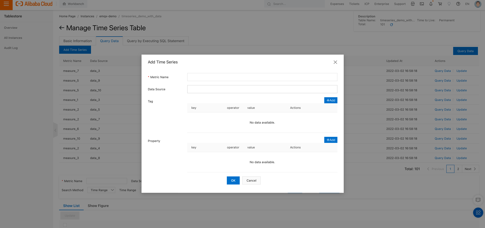
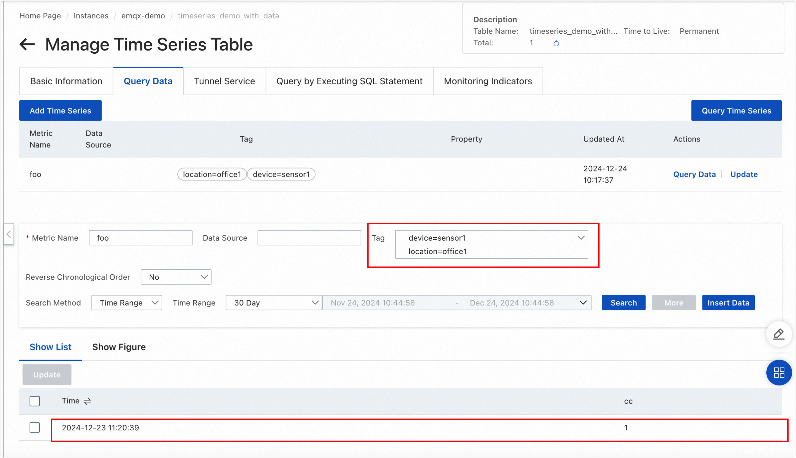

# MQTTデータをTablestoreに取り込む

[Tablestore](https://www.alibabacloud.com/en/product/table-store/pricing?spm=a3c0i.29367734.6737026690.8.78847d3fcEhuVv&_p_lc=1)は、IoTシナリオに最適化されたスケーラブルでサーバレスなデータベースです。時系列データ、構造化データ、半構造化データを管理するためのワンストップソリューションであるIoTstoreを提供しています。IoT、車載ネットワーク、リスクコントロール、メッセージング、レコメンデーションシステムなどのシナリオに最適です。Tablestoreは、コスト効率が高く高性能なデータストレージを提供し、ミリ秒単位のクエリや取得、柔軟なデータ分析機能を備えています。EMQXはTablestore Cloud、Tablestore OSS、Tablestore Enterpriseとシームレスに統合し、IoTユースケースにおける効率的なデータ管理を実現します。

## 動作概要

EMQXにおけるTablestoreデータ統合は、EMQXのリアルタイムデータキャプチャと送信機能と、Tablestoreの高性能なデータストレージおよび分析機能をシームレスに組み合わせています。組み込みの[ルールエンジン](./rules.md)を活用することで、EMQXからTablestoreへのデータ取り込みと保存のプロセスを簡素化し、複雑なコーディングを不要にします。EMQXはルールエンジンとSinkを介してIoTデバイスのデータをTablestoreに転送し、効率的な保存と分析を可能にします。

データが保存されると、Tablestoreはレポートやチャート、その他の可視化を生成する強力なツールを提供し、これらはTablestoreの可視化機能を通じてユーザーに提示されます。

以下の図は、エネルギー貯蔵シナリオにおけるEMQXとTablestoreの典型的なデータ統合アーキテクチャを示しています。



EMQXとTablestoreは、エネルギー消費データをリアルタイムに効率的に収集・分析するための拡張可能なIoTプラットフォームを提供します。このアーキテクチャでは、EMQXがデバイスアクセス、メッセージ送信、データルーティングを担当するIoTプラットフォームとして機能し、Tablestoreがデータストレージおよび分析プラットフォームとしてデータの保存と分析機能を担います。ワークフローは以下の通りです。

1. **メッセージのパブリッシュと受信**：エネルギー貯蔵デバイスや産業用IoTデバイスはMQTTプロトコルを通じてEMQXに正常に接続し、電力消費量、入出力電力などの情報を含むエネルギー消費データを定期的にMQTTプロトコルでパブリッシュします。EMQXはこれらのメッセージを受信すると、ルールエンジン内でマッチング処理を開始します。
2. **メッセージデータ処理**：組み込みのルールエンジンを使用して、特定のソースからのメッセージをトピックマッチングに基づいて処理できます。メッセージが到着するとルールエンジンを通過し、対応するルールにマッチングされ、データ形式の変換、特定情報のフィルタリング、コンテキスト情報によるメッセージの強化などの処理が行われます。
3. **Tablestoreへのデータ取り込み**：ルールエンジンで定義されたルールがメッセージをTablestoreに書き込む操作をトリガーします。Tablestore Sinkは、書き込むデータ形式を柔軟に定義できる設定項目を提供し、メッセージの特定フィールドをTablestoreの対応するメジャメントやフィールドにマッピングします。

エネルギー消費データがTablestoreに書き込まれた後、以下のような分析が可能です。

- Grafanaなどの可視化ツールに接続し、データに基づくチャートを生成してエネルギー貯蔵データを表示。
- ビジネスシステムに接続してエネルギー貯蔵デバイスの状態監視やアラートを実施。

## 特長と利点

Tablestoreデータ統合は以下の特長と利点を提供します。

- **効率的なデータ処理**：EMQXは膨大な数のIoTデバイス接続とメッセージスループットを処理でき、Tablestoreはデータの書き込み、保存、クエリに優れた性能を発揮します。IoTシナリオのデータ処理ニーズに応えつつ、システムに過度な負荷をかけません。
- **メッセージ変換**：メッセージはEMQXのルールを通じて大規模な処理や変換が可能で、Tablestoreに書き込む前に柔軟に加工できます。
- **スケーラビリティ**：EMQXとTablestoreはどちらもクラスター拡張に対応しており、ビジネスの成長に応じて柔軟に水平拡張が可能です。
- **豊富なクエリ機能**：Tablestoreは最適化された関数、演算子、インデックス技術を備え、タイムスタンプ付きデータの効率的なクエリと分析を実現し、IoT時系列データから価値ある洞察を正確に抽出できます。
- **効率的なストレージ**：Tablestoreは高圧縮率のエンコード方式を採用し、ストレージコストを大幅に削減します。また、データタイプごとに保存期間をカスタマイズでき、不必要なデータがストレージを占有するのを防ぎます。

## はじめる前に

このセクションでは、Tablestoreデータ統合の作成を開始する前に必要な準備、データベースインスタンスの作成、時系列テーブルの作成と管理について説明します。

::: tip

現時点では、Tablestoreとのデータ統合はTimeSeriesモデルのみをサポートしています。そのため、以下の手順はTimeSeriesモデルを対象としています。

:::

### 前提条件

以下を事前にご確認ください。

- EMQXデータ統合の[ルール](./rules.md)の理解。
- EMQXにおける[データ統合](./data-bridges.md)の仕組みの理解。

### 時系列テーブルの作成

1. [Tablestoreコンソール](https://account.alibabacloud.com/login/login.htm)にログインします。
2. 時系列モデルのインスタンスを作成します。インスタンス名として例として`emqx-demo`を指定します。インスタンス作成の詳細は[Tablestore公式ドキュメント](https://www.alibabacloud.com/help/en/tablestore/product-overview/activate-service-and-create-a-instance)を参照してください。
3. **インスタンス管理**ページに移動します。
4. **インスタンス詳細**タブで**時系列テーブル**を選択し、**時系列テーブル作成**ボタンをクリックします。
5. 時系列テーブル情報を設定し、テーブル名に例として`timeseries_demo_with_data`を入力します。**確認**をクリックします。



### 時系列テーブルの管理

先ほど作成した時系列テーブルを管理するには、テーブル名をクリックして**時系列テーブル管理**ページに入ります。ビジネス要件に応じて以下の手順を実行できます。

1. **データクエリ**タブをクリックします。

2. **時系列追加**をクリックします。

   ::: tip

   この手順は任意です。時系列テーブルが存在しない場合、データ書き込み時にTablestoreが自動的に作成します。そのため、この例では時系列の手動操作は示していません。

   :::



## コネクターの作成

このセクションでは、SinkをTablestoreサーバーに接続するためのコネクター作成方法を示します。

以下の手順はEMQXとTablestoreをローカルマシンで実行していることを前提としています。リモート環境で実行している場合は設定を適宜調整してください。

1. EMQXダッシュボードに入り、**Integration** -> **Connectors**をクリックします。
2. ページ右上の**作成**をクリックします。
3. **コネクター作成**ページで**Tablestore**を選択し、**次へ**をクリックします。
4. **設定**ステップで以下を設定します。
   - コネクター名を入力します。英数字の組み合わせで指定してください。例：`my_tablestore`
   - Tablestoreサーバー接続情報を入力します。
     - **エンドポイント**：TablestoreインスタンスのアクセスURLを入力します。Tablestoreコンソールのインスタンス詳細ページで確認可能です。デプロイ方法に応じてURLを入力してください。例：パブリックネットワークの場合は`https://emqx-demo.cn-hangzhou.ots.aliyuncs.com`
     - **インスタンス名**：接続するTablestoreインスタンス名。例として先ほど作成した`emqx-demo`を使用します。
     - **Access Key ID**：Tablestore認証に使用するAlibaba Cloud発行のアクセスキーID。
     - **Access Key Secret**：アクセスキーIDに対応するシークレットキー。
     - **ストレージモデルタイプ**：現時点では`TimeSeries`のみサポート。
     - **プローブテーブル名**：EMQX 6.3.2以降、既存の時系列テーブルを指定して接続性チェックに利用可能です。多くの時系列テーブルがあるインスタンスで推奨されます。未設定の場合、EMQXはエンドポイントの生のTCP接続性をプローブし、Tablestoreの認証やテーブルアクセスは検証しません。
   - TLSパラメータの設定。TablestoreはHTTPSエンドポイントを使用するため、TLSはデフォルトで有効です。追加のTLS設定は不要です。TLS接続オプションの詳細は[外部リソースアクセスのTLS有効化](../../guides/network/overview.md#enabling-tls-for-external-resource-access)を参照してください。
5. **作成**をクリックする前に、**接続テスト**をクリックしてコネクターがTablestoreに接続できるか確認できます。
6. ページ下部の**作成**ボタンをクリックしてコネクター作成を完了します。ポップアップで**コネクター一覧に戻る**か**ルール作成**を選択できます。ルールとSinkの作成手順は[Tablestore Sink付きルールの作成](#create-a-rule-with-tablestore-sink)を参照してください。

## Tablestore Sink付きルールの作成

このセクションでは、EMQXでソースMQTTトピック`t/#`からのメッセージを処理し、設定済みのSinkを通じてTablestoreに送信するルールの作成方法を示します。

1. EMQXダッシュボードに入り、左メニューから**Integration** -> **Rules**をクリックします。

2. ページ右上の**作成**をクリックします。

3. ルール作成ページで、ルールIDに`my_rule`を入力します。

4. **SQLエディター**でルールを設定します。例えば、トピック`t/#`のMQTTメッセージをTablestoreに保存したい場合、以下のSQL文を使用します。

   ::: tip

   独自のSQL文を指定する場合は、後で設定するSinkのデータ形式に含まれるすべての変数が`SELECT`部分に含まれていることを確認してください。

   :::

   ```sql
   SELECT
     *
   FROM
     "t/#"
   ```

   注：初心者の方は**SQL例**をクリックし、**テスト有効化**でSQLルールの学習とテストが可能です。

5. + **アクション追加**ボタンをクリックし、ルールがトリガーするアクションを定義します。このアクションでEMQXはルールで処理したデータをTablestoreに送信します。

6. **アクションの種類**ドロップダウンから`Alibaba Tablestore`を選択します。**アクション**はデフォルトの`Create Action`のままにします。既に作成済みのSinkがあれば選択可能です。この例では新規Sinkを作成します。

7. Sinkの名前を入力します。英数字の組み合わせで指定してください。

8. **コネクター**ドロップダウンから先ほど作成した`my_tablestore`を選択します。新規コネクターはドロップダウン横のボタンから作成可能です。設定パラメータは[コネクターの作成](#create-a-connector)を参照してください。

9. 以下の項目を設定します。

   - **データソース**：EMQXがメッセージを取得するデータソース。処理対象のデータの起点を示します。特定のトピックやデータストリームを指定します。

   - **テーブル名**：データを保存するTablestoreのテーブル名。先ほど作成したテーブル名を入力します。`${table}`などの変数で動的に割り当てることも可能です。

   - **メジャメント**：Tablestoreで使用されるメジャメント名。通常はデータの論理的なグループやカテゴリを示します。例：`temperature_readings`や`sensor_data`。`${measurement}`などの変数も使用可能です。

   - **ストレージモデルタイプ**：Tablestoreで使用するデータストレージモデルの種類。現時点では`timeseries`のみサポートし、時系列データに最適化されています。

   - **タグ**：Tablestoreの各データエントリに関連付けるキー・バリュー形式のタグ。メタデータやラベルとして利用し、クエリやフィルタリングを容易にします。**追加**をクリックして複数定義可能です。例：

     | キー        | 値         |
     | ---------- | ---------- |
     | `location` | `office1`  |
     | `device`   | `sensor1`  |

   - **フィールド**：Tablestoreに送信するデータフィールドのリスト。各フィールドはTablestoreテーブルのカラムにマッピングされます。**追加**をクリックして以下を設定します。
     - **カラム**：Tablestoreのカラム名。`${column_name}`などの変数で定義可能で、後述のメッセージペイロードのフィールドと一致させます。
     - **メッセージ値**：カラムに割り当てる値。`${value}`のような動的参照、`true`のような真偽値、`1.3`の数値、バイナリデータなどが指定可能です。
     - **整数型か**：カラムが数値型の場合、EMQXはデフォルトで浮動小数点型としてTablestoreに挿入します。整数値として挿入したい場合はこのフラグを`true`に設定します。設定ファイル経由では`${isint}`などの変数で動的割り当ても可能です。
     - **バイナリ型か**：カラムがバイナリの場合、EMQXはデフォルトで文字列型として挿入します。バイナリデータとして挿入したい場合はこのフラグを`true`に設定します。設定ファイル経由では`${isbinary}`などの変数で動的割り当ても可能です。

   - **タイムスタンプ**：Tablestoreに記録されるタイムスタンプ。マイクロ秒単位の整数値で指定します。固定値、文字列"NOW"（EMQXがメッセージ処理時に現在時刻を動的に埋め込み）、`${microsecond_timestamp}`のような変数プレースホルダーで動的割り当てが可能です。

   - **メタ更新モデル**：Tablestoreのメタデータ更新戦略を定義します。
     - `MUM_IGNORE`：メタデータ更新を無視し、競合があってもメタデータを変更しません。
     - `MUM_NORMAL`：通常のメタデータ更新を行います。メタデータが存在しない場合は動的に作成してからデータを書き込みます。既存メタデータと競合があれば上書きされる可能性があります。

10. **フォールバックアクション（任意）**：メッセージ配信失敗時の信頼性向上のため、1つ以上のフォールバックアクションを定義できます。これらはプライマリSinkがメッセージ処理に失敗した場合にトリガーされます。詳細は[フォールバックアクション](./data-bridges.md#fallback-actions)を参照してください。

11. **詳細設定（任意）**：[詳細設定](#advanced-configurations)を参照してください。

12. **作成**をクリックする前に、**接続テスト**をクリックしてSinkがTablestoreに接続できるか確認できます。

13. **作成**をクリックしてSink作成を完了します。ルール作成ページの**アクション出力**タブに新しいSinkが表示されます。

14. ルール作成ページで設定内容を確認し、**作成**ボタンをクリックしてルールを生成します。

これでルールが正常に作成され、**ルール**ページに新しいルールが表示されます。**アクション(Sink)**タブをクリックすると、新しいTablestore Sinkが確認できます。

また、**Integration** -> **Flow Designer**をクリックしてトポロジーを確認できます。トピック`t/#`のメッセージがルール`my_rule`で解析され、Tablestoreに送信・保存されていることがわかります。

## ルールのテスト

1. MQTTXを使ってトピック`t/1`にメッセージを送信し、オンライン/オフラインイベントをトリガーします。

   ```bash
   mqttx pub -i emqx_c -t t/1 -m '{ "table": "timeseries_demo_with_data", "measurement": "foo", "microsecond_timestamp": 1734924039271024, "column_name": "cc", "value": 1}'
   ```

2. Sinkの稼働状況を確認し、新しい受信メッセージと送信メッセージが1件ずつあることを確認します。

3. [Tablestoreコンソール](https://account.alibabacloud.com/login/login.htm?spm=5176.12901015-2.0.0.1a364b84fgwsH6)にアクセスし、データがTablestoreに書き込まれているか確認します。

   - **メトリック名**にメジャメント名（このデモでは`foo`）を入力。
   - **タグ**に`location=office1`と`device=sensor1`をクエリ条件として入力し、**検索**をクリック。

   

## 詳細設定

このセクションでは、TablestoreコネクターおよびSinkの詳細設定オプションについて説明します。ダッシュボードでコネクターやSinkを設定する際、**詳細設定**に進み、以下のパラメータをニーズに合わせて調整できます。

| **項目**              | **説明**                                                                                           | **推奨値** |
| --------------------- | ------------------------------------------------------------------------------------------------ | ---------- |
| バッファプールサイズ  | EMQXとTablestore間の出口タイプブリッジでデータフローを管理するために割り当てられるバッファワーカープロセスの数を指定します。これらのワーカーは送信前のデータを一時的に保存・処理します。出口（アウトバウンド）シナリオのパフォーマンス最適化に重要です。入力（インバウンド）データのみを扱うSinkの場合は"0"に設定可能です。 | `16`       |
| リクエストTTL         | リクエストTTL（Time To Live）は、リクエストがバッファに入ってから有効と見なされる最大秒数を指定します。TTLを超えてバッファに滞留するか、送信後にTablestoreからの応答やアックがタイムリーに得られない場合、リクエストは期限切れと判断されます。 | `45`       |
| ヘルスチェック間隔    | SinkがTablestore接続の自動ヘルスチェックを実行する間隔（秒）を指定します。                             | `15`       |
| 最大バッファキューサイズ | Tablestore Sinkの各バッファワーカーがバッファリング可能な最大バイト数を指定します。バッファワーカーはデータ送信前に一時的にデータを保持し、データフローを効率化します。システムの性能やデータ転送要件に応じて調整してください。 | `256`      |
| バッチサイズ          | EMQXからTablestoreに一度に転送可能なデータバッチのサイズを指定します。サイズを調整することでデータ転送の効率と性能を最適化できます。 | `1`        |
| クエリモード          | メッセージ送信を最適化するために`asynchronous`（非同期）または`synchronous`（同期）モードを選択できます。非同期モードではTablestoreへの書き込みがMQTTメッセージのパブリッシュをブロックしませんが、クライアントがTablestore到着前にメッセージを受信する可能性があります。 | `Async`    |
| インフライトウィンドウ | インフライトクエリとは、開始されたがまだ応答やアックを受け取っていないクエリを指します。SinkがTablestoreと通信する際に同時に存在可能な最大インフライトクエリ数を制御します。<br/>**クエリモード**が`async`（非同期）の場合、このパラメータは特に重要です。同一MQTTクライアントからのメッセージを厳密な順序で処理したい場合は、この値を1に設定してください。 | `100`      |
