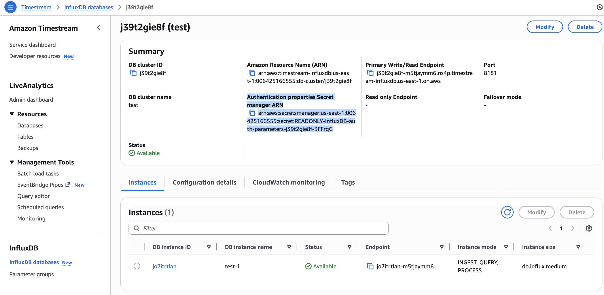

# AWS Timestream for InfluxDB への MQTT データ取り込み

[AWS Timestream for InfluxDB](https://docs.aws.amazon.com/timestream/latest/developerguide/timestream-for-influxdb.html) は、InfluxDB 2.x ワークロードを AWS 上で実行可能にし、データ取り込みの簡素化とリアルタイム分析を実現するフルマネージドの時系列データベースサービスです。EMQX 6.1 以降、EMQX は既存の InfluxDB Cloud、InfluxDB OSS、InfluxDB Enterprise のサポートに加え、Amazon Timestream for InfluxDB とのネイティブ統合を提供しています。

本ページでは、EMQX と Amazon Timestream for InfluxDB 間のデータ統合について包括的に解説し、設定およびデータフローの検証手順を実践的に説明します。

## 動作概要

Amazon Timestream for InfluxDB との統合は、EMQX のリアルタイムデータ処理およびルーティング機能と、Timestream のフルマネージドかつ高性能な InfluxDB エンジンを組み合わせたものです。

EMQX の組み込みの[ルールエンジン](./rules.md)と Timestream for InfluxDB Sink を通じて、EMQX は MQTT メッセージを変換し、カスタムアプリケーションコードを必要とせずに直接 Timestream for InfluxDB DB インスタンスへ書き込みます。

以下の図は、エネルギー貯蔵シナリオにおける EMQX と Amazon Timestream for InfluxDB 間の典型的なデータ統合アーキテクチャを示しています。


この統合は、リアルタイムのエネルギー監視と分析のためのスケーラブルな IoT データパイプラインを提供します。EMQX はデバイス接続とデータルーティングを担う IoT メッセージング層として機能し、Timestream for InfluxDB は管理された時系列ストレージとクエリ機能を提供します。ワークフローは以下の通りです。

1. **メッセージのパブリッシュと受信**：デバイスは MQTT 経由で EMQX に接続し、テレメトリ（例：電力使用量、充放電メトリクス）をパブリッシュします。EMQX はこれらのメッセージを受信すると、ルールエンジン内でマッチング処理を開始します。  
2. **メッセージ処理**：ルールエンジンはトピックをマッチングし、フィルタリング、フィールド抽出、データ強化などの変換を適用し、ペイロードをターゲットの Timestream for InfluxDB バケットへの取り込み用に整形します。
3. **Timestream へのデータ取り込み**：ルールが Amazon Timestream Sink をトリガーすると、EMQX は InfluxDB ラインプロトコルを用いてデータを書き込みます。テンプレートは MQTT フィールドをメジャメント、タグ、フィールドにマッピングする方法を定義します。

Timestream for InfluxDB に保存された後は、Flux/InfluxQL クエリ、InfluxUI、Grafana などのツールを使って電力メトリクスの可視化や監視・アラートのためのビジネスシステム統合が可能です。

## 特長とメリット

Amazon Timestream for InfluxDB 統合は以下の特長と利点を提供します。

- **効率的なデータ処理**：EMQX は大規模な IoT 接続と高スループットの MQTT データを処理し、Timestream for InfluxDB は高速な取り込みとミリ秒単位のクエリ性能を提供し、リアルタイム分析を実現します。
- **メッセージ変換**：EMQX のルールは柔軟なフィルタリング、抽出、変換を可能にし、データを構造化された JSON マッピングまたはカスタム InfluxDB ラインプロトコルテンプレートとしてフォーマットした上で Timestream に書き込みます。
- **管理されたスケーラビリティ**：EMQX は大規模 IoT デプロイメント向けの水平クラスタリングをサポートし、Timestream for InfluxDB はマネージドインスタンスのスケーリング、自動バックアップ、シームレスなバージョンアップデートを提供します。
- **豊富なクエリ機能**：Timestream for InfluxDB は Flux と InfluxQL を含む InfluxDB 2.x のクエリエコシステムを完全サポートし、強力な時系列分析と下流ツールとの統合を可能にします。
- **最適化されたストレージ**：Timestream for InfluxDB は AWS 管理のストレージを使用し、事前設定された IOPS とスループット階層により、時系列データワークロードに対して効率的かつコスト最適化されたパフォーマンスを提供します。

## はじめる前に

このセクションでは、データ統合作成前に必要な準備事項を説明します。Amazon Timestream for InfluxDB 環境のセットアップや接続パラメータの取得が含まれます。

### 前提条件

統合設定の前に以下を確認してください。

- EMQX が Timestream for InfluxDB へデータ書き込み時に使用する[InfluxDB ラインプロトコル](https://docs.influxdata.com/influxdb/v2.5/reference/syntax/line-protocol/)に精通していること。
- EMQX のデータ統合[ルール](./rules.md)とルールエンジンによる MQTT メッセージの変換・ルーティングの理解。
- EMQX の[データ統合](./data-bridges.md)の基本知識、特に Sink の設定とトリガー方法。

### Amazon Timestream for InfluxDB の準備

EMQX から Timestream for InfluxDB インスタンスへデータ送信を可能にするため、AWS 上で以下の準備を行います。

::: tip 前提条件

Timestream for InfluxDB リソースの作成・管理権限を持つ AWS アカウントを用意してください。

:::

#### Timestream for InfluxDB DB インスタンスの作成

1. AWS マネジメントコンソールにサインインし、[Amazon Timestream for InfluxDB コンソール](https://console.aws.amazon.com/timestream/)を開きます。

2. 画面右上で DB インスタンスを作成したい AWS リージョンを選択します。

3. ナビゲーションペインで **InfluxDB Databases** を選択します。

4. **Create InfluxDB database** をクリックします。

5. **Engine settings** でデプロイに使用する InfluxDB エンジンバージョンを選択します。

   ::: tip 注意

   エンジンバージョンは後述の EMQX コネクター用認証情報の取得方法に影響します。ワークロードと統合要件に合ったバージョンを選択してください。

   :::

   

6. 残りの設定（デプロイ設定、ストレージオプション、ネットワーキング、ログ設定など）を要件に応じて完了します。各オプションの詳細は以下を参照してください：[InfluxDB DB インスタンスの作成](https://docs.aws.amazon.com/timestream/latest/developerguide/timestream-for-influx-getting-started-creating-db-instance.html#timestream-for-influx-getting-started-creating-db-instance-step2)。

7. データベース作成後、インスタンス詳細ページを開き、AWS が生成したエンドポイント（例：`c5vasdqn0b-3ksj4dla5nfjhi.timestream-influxdb.us-east-1.on.aws`）を取得します。EMQX コネクター設定時に必要です。

#### ネットワークおよびセキュリティグループの設定

EMQX が Timestream for InfluxDB インスタンスに接続できるよう、インスタンスの VPC セキュリティグループで TCP ポート 8086 への着信接続を許可してください。設定例は以下の通りです。

- **プロトコル**：TCP
- **ポート**：8086（Timestream for InfluxDB が使用する InfluxDB API ポート）
- **送信元**：EMQX がデプロイされているネットワークの IP アドレス範囲またはセキュリティグループ

EMQX が Timestream for InfluxDB と同じ VPC 内にある場合、VPC 内のプライベートネットワーク経路で接続可能です。EMQX が AWS 外部で稼働している場合は、セキュリティグループで EMQX の外部ネットワークからの接続を許可してください。また、EMQX から Timestream エンドポイントへの HTTPS/TCP 8086 トラフィックをブロックするアウトバウンドファイアウォールルールがないことも確認してください。

接続要件やセキュリティに関する詳細は AWS ドキュメントを参照してください：[Amazon Timestream for InfluxDB DB インスタンスへの接続](https://docs.aws.amazon.com/timestream/latest/developerguide/timestream-for-influx-db-connecting.html)。

#### InfluxDB トークン、Organization、Bucket の取得

トークンおよび認証情報の取得方法は、Timestream for InfluxDB インスタンス作成時に選択した **InfluxDB エンジンバージョン** に依存します。

##### InfluxDB v2 DB インスタンスの Influx UI アクセス

1. DB インスタンスのエンドポイントを使って **Influx UI** を開きます。

   ```
   https://<endpoint>:8086
   ```

   > DB インスタンスがパブリックアクセス不可の場合、同一 VPC 内のホスト（例：バスチオンホストや SSM ポートフォワーディング経由）からアクセスする必要があります。詳細は [AWS ドキュメント](https://docs.aws.amazon.com/timestream/latest/developerguide/timestream-for-influx-getting-started-creating-db-instance.html) を参照してください。

2. DB インスタンス作成時に設定したマスターユーザー認証情報でログインします。

3. 対象バケットへの書き込み権限を持つパーソナルアクセストークンを生成または取得します。

   このトークンが EMQX の Timestream for InfluxDB 認証に使用されます。

   ::: tip 注意

   新規作成したトークンは一度しか表示されません。必ずコピーして保存してください。

   :::

4. インスタンスで設定されている **Organization** と **Bucket** の値を確認します。これらは EMQX 設定時に正確に一致させる必要があります。

詳細は AWS 公式ドキュメントを参照してください：[InfluxDB UI へのアクセス](https://docs.aws.amazon.com/timestream/latest/developerguide/timestream-for-influx-getting-started-creating-db-instance.html#timestream-for-influx-getting-started-creating-db-instance-step-3)。

##### **InfluxDB v3** DB インスタンスの認証トークン取得

InfluxDB v3 では InfluxDB UI から API トークンを発行しません。代わりに、DB インスタンス作成時に AWS が認証パラメータ（API トークン含む）を **AWS Secrets Manager** に保存します。

1. Timestream コンソールの DB クラスター詳細ページを開き、**Authentication properties Secret manager ARN** フィールドを確認します。

   

   この ARN は EMQX が使用する認証情報が格納された Secrets Manager エントリを指します。

2. **AWS Secrets Manager** の **Secrets** で該当するシークレット名（例：`READONLY-InfluxDB-auth-parameters-<cluster-id>`）を検索します。

3. シークレットを開き、**Plaintext** 表示に切り替えて内容を取得します。

   

### 必須接続パラメータ

EMQX の Amazon Timestream for InfluxDB コネクター設定時には、Timestream インスタンスの InfluxDB エンジンバージョンに応じて以下のパラメータを指定してください。

| パラメータ           | 説明                                                         |
| -------------------- | ------------------------------------------------------------ |
| **Endpoint**         | InfluxDB インスタンスの AWS 生成エンドポイント例：`xxxxxxx-yyyyyyyy.timestream-influxdb.<region>.on.aws` |
| **Port**             | 常に **8086**。InfluxDB API エンドポイントのポート番号。      |
| **Database Name**    | （**InfluxDB v3**）v3 DB インスタンス作成時に指定したデータベース名。 |
| **Organization**     | （**InfluxDB v2**）InfluxDB UI で設定した Organization 名。  |
| **Bucket**           | （**InfluxDB v2**）EMQX がテレメトリデータを書き込む Bucket 名。 |
| **Token**            | EMQX が使用する認証トークン：<br />**InfluxDB v2:** InfluxDB UI で作成したパーソナルアクセストークン<br />**InfluxDB v3:** AWS Secrets Manager から取得したトークン（`token` フィールド） |

## コネクターの作成

このセクションでは、Sink を AWS Timestream for InfluxDB DB インスタンスに接続するためのコネクター作成手順を示します。

1. EMQX ダッシュボードに入り、**Integration** -> **Connectors** をクリックします。  
2. 画面右上の **Create** をクリックします。  
3. **Create Connector** ページで、**Data Persistence** タイプから **Amazon Timestream** を選択し、**Next** をクリックします。  
4. **Configuration** ステップで以下の項目を設定します。  
   - **Connector Name**：英数字で始まる名前。英数字、ハイフン、アンダースコアが使用可能。例：`my_timestream`  
   - **Server Host**：Timestream for InfluxDB インスタンスのエンドポイントとポートを入力（例：`<instance-endpoint>:8086`）  
   - **Version of InfluxDB**：Timestream インスタンスの設定に合わせて以下から選択  
     - `v2`（デフォルト）：[InfluxDB トークン、Organization、Bucket の取得](#influxdb-トークン-organization-バケットの取得)で取得したパーソナルアクセストークン、Organization 名、Bucket 名を入力。設定値は InfluxDB と完全に一致させる必要があります。  
     - `v3`：DB インスタンス作成時に指定した **Database Name** と、[InfluxDB v3 DB インスタンスのシークレット値取得](#influxdb-v3-db-インスタンスの認証トークン取得)で取得したトークンを入力。  
   - **TLS**（任意）：Timestream for InfluxDB エンドポイントが HTTPS を必要とする場合は有効化（推奨）。TLS 接続オプションの詳細は [TLS for External Resource Access](../../guides/network/overview.md#enabling-tls-for-external-resource-access) を参照。  
5. **Create** をクリックする前に、**Test Connectivity** を押してコネクターが Timestream InfluxDB DB インスタンスに接続可能かテストできます。  
6. ページ下部の **Create** ボタンを押してコネクター作成を完了します。ポップアップダイアログで **Back to Connector List** または **Create Rule** を選択し、ルールと Sink の作成に進めます。詳細は [Amazon Timestream Sink を使ったルール作成](#create-a-rule-with-amazon-timestream-sink) を参照してください。

## Amazon Timestream Sink を使ったルール作成

このセクションでは、EMQX でソース MQTT トピック `t/#` のメッセージを処理し、設定済み Sink を通じて AWS Timestream for InfluxDB に送信するルール作成手順を示します。

### ルール SQL の定義

1. EMQX ダッシュボードで、左メニューの **Integration** -> **Rules** をクリックします。  
2. 画面右上の **Create** をクリックします。  
3. **Create Rule** ページで、ルール ID に `my_rule` と入力します。  
4. **SQL Editor** に以下の SQL 文を設定し、トピック `t/#` 以下のすべてのメッセージを転送します。

   ```sql
   SELECT
     *
   FROM
     "t/#"
   ```

   ::: tip

   カスタム SQL を記述する場合は、`SELECT` 句に Sink のデータフォーマットで参照するすべての変数を含めるよう注意してください。

   :::

   > 初心者の方は **SQL Examples** と **Enable Test** をクリックして SQL ルールの学習とテストが可能です。

### ルールにアクション（Sink）を追加

ルール SQL を定義したら、Amazon Timestream Sink アクションを作成してルールに紐付けます。このアクションにより、EMQX はルールで処理したデータを Timestream for InfluxDB に送信します。

#### 基本設定

1. **Create Rule** ページで + **Add Action** をクリックし、ルールの出力を定義します。  
2. **Type of Action** ドロップダウンから `Amazon Timestream` を選択します。  
   **Action** ドロップダウンはデフォルトの `Create Action` のままにします。  
   > 既存 Sink を選択することも可能ですが、本例では新規作成します。  
3. **Name** と任意の **Description** を入力します。  
4. **Connector** ドロップダウンから先に作成した `my_timestream` を選択します。必要に応じて新規コネクター作成も可能です。詳細は [コネクターの作成](#コネクターの作成) を参照。  
5. **Time Precision** を指定します（デフォルトは `millisecond`）。  

#### データフォーマットの設定

EMQX が Timestream for InfluxDB へ書き込む前にデータをシリアライズする形式として、`JSON` または `Line Protocol` を選択します。

##### JSON フォーマット

構造化された設定フィールドを好む場合に使用します。EMQX は定義した構造化フィールドを自動的に InfluxDB ラインプロトコルに変換します。

- **Measurement**：メジャメント名を指定（例：`sensor_data`）。プレースホルダーも利用可能です。例：  
  - `${topic}`  
  - `${payload.measurement}`  
- **Timestamp**：（任意）数値またはプレースホルダー形式のタイムスタンプ。省略時は EMQX のサーバー時刻を使用。例：  
  - `${timestamp}`  
  - `${payload.ts}`  
- **Fields**：キーと値のペア。すべての値は変数やプレースホルダーが使え、[InfluxDB ラインプロトコル](https://docs.influxdata.com/influxdb/v2.5/reference/syntax/line-protocol/) に従った設定も可能。例：

  | キー    | 値                   |
  | ------- | -------------------- |
  | temp    | `${payload.temp}`     |
  | hum     | `${payload.hum}`      |
  | count   | `${payload.count}i`  |

  > **バッチ設定:** 数百のフィールドがある場合は CSV インポート機能を利用できます。詳細は [バッチ設定](#batch-setting) を参照。

- **Tags**：タグは常に文字列で、インデックスや高速クエリに使用。例：

  | キー     | 値               |
  | -------- | ---------------- |
  | device   | `${clientid}`    |
  | region   | `us-east`        |

##### ラインプロトコル

最終的な書き込み構文を完全に制御したい場合に使用します。以下の [InfluxDB ラインプロトコル](https://docs.influxdata.com/influxdb/v2.3/reference/syntax/line-protocol/) 構文でテンプレートを記述します。

```
<measurement>[,<tag-key>=<tag-value>...] <field-key>=<field-value>[,<field-key>=<field-value>...] <timestamp>
```

例：

```bash
sensor_data,device=${clientid},region=us-east temp=${payload.temp},hum=${payload.hum},precip=${payload.precip}i ${timestamp}
```

**この例の説明：**

- `sensor_data` はメジャメント名  
- `device` と `region` はタグ  
- `temp`、`hum`、`precip` はフィールド  
- `${timestamp}` はタイムスタンプで、実行時に置換されます  

::: tip

- InfluxDB 1.x または 2.x に符号付き整数を送る場合は、プレースホルダーの後に `i` を付けます（例：`${payload.int}i`）。詳細は [InfluxDB 1.8 整数値書き込み](https://docs.influxdata.com/influxdb/v1.8/write_protocols/line_protocol_reference/#write-the-field-value-1-as-an-integer-to-influxdb) を参照。  
- 符号なし整数の場合は `u` を付けます（例：`${payload.int}u`）。  

:::

##### バッチ設定

InfluxDB ではデータエントリに数百のフィールドが含まれることが多く、データフォーマットの設定が複雑です。EMQX では CSV ファイルからフィールドのキー・値ペアを一括インポートできるバッチ設定機能を提供しています。

1. **Fields** テーブルの **Batch Setting** ボタンをクリックし、**Import Batch Setting** ポップアップを開きます。  
2. 指示に従い、まずテンプレートファイルをダウンロードし、フィールドのキー・値ペアを記入します。テンプレートのデフォルト内容は以下の通りです。

   | Field  | Value              | 備考（任意）                                               |
   | ------ | ------------------ | ---------------------------------------------------------- |
   | temp   | ${payload.temp}    |                                                            |
   | hum    | ${payload.hum}     |                                                            |
   | precip | ${payload.precip}i | フィールド値に `i` を付けて整数として保存するよう InfluxDB に指示。 |

   - **Field**：フィールドキー。定数または `${var}` プレースホルダー形式をサポート。  
   - **Value**：フィールド値。定数またはプレースホルダー。ラインプロトコルに従い型識別子の付加も可能。  
   - **備考**：CSV 内のメモ用で、EMQX へのインポート対象外。  

   CSV ファイルの行数は 2048 行を超えないようにしてください。  
3. 記入したテンプレートファイルを保存し、**Import Batch Setting** ポップアップにアップロード後、**Import** をクリックしてバッチ設定を完了します。  
4. インポート後、**Fields** 設定テーブル内でキー・値ペアの調整が可能です。

#### アクション作成の完了

1. **Fallback Actions** と **Advanced Settings**（任意）を設定します。  
   - **Fallback Actions**：メッセージ配信失敗時の信頼性向上のため、1つ以上のフォールバックアクションを定義可能です。詳細は [Fallback Actions](./data-bridges.md#fallback-actions) を参照。  
   - **Advanced Settings**：詳細は [高度な設定](#advanced-configurations) を参照。  
2. **Add Action** ペイン下部の **Test Connectivity** をクリックし、Sink が Timestream for InfluxDB インスタンスに接続可能かテストします。  
3. **Create** をクリックしてアクション作成を完了します。保存後、ルールページの **Action Outputs** に Sink が表示されます。

### ルール作成の完了

**Create Rule** ページで設定内容を確認し、**Create** ボタンをクリックしてルールを生成します。

これでルールが作成され、**Rule** ページに新規ルールが表示されます。**Actions(Sink)** タブをクリックすると、新規 Amazon Timestream Sink が確認できます。

また、**Integration** -> **Flow Designer** を開くとトポロジーが表示され、トピック `t/#` のメッセージがルール `my_rule` によって解析され、Amazon Timestream に送信・保存されていることが確認できます。

## ルールのテスト

統合作成後、EMQX が MQTT メッセージを正常に Timestream for InfluxDB に転送できているか検証します。

### テスト MQTT メッセージのパブリッシュ

[MQTTX](https://mqttx.app/) などの MQTT クライアントを使い、ルールにマッチするトピック `t/1` にメッセージをパブリッシュします。

```bash
mqttx pub -i emqx_c -t t/1 -m '{ "temp": "36.5", "hum": "70", "precip": "12" }'
```

このメッセージはルールをトリガーし、設定済みの Timestream for InfluxDB Sink に送信されます。

### EMQX での Sink 配信状況確認

EMQX ダッシュボードでルール名をクリックし、ルール詳細ページを開きます。受信メッセージ数が 1、正常に配信された送信メッセージ数が 1 であることを確認してください。

### Timestream for InfluxDB でのデータ確認

#### InfluxDB v2 インスタンスの場合

InfluxDB UI を使用します。

1. InfluxDB UI `https://<endpoint>:8086` を開きます。  
2. **Data Explorer** に移動します。  
3. EMQX Sink で設定した **Bucket** を選択します。  
4. 最近のデータポイントをクエリまたは参照します。  

選択したメジャメントに以下のフィールドを含む新しいポイントが表示されるはずです。

- `temp`  
- `hum`  
- `precip`  

#### InfluxDB v3 インスタンスの場合

InfluxDB v3 は UI によるデータ参照を提供しません。InfluxDB v3 SQL クエリアPI を使って取り込んだデータを検証します。

例：

```bash
curl -G -k "https://<endpoint>:8181/api/v3/query_sql" \
  --header "Authorization: Bearer <your-token>" \
  --data-urlencode "db=<your-database-name>" \
  --data-urlencode "q=SELECT * FROM sensor_data" \
  --data-urlencode "format=jsonl"
```

期待される出力例：

```json
{"temp":36.5,"hum":70,"precip":12,"device":"myclient","region":"us-east", ... }
```

正常なレスポンスは JSONL 形式で挿入済みデータを返します。

詳細なクエリ例は InfluxDB [API ドキュメント](https://docs.influxdata.com/influxdb3/core/api/v3/#tag/Quick-start) を参照してください。

## 高度な設定

このセクションでは、Amazon Timestream コネクターおよび Sink の高度な設定オプションについて説明します。ダッシュボードでコネクター・Sink 設定時に **Advanced Settings** を開き、以下のパラメータを要件に合わせて調整してください。

| **項目**               | **説明**                                                                                     | **推奨値**            |
| ---------------------- | -------------------------------------------------------------------------------------------- | --------------------- |
| Start Timeout          | コネクター起動時にターゲットリソース（例：Timestream for InfluxDB インスタンス）が正常になるまで待機する最大時間（秒）。この時間内に準備できない場合、作成要求は失敗します。 | `5`                   |
| Buffer Pool Size       | Timestream for InfluxDB へ送信前にデータを処理するバッファワーカープロセス数。書き込み負荷が高い場合に増やすとスループットが向上します。受信のみの用途では `0` に設定可能。 | `4`                   |
| Request TTL            | バッファ内にある書き込みリクエストが有効な最大時間（秒）。この時間内に送信・アックされなければ期限切れとして破棄されます。 | `45`                  |
| Health Check Interval  | Sink が Timestream for InfluxDB エンドポイントの接続性と正常性をチェックする間隔（秒）。 | `15`                  |
| Max Buffer Queue Size  | バッファワーカーが送信待ちに保持できる最大データ量（バイト）。データのバーストにより一時的なバックプレッシャーが発生する場合に増やします。 | `1`                   |
| Max Batch Size         | 1 回の書き込みリクエストで送信する最大レコード数。バッチサイズを大きくするとスループットが向上しますが、レイテンシが増加する可能性があります。`1` に設定するとバッチ処理を無効化し、レコードを個別送信します。 | `100`                 |
| Query Mode             | 書き込み操作を非同期または同期で実行するか制御します。`Async` モードでは Timestream への書き込みが MQTT メッセージのパブリッシュ処理をブロックしませんが、クライアントがメッセージを受信した時点で Timestream への書き込みが完了していない可能性があります。 | `Async`               |
| Inflight Window        | 同時に処理可能な書き込みリクエストの最大数。**Query Mode** が `Async` の場合の並行度を制御します。同一 MQTT クライアントからのメッセージの厳密な順序保証が必要な場合は `1` に設定してください。 | `100`                 |
