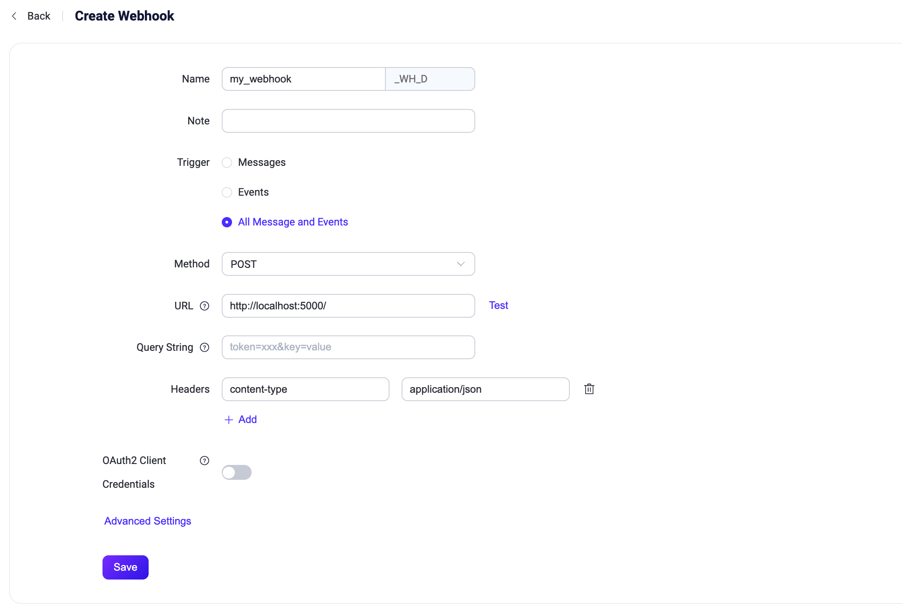

# Webhook

Webhookは、EMQXのクライアントメッセージやイベントを外部のHTTPサーバーと連携させる方法を提供します。ルールエンジンやデータブリッジを使用する場合と比較して、Webhookはよりシンプルな手法であり、導入のハードルを大幅に下げ、EMQXと外部システム間の迅速な連携を可能にします。

本ページでは、Webhookに関する情報と実践的な利用方法を包括的に紹介します。

## 仕組み

クライアントが特定のトピックにメッセージをパブリッシュしたり、特定の操作を行うとWebhookがトリガーされます。Webhookはルールエンジンがサポートするすべてのメッセージおよびイベントに対応しています。

Webhookは以下のシナリオでトリガーされるよう設定できます。各イベントのリクエスト内容については[SQLデータソースとフィールド](./rule-sql-events-and-fields.md)を参照してください。


### メッセージ

パブリッシャーがメッセージをパブリッシュしたり、メッセージの状態が変化した場合にトリガーされます。具体的には以下のイベントです。

- メッセージがパブリッシュされた
- メッセージが配信された
- メッセージがアックされた
- メッセージが転送されドロップされた
- メッセージの配信がドロップされた

メッセージに対して複数のトピックフィルターを設定可能で、マッチしたメッセージのみがWebhookをトリガーします。

### イベント

クライアントが特定の操作を行ったり、状態が変化した場合にトリガーされます。具体的には以下のイベントです。

- 接続が確立された
- 接続が切断された
- 接続が確認された
- 認可結果
- セッションのサブスクライブ完了
- セッションのサブスクライブ解除

## 特徴

EMQXのWebhook連携を利用することで、以下のようなメリットが得られます。

- **より多くの下流システムへデータを渡せる**  
  Webhookにより、MQTTデータを分析プラットフォームやクラウドサービスなど、より多くの外部システムへ簡単に連携でき、マルチシステムでのデータ配信が可能になります。

- **リアルタイム応答と業務プロセスのトリガー**  
  Webhookを通じて外部システムがMQTTデータをリアルタイムに受信し、業務プロセスをトリガーできるため、迅速な対応が可能です。例えば、アラームデータを受け取って業務ワークフローを起動するなどの活用が可能です。

- **データ処理のカスタマイズ**  
  外部システム側で受信したデータをさらに必要に応じて処理し、より複雑な業務ロジックを実装できます。EMQXの機能に制限されることなく柔軟に対応可能です。

- **疎結合な連携方式**  
  WebhookはシンプルなHTTPインターフェースを利用するため、システム間の疎結合な連携手法を提供します。

まとめると、Webhook連携はリアルタイムかつ柔軟でカスタマイズ可能なデータ統合機能を提供し、多様で豊富なアプリケーション開発ニーズに応えます。

## はじめに

本節ではmacOSを例に、Webhookの設定および利用方法を紹介します。

### HTTPサービスの作成

ここではPythonを使ってローカルのポート5000で待ち受けるHTTPサーバーを簡単に作成し、Webhookリクエストを受け取った際にURLを表示する例を示します。実際の用途ではご自身の業務サーバーに置き換えてください。

まず、Pythonで`POST /`リクエストを受け取る簡単なHTTPサービスを構築します。リクエスト内容を表示し、200 OKを返します。

```python
from flask import Flask, json, request

api = Flask(__name__)

@api.route('/', methods=['POST'])
def print_messages():
  reply= {"result": "ok", "message": "success"}
  print("got post request: ", request.get_data())
  return json.dumps(reply), 200

if __name__ == '__main__':
  api.run()
```

上記コードを`http_server.py`として保存し、ファイルのあるディレクトリで以下のコマンドを実行します。

```shell
# flask依存関係のインストール
pip install flask

# サービス起動
python3 http_server.py
```

### Webhookの作成

1. ダッシュボードの左メニューから **Integration** -> **Webhooks** をクリックします。

2. ページ上の **Create** ボタンをクリックします。

3. Webhook名と説明を入力します。英大文字・小文字・数字の組み合わせで入力してください。ここでは `my_webhook` と入力します。

4. トリガーをニーズに応じて選択します。今回は **All messages and events** を選択します。他のオプションについては[仕組み](#仕組み)を参照してください。

5. Webhookリクエストの設定を行います。

   - リクエストメソッドは `POST` を選択し、**URL** に `http://localhost:5000` を設定します。  
   - 必要に応じて**Query String**にクエリパラメータを追加したり、**Headers**でカスタムHTTPリクエストヘッダーを設定できます。  
   - OAuth2でWebhookリクエストを保護する場合は、**OAuth2 Client Credentials**をオンにして必要な設定を行います。詳細は[OAuth2 Client Credentialsの設定](#configure-oauth2-client-credentials)を参照してください。URL入力欄の横にある**Test**ボタンで接続テストも可能です。

6. **Save** をクリックしてWebhook作成を完了します。

   

これでWebhookの作成が完了しました。

#### OAuth2 Client Credentialsの設定

EMQX 6.0.4以降、WebhookはOAuth 2.0 Client Credentials Grantをサポートしています。OAuth2を有効にすると、EMQXは設定されたトークンエンドポイントからアクセストークンを取得・キャッシュし、自動で更新します。Webhookリクエスト送信時には、`Authorization: Bearer <access_token>` ヘッダーにトークンを含め、ターゲットサーバーがEMQXを認証できるようにします。

トークンエンドポイント、クライアント認証情報、許可されたスコープはOAuth2認可サーバー、IDプロバイダー（IdP）、またはターゲットAPI管理者から取得してください。**OAuth2 Client Credentials**をオンにし、以下の設定を行います。

| ダッシュボード設定 | 説明 |
| --- | --- |
| **Token Endpoint** | 必須。アクセストークン取得に使用するOAuth2認可サーバーのエンドポイント。URLはHTTPまたはHTTPSで、ユーザー情報を含まないこと。 |
| **Client ID** | 必須。アクセストークン取得に使用するOAuth2クライアントID。 |
| **Client Secret** | 必須。アクセストークン取得に使用するOAuth2クライアントシークレット。 |
| **Scope** | 任意。アクセストークンに要求するOAuth2スコープ。複数スコープはスペース区切り。認可サーバーがスコープ不要の場合は空欄にします。 |
| **Token Request Timeout** | トークンエンドポイントへのHTTPリクエストのタイムアウト。デフォルトは5秒。 |
| **Enable TLS** | トークンエンドポイントにTLSを有効にする場合はオンにします。 |

EMQXは`application/x-www-form-urlencoded`のPOSTリクエストをトークンエンドポイントに送信します。リクエストボディには`grant_type`、`client_id`、`client_secret`、および任意の`scope`が含まれます。トークンエンドポイントは`200`レスポンスで`access_token`を含むJSONを返す必要があります。`token_type`と`expires_in`も返すことができます。存在する場合、`token_type`は`Bearer`であり、`expires_in`は正の整数でなければなりません。

::: warning 重要なお知らせ

- OAuth2を有効にした場合、Webhookに対して`Authorization`ヘッダーを設定しないでください。EMQXは自動生成されるBearer認証ヘッダーと競合するため設定を拒否します。  
- トークンエンドポイントはクライアントIDとクライアントシークレットをリクエストボディのフォームフィールドとして受け入れる必要があります。HTTP Basic認証の`Authorization`ヘッダーによる認証はサポートされていません。

:::

### Webhookのテスト

MQTTX CLIを使って` t/1`トピックにメッセージをパブリッシュします。

```bash
mqttx pub -i emqx_c -t t/1 -m '{ "msg": "Hello Webhook" }'
```

この操作により、以下のイベントが順にトリガーされます。

- 接続確立
- 接続確認
- 認可チェック完了
- メッセージパブリッシュ
- 接続切断

もし` t/1`トピックにサブスクライバーがいなければ、メッセージパブリッシュ後に**メッセージ転送およびドロップ**イベントもトリガーされます。

対応するイベントおよびメッセージデータがHTTPサービスに転送されているか確認してください。以下のようなデータが表示されるはずです。

```shell
got post request:  b'{"username":"undefined","timestamp":1694681417717,"sockname":"127.0.0.1:1883","receive_maximum":32,"proto_ver":5,"proto_name":"MQTT","peername":"127.0.0.1:61003","node":"emqx@127.0.0.1","mountpoint":"undefined","metadata":{"rule_id":"my-webhook_WH_D"},"keepalive":30,"is_bridge":false,"expiry_interval":0,"event":"client.connected","connected_at":1694681417714,"conn_props":{"User-Property":{},"Request-Problem-Information":1},"clientid":"emqx_c","clean_start":true}'
127.0.0.1 - - [14/Sep/2023 16:50:17] "POST / HTTP/1.1" 200 -
got post request:  b'{"username":"undefined","timestamp":1694681417719,"sockname":"127.0.0.1:1883","reason_code":"success","proto_ver":5,"proto_name":"MQTT","peername":"127.0.0.1:61003","node":"emqx@127.0.0.1","metadata":{"rule_id":"my-webhook_WH_D"},"keepalive":30,"expiry_interval":0,"event":"client.connack","conn_props":{"User-Property":{},"Request-Problem-Information":1},"clientid":"emqx_c","clean_start":true}'
127.0.0.1 - - [14/Sep/2023 16:50:17] "POST / HTTP/1.1" 200 -
got post request:  b'{"username":"undefined","topic":"t/1","timestamp":1694681417728,"result":"allow","peerhost":"127.0.0.1","node":"emqx@127.0.0.1","metadata":{"rule_id":"my-webhook_WH_D"},"event":"client.check_authz_complete","clientid":"emqx_c","authz_source":"file","action":"publish"}'
127.0.0.1 - - [14/Sep/2023 16:50:17] "POST / HTTP/1.1" 200 -
got post request:  b'{"username":"undefined","topic":"t/1","timestamp":1694681417728,"qos":0,"publish_received_at":1694681417728,"pub_props":{"User-Property":{}},"peerhost":"127.0.0.1","payload":"{ \\"msg\\": \\"Hello Webhook\\" }","node":"emqx@127.0.0.1","metadata":{"rule_id":"my-webhook_WH_D"},"id":"0006054DC3E940F8F445000038A60002","flags":{"retain":false,"dup":false},"event":"message.publish","clientid":"emqx_c"}'
127.0.0.1 - - [14/Sep/2023 16:50:17] "POST / HTTP/1.1" 200 -
got post request:  b'{"username":"undefined","topic":"t/1","timestamp":1694681417729,"reason":"no_subscribers","qos":0,"publish_received_at":1694681417728,"pub_props":{"User-Property":{}},"peerhost":"127.0.0.1","payload":"{ \\"msg\\": \\"Hello Webhook\\" }","node":"emqx@127.0.0.1","metadata":{"rule_id":"my-webhook_WH_D"},"id":"0006054DC3E940F8F445000038A60002","flags":{"retain":false,"dup":false},"event":"message.dropped","clientid":"emqx_c"}'
127.0.0.1 - - [14/Sep/2023 16:50:17] "POST / HTTP/1.1" 200 -
got post request:  b'{"username":"undefined","timestamp":1694681417729,"sockname":"127.0.0.1:1883","reason":"normal","proto_ver":5,"proto_name":"MQTT","peername":"127.0.0.1:61003","node":"emqx@127.0.0.1","metadata":{"rule_id":"my-webhook_WH_D"},"event":"client.disconnected","disconnected_at":1694681417729,"disconn_props":{"User-Property":{}},"clientid":"emqx_c"}'
127.0.0.1 - - [14/Sep/2023 16:50:17] "POST / HTTP/1.1" 200 -
```
