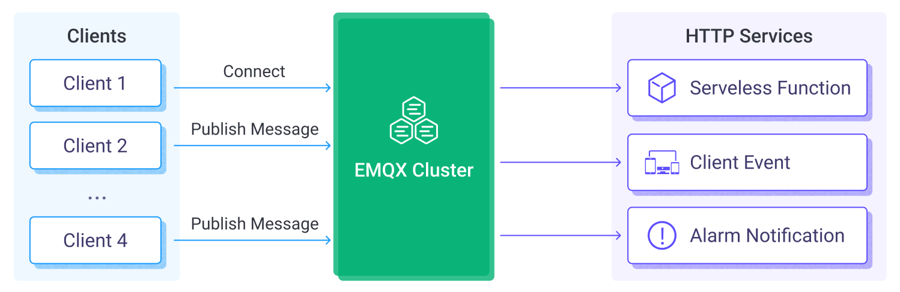

# Webhook

Webhook は、EMQX クライアントのメッセージやイベントを外部の HTTP サーバーと連携させる方法を提供します。ルールエンジンやデータブリッジを使用する場合と比べて、Webhook はよりシンプルな手段であり、導入のハードルを大幅に下げ、EMQX と外部システム間の迅速な連携を可能にします。

本ページでは、Webhook に関する情報と実践的な利用方法を包括的に紹介します。


<video
  src="https://assets.emqx.com/data/video/emqx-docs/data-integration/webhook_integration.mp4"
  preload="metadata"
  controls
  muted
  playsinline
  style="width: 100%; border-radius: 8px;"></video>

## 仕組み

クライアントが特定のトピックにメッセージをパブリッシュしたり、特定の操作を行うと、Webhook がトリガーされます。Webhook はルールエンジンがサポートするすべてのメッセージおよびイベントに対応しています。

Webhook をトリガーするシナリオは以下の通りです。各イベントのリクエスト内容については、[SQL データソースとフィールド](./rule-sql-events-and-fields.md)を参照してください。



### メッセージ

パブリッシャーがメッセージをパブリッシュしたり、メッセージの状態が変化した場合にトリガーされます。具体的には以下のイベントです。

- メッセージがパブリッシュされた
- メッセージが配信された
- メッセージがアックされた
- メッセージが転送されドロップされた
- メッセージ配信がドロップされた

メッセージに対して複数のトピックフィルターを設定可能で、マッチしたメッセージのみが Webhook をトリガーします。

### イベント

クライアントが特定の操作を行ったり、状態が変化した場合にトリガーされます。具体的には以下のイベントです。

- 接続が確立された
- 接続が切断された
- 接続が確認された
- 認可結果
- セッションのサブスクライブ完了
- セッションのサブスクライブ解除

## 特長

EMQX の Webhook 連携を利用することで、以下のようなメリットをビジネスにもたらします。

- **より多くの下流システムへデータを渡せる**  
  Webhook により、MQTT データを分析プラットフォームやクラウドサービスなど、より多くの外部システムに簡単に連携でき、多システムへのデータ配信が可能になります。

- **リアルタイム応答と業務プロセスのトリガー**  
  Webhook を通じて外部システムは MQTT データをリアルタイムに受け取り、業務プロセスをトリガーできます。例えば、アラームデータを受けて業務ワークフローを起動するなど、迅速な対応が可能です。

- **データ処理のカスタマイズ**  
  外部システム側で受け取ったデータをさらに加工し、より複雑な業務ロジックを実装できます。EMQX の機能に縛られず柔軟な処理が可能です。

- **疎結合な連携方式**  
  Webhook はシンプルな HTTP インターフェースを利用するため、システム間の疎結合な連携手法を提供します。

まとめると、Webhook 連携はリアルタイムかつ柔軟でカスタマイズ可能なデータ統合を実現し、多様で豊富なアプリケーション開発ニーズに応えます。

## はじめに

本節では macOS を例に、Webhook の設定と利用方法を紹介します。

### HTTP サービスの作成

ここでは Python を使ってローカルのポート 5000 で待ち受ける HTTP サーバーを簡単に作成し、Webhook リクエストを受け取った際に内容を表示します。実際のアプリケーションでは、ご自身の業務サーバーに置き換えてください。

まず、Python で `POST /` リクエストを受け取るシンプルな HTTP サービスを作成します。リクエスト内容を表示し、200 OK を返します。

```python
from flask import Flask, json, request

api = Flask(__name__)

@api.route('/', methods=['POST'])
def print_messages():
  reply= {"result": "ok", "message": "success"}
  print("got post request: ", request.get_data())
  return json.dumps(reply), 200

if __name__ == '__main__':
  api.run()
```

上記コードを `http_server.py` というファイル名で保存し、ファイルのあるディレクトリで以下のコマンドを実行します。

```shell
# flask の依存関係をインストール
pip install flask

# サービスを起動
python3 http_server.py
```

### Webhook の作成

1. ダッシュボードの左メニューから **Integration** -> **Webhooks** をクリックします。

2. ページ上の **Create Webhook** ボタンをクリックします。

3. Webhook の **Name** と任意で **Note** を入力します。

   名前は英大文字・小文字と数字のみを含めてください。例：`my_webhook`

5. Webhook のリクエスト設定を行います。

   - リクエストメソッドに `POST` を選択し、**URL** に `http://localhost:5000` を設定します。
   - 必要に応じて **Query String** にクエリパラメータを追加したり、**Headers** にカスタム HTTP リクエストヘッダーを設定できます。
   - OAuth2 で Webhook リクエストを保護する場合は、**OAuth2 Client Credentials** をオンにして必要な設定を行います。詳細は [OAuth2 Client Credentials の設定](#configure-oauth2-client-credentials) を参照してください。URL 入力欄の横にある **Test** ボタンで接続テストが可能です。

   本例では **All Messages and Events** を選択します。その他のオプションについては [仕組み](#仕組み) を参照してください。

5. リクエスト設定を以下のように行います。

   - **Method**: `POST`
   - **URL**: `http://localhost:5000`

   URL フィールド横の **Test** ボタンで接続を検証できます。その他の設定はデフォルトのままで問題ありません。

6. ページ下部の **Save** をクリックして Webhook を作成します。

   

これで Webhook の作成が完了しました。

#### OAuth2 Client Credentials の設定

EMQX 6.0.4 以降、Webhook は OAuth 2.0 の Client Credentials Grant をサポートしています。OAuth2 を有効にすると、EMQX は設定されたトークンエンドポイントからアクセストークンを取得・キャッシュし、自動で更新します。Webhook リクエストを送信する際には、`Authorization: Bearer <access_token>` ヘッダーにトークンを含め、ターゲットサーバー側で EMQX の認証を行います。

トークンエンドポイント、クライアント認証情報、許可されたスコープは OAuth2 認可サーバーやアイデンティティプロバイダー（IdP）、ターゲット API 管理者から取得してください。**OAuth2 Client Credentials** をオンにして、以下の設定を行います。

| ダッシュボード設定項目 | 説明 |
| --- | --- |
| **Token Endpoint** | 必須。アクセストークンを取得する OAuth2 認可サーバーのエンドポイント。URL は HTTP または HTTPS で、ユーザー情報を含んではいけません。 |
| **Client ID** | 必須。アクセストークン取得に使用する OAuth2 クライアント ID。 |
| **Client Secret** | 必須。アクセストークン取得に使用する OAuth2 クライアントシークレット。 |
| **Scope** | 任意。アクセストークン取得時に要求する OAuth2 スコープ。複数ある場合はスペース区切りで指定します。認可サーバーがスコープを要求しない場合は空欄のままにします。 |
| **Token Request Timeout** | トークンエンドポイントへの HTTP リクエストのタイムアウト（秒）。デフォルトは `5` 秒です。 |
| **Enable TLS** | トークンエンドポイントに対して TLS を有効にする場合はオンにします。 |

EMQX は `application/x-www-form-urlencoded` のコンテンツタイプで `POST` リクエストをトークンエンドポイントに送信します。リクエストボディには `grant_type`、`client_id`、`client_secret`、および任意の `scope` が含まれます。トークンエンドポイントは `200` レスポンスで JSON ボディに `access_token` を返す必要があります。`token_type` と `expires_in` を返すことも可能です。存在する場合、`token_type` は `Bearer`、`expires_in` は正の整数でなければなりません。

::: warning 重要なお知らせ

- OAuth2 を有効にしている場合、Webhook の `Authorization` ヘッダーを設定しないでください。EMQX は自動生成される Bearer 認証ヘッダーと競合するため、設定を拒否します。
- トークンエンドポイントは、クライアント ID とクライアントシークレットをリクエストボディのフォームフィールドとして受け入れる必要があります。HTTP Basic 認証ヘッダーによる認証はサポートしていません。

:::

### Webhook のテスト

MQTTX CLI を使い、`t/1` トピックにメッセージをパブリッシュします。

```bash
mqttx pub -i emqx_c -t t/1 -m '{ "msg": "Hello Webhook" }'
```

この操作により、以下のイベントが順にトリガーされます。

- 接続確立（Connection established）
- 接続確認（Connection confirmed）
- 認可チェック完了（Authorization checked and completed）
- メッセージパブリッシュ（Message published）
- 接続切断（Connection terminated）

もし `t/1` トピックにサブスクライバーがいなければ、メッセージパブリッシュ後に **メッセージ転送およびドロップ** イベントもトリガーされます。

HTTP サービスに対応するイベントおよびメッセージデータが転送されているか確認してください。以下のようなデータが表示されるはずです。

```shell
got post request:  b'{"username":"undefined","timestamp":1694681417717,"sockname":"127.0.0.1:1883","receive_maximum":32,"proto_ver":5,"proto_name":"MQTT","peername":"127.0.0.1:61003","node":"emqx@127.0.0.1","mountpoint":"undefined","metadata":{"rule_id":"my-webhook_WH_D"},"keepalive":30,"is_bridge":false,"expiry_interval":0,"event":"client.connected","connected_at":1694681417714,"conn_props":{"User-Property":{},"Request-Problem-Information":1},"clientid":"emqx_c","clean_start":true}'
127.0.0.1 - - [14/Sep/2023 16:50:17] "POST / HTTP/1.1" 200 -
got post request:  b'{"username":"undefined","timestamp":1694681417719,"sockname":"127.0.0.1:1883","reason_code":"success","proto_ver":5,"proto_name":"MQTT","peername":"127.0.0.1:61003","node":"emqx@127.0.0.1","metadata":{"rule_id":"my-webhook_WH_D"},"keepalive":30,"expiry_interval":0,"event":"client.connack","conn_props":{"User-Property":{},"Request-Problem-Information":1},"clientid":"emqx_c","clean_start":true}'
127.0.0.1 - - [14/Sep/2023 16:50:17] "POST / HTTP/1.1" 200 -
got post request:  b'{"username":"undefined","topic":"t/1","timestamp":1694681417728,"result":"allow","peerhost":"127.0.0.1","node":"emqx@127.0.0.1","metadata":{"rule_id":"my-webhook_WH_D"},"event":"client.check_authz_complete","clientid":"emqx_c","authz_source":"file","action":"publish"}'
127.0.0.1 - - [14/Sep/2023 16:50:17] "POST / HTTP/1.1" 200 -
got post request:  b'{"username":"undefined","topic":"t/1","timestamp":1694681417728,"qos":0,"publish_received_at":1694681417728,"pub_props":{"User-Property":{}},"peerhost":"127.0.0.1","payload":"{ \\"msg\\": \\"Hello Webhook\\" }","node":"emqx@127.0.0.1","metadata":{"rule_id":"my-webhook_WH_D"},"id":"0006054DC3E940F8F445000038A60002","flags":{"retain":false,"dup":false},"event":"message.publish","clientid":"emqx_c"}'
127.0.0.1 - - [14/Sep/2023 16:50:17] "POST / HTTP/1.1" 200 -
got post request:  b'{"username":"undefined","topic":"t/1","timestamp":1694681417729,"reason":"no_subscribers","qos":0,"publish_received_at":1694681417728,"pub_props":{"User-Property":{}},"peerhost":"127.0.0.1","payload":"{ \\"msg\\": \\"Hello Webhook\\" }","node":"emqx@127.0.0.1","metadata":{"rule_id":"my-webhook_WH_D"},"id":"0006054DC3E940F8F445000038A60002","flags":{"retain":false,"dup":false},"event":"message.dropped","clientid":"emqx_c"}'
127.0.0.1 - - [14/Sep/2023 16:50:17] "POST / HTTP/1.1" 200 -
got post request:  b'{"username":"undefined","timestamp":1694681417729,"sockname":"127.0.0.1:1883","reason":"normal","proto_ver":5,"proto_name":"MQTT","peername":"127.0.0.1:61003","node":"emqx@127.0.0.1","metadata":{"rule_id":"my-webhook_WH_D"},"event":"client.disconnected","disconnected_at":1694681417729,"disconn_props":{"User-Property":{}},"clientid":"emqx_c"}'
127.0.0.1 - - [14/Sep/2023 16:50:17] "POST / HTTP/1.1" 200 -
```
