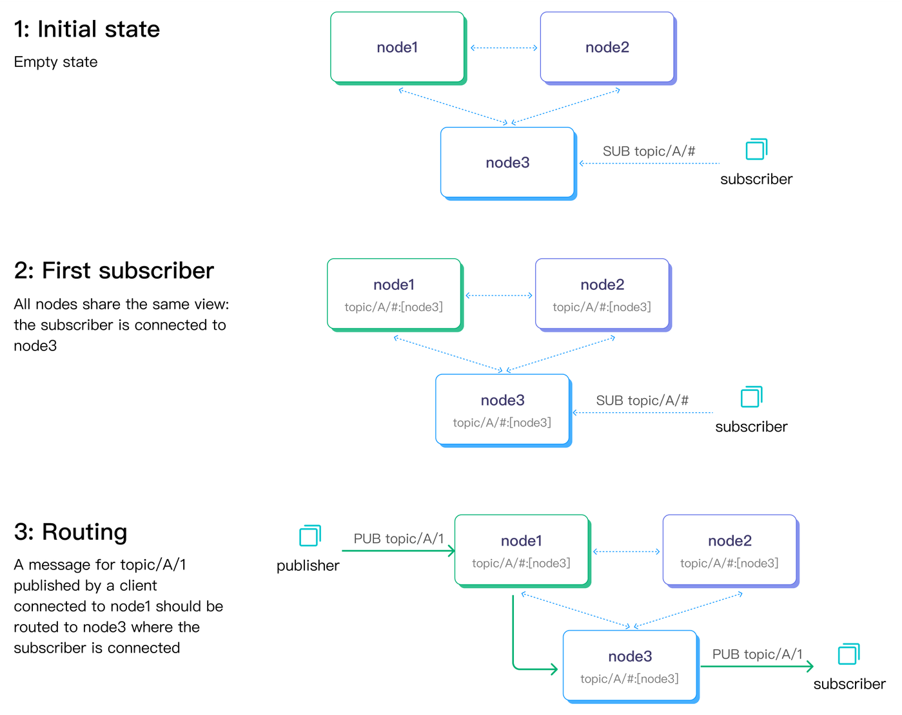

# EMQXクラスタリングの設計

MQTTはステートフルなプロトコルであり、ブローカーは各MQTTセッションの状態情報（サブスクライブされたトピックや未完了のメッセージ送信など）を保持する必要があります。MQTTブローカーのクラスタリングにおける主な課題の一つは、これらの状態をクラスタ内のすべてのノード間で効率的かつ信頼性高く同期・複製することです。

EMQXは高いスケーラビリティとフォールトトレランスを備えたMQTTブローカーであり、複数ノードによるクラスタモードでの運用が可能です。EMQXのクラスタリングは、IoTメッセージングシステムのスケーラビリティ、可用性、信頼性、管理性を向上させ、大規模またはミッションクリティカルなアプリケーションに推奨される手法です。本ページでは、MQTTブローカーのクラスタリングの必要性とEMQXがどのようにこれを実現し、単一クラスタ内で数百万のユニークなワイルドカードサブスクライバーをサポートできるかを解説します。

EMQX v5クラスタの作成および運用の詳細手順については、[EMQX Cluster](../cluster/introduction.md)をご参照ください。

## クラスタリングの重要な側面

クラスタ設計において考慮すべき重要なポイントはいくつかあります。これらはクラスタの成功を左右する最も重要な要素であることが多いです。簡単にまとめると以下の通りです。

* **集中管理**：クラスタ内のすべてのノードを単一の管理コンソールから監視・制御できるようにし、中央集権的に管理可能であること。

* **データの一貫性**：クラスタ内の全ノードがルーティング情報を一貫して保持できるように、データを全ノード間で複製すること。

* **スケールの容易さ**：クラスタ管理の複雑さを減らすため、新しいノードの追加が複雑でなく、クラスタが自動的に新規ノードを検知して参加できること。

* **クラスタの負荷再分散**：運用オーバーヘッドを最小限に抑えつつ、各ノードの負荷の偏りを検知し、負荷の少ないノードへワークロードを再割り当てできること。これにより、1台以上のノードが障害を起こしてもクラスタが継続稼働可能となる。

* **大規模クラスタ対応**：システムの要求増加に応じてノードを追加し、水平スケールでクラスタを拡張できること。

* **自動フェイルオーバー**：ノード障害時に自動的に障害を検知し、残りのノードにワークロードを再割り当てできること。

* **ネットワーク分断耐性**：ネットワーク分断が発生してもクラスタが継続稼働可能であること。

以下のセクションで、これらのクラスタリングの重要な側面について詳しく説明します。

## 集中管理

EMQXはクラスタ内のすべてのノードを単一の管理コンソールから監視・制御できるため、集中管理が可能です。これにより、多数のデバイスやメッセージを容易に管理できます。コンソールはウェブブラウザからアクセスでき、クラスタ管理に適したユーザーフレンドリーなインターフェースを提供します。`core`タイプのノードであればどれでも管理用HTTP APIのエンドポイントとして機能します（ノードタイプの詳細は次節で説明します）。

オンライン設定管理機能により、クラスタ内のすべてのノードに対してノードの再起動なしに設定変更を反映できます。ノードの追加や削除などクラスタ設定の変更時に特に有用です。

## データの一貫性

MQTTブローカークラスタにおける最も重要な分散データ構造はルーティングテーブルです。これはすべてのトピックのルーティング情報を保持し、特定のトピックにパブリッシュされたメッセージをどのノードが受け取るべきかを決定します。本節では、EMQXがクラスタ内のすべてのノードでルーティングテーブルの一貫性をどのように保証しているかを説明します。

EMQXクラスタは完全なACID（Atomicity, Consistency, Isolation, Durability）トランザクションを活用し、クラスタ内のすべての`core`ノード間でルーティングテーブルの一貫性を確保します。また、`core`ノードから`replica`ノードへの非同期レプリケーションを用いて、クラスタ全体で最終的に一貫した状態を実現しています。

以下でEMQXのデータ一貫性の仕組みを詳しく見ていきましょう。

### データレプリケーションチャネル

EMQXクラスタには2つのデータレプリケーションチャネルがあります。

- メタデータのレプリケーション：どの（ワイルドカード）トピックがどのノードにサブスクライブされているかなどのルーティング情報。

- メッセージ配信：ノード間でメッセージを転送する際のチャネル。

下図は2つのデータレプリケーションチャネルとパブサブのフローを示しています。点線はノード間のメタデータレプリケーションを、実線矢印はメッセージ配信チャネルを表します。



### EMQXノード間の通信

EMQXはErlang/OTPの組み込みデータベースであるMnesiaを用いてMQTTセッション状態を保存します。データベースおよびメッセージのレプリケーションには、Erlang分散プロトコルとカスタム分散プロトコルを使ったブローカー間のリモートプロシージャコールが利用されます。

データベースレプリケーションチャネルは「Erlang分散」プロトコルで動作し、各ノードはクライアント兼サーバとして機能します。このプロトコルのデフォルトリスニングポートは4370です。

一方、メッセージ配信チャネルはコネクションプールを利用し、各ノードはデフォルトでポート5370（Dockerコンテナ内では5369）で待ち受けます。これはErlang分散プロトコルの単一接続とは異なる方式です。

### ルーティングテーブルのレプリケーション

Mnesiaクラスタはフルメッシュトポロジーで設計されており、クラスタ内の各ノードは他のすべてのノードに接続し、常に生存確認を行います。


しかし、フルメッシュトポロジーはクラスタサイズに実用的な制限を課します。EMQX 5.0未満のバージョンでは、クラスタサイズは5ノード以下に抑えることが推奨されます。それ以上の規模では、より高性能なマシンを用いる垂直スケールがクラスタの性能と安定性を維持するために望ましい選択肢です。

ベンチマーク環境では、[EMQX Enterprise 4.3で1000万同時接続を達成](https://www.emqx.com/en/resources/emqx-v-4-3-0-ten-million-connections-performance-test-report)しています。

お客様からの本番環境の詳細報告は必須ではありませんが、共有された情報によると、最大規模の本番クラスタは7ノードで構成されています。

大規模Mnesiaクラスタ管理の大きな課題の一つはスプリットブレイン問題のリスクです。これはネットワーク分断によりノードが複数のサブクラスタに分離され、それぞれが唯一のアクティブクラスタと誤認する状況です。大規模クラスタではネットワークオーバーヘッドがN^2の複雑度となり、高負荷時にノードの応答性が低下しやすくなります。さらに、Erlang分散チャネルのヘッドオブラインブロッキングによりハートビート送信が遅延し、スプリットブレインのリスクが増大します。

EMQX v5では、[Mria](https://github.com/emqx/mria)（非同期トランザクションログレプリケーションを備えたMnesiaの拡張版）を導入し、クラスタのスケーラビリティを大幅に向上させました。Mriaは`core`ノードと`replicant`ノード（短縮して`replica`とも呼ばれます）という2種類のノードロールからなる新しいネットワークトポロジーを採用しています。


EMQX v5クラスタでは、`core`ノードは従来通りフルメッシュネットワークを形成します。一方、`replicant`ノードは1つ以上の`core`ノードにのみ接続し、相互には接続しません。

### CoreノードとReplicantノード

Coreノードの動作は4.xのMnesiaノードと同様で、フル接続のクラスタを形成し、各ノードがトランザクションの開始やロック保持を行います。したがって、EMQX v5でもCoreノードは信頼性の高い環境でのデプロイが求められます。

Replicantノードはトランザクション処理に直接関与せず、Coreノードに接続してデータ更新を受動的に複製します。Replicantノードは書き込み操作を行わず、書き込みはCoreノードに委譲されます。さらに、ReplicantはCoreノードからのデータを完全にローカルに保持するため、読み取り操作の効率が最大化され、EMQXのルーティングレイテンシ低減に寄与します。

Replicantノードは書き込みに関与しないため、Replicantノードを増やしても書き込み操作のレイテンシには影響しません。これにより、より大規模なEMQXクラスタの構築が可能となります。

パフォーマンス向上のため、関連性の低いデータのレプリケーションは独立したデータストリームに分割されます。複数の関連テーブルは同一のRLOGシャード（レプリケートログシャード）に割り当てられ、トランザクションはCoreノードからReplicantノードへ順次レプリケートされますが、異なるRLOGシャードは非同期に処理されます。

## スケールの容易さ

EMQXは水平スケールが容易にできるよう設計されています。CLI、API、さらにはダッシュボードからいつでもクラスタへのノード追加・削除が可能です。

例えば、新しいノードをクラスタに参加させるには、以下のようなコマンドを実行するだけです。

```bash
$ emqx ctl cluster join emqx@node1.my.net
```

ここで`emqx@node1.my.net`はクラスタ内の既存ノードの一つです。

また、ダッシュボードからボタン操作で新規ノードをクラスタに招待することもできます。

豊富な管理インターフェースを活用すれば、クラスタ管理をスクリプト化し、DevOpsパイプラインの一部に組み込むことも容易です。

EMQX v5では、`replica`ノードはステートレスに設計されており、オートスケーリンググループに配置してより良いDevOps運用が可能です。

## クラスタの負荷再分散

新規ノードがクラスタに参加した際、そのノードは空の状態からスタートします。優れたロードバランサーがあれば、新規接続クライアントは新ノードに接続しやすくなりますが、既存クライアントは依然として旧ノードに接続し続けます。

クライアントが短期間に再接続すればクラスタは速やかにバランスを取れますが、再接続がなければクラスタは長期間アンバランスな状態が続く可能性があります。

この課題に対処するため、EMQX（4.4以降）は[クラスタ負荷再分散](../../operate/cluster/rebalancing.md)機能を導入しました。この機能により、クラスタは過負荷ノードから低負荷ノードへセッションを自動的に移行し、負荷を再分散できます。

「再分散」の極端な例として「避難（evacuation）」があり、特定ノードからすべてのセッションを移行します。これはノードをクラスタから除去したい場合に有用です。

## クラスタサイズ

数百万の同時接続規模では、単一マシンでの処理は不可能なため、水平スケールが必須です。

EMQX v5の`core`-`replica`クラスタリングアーキテクチャにより、より大規模なクラスタ構築が可能となりました。

ベンチマークでは、23ノードクラスタで5000万のパブリッシャーと5000万のワイルドカードサブスクライバーをテストしました。詳細は[ブログ記事](https://www.emqx.com/en/blog/reaching-100m-mqtt-connections-with-emqx-5-0)をご覧ください。

なぜワイルドカードかというと、ワイルドカードサブスクリプションはMQTTブローカークラスタのスケーラビリティを評価するゴールドスタンダードであり、基盤となるデータ構造やアルゴリズムに対して最も厳しい負荷をかけるためです。

## 自動フェイルオーバー

MQTTプロトコル仕様にはセッションアフィニティの概念がありません。つまり、クライアントはクラスタ内の任意のノードに接続しても、サブスクライブしたトピックのメッセージを受信可能です。

またMQTTにはサービスディスカバリ機構がないため、クライアントはクラスタノードのアドレスを知っている必要があります。通常、クライアントはクラスタ内のすべてのノードのリスト、あるいは適切なノードへルーティングできるロードバランサーを設定されます。

EMQXはクラスタ前段にロードバランサーを配置する設計です。ヘルスチェックエンドポイントを用いて、ロードバランサーはクラスタノードの健全性を検知し、クライアントを適切なノードへルーティングします。

Erlangのノード監視機構により、EMQXノードは互いの健全性を監視し、不健康なノードを自動的にクラスタから除外します。

## ネットワーク分断耐性

ネットワーク分断が発生すると、クラスタは複数の孤立したサブクラスタに分割され、それぞれが唯一のアクティブクラスタと誤認する「スプリットブレイン」問題が発生します。

本番クラスタはネットワーク分断から自動的に復旧できる必要があります。

EMQXの「autoheal」機能はネットワーク分断後のクラスタを自動的に修復します。この機能が有効な場合、分断発生後に復旧すると、クラスタ内のノードは以下の手順でクラスタを修復します。

1. ノードは最も長いアップタイムを持つリーダーノードに分断情報を報告します。  
2. リーダーノードはグローバルなネットスプリットビューを作成し、多数派のノードの中からコーディネーターを選出します。  
3. リーダーノードはコーディネーターに少数派のノードに再起動を命じるよう要求します。  
4. 少数派のすべてのノードに対して再起動要求を送ります。

## まとめ

本記事では、EMQX v5の新しいクラスタリングアーキテクチャを紹介しました。また、スケーラビリティ、自動フェイルオーバー、ネットワーク分断耐性など、本番環境に適したMQTTブローカークラスタの重要な側面と、それらを実現するEMQXの仕組みについても解説しました。
