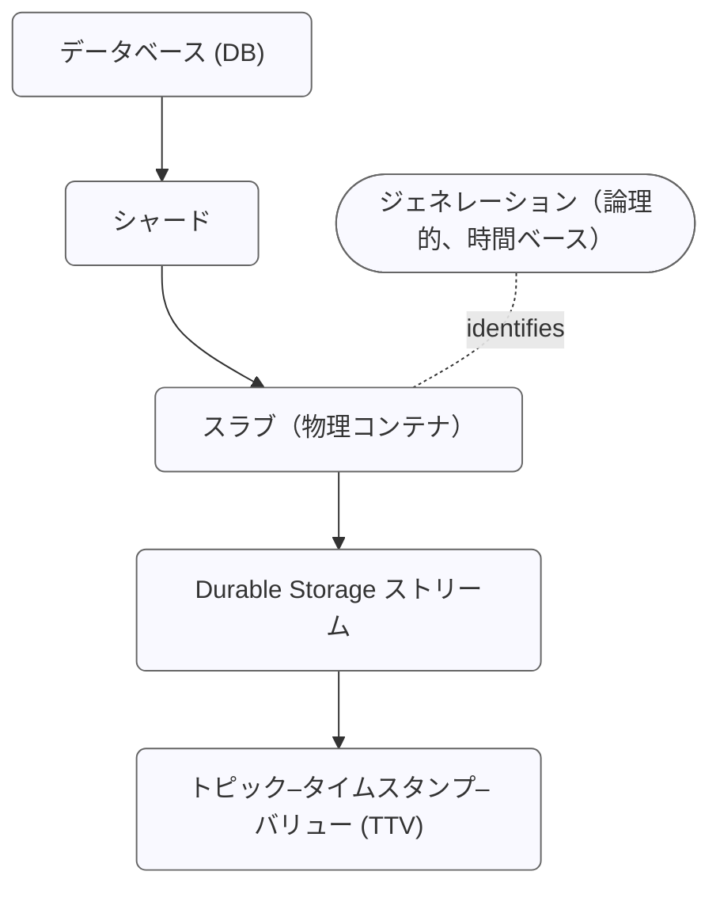

# Durable Storage の設計

EMQX 6.0 では、MQTT メッセージ配信の高い信頼性と永続性を確保するために設計された専用のデータベース抽象レイヤーである最適化された Durable Storage（DS）を導入しました。DS はストリーミングサービス（Kafka など）とキー・バリュー・ストアの強みを組み合わせ、MQTT データの保存、再生、管理において堅牢で高度に最適化された基盤を提供します。

## アーキテクチャ：バックエンドとストレージ階層

Durable Storage は実装に依存しない設計で、バックエンドという概念を用いて異なるデータベース管理システムにまたがってデータを保存可能です。

### 埋め込み型バックエンド

EMQX はサードパーティのサービスに依存しない2つの埋め込み型バックエンドを提供しています。

- `builtin_local` バックエンドは RocksDB をストレージエンジンとして使用し、単一ノードのデプロイメント向けに設計されています。
- `builtin_raft` バックエンドは `builtin_local` を拡張し、クラスターおよび異なるサイト間でのデータレプリケーションをサポートします。

::: warning 重要なお知らせ
埋め込み型 Durable Storage バックエンドは、EMQX のデータディレクトリにローカルファイルシステムを使用する必要があります。NFS や SMB/CIFS などのネットワークファイルシステムはサポートされていません。最高のパフォーマンスを得るために、ソリッドステートドライブ（SSD）ストレージの使用を推奨します。
:::

### データストレージ階層

EMQX の組み込み耐久機能を支えるデータベースストレージエンジンは、階層構造でデータを整理しています。以下の図は、EMQX クラスター全体に分散された Durable Storage データベースの構成を示しています。


内部的に DS は水平スケーラビリティと時間的パーティションを両立する多層階層構造でデータを管理します。この構造はアプリケーションからは透過的であり、分散した EMQX ノード間で効率的なデータ管理を実現します。

DS の階層構造は以下のように表現できます。



#### データベース (DB)

データベースはデータの最上位の論理コンテナです。各 DS データベースは独立しており、自身のシャード、スラブ、ストリームを管理し、必要に応じて作成、管理、削除が可能です。例として：

- **Sessions DB** は耐久セッション状態を保存します。
- **Messages DB** は対応する MQTT メッセージデータを保持します。

単一の EMQX クラスターは複数の DS データベースをホストできます。

#### シャード

シャードは Durable Storage データベースの水平パーティションです。データはパブリッシャーのクライアント ID に基づいてシャード間に分散され、並列処理と高可用性を実現します。各 EMQX ノードは1つ以上のシャードをホストでき、シャードの総数は EMQX 起動時の [n_shards](../../guides/durability/managing-replication.md#number-of-shards) 設定パラメータで決定されます。

シャードはレプリケーションの基本単位でもあります。各シャードは `durable_storage.messages.replication_factor` 設定に従って複数ノードにレプリケートされ、すべてのレプリカが同一のメッセージセットを保持し、冗長性とフォールトトレランスを確保します。

#### ジェネレーション

ジェネレーションは論理的かつ時間ベースのデータベースパーティションです。異なる期間に書き込まれたデータは別々のジェネレーションにまとめられます。新しいメッセージは常に現在のジェネレーションに書き込まれ、古いジェネレーションは不変かつ読み取り専用になります。EMQX は以下の主な目的で定期的に新しいジェネレーションを作成します。

1. **後方互換性とデータマイグレーション：** 新しいデータは改善されたエンコーディングで新しいジェネレーションに追加され、古いジェネレーションは不変かつ読み取り専用のまま維持されます。
2. **時間ベースのデータ保持：** 各ジェネレーションが特定の時間範囲に対応するため、期限切れデータはジェネレーション単位で効率的に削除可能です。

ジェネレーションはスラブと概念的に関連しますが、物理的なストレージ単位ではありません。代わりに、各シャード内のスラブを時間的に区切る境界を定義します。

ジェネレーションは内部的なデータ構造や保存方法が異なる場合もあり、これは設定されたストレージレイアウトに依存します。現在 DS はワイルドカードおよび単一トピックのサブスクライブに最適化された単一のレイアウトをサポートしています。将来的には異なるワークロード向けの追加レイアウトが導入される予定です。新しいジェネレーションで使用されるレイアウトは `durable_storage.messages.layout` パラメータで設定し、各レイアウトエンジンは独自の設定オプションを提供します。

#### スラブ

スラブはシャード ID とジェネレーション ID の両方で識別される物理的なデータパーティションです。各スラブは1つ以上の Durable Storage ストリームを格納する耐久コンテナとして機能します。スラブ内のすべてのデータは同一のエンコーディングスキーマを共有し、追加のメタデータ保存が不要です。スラブ内では原子性と一貫性が保証されます。

例：`shard 2, gen 3` はそのジェネレーションの時間範囲内に書き込まれたすべてのストリームを格納する特定のスラブを表します。

#### ストリーム

Durable Storage ストリームは各スラブ内のバッチ処理およびシリアライズの論理単位です。ストリームは類似したトピック構造を持つ **トピック–タイムスタンプ–バリュー (TTV)** の集合をグループ化し、時間順かつ決定的なチャンクでデータを読み取れるようにします。単一の Durable Storage ストリームは複数トピックのメッセージを含む場合があり、異なるストレージレイアウトはトピックをストリームにマッピングする戦略が異なります。

Durable Storage ストリームは Durable Storage におけるサブスクライブおよびイテレーションの基本単位でもあり、ワイルドカードトピックフィルターの効率的な処理と順序付けられたデータの一貫した再生を可能にします。[耐久セッション](../../guides/durability/durability_introduction.md#durable-sessions)は `durable_sessions.batch_size` 設定パラメータで制御されるバッチサイズでストリームからメッセージをまとめて読み取ります。

#### トピック–タイムスタンプ–バリュー (TTV)

最小の保存単位であり、単一の MQTT メッセージを表します。各 TTV は以下を含みます。

- **トピック：** MQTT のセマンティクスに従います。
- **タイムスタンプ：** 書き込み時刻または論理的な順序キー。
- **バリュー：** 任意のバイナリデータ。

## Durable Storage データベースグループ

EMQX 6.0.2 以降、Durable Storage はリソース管理と運用安全性向上のためにデータベースグループの概念を導入しました。

データベースグループは、ノード上の1つ以上の Durable Storage データベースに対して、ディスク容量やメモリバッファなどのストレージリソースを統一的に管理します。デフォルトでは、各 Durable Storage データベースは自身の名前を冠した単一のデータベースグループに割り当てられ、以前のリリースの挙動を保持します。

データベースグループはデータの構造やアクセス方法を変更しません。シャード、ジェネレーション、スラブ、ストリームといった論理データモデルはそのままです。あくまでリソース管理のためのガバナンス層として機能します。グループに単一のデータベースが含まれていても、クォータ管理やリソース会計の一貫した拠点を提供します。

### 設計の動機

Durable Storage の永続データは RocksDB の SST（Stored String Table）ファイルとして保存されます。書き込み先行ログはサイズに制限がありますが、SST ファイルは新規データの書き込みに伴い無制限に増大する可能性があります。

データベースグループは、同一ノード上で動作する Durable Storage データベースの RAM とディスク使用量を明示的に制御し、リソース消費の明確な境界を確立するために導入されました。

データベースグループは以下の課題に対応します。

- 複数データベースで共通のディスク使用制限を共有可能にする
- データ永続化前の書き込み受け入れ制御を強制する
- グループレベルの可観測性の基盤を提供する

データベースグループは、特定ノード上にレプリカを持つすべての Durable Storage シャードのリソース使用量を制限します。RAM 制限はノードローカルで適用され、グループ全体のメモリ消費に直接影響します。ディスク制限はローカルレプリカが書き込む SST ファイルに対して適用されます。データはレプリケートされるため、ディスク使用量は論理データサイズではなく物理ストレージ消費を表します。

### データベースグループモデル

各 Durable Storage データベースは必ず1つのデータベースグループに属します。複数のデータベースが同一グループに属することも可能で、グループ内のすべてのデータベースは同一のストレージバックエンドを使用しなければなりません。

データベースグループは以下の共有リソースを所有・管理します。

- SST ファイルのディスク使用量（ソフトクォータ）
- RocksDB の書き込みバッファ（メモリテーブル）メモリ
- RocksDB のバックグラウンドスレッドプール

リソース使用量はデータベース単位やシャード単位ではなく、グループ単位で追跡・制御されます。

概念的には、データベースグループは以下の階層を導入します。

```
データベースグループ
  └── データベース (DB)
        └── シャード
              └── スラブ
                    └── ストリーム
                          └── TTV
```

### ストレージクォータ

Durable Storage はディスク使用量制御の主要な仕組みとしてソフトクォータを使用します。

#### ソフトクォータの適用

ストレージクォータは Durable Storage リーダーが書き込みトランザクションを受け入れる前に適用されます。

1. 書き込みを含むトランザクションが送信されると、リーダーはデータベースグループの現在の SST ディスク使用量をチェックします。
2. クォータを超過する場合、リーダーはトランザクションを拒否します。受け入れた場合はすべてのレプリカに一貫してレプリケート・適用されます。
3. 読み取り専用トランザクションは引き続き受け入れられます。
4. データ削除のみのトランザクションも受け入れられます。

## 書き込みパス

DS へのデータ書き込みは **append-only モード** または **ACID トランザクション** のいずれかを使用できます。

### Append-Only モード

このモードはデータの追記のみをサポートし、高スループットシナリオ向けに最小限のオーバーヘッドを提供します。

### ACID トランザクション

トランザクションは **楽観的同時実行制御（OCC）** に基づき、クライアントは通常競合しないデータサブセットで操作すると仮定します。競合が発生した場合は、1つのトランザクションのみがコミットに成功し、他は中止され再試行されます。

**トランザクションの流れ：**

1. **開始：** クライアントプロセス（Tx）がリーダーノードにトランザクションコンテキスト（リーダーの term と最後にコミットされたシリアル番号を含む）作成を要求します。
2. **操作：** Durable Storage トランザクションは Erlang 関数で表現されます。この関数内でクライアントはデータを読み取り（アクセスしたトピックや時間範囲の情報がトランザクションコンテキストに追加される）、書き込みや削除をスケジュールします。コミット前条件（特定の TTV の存在／非存在チェック）も設定可能です。読み取りは即時実行されますが、書き込み・削除は完全にコミットされレプリケートされるまで実体化しません。
3. **送信と検証：** クライアントは操作リストをリーダーに送信します。
   - リーダーは最新のデータスナップショットに対してコミット前条件を検証します。
   - 読み取りが最近の書き込みと競合しないか確認します。
4. **「調理（準備）」とログ記録：** 成功した場合、リーダーはトランザクションを「調理」します。
   - 書き込まれる各 TTV をストリームに割り当て、必要に応じて新規ストリームを作成します。
   - すべてのレプリカに決定論的に適用可能な低レベルのストレージ変異リストを作成します。
5. **コミット：** 「調理済み」トランザクションのバッチが Raft ログ（`builtin_raft`）または RocksDB の書き込み先行ログ（WAL）に追加されます。
6. **結果：** 成功時にトランザクションプロセスに通知されます。競合があればトランザクションは中止され再試行されます。

**書き込みフラッシュ制御：**

バッファを Raft ログにフラッシュする頻度は以下で制御されます。

- `flush_interval`：調理済みトランザクションがバッファに留まる最大時間
- `max_items`：保留中トランザクションの最大数
- `idle_flush_interval`：新規データがこの間隔内に追加されなければ早期フラッシュを許可

以下のシーケンスは `builtin_raft` バックエンド内のトランザクションライフサイクルを示します。


## 読み取りパス

DS からのデータ読み取りはストリームを中心に行われます。

1. MQTT トピックのデータにアクセスするため、リーダーはまず `get_streams` API を使ってトピックに関連付けられたストリーム一覧を取得します。この間接的な仕組みにより、DS は類似トピックをグループ化しメタデータ量を最小化します。リーダーは各ストリームに対して指定した開始時刻で *イテレーター* を作成します。イテレーターはストリーム内の読み取り位置を追跡する小さなデータ構造です。
2. その後、`next` API を使ってデータチャンクと更新されたイテレーターを取得しながら読み取ります。

### ワイルドカードトピックフィルターによる読み取り

ワイルドカードトピックフィルターの効率的なサブスクライブを可能にするため、DS は類似したトピック構造を持つ TTV を同一ストリームにグループ化します。これは Learned Topic Structure（LTS）アルゴリズムを用いて、トピックを *静的* 部分と *可変* 部分に分割することで実現されます。

- **例：** クライアントが `metrics/<hostname>/cpu/socket/1/core/16` にデータをパブリッシュする場合、LTS アルゴリズムは十分なデータがあれば静的トピック部分を `metrics/+/cpu/socket/+/core/+` と導出し、ホスト名、ソケット、コアを可変部分として扱います。
- **利点：** これにより `metrics/my_host/cpu/#` や `metrics/+/cpu/socket/1/core/+` のような効率的なクエリが可能になります。

### リアルタイムサブスクリプション

リーダーはサブスクライブ機構を使ってリアルタイムでデータにアクセスすることもできます。`subscribe` API はイテレーターに基づき、クライアントがポーリングする代わりに DS がサブスクライバーにデータをプッシュします。

DS は2つのサブスクライバープールを管理しています。

- **キャッチアップサブスクライバー：** 過去データを読み取り、終端に達するとリアルタイムサブスクライバーに移行します。
- **リアルタイムサブスクリプション：** イベントベースで、新規データが DS に書き込まれたときのみアクティブになります。

両プールはストリームとトピックごとにサブスクライバーをグループ化し、複数のサブスクライバーに同時にサービスするためにリソースを共有します。この方法により、ディスク読み取り時の IOPS を節約し、リモートクライアントへの送信時のネットワーク帯域も削減されます。メッセージのバッチ、サブスクリプション ID のリスト、スパースなディスパッチマトリックスがクラスター内のリモートノードに送信され、そこからローカルクライアントにメッセージが配信されます。


## さらに詳しく

Durable Storage は EMQX の高信頼性および永続性関連機能の中核的なデータ基盤として機能し、上位レイヤーの機能に対して統一的なストレージ、再生、一貫性保証を提供します。主な機能には以下があります。

- **[MQTT 耐久セッション](../../guides/durability/durability_introduction.md)**：セッション状態および未配信メッセージを永続化する DS ベースの仕組み。
- **[メッセージキュー](../message-queue/message-queue-concept.md)**：EMQX クラスター全体で順序付けられたメッセージ配信、メッセージ再生、高可用性を提供する組み込みメッセージキュー機能。
- **[共有サブスクリプション](../../get-started/messaging/mqtt-shared-subscription.md)**：同一グループ内の複数サブスクライバー間でメッセージを負荷分散するサブスクライブ機構。
