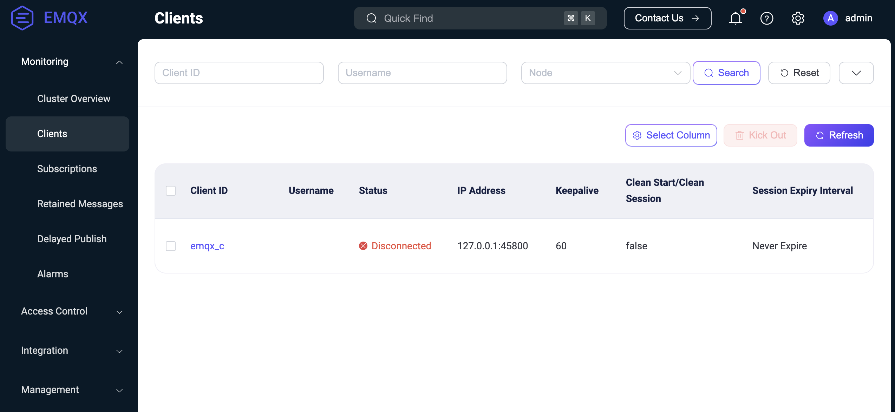

# MQTT Durable Sessions

EMQXにはDurable Sessions機能があり、MQTTセッションとメッセージをディスクに永続的に保存することで、高可用性のレプリカを提供し、データの冗長性と整合性を確保します。セッションの耐久性により、効果的なフェイルオーバーとリカバリ機構を実装でき、サービスの継続性と可用性を保証し、システムの信頼性を向上させます。

本ページでは、EMQXにおけるセッション永続化の概念、原理、および使用方法を紹介します。

::: warning Important Notice

この機能はEMQX v5.7.0以降で利用可能です。ただし、共有サブスクリプションセッションの永続化はまだサポートされておらず、今後のバージョンで実装予定です。

:::

## 基本概念

EMQXのDurable Sessions機能を理解する前に、EMQXに関するいくつかの基本概念を押さえておくことが重要です。

### セッションと耐久ストレージ

**セッション**：セッションは、EMQX内でクライアント接続ごとに作成される軽量プロセスです。セッションはMQTT標準で規定されたブローカーの動作を実装しており、初期接続、トピックのサブスクライブ・サブスクライブ解除、メッセージの配信などを行います。

**耐久ストレージ**：耐久ストレージはEMQX内部のデータベースです。セッションは自身の状態やトピックに送信されたMQTTメッセージを保存するために利用します。耐久ストレージのデータベースエンジンは[RocksDB](https://rocksdb.org/)を用いてデータをディスクに保存し、[Raftアルゴリズム](https://raft.github.io/)でクラスター内にデータを一貫してレプリケートします。耐久ストレージと**Durable Sessions**は混同しないよう注意が必要です。

### セッション有効期限（Session Expiry Interval）

MQTT標準によると、クライアントセッションはMQTTブローカー内でクライアント接続と状態を管理します。**有効期限（Expiry Interval）**は、クライアント接続終了後にブローカーがセッション状態を保持する期間を制御するセッションのプロパティです。本ドキュメントの文脈で重要な役割を果たします。

有効期限が0に設定されたセッションは、クライアントがEMQXに接続している間のみ存在します。クライアントが切断されると、サブスクリプションや未配信メッセージを含むすべてのセッション情報は即座に破棄されます。有効期限が0以外のセッションは、クライアント接続終了後もEMQXに保持され、クライアントがセッション有効期限内に再接続した場合に再開可能です。クライアントがオフライン中にトピックに送信されたメッセージは配信されます。

- MQTT 5プロトコルを使用するクライアントは、`CONNECT`または`DISCONNECT`パケットの[Session Expiry Interval](https://docs.oasis-open.org/mqtt/mqtt/v5.0/os/mqtt-v5.0-os.html#_Toc3901048)プロパティで明示的にセッション有効期限を指定できます。

- MQTT 3.*プロトコルのクライアントの場合、EMQXは以下のルールに従ってセッション有効期限を決定します：`Clean Session`フラグが`true`の場合、有効期限は0に設定されます。そうでなければ、`mqtt.session_expiry_interval`設定パラメータの値が使用されます。

## EMQXにおけるセッション実装

EMQXは用途に応じて最適化された2種類のクライアントセッション実装を提供しています：

- **通常セッション**：実行中のEMQXノードのメモリに状態を保持するセッション。ノード再起動時に状態は失われます。
- **Durableセッション**：耐久ストレージに状態と受信メッセージをバックアップし、EMQXノードの再起動後も再開可能なセッション。

セッション実装の選択は、セッション有効期限とグローバルまたは[ゾーン単位](../guides/configuration/configuration.md#zone-override)で設定可能な`durable_sessions.enable`設定パラメータに依存します。以下の基準で実装が選択されます：

| `durable_sessions.enable` | セッション有効期限 = 0 | セッション有効期限 > 0 |
| ------------------------- | ----------------------- | ----------------------- |
| `false`                   | 通常                    | 通常                    |
| `true`                    | 通常                    | Durable                 |

EMQXはメッセージの耐久性管理に独自のアプローチを採用しており、通常セッションとDurableセッションが共存しつつ、ストレージコストを最小限に抑えています。

### セッション実装の比較

クライアントセッションの管理戦略はサービスの安定性と信頼性を確保する上で重要です。本節では2つのセッション実装の特徴を比較し、開発者がそれぞれの特性と適用シナリオを理解し、より適切なデプロイメント判断を行えるよう支援します。

#### 通常セッション

この実装はデフォルトであり、EMQX v5.7以前のすべてのリリースで使用されてきました。通常セッションの状態は実行中のEMQXノードのRAMに完全に保持されます。

通常セッションの利点：

- 非常に高いスループットと低レイテンシ。
- クライアントへの即時メッセージ配信。

一方で欠点もあります：

- セッションデータはセッションをホストするEMQXノードの停止または再起動時に失われる。
- 未配信メッセージはセッションのメモリキューに保存され、EMQXのメモリ使用量が増加する。
- メモリ枯渇を防ぐためにEMQXはメモリキューのサイズ制限を設けており、制限に達すると新しいメッセージは破棄され、未配信メッセージが失われる可能性がある。

#### Durableセッション

EMQX v5.7.0で導入されたDurableセッション実装は、セッション状態とDurableセッションにルーティングされるメッセージをディスクに保存します。この機能はデフォルトで無効で、`durable_sessions.enable`設定を`true`にすることで有効化できます。

Durableセッションがトピックフィルターにサブスクライブすると、EMQXはそのフィルターにマッチするトピックを「Durable」とマークします。これにより、通常セッションへのMQTT PUBLISHメッセージのルーティングに加え、ブローカーはこれらのメッセージを`messages`と呼ばれる耐久ストレージに保存します。

メッセージ配信プロトコルはパブリッシャーではなく、サブスクライバーのセッションの耐久性に依存することに注意してください。

各Durable MQTTメッセージは、サブスクライブしているDurableセッションの数や接続状態に関わらず、各レプリカに正確に1回だけ保存されます。これにより効率的なメッセージファンアウトが可能になり、ディスク書き込みを最小化します。

耐久ストレージは、EMQXクラスター内の複数ノードにセッションメタデータとMQTTメッセージを一貫してレプリケートすることで、高い耐久性と可用性を提供します。設定可能な[レプリケーションファクター](../guides/durability/managing-replication.md#replication-factor)により、各メッセージやセッションのレプリカ数を決定でき、耐久性とパフォーマンスのバランスをユーザーが要件に応じて調整可能です。

Durableセッションの利点：

- EMQXノードの再起動や停止後もセッションを再開できる。
- MQTTメッセージはメモリキューではなく共有のレプリケートされた耐久ストレージに保存されるため、オンライン・オフラインセッション双方のRAM使用量が削減される。
- 未配信メッセージ数に上限がなく、メモリキューのオーバーランによるメッセージ破棄が発生しない。

一方で欠点もあります：

- メッセージをディスクに保存するため、システム全体のスループットは低下する。
- Durableセッションは通常セッションよりレイテンシが高い。これはMQTTメッセージの書き込み・読み込みがバッチ処理で行われるためで、バッチ処理はスループットを向上させる一方で、クライアントがメッセージを受信するまでの遅延（エンドツーエンドレイテンシ）を増加させる。

## Durable Sessionsのクイックスタート

本節では、EMQXとMQTTクライアントでDurable Sessions機能を素早く利用する方法と、Durable Sessionsの簡単なワークフローを紹介します。

::: tip Note

Durable Sessionsを有効化していなくても、ステップ2〜4はセッションを保持し、メッセージはクライアントキューに保存されます。違いはステップ5でノード再起動後にセッションが永続的に保存され、復元可能かどうかです。

:::

1. EMQXでDurable Sessions機能を有効化します。

   デフォルトではDurable Sessionsは無効です。`etc/emqx.conf`ファイルを編集し、以下の設定を追加して有効化してください：

   ```bash
   durable_sessions {
     enable = true
   }
   ```

   設定を反映するためにEMQXを再起動します。

2. MQTTクライアントの接続パラメータを調整し、セッション耐久性を有効にします。

   例として、デフォルトでMQTT 5.0プロトコルを使う[MQTTX CLI](https://mqttx.app/cli)を用います。`--no-clean`オプションを付けて`Clean Start = false`を設定し、クライアントIDを`emqx_c`に指定してEMQXに接続し、`t/1`トピックをサブスクライブします：

   ```bash
   mqttx sub -t t/1 -i emqx_c --no-clean
   ```

3. クライアントを切断し、セッションを保持します。

   ステップ2のクライアントを切断します。EMQXダッシュボードの**Monitoring** -> **Clients**ページを開くと、クライアントの状態が**Disconnected**のままで、セッションが保持されていることが確認できます。

   

4. クライアントにメッセージを送信し、メッセージがクライアントキューに保存されます。

   再度MQTTX CLIを使い、`bench`コマンドで1クライアントに対して`t/1`トピックに繰り返しメッセージをパブリッシュします：

   ```bash
   mqttx bench pub -t t/1 -c 1
   ```

   MQTTプロトコルに従い、`emqx_c`クライアントがオフラインでも、サブスクライブしている`t/1`トピックのメッセージはクライアントキューに保存され、再接続時に配信されます。

5. EMQXノードを再起動し、セッションとメッセージが耐久ストレージから復元されます。

   EMQXノードを再起動します。クライアント接続操作を行わずにEMQXダッシュボードの**Monitoring** -> **Clients**ページを開くと、クライアントの状態が**Disconnected**のままで、セッションが復元されていることが確認できます。

   同じクライアントID `emqx_c` と`--no-clean`オプション（`Clean Start = false`）を指定してEMQXに接続してみてください：

   ```bash
   mqttx sub -t t/1 -i emqx_c --no-clean
   ```

   オフライン期間中に受信したメッセージがクライアントに配信されます：

   ```bash
   ...
   [2024-5-22] [16:14:14] › …  Connecting...
   [2024-5-22] [16:14:14] › ✔  Connected
   [2024-5-22] [16:14:14] › …  Subscribing to t/1...
   [2024-5-22] [16:14:14] › ✔  Subscribed to t/1
   [2024-5-22] [16:14:14] › payload: Hello From MQTTX CLI
   ...
   ```

   ::: tip Note

   - セッションを復元するには、同じクライアントID `emqx_c` を使用し、`--no-clean`オプションで`Clean Start`を`false`に設定する必要があります。この2つの条件を満たす必要があります。
   - 以前のサブスクリプション情報はすでにセッションに保存されているため、再接続時に`t/1`トピックを再サブスクライブしなくてもメッセージは配信されます。

   :::

## 耐久ストレージのアーキテクチャ

EMQXの組み込み耐久機能を支えるデータベースエンジンは、ストレージ、シャード、ジェネレーション、ストリームという階層構造でデータを整理しています。


### ストレージ

ストレージはMQTTメッセージやMQTTセッションなど、特定の種類のすべてのデータをカプセル化します。

### シャード

メッセージはパブリッシャーのクライアントIDに基づいてクライアントごとに分割され、シャードに保存されます。シャード数はEMQX初回起動時の[n_shards](../guides/durability/managing-replication.md#number-of-shards)設定パラメータで決定されます。シャードはレプリケーションの単位でもあり、各シャードは`durable_storage.messages.replication_factor`で指定された回数だけ異なるノードに一貫してレプリケートされ、各レプリカは同一のメッセージセットを保持します。

### ジェネレーション

シャード内のメッセージは特定の時間枠に対応するジェネレーションに区切られます。新しいメッセージは現在のジェネレーションに書き込まれ、過去のジェネレーションは読み取り専用です。EMQXは古いMQTTメッセージを古いジェネレーションごとに削除してクリーンアップします。古いMQTTメッセージの保持期間は`durable_sessions.message_retention_period`パラメータで決まります。

ジェネレーションはストレージレイアウト仕様に応じて異なるデータ構造を持てます。現在はワイルドカードや単一トピックのサブスクリプションに最適化された1つのレイアウトのみがサポートされています。将来的には異なるワークロードに最適化されたレイアウトが追加される予定です。

新しいジェネレーションのストレージレイアウトは`durable_storage.messages.layout`パラメータで設定され、各レイアウトエンジンは独自の設定パラメータを持ちます。

### ストリーム

各シャードとジェネレーション内のメッセージはストリームに分割されます。ストリームはEMQXにおけるメッセージのシリアライズ単位です。ストリームは複数トピックのメッセージを含むことができます。さまざまなストレージレイアウトはトピックをストリームにマッピングする異なる戦略を採用しています。

Durableセッションはストリームからバッチでメッセージを取得し、バッチサイズは`durable_sessions.batch_size`パラメータで調整可能です。

## クラスター間の耐久ストレージ

EMQXクラスター内の各ノードには一意の*Site ID*が割り当てられており、これはErlangノード名（`emqx@...`）とは独立した安定した識別子です。Site IDは永続的で、ノードの初回起動時にランダム生成されます。この安定性により、ノード名の変更や再設定があってもデータの整合性が保たれます。

管理者は`emqx_ctl ds info` CLIコマンドを使ってクラスター全体の耐久ストレージの状態を管理・監視できます。

## Durable Sessionsのハードウェア要件

セッション耐久性を有効にすると、EMQXはDurableセッションのメタデータとDurableセッションに送信されたMQTTメッセージをディスクに保存します。そのため、十分なストレージ容量を持つサーバーにEMQXをデプロイする必要があります。最高のスループットを得るためには、SSDストレージの使用を推奨します。

ディスク容量の目安は以下の通りです：

- **メッセージストレージ**：各レプリカでのメッセージ保存に必要な容量は、受信メッセージレートに`durable_sessions.message_retention_period`パラメータで指定された保持期間を掛けたものに比例します。このパラメータはメッセージの保持期間を決定し、必要な総ストレージ容量に影響します。
- **セッションメタデータストレージ**：セッションメタデータのストレージ容量は、セッション数にサブスクライブしているストリーム数を掛けたものに比例します。
- **ストリーム数の計算**：ストリーム数はシャード数に比例し、トピック数にも（非線形に）依存します。EMQXは構造が類似したトピックを同じストリームに自動的にまとめるため、トピック数の増加に伴うストリーム数の増加を抑制し、セッションごとのメタデータ量を最小化します。

## 次のステップ

Durable Sessions機能の設定・管理方法や、EMQXクラスターでのDurable Sessionsの初期設定・変更方法については、以下のページを参照してください：

- [Durable Sessionsの設定と管理](../guides/durability/management.md)
- [データレプリケーションの管理](../guides/durability/managing-replication.md)
