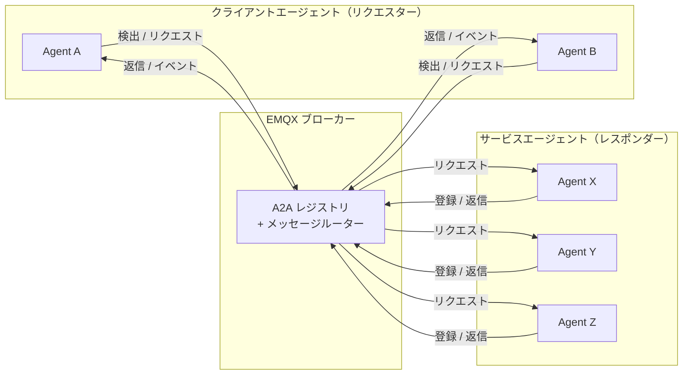
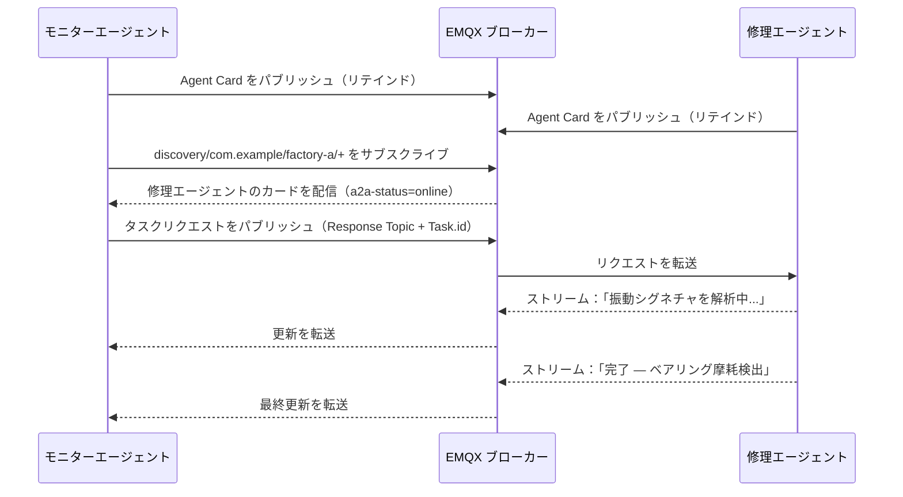

# A2A over MQTT の仕組み

このページでは、A2A over MQTT の基本概念について説明します。エージェント、クライアント、ブローカーの構成、エージェント同士の識別と検出方法、Agent Card の内容、およびエージェント間の通信パターンについて解説します。これらの概念を理解することは、EMQX の A2A レジストリを扱う上での基礎となります。

## アーキテクチャ

A2A over MQTT はブローカー中心モデルを採用し、以下の3者が参加します。

- **エージェント（レスポンダー）**：自身の Agent Card を検出トピックにリテインドメッセージとしてパブリッシュし、自身のリクエストトピックをサブスクライブし、受信したタスクリクエストに応答します。
- **クライアントエージェント（リクエスター）**：検出トピックをサブスクライブして利用可能なエージェントを発見し、タスクリクエストを送信し、返信を受け取ります。
- **MQTT ブローカー（EMQX）**：すべてのメッセージをルーティングし、Agent Card を A2A レジストリに記録し、認証と認可を実施し、検出メッセージに対してライブネスメタデータを付与します。



## エージェント識別

各エージェントは3階層の階層構造で識別されます。

```
{org_id} / {unit_id} / {agent_id}
```

- **org_id**：エージェントが所属する組織（例：`com.example`）。
- **unit_id**：組織内の部門やチーム、デプロイ環境などの区分（例：`factory-a`）。
- **agent_id**：組織およびユニット内で一意なエージェント識別子（例：`iot-ops-agent-001`）。

3つのセグメントすべてが `^[A-Za-z0-9_.-]+$` にマッチし、`/`、`+`、`#`、空白文字を含んではいけません。エージェントの MQTT クライアントIDは `{org_id}/{unit_id}/{agent_id}` の形式を使用します。

## トピックモデル

| トピック | 用途 |
|---|---|
| `$a2a/v1/discovery/{org_id}/{unit_id}/{agent_id}` | エージェントの登録および検出（リテインド） |
| `$a2a/v1/request/{org_id}/{unit_id}/{agent_id}` | 特定エージェントへのタスクリクエスト受信 |
| `$a2a/v1/reply/{org_id}/{unit_id}/{agent_id}/{suffix}` | 推奨される返信トピックパターン（下記注釈参照） |
| `$a2a/v1/event/{org_id}/{unit_id}/{agent_id}` | 要求されていないイベントのパブリッシュ |
| `$a2a/v1/request/{org_id}/{unit_id}/pool/{pool_id}` | ロードバランスされた共有プールトピック |

::: tip 注釈
返信トピックは固定のプロトコルトピックではありません。リクエスターは任意のトピックを返信トピックとして使用できます。レスポンダーは MQTT v5 の `Response Topic` プロパティから返信先を取得します。上記のパターンは一貫性を保ち、ACL設定を簡素化するための推奨例です。
:::

検出サブスクリプションはワイルドカードを使って範囲を限定します。

```
$a2a/v1/discovery/com.example/+/+     # 組織内のすべてのエージェント
$a2a/v1/discovery/com.example/factory-a/+  # ユニット内のすべてのエージェント
```

## Agent Card

Agent Card はエージェントが自身の検出トピックにパブリッシュする JSON ドキュメントです。エージェントの識別情報、機能、HTTP エンドポイント、オプションのセキュリティメタデータを記述します。EMQX は受信時にカードを A2A レジストリに記録します。

最低限必要なフィールド：

| フィールド | 型 | 説明 |
|---|---|---|
| `name` | 文字列 | 人間が読めるエージェント名 |
| `description` | 文字列 | エージェントの概要説明 |
| `version` | 文字列 | バージョン文字列（例：`"1.0.0"`） |
| `url` | 文字列（URI） | エージェントのエンドポイントURI。任意 |
| `skills` | 配列 | 少なくとも1つのスキルオブジェクト。各スキルは `id`、`name`、`description` を持つ |

最小限の Agent Card の例：

```json
{
  "name": "IoT Operations Agent",
  "description": "工場のテレメトリを監視し、対策を調整します。",
  "version": "1.2.3",
  "url": "mqtts://broker.example.com:8883",
  "skills": [
    {
      "id": "device-diagnostics",
      "name": "デバイス診断",
      "description": "テレメトリを解析し、デバイス異常を検出します。"
    }
  ]
}
```

`capabilities`、`securitySchemes`、`supportedInterfaces`、拡張パラメータを含む完全な Agent Card スキーマは、[A2A仕様](https://a2a-protocol.org/latest/specification/)をご参照ください。

## エージェントのライブネス

Agent Card はエージェントが切断した後もリテインドメッセージとして保持されます。EMQX は接続状態を追跡し、検出メッセージをサブスクライバーに転送する際に MQTT v5 のユーザープロパティを付与します。

| ユーザープロパティ | 値 | 意味 |
|---|---|---|
| `a2a-status` | `online` | エージェントの MQTT 接続がアクティブ |
| `a2a-status` | `offline` | エージェントが切断済み（正常終了または LWT） |
| `a2a-status-source` | `broker` | EMQX によって状態が設定された |
| `a2a-status-source` | `agent` | エージェント自身によって状態が設定された |
| `a2a-status-source` | `lwt` | 予期しない切断（Last Will）による状態 |

エージェントは検出トピックに対して Last Will メッセージを設定し、`a2a-status=offline` と `a2a-status-source=lwt` を含めることで、異常切断時にサブスクライバーへ自動通知されるようにすべきです。

## インタラクションパターン

A2A over MQTT は以下のエージェント間インタラクションパターンをサポートします。すべて MQTT v5 の `Response Topic` と `Correlation Data` プロパティを用いたリクエスト／リプライルーティングを行い、リクエスター生成の `Task.id` によりタスク状態をライフサイクル全体で追跡します。

| パターン | 説明 |
|---|---|
| 1リクエスト1レスポンス | リクエスターがタスクリクエストをパブリッシュし、レスポンダーが指定された `Response Topic` に単一の返信をパブリッシュ |
| ストリーミングレスポンス | レスポンダーが複数のステータスや成果物更新メッセージをパブリッシュし、タスクの最終状態に達するまで継続 |
| マルチターン会話 | 関連タスクを `Task.context_id` でグループ化し、中断されたタスクの再開を可能にする |
| 共有プールディスパッチ | 複数のエージェントインスタンスが MQTT 共有サブスクリプションを用いてプールトピックを共有し、ロードバランスされたリクエスト処理を実現 |
| タスクの引き継ぎ | レスポンダーが進行中のタスクを `a2a-responder-agent-id` ユーザープロパティを使って別インスタンスに委譲 |
| OAuth 2.0 認可 | リクエストごとにベアラートークンを `a2a-authorization` MQTT ユーザープロパティとして渡す |
| エンドツーエンドセキュリティ | オプションの `ubsp-v1` セキュリティプロファイルにより、信頼できないブローカー環境でもペイロードをエンドツーエンドで暗号化 |

各パターンの詳細な仕様は、[A2A over MQTT トランスポート仕様](https://www.emqx.com/mqtt-for-ai/a2a-over-mqtt/specification/0.1/basic/mqtt_transport.html)をご参照ください。

## 例：工場アラート対応ワークフロー

2つのエージェントが協力して工場フロアのアラートに対応します。異常を検知し診断タスクを委譲する **モニターエージェント** と、それを処理して結果をストリーム配信する **修理エージェント** です。

**ステップ1：両エージェントが登録する。** 各エージェントは自身の Agent Card を検出トピックにリテインドメッセージとしてパブリッシュします。EMQX はカードを記録し、両エージェントをオンラインとしてマークします。

**ステップ2：モニターエージェントが修理エージェントを検出する。** モニターエージェントは `$a2a/v1/discovery/com.example/factory-a/+` をサブスクライブし、修理エージェントのリテインドカードを即座に受信、機器故障の診断が可能であることを確認します。

**ステップ3：モニターエージェントがタスクリクエストを送信する。** モーター `line-7` から異常振動の読み取りが届きます。モニターエージェントは修理エージェントのリクエストトピックにユニークな `Task.id` と MQTT の `Response Topic` プロパティで指定した返信トピックを付けてリクエストをパブリッシュします。

**ステップ4：修理エージェントがステータス更新をストリーム配信する。** 修理エージェントは返信トピックに進捗更新をパブリッシュし、最終的に `completed` ステータス（ベアリング摩耗検出、点検予定）を送信します。各更新は元の `Correlation Data` をエコーし、モニターエージェントがリクエストに紐づけられるようにします。


