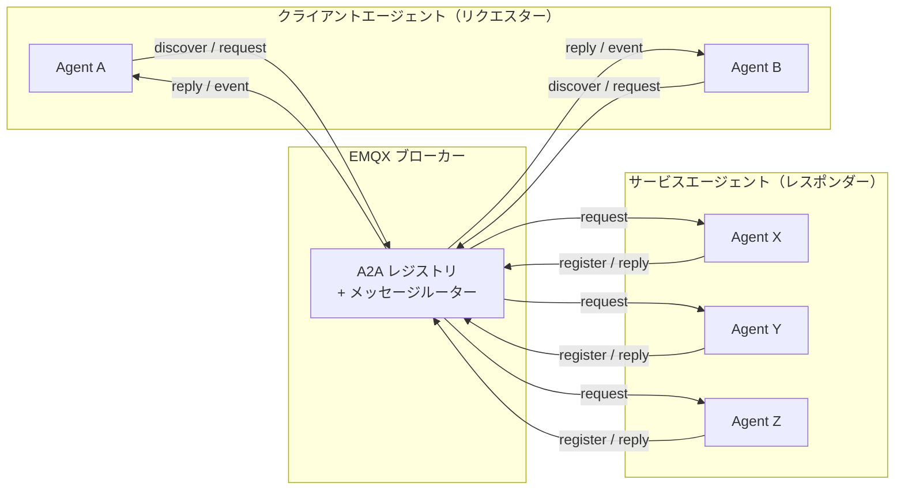
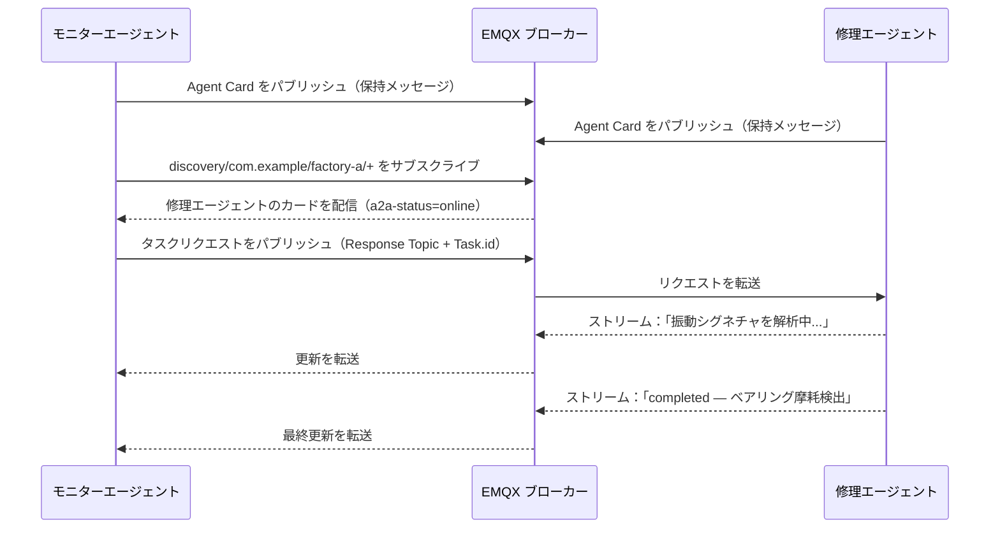

# A2A over MQTT の仕組み

このページでは、A2A over MQTT の基本概念について説明します。エージェント、クライアント、ブローカーの構成方法、エージェント同士の識別と検出方法、Agent Card の内容、エージェント間の通信パターンを解説します。これらの概念を理解することは、EMQX の A2A レジストリを扱う上での基礎となります。

## アーキテクチャ

A2A over MQTT はブローカー中心モデルを採用しており、以下の3者が参加します。

- **エージェント（レスポンダー）**：自身の Agent Card を検出トピックに保持メッセージとしてパブリッシュし、自身のリクエストトピックをサブスクライブし、受信したタスクリクエストに応答します。
- **クライアントエージェント（リクエスター）**：検出トピックをサブスクライブして利用可能なエージェントを発見し、タスクリクエストを送信し、返信を受信します。
- **MQTT ブローカー（EMQX）**：すべてのメッセージをルーティングし、Agent Card を A2A レジストリに記録し、認証・認可を適用し、検出メッセージにライブネスメタデータを付加します。



## エージェント識別

各エージェントは以下の3階層の階層構造で識別されます。

```
{org_id} / {unit_id} / {agent_id}
```

- **org_id**：エージェントが所属する組織（例：`com.example`）。
- **unit_id**：組織内の部門やチーム、デプロイ環境などの区分（例：`factory-a`）。
- **agent_id**：組織およびユニット内で一意のエージェント識別子（例：`iot-ops-agent-001`）。

3つのセグメントはすべて `^[A-Za-z0-9_.-]+$` にマッチし、`/`、`+`、`#`、空白文字を含んではいけません。エージェントの MQTT クライアントID は `{org_id}/{unit_id}/{agent_id}` の形式を用います。

## トピックモデル

| トピック | 用途 |
|---|---|
| `$a2a/v1/discovery/{org_id}/{unit_id}/{agent_id}` | エージェント登録および検出（保持メッセージ） |
| `$a2a/v1/request/{org_id}/{unit_id}/{agent_id}` | 特定エージェントへのタスクリクエスト受信 |
| `$a2a/v1/reply/{org_id}/{unit_id}/{agent_id}/{suffix}` | 推奨される返信トピックパターン（下記注釈参照） |
| `$a2a/v1/event/{org_id}/{unit_id}/{agent_id}` | 任意のイベントパブリッシュ |
| `$a2a/v1/request/{org_id}/{unit_id}/pool/{pool_id}` | ロードバランスされた共有プールトピック |

::: tip 注釈
返信トピックは固定のプロトコルトピックではありません。リクエスターは任意のトピックを返信トピックとして使用できます。レスポンダーは MQTT v5 の `Response Topic` プロパティから返信先を取得します。上記パターンは一貫性を保ち、ACL設定を簡素化するための推奨例です。
:::

検出サブスクリプションはワイルドカードを用いてスコープを限定します。

```
$a2a/v1/discovery/com.example/+/+     # 組織内すべてのエージェント
$a2a/v1/discovery/com.example/factory-a/+  # ユニット内すべてのエージェント
```

## Agent Card

Agent Card はエージェントが自身の検出トピックにパブリッシュする JSON ドキュメントです。エージェントの識別情報、機能、HTTP エンドポイント、任意のセキュリティメタデータを記述します。EMQX は受信時にカードを A2A レジストリに記録します。

最低限必要なフィールド：

| フィールド | 型 | 説明 |
|---|---|---|
| `name` | 文字列 | 人間が読みやすいエージェント名 |
| `description` | 文字列 | エージェントの概要説明 |
| `version` | 文字列 | バージョン文字列（例：`"1.0.0"`） |
| `url` | 文字列（URI） | エージェントのエンドポイントURI。任意。 |
| `skills` | 配列 | 少なくとも1つのスキルオブジェクト。各スキルは `id`、`name`、`description` を持つ。 |

最小限の Agent Card 例：

```json
{
  "name": "IoT Operations Agent",
  "description": "Monitors factory telemetry and coordinates remediation actions.",
  "version": "1.2.3",
  "url": "mqtts://broker.example.com:8883",
  "skills": [
    {
      "id": "device-diagnostics",
      "name": "Device Diagnostics",
      "description": "Analyzes telemetry and detects device anomalies."
    }
  ]
}
```

`capabilities`、`securitySchemes`、`supportedInterfaces`、拡張パラメータを含む完全な Agent Card スキーマは、[A2A仕様](https://a2a-protocol.org/latest/specification/)をご参照ください。

## エージェントのライブネス

Agent Card はエージェント切断後も保持メッセージとして残ります。EMQX は接続状態を追跡し、検出メッセージをサブスクライバーに転送する際に MQTT v5 のユーザープロパティを付加します。

| ユーザープロパティ | 値 | 意味 |
|---|---|---|
| `a2a-status` | `online` | エージェントの MQTT 接続がアクティブ |
| `a2a-status` | `offline` | エージェントが切断済み（正常切断または LWT による） |
| `a2a-status-source` | `broker` | EMQX によって状態が設定された |
| `a2a-status-source` | `agent` | エージェント自身によって状態が設定された |
| `a2a-status-source` | `lwt` | 予期しない切断（Last Will）を反映した状態 |

エージェントは検出トピックに対して Last Will メッセージを設定し、`a2a-status=offline` と `a2a-status-source=lwt` を付与することで、異常切断時にサブスクライバーへ自動通知されるようにすべきです。

## インタラクションパターン

A2A over MQTT はエージェント間で以下のインタラクションパターンをサポートします。各パターンは MQTT v5 の `Response Topic` と `Correlation Data` プロパティを用いたリクエスト／リプライルーティングを行い、リクエスター生成の `Task.id` によりタスク状態をライフサイクル全体で追跡します。

| パターン | 説明 |
|---|---|
| 1リクエスト1レスポンス | リクエスターがタスクリクエストをパブリッシュし、レスポンダーが指定された `Response Topic` に単一の返信をパブリッシュ |
| ストリーミングレスポンス | レスポンダーが複数のステータスおよび成果物更新メッセージをタスク完了まで連続パブリッシュ |
| マルチターン会話 | 関連タスクを `Task.context_id` でグループ化し、中断されたタスクの再開を可能に |
| 共有プールディスパッチ | 複数のエージェントインスタンスが MQTT 共有サブスクリプションを用いてロードバランスされたリクエスト処理を実現 |
| タスクハンドオーバー | レスポンダーが進行中タスクを `a2a-responder-agent-id` ユーザープロパティを使い別インスタンスに委譲 |
| OAuth 2.0 認可 | リクエスト毎にベアラートークンを `a2a-authorization` MQTT ユーザープロパティとして渡す |
| エンドツーエンドセキュリティ | 任意の `ubsp-v1` セキュリティプロファイルにより、信頼できないブローカー環境でもペイロードをエンドツーエンド暗号化可能 |

各パターンの完全な仕様は、[A2A over MQTT トランスポート仕様](https://www.emqx.com/mqtt-for-ai/a2a-over-mqtt/specification/0.1/basic/mqtt_transport.html)をご覧ください。

## 例：工場アラート対応ワークフロー

2つのエージェントが協力して工場フロアのアラートに対応します。異常検知と診断タスクの委譲を行う **モニターエージェント** と、タスクを処理し結果をストリーム配信する **修理エージェント** です。

**ステップ1：両エージェントが登録。** 各エージェントは自身の Agent Card を保持メッセージとして検出トピックにパブリッシュします。EMQX はカードを記録し、両エージェントをオンライン状態としてマークします。

**ステップ2：モニターエージェントが修理エージェントを検出。** モニターエージェントは `$a2a/v1/discovery/com.example/factory-a/+` をサブスクライブし、保持されている修理エージェントのカードを即座に受信、機器故障診断が可能であることを確認します。

**ステップ3：モニターエージェントがタスクリクエストを送信。** モーター `line-7` から異常振動値が届きます。モニターエージェントは修理エージェントのリクエストトピックにユニークな `Task.id` と MQTT の `Response Topic` プロパティを設定してリクエストをパブリッシュします。

**ステップ4：修理エージェントがステータス更新をストリーム配信。** 修理エージェントは返信トピックに進捗更新を連続パブリッシュし、最終的に `completed` ステータス（ベアリング摩耗検出、点検予定）を送信します。各更新は元の `Correlation Data` をエコーし、モニターエージェントがリクエストに紐付けられるようにします。


