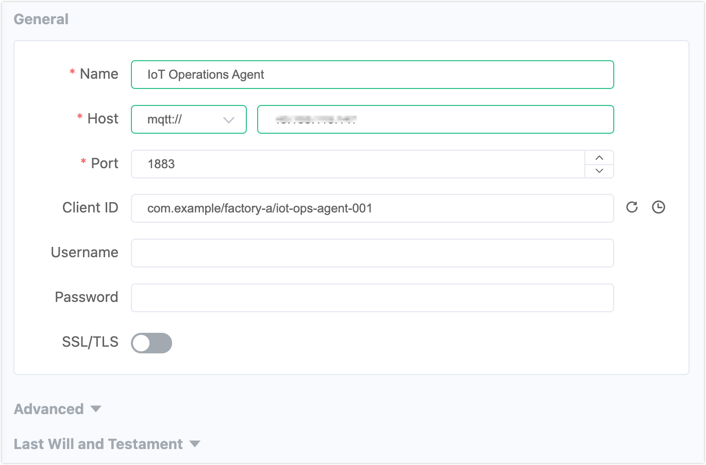
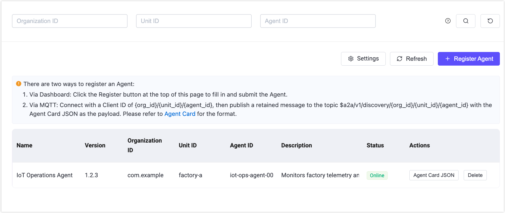

# エージェントの管理

このページでは、A2Aレジストリの有効化方法と、ダッシュボードUI、CLI、またはMQTTを使用してエージェントを登録、表示、削除する方法について説明します。

## 前提条件

- EMQX 6.2.0以降。
- ダッシュボードまたはEMQXノードへの管理者アクセス権。

## A2Aレジストリの有効化

A2Aレジストリはデフォルトで無効になっています。エージェントを登録する前に有効化してください。

### ダッシュボード経由

1. 左側のナビゲーションパネルで **A2A Registry** をクリックします。
2. **Settings** をクリックします。
3. **Enable A2A Registry** をオンに切り替えます。
4. **Validate Schema** はデフォルトで有効です。有効にすると、EMQXは登録時にAgent CardのペイロードをA2Aスキーマに対して検証し、スキーマに準拠しないカードは拒否されます。スキーマから逸脱したカードを受け入れる必要がある場合のみ無効にしてください。
5. **Save Changes** をクリックします。

### 設定ファイル経由

`emqx.conf` に以下を追加します。

```hocon
a2a_registry {
  enable = true
  validate_schema = true
}
```

設定項目の詳細：

| パラメーター | 型 | デフォルト | 説明 |
|---|---|---|---|
| `enable` | Boolean | `false` | A2Aレジストリを有効にします。 |
| `validate_schema` | Boolean | `true` | 登録時にAgent CardのペイロードをA2Aスキーマに対して検証します。無効なカードは拒否されます。 |
| `max_card_size` | Integer | `65536` | Agent Cardペイロードの最大サイズ（バイト単位）。 |
| `registration_rate_limit` | Integer | `10` | エージェントごとの1分あたりの最大登録更新数。 |
| `require_security_metadata` | Boolean | `false` | 有効にすると、Agent Cardのセキュリティメタデータ拡張に`jwksUri`の記載を必須とします。 |
| `trusted_jkus` | 配列 | `[]` | 空でない場合、Agent Card内の`jwksUri`はリスト内のいずれかのプレフィックスと一致する必要があります。空リストはJKU検証を無効化（許容モード）します。 |
| `verify_jku_tls` | Boolean | `true` | JWKSエンドポイント取得時にTLS証明書を検証します。 |

## エージェントの登録

エージェントは自身のAgent CardをA2Aレジストリにパブリッシュすることで登録され、他のエージェントから検出可能になります。登録はダッシュボード、MQTT、またはCLIから行えます。

### ダッシュボード経由

1. **A2A Registry** -> **+ Register Agent** をクリックします。
2. 識別フィールドを入力します：

   - **Organization ID**：エージェントが所属する組織または信頼ドメイン（例：`com.example`）。展開間での一意性を保つために逆DNS表記を使用してください。
   - **Unit ID**：組織内の区分（例：事業部門や展開環境など、`factory-a`など）。
   - **Agent ID**：組織およびユニット内で一意のエージェント識別子（例：`iot-ops-agent-001`）。

   これら3つの値は英数字、ハイフン、アンダースコア、ピリオド（`^[A-Za-z0-9._-]+$`）のみを含み、`/`、`+`、`#`、空白は含められません。これらはエージェントの完全なアドレス `{org_id}/{unit_id}/{agent_id}` を形成します。

3. Agent CardのJSONをエディターに貼り付けます。必要なフィールドやテンプレートは **Help** ボタンで確認できます。
4. **Register Agent** をクリックします。

### MQTTX経由

エージェントは自身のAgent Cardを保持メッセージとして発見用トピックにパブリッシュすることで登録します。要件は以下の通りです：

- MQTTプロトコルバージョン5。
- クライアントIDは `{org_id}/{unit_id}/{agent_id}` に設定。
- Retainフラグ有効、QoS 1。
- ペイロードは少なくとも `name`、`description`、`version`、`url`、`skills` を含むAgent Card JSON。

**[MQTTX Desktop](https://mqttx.app/downloads)を使用する場合：**

1. MQTTXを開き、**New Connection** をクリックします。

2. 接続情報を入力します：
   - **Name**：接続名（例：`IoT Operations Agent`）
   - **Host**：EMQXブローカーのアドレス
   - **Port**：`1883`（または適切なポート）
   - **Client ID**：`com.example/factory-a/iot-ops-agent-001`
   - **MQTT Version**：`5.0`
   
   
   
3. **Connect** をクリックします。

4. 画面下部のメッセージ作成エリアに以下を入力します：
   - **Topic**：`$a2a/v1/discovery/com.example/factory-a/iot-ops-agent-001`
   - **QoS**：`1`
   - **Retain**：有効
   - **Payload**：Agent Card JSON（以下の例を参照）
   
5. 送信ボタンをクリックします。

```json
{
  "name": "IoT Operations Agent",
  "description": "Monitors factory telemetry and coordinates remediation actions.",
  "version": "1.2.3",
  "url": "mqtts://broker.example.com:8883",
  "skills": [
    {
      "id": "device-diagnostics",
      "name": "Device Diagnostics",
      "description": "Analyzes telemetry and detects device anomalies."
    }
  ]
}
```


**[MQTTX CLI](https://mqttx.app/cli)を使用する場合：**

```bash
mqttx pub \
  -h localhost -p 1883 \
  -V 5 \
  -i "com.example/factory-a/iot-ops-agent-001" \
  -t '$a2a/v1/discovery/com.example/factory-a/iot-ops-agent-001' \
  -m '{"name":"IoT Operations Agent","description":"Monitors factory telemetry and coordinates remediation actions.","version":"1.2.3","url":"mqtts://broker.example.com:8883","skills":[{"id":"device-diagnostics","name":"Device Diagnostics","description":"Analyzes telemetry and detects device anomalies."}]}' \
  -q 1 -r
```

**Validate Schema** が有効な場合、EMQXは登録前にペイロードを検証し、不正なカードはPUBACKの理由コードとともに拒否されます。

### CLI経由

```bash
emqx ctl a2a-registry register <path-to-agent-card.json>
```

JSONファイルにはAgent Cardのフィールドに加え、ルーティングに使う識別フィールドを含める必要があります：

```json
{
  "org_id": "com.example",
  "unit_id": "factory-a",
  "agent_id": "iot-ops-agent-001",
  "name": "IoT Operations Agent",
  "description": "Monitors factory telemetry and coordinates remediation actions.",
  "version": "1.2.3",
  "url": "mqtts://broker.example.com:8883",
  "skills": [
    {
      "id": "device-diagnostics",
      "name": "Device Diagnostics",
      "description": "Analyzes telemetry and detects device anomalies."
    }
  ]
}
```

## 登録済みエージェントの表示

登録済みエージェントはダッシュボードで閲覧・確認でき、CLIからもクエリ可能です。

### ダッシュボード経由

**A2A Registry** ページには登録済みのエージェントが一覧表示されます。各行には **Agent Card JSON** と **Delete** の2つの操作ボタンがあります。

上部の **Organization ID**、**Unit ID**、**Agent ID** のフィルターでリストを絞り込めます。

任意の行の **Agent Card JSON** をクリックすると、Agent Cardの生JSONがコピー用ボタン付きで表示されます。



### CLI経由

```bash
# 全エージェントの一覧表示
emqx ctl a2a-registry list

# 組織と状態でフィルター
emqx ctl a2a-registry list --org com.example --status online

# 特定エージェントのAgent Card取得
emqx ctl a2a-registry get com.example factory-a iot-ops-agent-001

# レジストリ統計の表示
emqx ctl a2a-registry stats
```

## エージェントの削除

エージェントを削除するとA2Aレジストリから登録解除され、保持されたAgent Cardがクリアされて検出不能になります。

### ダッシュボード経由

エージェント一覧で削除したいエージェントの削除操作をクリックし、確認のために完全な `{org_id}/{unit_id}/{agent_id}` を入力してください。

### MQTT経由

エージェントの発見用トピックに空の保持メッセージをパブリッシュします。これにより保持されたカードがクリアされ、レジストリから削除されます。

**MQTTX Desktopを使用する場合：**

1. エージェントのクライアントID（`com.example/factory-a/iot-ops-agent-001`）で接続します。
2. トピックを `$a2a/v1/discovery/com.example/factory-a/iot-ops-agent-001`、QoS `1`、**Retain** 有効に設定し、ペイロードは空にします。
3. 送信ボタンをクリックします。

**MQTTX CLIを使用する場合：**

```bash
mqttx pub \
  -h localhost -p 1883 \
  -V 5 \
  -i "com.example/factory-a/iot-ops-agent-001" \
  -t '$a2a/v1/discovery/com.example/factory-a/iot-ops-agent-001' \
  -m '' \
  -q 1 -r
```

### CLI経由

```bash
emqx ctl a2a-registry delete com.example factory-a iot-ops-agent-001
```

## MQTTによるエージェントの検出

クライアントエージェントはワイルドカードを使って発見用トピックをサブスクライブし、利用可能なエージェントを検出します。カードは保持されているため、サブスクライブ直後に即座に配信されます。

**MQTTX Desktopを使用する場合：**

1. EMQXブローカーに接続します。
2. **+ New Subscription** をクリックし、ワイルドカードトピック（例：`$a2a/v1/discovery/com.example/+/+`）を入力して組織内の全エージェントを検出します。
3. **Confirm** をクリックします。保持されたAgent Cardが即座にメッセージペインに表示されます。

**MQTTX CLIを使用する場合：**

```bash
# 組織内の全エージェント
mqttx sub -h localhost -p 1883 -V 5 -t '$a2a/v1/discovery/com.example/+/+' -v

# 特定ユニット内の全エージェント
mqttx sub -h localhost -p 1883 -V 5 -t '$a2a/v1/discovery/com.example/factory-a/+' -v

# 特定エージェント
mqttx sub -h localhost -p 1883 -V 5 -t '$a2a/v1/discovery/com.example/factory-a/iot-ops-agent-001' -v
```

`-v` フラグは受信したペイロードの前にトピック名を表示します。

受信メッセージのペイロードにはAgent CardのJSONが含まれています。EMQXはMQTT v5のユーザープロパティとして以下を付加し、エージェントのライブ状態を示します：

| ユーザープロパティ | 値 | 意味 |
|---|---|---|
| `a2a-status` | `online` | エージェントが現在接続中。 |
| `a2a-status` | `offline` | エージェントが切断済み。 |
| `a2a-status-source` | `broker` | EMQXが接続状態に基づき設定。 |
| `a2a-status-source` | `agent` | エージェント自身が積極的に公開（例：正常なオフライン）。 |
| `a2a-status-source` | `lwt` | Last Will and Testamentによる異常切断を反映。 |
