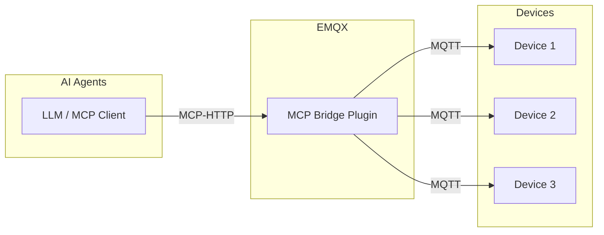
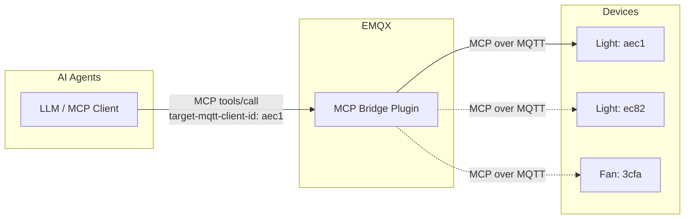
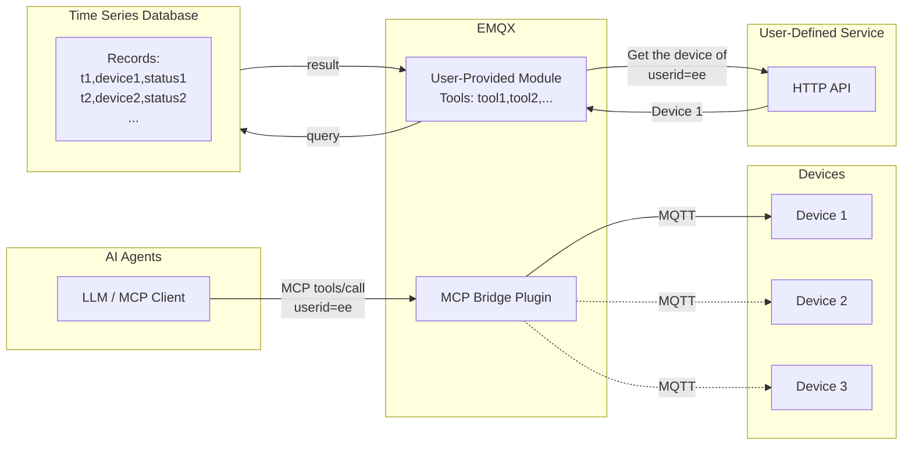

# MCP Bridge プラグイン

[EMQX MCP Bridge プラグイン](https://github.com/emqx/emqx_mcp_bridge) は、EMQX と MCP（Model Context Protocol）対応デバイスを統合するためのプラグインです。このプラグインを使うことで、MCP対応の大規模言語モデルやAIエージェントを利用してIoTデバイスにアクセスし、制御できます。

## MCP Bridge プラグインの仕組み

MCP Bridge プラグインはEMQX内にインストールされて動作します。起動後、Streamable HTTPまたはSSEに基づくMCP接続をMQTTプロトコルに変換するHTTPエンドポイントを公開します。

IoTデバイスはMQTTを使ってEMQXブローカーに接続し、MCP対応の大規模モデルやAIエージェントはMCP Bridge プラグインが公開するHTTPエンドポイントに接続します。

## MCP over MQTT を使ったデバイスアクセス

デバイス側では、MCP over MQTTプロトコルを使い、MCPサーバーとして自身のツールや機能を直接公開できます。プラグインはデバイスが登録したツールをツールタイプごとに集約します。MCP Bridge プラグインでは、MCP over MQTTプロトコルのServer Nameの概念をツールタイプにマッピングしています。

つまり、同じタイプの複数デバイスが登録したツールは、ブリッジプラグインによって単一の論理ツールとして集約され、MCPクライアントから呼び出せるようになります。

この方式は、スマートホームや産業制御システム、音声対応玩具など、単一または少数のデバイスにクライアントがアクセスするシナリオに適しています。これらのシナリオでは、ユーザーは大規模なデバイス群を管理するのではなく、自身のデバイスにのみアクセスすることが一般的です。

同じタイプの複数デバイスのツールが単一の論理ツールに集約されるため、MCP Bridge プラグインはツール定義に `target-mqtt-client-id` という必須パラメータを注入します。AIエージェントがツールを呼び出す際には、ビジネスロジックに基づいて対象デバイスIDを決定し、このパラメータを通じて指定する必要があります。これにより、MCPリクエストは特定のデバイスへルーティングされます。

## 標準MQTTを使ったデバイスアクセス

デバイスはMCP over MQTTの代わりに標準MQTTプロトコルでEMQXに接続することも可能です。この場合、ユーザーはMCP Bridge プラグイン内にMCPツールを直接実装し、これらの通常のMQTTデバイスに間接的にアクセスできます。

この方式は、スマートシティ、コネクテッドビークル、産業用IoTなど、より柔軟なデバイスアクセスが求められるシナリオに適しています。MCP Bridge プラグイン内では、ユーザー定義の外部サービスやAPIへのアクセス、外部データベースからのデバイス報告データの取得など、任意のビジネスロジックを実装できます。

MCPツールのコード実装例については、[Create Custom MCP Tools](https://github.com/emqx/emqx_mcp_bridge?tab=readme-ov-file#create-custom-mcp-tools) を参照してください。

