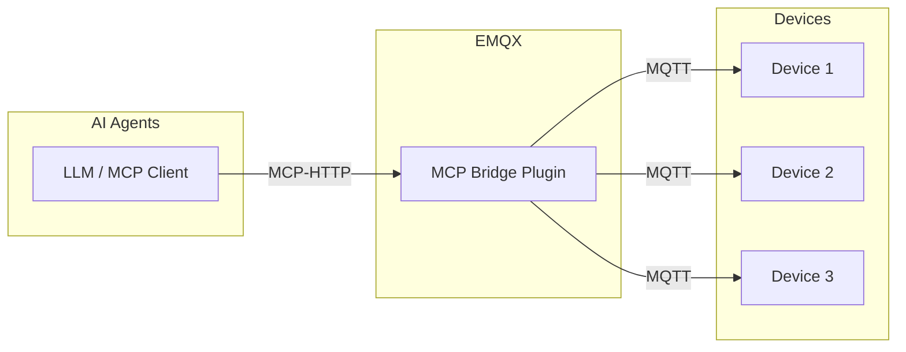
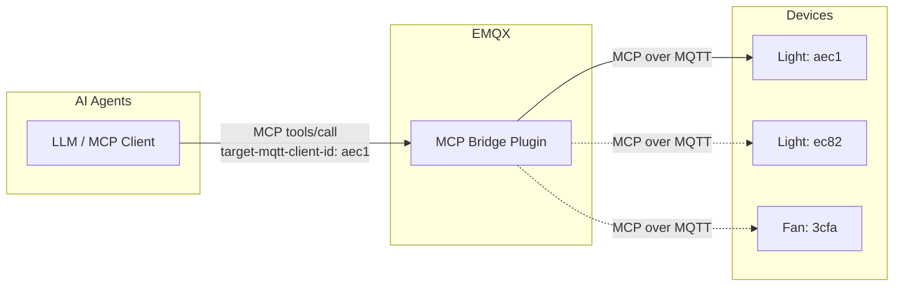
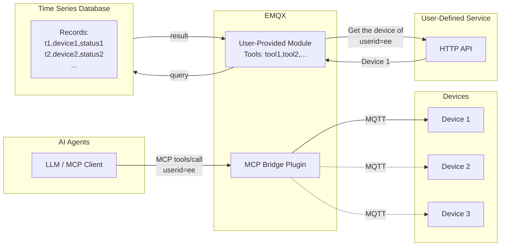

# MCP Bridge プラグイン

[EMQX MCP Bridge プラグイン](https://github.com/emqx/emqx_mcp_bridge) は、EMQX と MCP（Model Context Protocol）対応デバイスを統合するためのプラグインです。このプラグインを使うことで、ユーザーは MCP 対応の大規模言語モデルや AI エージェントを利用して IoT デバイスにアクセスし、制御できます。

## MCP Bridge プラグインの仕組み

MCP Bridge プラグインは EMQX 内にインストールされて動作します。起動後、Streamable HTTP または SSE に基づく MCP 接続を MQTT プロトコルに変換する HTTP エンドポイントを公開します。

IoT デバイスは MQTT を使って EMQX ブローカーに接続し、MCP 対応の大規模モデルや AI エージェントは MCP Bridge プラグインが公開する HTTP エンドポイントに接続します。

## MCP over MQTT を使ったデバイスアクセス

デバイス側では、MCP over MQTT プロトコルを使用し、MCP サーバーとして自らのツールや機能を直接公開できます。プラグインはデバイスが登録したツールをツールタイプごとに集約します。MCP Bridge プラグインでは、MCP over MQTT プロトコルの Server Name の概念をツールタイプにマッピングしています。

つまり、同じタイプの複数デバイスが登録したツールは、ブリッジプラグインによって単一の論理的なツールとして集約され、MCP クライアントから呼び出せるようになります。

この方式は、スマートホーム、産業制御システム、音声対応玩具など、単一または少数のデバイスにクライアントがアクセスするシナリオに適しています。これらのシナリオでは、ユーザーは通常、自分のデバイスのみを操作すればよく、大規模なデバイス群の管理は必要ありません。

同じタイプの複数デバイスのツールが単一の論理ツールに集約されるため、MCP Bridge プラグインはツール定義に `target-mqtt-client-id` という必須パラメータを注入します。AI エージェントがツールを呼び出す際は、ビジネスロジックに従って対象デバイスの ID を決定し、このパラメータで指定する必要があります。これにより MCP リクエストが特定のデバイスにルーティングされます。

## 標準 MQTT を使ったデバイスアクセス

デバイスは MCP over MQTT の代わりに標準 MQTT プロトコルで EMQX に接続することも可能です。この場合、ユーザーは MCP Bridge プラグイン内に MCP ツールを直接実装し、通常の MQTT デバイスへ間接的にアクセスできます。

この方式は、スマートシティ、コネクテッドビークル、産業用 IoT など、より柔軟なデバイスアクセスが求められるシナリオに適しています。MCP Bridge プラグイン内では任意のビジネスロジックを実装でき、ユーザー定義の外部サービスや API へのアクセス、外部データベースからのデバイス報告データの取得なども可能です。

MCP ツールのコード実装例については、[Create Custom MCP Tools](https://github.com/emqx/emqx_mcp_bridge?tab=readme-ov-file#create-custom-mcp-tools) を参照してください。

