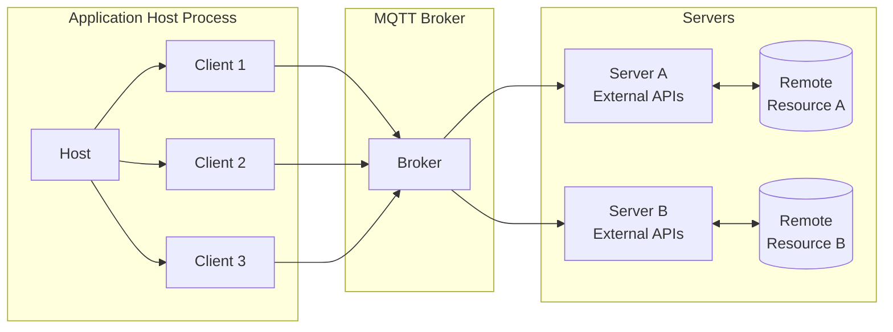
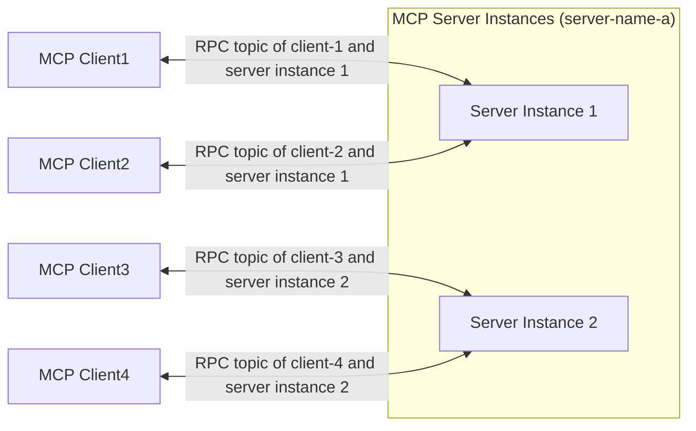

# MCP over MQTT アーキテクチャ

MCP over MQTT は、標準のMCPアーキテクチャ（Host、Client、Server）のコアコンセプトを継承しつつ、トランスポート層として中央集約型のMQTT ブローカーを導入しています。ブローカーはメッセージのルーティング、サービスの登録と検出、認証および認可を可能にします。

このアーキテクチャは、MCPの元々のコンテキストインタラクションモデルを保持しつつ、MQTTの軽量で広く適用可能な設計を活用し、IoTやエッジコンピューティングのシナリオにおける多対多通信、ロードバランシング、スケーラビリティの基盤を提供します。

## MQTT トランスポートのコアコンポーネント

MCP over MQTT アーキテクチャでは、メッセージルーターとして中央集約型のMQTT ブローカーを導入し、その他のコンポーネント（Host、Client、Server）は標準のMCP設計と一貫しています。

### Host、Client、および Server

Host、Client、および Server のコンポーネントは変更されていません（詳細は[MCPコアコンセプト](https://modelcontextprotocol.io/docs/learn/architecture#concepts-of-mcp)を参照してください）：

- **Host** はクライアントのコンテナおよびコーディネーターとして機能します。
- 各 **Client** はHostによって作成され、Serverと独立した接続を維持します。
- **Server** は専用のコンテキストと機能を提供します。

主な違いは、ClientとServerが直接通信するのではなく、MQTT ブローカーを介して通信する点です。ブローカーの導入により、ClientとServer間の関係は1対1から多対多に変わります。

### MQTT ブローカーの役割

MQTT ブローカーは中央集約型のメッセージルーターとして機能します：

- ClientとServer間のメッセージを転送します。
- サービスの登録と検出（保持メッセージを利用）をサポートします。
- ClientおよびServerの認証と認可を処理します。

## Serverのスケーリングとロードバランシング

スケーラビリティとロードバランシングを実現するために、MCP Serverは複数のインスタンス（プロセス）を起動できます。各インスタンスはユニークな `server-id` をMQTT クライアントIDとしてブローカーに接続し、すべてのインスタンスは同じ `server-name` を共有します。

**Clientのインタラクションフロー：**

1. Clientはサービス検出トピックをサブスクライブし、対象の `server-name` 配下のすべての利用可能な `server-id` を取得します。
2. Clientはカスタムポリシー（例：ランダムまたはラウンドロビン）に基づいてServerインスタンスを選択し、`initialize` リクエストを送信します。
3. 初期化後、Clientは専用のRPCトピックを通じて選択したServerインスタンスと通信します。

この方法により、MCP Serverの高可用性とスケーラビリティが実現されます：

- **スケールアップ時**、既存のMCPクライアントは旧サーバーインスタンスに接続したままで、新規クライアントは新たに追加されたインスタンスで初期化できます。
- **スケールダウン時**、MCPクライアントは再初期化して他の利用可能なサーバーインスタンスに接続できます。
