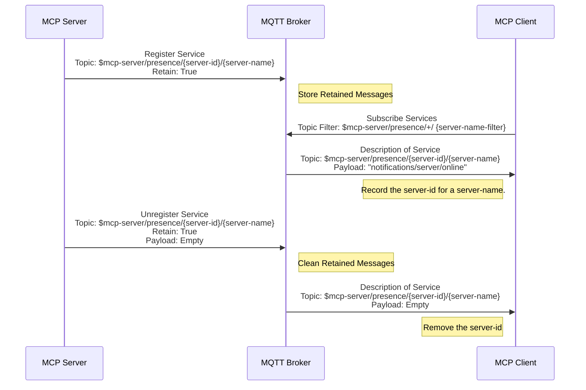
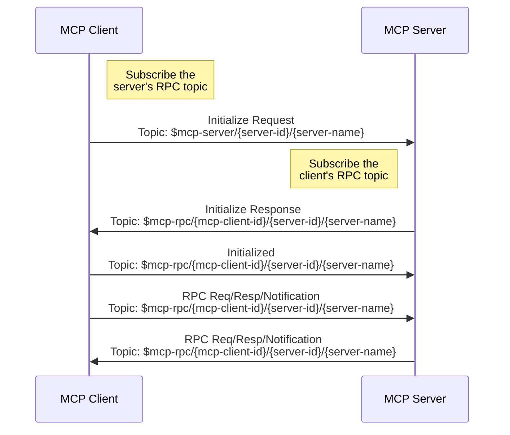
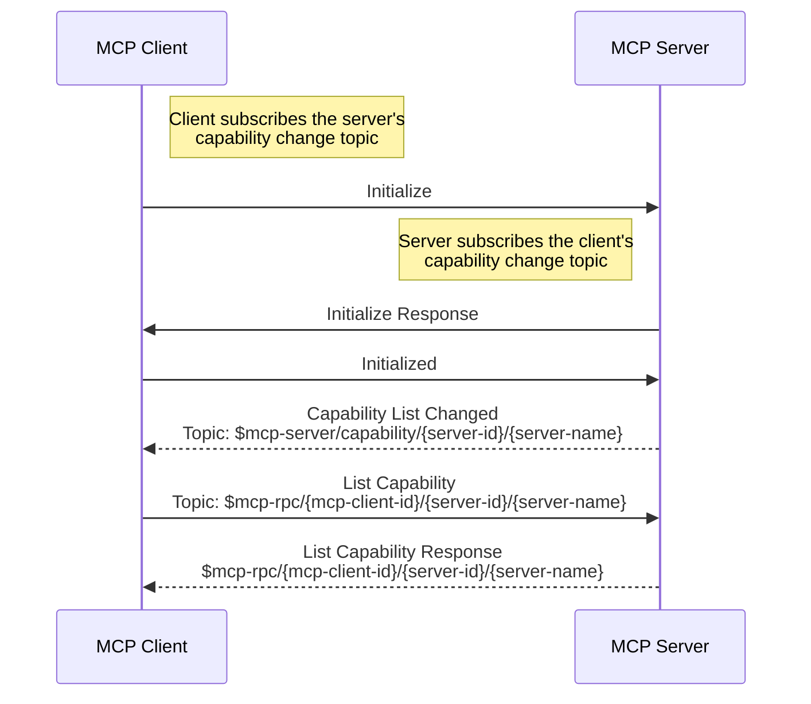
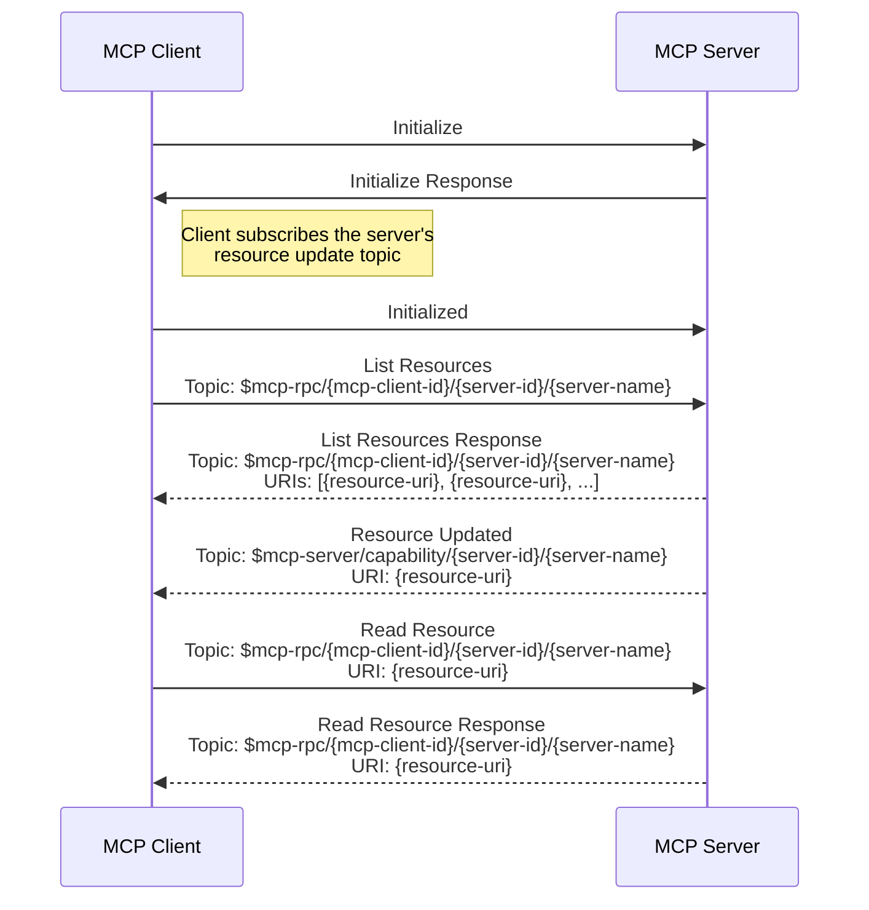

# 仕様

この仕様は、MQTT固有の要件（MQTTトピックやクライアントIDの形式など）を定義しています。また、サービスディスカバリー、初期化、機能リストの変更、リソース更新、シャットダウン手順など、MQTTトランスポートのライフサイクルについても概説しています。

本仕様は、[MCP仕様](https://modelcontextprotocol.io/specification/2025-06-18)と併せて読む必要があります。

## 用語

- **server-name**: server-nameはMCPサーバーの識別子であり、トピックに含まれます。

  同じ`server-name`を持つ複数の接続は、同一のMCPサーバーの複数インスタンスとみなされ、全く同じサービスを提供します。MCPクライアントが初期化メッセージを送信する際には、クライアント側で決定された戦略に従ってその中の一つを選択すべきです。

  異なる`server-name`を持つ複数のMCPサーバーは、類似の機能を提供する場合があります。この場合、クライアントは初期化メッセージを送信する際に、必要に応じていずれかを選択して接続を確立します。選択基準はクライアントの権限、LLMからの推奨、ユーザーの選択などに基づくことができます。

  MQTTブローカーに接続後、ブローカーはMQTT CONNECTメッセージのユーザープロパティに`MCP-SERVER-NAME`を含めてMCPサーバーに`server-name`を提案する場合があります。その場合、MCPサーバーは**必ず**この`server-name`をサーバー名として使用しなければなりません。ブローカーが`server-name`を提案しない場合、MCPサーバーは提供する機能に基づいたデフォルトの`server-name`を**推奨**します。

  `server-name`は`/`で区切られた階層的なトピック形式でなければならず、クライアントはMQTTトピックのワイルドカードを使って特定のタイプのMCPサーバーをサブスクライブできます。例：`server-type/sub-type/name`。

  `server-name`に`+`や`#`の文字を含めてはなりません。

  `server-name`はすべてのMCPサーバー間で一意である必要があります。

- **server-name-filter**: `server-name`にマッチするMQTTトピックフィルターであり、`/`、`+`、`#`の文字を含むことがあります。詳細は**server-name**の説明を参照してください。

  MQTTブローカーに接続後、ブローカーはMQTT CONNACKメッセージのユーザープロパティに`MCP-SERVER-NAME-FILTERS`を含めてMCPクライアントに`server-name-filter`を提案する場合があります。その場合、MCPクライアントは**必ず**この`server-name-filter`を使ってサーバーのプレゼンストピックをサブスクライブしなければなりません。`MCP-SERVER-NAME-FILTERS`の値は文字列のJSON配列であり、各文字列はMQTTトピックフィルターです。ブローカーが`server-name-filter`を提案しない場合、MCPクライアントは提供する機能に基づいたデフォルトの`server-name-filter`を**推奨**します。

- **server-id**: MCPサーバーインスタンスのMQTTクライアントID。`/`、`+`、`#`以外の任意の文字列で、グローバルに一意でなければなりません。トピックにも含まれます。

- **mcp-client-id**: クライアントのMQTTクライアントID。`/`、`+`、`#`以外の任意の文字列で、グローバルに一意でなければなりません。トピックにも含まれます。初期化要求を行うたびに異なるクライアントIDを使用しなければなりません。

## メッセージトピック

MCP over MQTTはMQTTトピックを通じてメッセージを送受信します。本プロトコルには以下のメッセージトピックがあります。

| トピック名                         | トピック名（英語）                                                    | 説明                                                                                     |
|-----------------------------------|---------------------------------------------------------------------|------------------------------------------------------------------------------------------|
| サーバーの制御トピック            | `$mcp-server/{server-id}/{server-name}`                             | 初期化メッセージやその他制御メッセージの送受信用。                                      |
| サーバーの機能変更トピック        | `$mcp-server/capability/{server-id}/{server-name}`                  | サーバーの機能リスト変更やリソース更新通知の送受信用。                                  |
| サーバーのプレゼンストピック      | `$mcp-server/presence/{server-id}/{server-name}`                    | サーバーのオンライン／オフライン状態メッセージの送受信用。                              |
| クライアントのプレゼンストピック  | `$mcp-client/presence/{mcp-client-id}`                              | クライアントのオンライン／オフライン状態メッセージの送受信用。                          |
| クライアントの機能変更トピック    | `$mcp-client/capability/{mcp-client-id}`                            | クライアントの機能リスト変更通知の送受信用。                                            |
| RPCトピック                      | `$mcp-rpc/{mcp-client-id}/{server-id}/{server-name}`                | RPCリクエスト／レスポンスおよび通知メッセージの送受信用。                              |

## MQTTプロトコルバージョン

MCPサーバーとクライアントは**必ず**MQTTプロトコルバージョン5.0を使用しなければなりません。

## ユーザープロパティ

`CONNECT`メッセージには以下のユーザープロパティを**必ず**設定します：
- `MCP-COMPONENT-TYPE`: `mcp-client`または`mcp-server`
- `MCP-META`: MCPコンポーネントのバージョン、実装詳細、場所などのメタデータを含むJSONオブジェクト。ブローカーはこれを使ってMCPサーバーにサーバー名を、MCPクライアントにサーバー名フィルターを提案できます。

ブローカーが送信する`CONNACK`メッセージには以下のユーザープロパティを**任意で**設定できます：
- `MCP-SERVER-NAME`: MCPサーバー向けのブローカー提案サーバー名。MCPサーバーの場合のみ存在。
- `MCP-RBAC`: MCPクライアントがMCPサーバーに対して持つロールを判定するための、サーバー名と対応するロール名のJSON配列。各要素は`server_name`と`role_name`の2フィールドを持つJSONオブジェクト。MCPクライアントの場合のみ存在。
- `MCP-SERVER-NAME-FILTERS`: ブローカー提案のサーバー名フィルター。文字列のJSON配列で、各文字列はMQTTトピックフィルター。MCPクライアントがサーバーのプレゼンスをサブスクライブするために使用。MCPクライアントの場合のみ存在。

`PUBLISH`メッセージには以下のユーザープロパティを**必ず**設定します：
- `MCP-COMPONENT-TYPE`: `mcp-client`または`mcp-server`
- `MCP-MQTT-CLIENT-ID`: 送信者のMQTTクライアントID

## セッション有効期限

セッション有効期限は**必ず**0に設定し、クライアント切断時にセッションがクリーンアップされるようにします。

## MQTTクライアントID

### MCPサーバー

MCPサーバーのクライアントIDは`/`、`+`、`#`を含まない任意の文字列で、`server-id`と呼びます。

### MCPクライアント

MCPクライアントのクライアントIDは`/`、`+`、`#`を含まない任意の文字列で、`mcp-client-id`と呼びます。初期化要求ごとに異なるクライアントIDを使用しなければなりません。

## MQTTトピックとトピックフィルター

### MCPサーバーのサブスクリプション

| トピックフィルター                                              | 説明                                                                                         |
|-----------------------------------------------------------------|----------------------------------------------------------------------------------------------|
| `$mcp-server/{server-id}/{server-name}`                         | MCPサーバーの制御トピック。制御メッセージ受信用。                                           |
| `$mcp-client/capability/{mcp-client-id}`                        | MCPクライアントの機能変更トピック。クライアントの機能リスト変更通知受信用。                 |
| `$mcp-client/presence/{mcp-client-id}`                          | MCPクライアントのプレゼンストピック。クライアントの切断通知受信用。                         |
| `$mcp-rpc/{mcp-client-id}/{server-id}/{server-name}`            | RPCトピック。MCPクライアントからのRPCリクエスト、レスポンス、通知受信用。                   |

::: info
- サーバーはRPCトピック（`$mcp-rpc/{mcp-client-id}/{server-id}/{server-name}`）のサブスクリプションに対して**No Local**オプションを設定し、自身のメッセージを受信しないようにしなければなりません。
:::

### MCPサーバーのパブリッシュ

| トピック名                                                     | メッセージ内容                                                                                   |
|----------------------------------------------------------------|------------------------------------------------------------------------------------------------|
| `$mcp-server/capability/{server-id}/{server-name}`             | 機能リスト変更またはリソース更新通知。                                                           |
| `$mcp-server/presence/{server-id}/{server-name}`               | MCPサーバーのプレゼンスメッセージ。<br>詳細は[サービスディスカバリー](#service-discovery)参照。 |
| `$mcp-rpc/{mcp-client-id}/{server-id}/{server-name}`           | RPCリクエスト、レスポンス、通知。                                                               |

::: info
- サーバーはサーバープレゼンスメッセージをパブリッシュする際、トピック`$mcp-server/presence/{server-id}/{server-name}`に対して**RETAIN**フラグを`True`に設定しなければなりません。
- MQTTブローカーに接続する際、サーバーは予期せぬ切断時にリテインメッセージをクリアするため、`$mcp-server/presence/{server-id}/{server-name}`をウィルトピックとして空ペイロードで設定しなければなりません。
:::

### MCPクライアントのサブスクリプション

| トピックフィルター                                            | 説明                                                                                           |
|---------------------------------------------------------------|------------------------------------------------------------------------------------------------|
| `$mcp-server/capability/{server-id}/{server-name-filter}`     | MCPサーバーの機能変更トピック。機能リスト変更やリソース更新通知受信用。                        |
| `$mcp-server/presence/+/{server-name-filter}`                 | MCPサーバーのプレゼンストピック。サーバーのプレゼンスメッセージ受信用。                      |
| `$mcp-rpc/{mcp-client-id}/{server-id}/{server-name-filter}`   | MCPサーバーから送信されるRPCリクエスト、レスポンス、通知受信用。                             |

::: tip 注意

クライアントはRPCトピック（`$mcp-rpc/{mcp-client-id}/{server-id}/{server-name-filter}`）のサブスクリプションに対して**必ず**No Localオプションを設定し、自身のメッセージを受信しないようにしなければなりません。
:::

### MCPクライアントのパブリッシュ

| トピック名                                                   | メッセージ内容                                                       |
|--------------------------------------------------------------|----------------------------------------------------------------------|
| `$mcp-server/{server-id}/{server-name}`                      | 初期化要求などの制御メッセージ送信用。                              |
| `$mcp-client/capability/{mcp-client-id}`                     | クライアントの機能リスト変更通知送信用。                            |
| `$mcp-client/presence/{mcp-client-id}`                       | MCPクライアントの切断通知送信用。                                  |
| `$mcp-rpc/{mcp-client-id}/{server-id}/{server-name}`         | 特定サーバーへのRPCリクエスト／レスポンス送信用。                  |

::: tip 注意

MQTTブローカーに接続する際、クライアントは予期せぬ切断時にサーバーへ通知するため、`$mcp-client/presence/{mcp-client-id}`をウィルトピックとして「disconnected」通知のペイロードで設定しなければなりません。
:::

## サービスディスカバリー

### サービス登録

MCPサーバーは起動後、MQTTブローカーにサービス登録を行います。サービスディスカバリーおよび登録用のプレゼンストピックは`$mcp-server/presence/{server-id}/{server-name}`です。

MCPサーバーは起動時に、サービスプレゼンストピックに対して「server/online」通知を**必ず**RETAINフラグを`True`に設定してパブリッシュしなければなりません。

「server/online」通知はメッセージサイズが大きくなりすぎないよう、サーバーの限定的な情報のみを提供することが**推奨**されます。クライアントは初期化後に詳細情報を要求できます。

- MCPサーバーの機能の簡単な説明。クライアントが必要に応じてどのMCPサーバーを初期化すべきか判断するためのもの。
- ロールや権限などのメタデータ。クライアントがMCPサーバーのアクセス制御ポリシーを理解するためのもの。メタデータの`rbac`フィールドにはロール情報が含まれ、各ロールは名前、説明、許可されたメソッド、許可されたツール、許可されたリソースを持ち、MQTTブローカーがMCPサーバーのロールベースアクセス制御（RBAC）を実装する際に利用される可能性があります。

```json
{
  "jsonrpc": "2.0",
  "method": "notifications/server/online",
  "params": {
      "server_name": "example/server",
      "description": "This is a brief description about the functionalities provided by this MCP server to allow clients to choose as needed. If tools are provided, it explains what tools are available but does not include tool parameters to reduce message size.",
      "meta": {
        "rbac": {
          "roles": [
            {
              "name": "admin",
              "description": "Administrator role with full access",
              "allowed_methods": [
                "notifications/initialized",
                "ping", "tools/list", "tools/call", "resources/list", "resources/read",
                "resources/subscribe", "resources/unsubscribe"
              ],
              "allowed_tools": "all",
              "allowed_resources": "all"
            },
            {
              "name": "user",
              "description": "User role with limited access",
              "allowed_methods": [
                "notifications/initialized",
                "ping", "tools/list", "tools/call", "resources/list", "resources/read"
              ],
              "allowed_tools": [
                "get_vehicle_status", "get_vehicle_location"
              ],
              "allowed_resources": [
                "file:///vehicle/telemetry.data"
              ]
            }
          ]
        }
      }
  }
}
```

ツールのパラメータ詳細などのより詳細な情報は、クライアントが必要に応じて`**/list`リクエストをサーバーに送信して取得することが**推奨**されます。

クライアントはいつでも`$mcp-server/presence/+/{server-name-filter}`トピックをサブスクライブできます。ここで`{server-name-filter}`はサーバー名のフィルターです。

例えば、サーバー名が`{server-type}/{sub-type}/{name}`で、クライアントが権限により`{server-type}/{sub-type}`タイプのMCPサーバーのみアクセス可能と判断した場合、`$mcp-server/presence/+/{server-type}/{sub-type}/#`をサブスクライブすることで、その`{sub-type}`タイプのすべてのMCPサーバーのサービスプレゼンスを一括で受信できます。

クライアントは`$mcp-server/presence/+/#`をサブスクライブしてすべてのタイプのMCPサーバーを取得可能ですが、管理者がMQTTブローカーのACL（アクセス制御リスト）で`$mcp-rpc/{mcp-client-id}/{server-id}/{server-type}/{sub-type}/#`のようなRPCトピックのみ送受信を許可している場合があるため、過度に広範囲なトピックのサブスクライブは有効ではありません。`{server-name-filter}`を適切に設計することで、クライアントは不要な情報の干渉を減らせます。

### サービス登録解除

MQTTブローカーに接続する際、サーバーは予期せぬ切断時に登録情報をクリアするため、`$mcp-server/presence/{server-id}/{server-name}`をウィルトピックとして空ペイロードで設定しなければなりません。

MQTTブローカーから積極的に切断する前に、サーバーは`$mcp-server/presence/{server-id}/{server-name}`トピックに空ペイロードのメッセージを送信し、登録情報をクリアしなければなりません。

`$mcp-server/presence/{server-id}/{server-name}`トピック上では：

- クライアントが`server/online`通知を受信した場合、その`{server-id}`を当該`{server-name}`のインスタンスの一つとして記録します。
- クライアントが空ペイロードメッセージを受信した場合、キャッシュされた`{server-id}`をクリアします。ただし、当該`{server-name}`のいずれかのインスタンスがオンラインであれば、クライアントはMCPサーバーがオンラインとみなします。

サービス登録および登録解除のメッセージフローは以下の通りです：



## 初期化

本節は初期化フェーズのMQTTトランスポート固有部分のみを記述しています。詳細は[ライフサイクル](https://modelcontextprotocol.io/specification/2025-06-18/basic/lifecycle#initialization)を参照してください。

初期化フェーズはクライアントとサーバー間の最初のやり取りでなければなりません。

クライアントは初期化要求を送信する前に、RPCトピック（`$mcp-rpc/{mcp-client-id}/{server-id}/{server-name}`）を**No Local**サブスクリプションオプション付きでサブスクライブしなければなりません。

サーバーは初期化応答を送信する前に、RPCトピック（`$mcp-rpc/{mcp-client-id}/{server-id}/{server-name}`）を**No Local**サブスクリプションオプション付きでサブスクライブしなければなりません。



クライアントは以下を含む`initialize`リクエストをトピック`$mcp-server/{server-id}/{server-name}`に送信してこのフェーズを開始しなければなりません：

- サポートするプロトコルバージョン
- クライアントの機能
- クライアントの実装情報

```json
{
  "jsonrpc": "2.0",
  "id": 1,
  "method": "initialize",
  "params": {
    "protocolVersion": "2024-11-05",
    "capabilities": {
      "roots": {
        "listChanged": true
      },
      "sampling": {}
    },
    "clientInfo": {
      "name": "ExampleClient",
      "version": "1.0.0"
    }
  }
}
```

サーバーは自身の機能情報をトピック`$mcp-rpc/{mcp-client-id}/{server-id}/{server-name}`に応答として送信しなければなりません：

```json
{
  "jsonrpc": "2.0",
  "id": 1,
  "result": {
    "protocolVersion": "2024-11-05",
    "capabilities": {
      "logging": {},
      "prompts": {
        "listChanged": true
      },
      "resources": {
        "subscribe": true,
        "listChanged": true
      },
      "tools": {
        "listChanged": true
      }
    },
    "serverInfo": {
      "name": "ExampleServer",
      "version": "1.0.0"
    }
  }
}
```

初期化成功後、クライアントは通常の操作を開始可能であることを示すため、トピック`$mcp-rpc/{mcp-client-id}/{server-id}/{server-name}`に`initialized`通知を送信しなければなりません：

```json
{
  "jsonrpc": "2.0",
  "method": "notifications/initialized"
}
```

## 機能リスト変更

初期化要求を開始する前に、MCPクライアントはMCPサーバーの機能リスト変更トピック`$mcp-server/capability/{server-id}/{server-name-filter}`をサブスクライブしなければなりません。ここで`{server-name-filter}`はサーバー名のフィルターです。

MCPサーバーは初期化応答を送信する前に、MCPクライアントの機能リスト変更トピック`$mcp-client/capability/{mcp-client-id}`をサブスクライブしなければなりません。

機能リストに変更があった場合：

- サーバーは通知を`$mcp-server/capability/{server-id}/{server-name}`に送信します。
- クライアントは通知を`$mcp-client/capability/{mcp-client-id}`に送信します。

機能リスト変更通知のペイロードは変更された特定の機能に依存します。例えばツールの場合は`notifications/tools/list_changed`です。機能リスト変更通知を受信した後、クライアントまたはサーバーは更新された機能リストを取得する必要があります。詳細は各機能のドキュメントを参照してください。



## リソース更新

MCPプロトコルでは、クライアントが特定のリソースの変更をサブスクライブ可能です。

サーバーがリソースのサブスクライブ機能を提供する場合、クライアントは`initialized`通知を送信する前にリソース変更をサブスクライブできます。

リソース変更のサブスクライブ用トピックは`$mcp-server/capability/{server-id}/{server-name}`です。

リソースが変更された場合、サーバーは`$mcp-server/capability/{server-id}/{server-name}`に通知を**推奨**して送信します。



## シャットダウン

### サーバー切断

サーバーは予期せぬ切断時にクライアントへ通知するため、ウィルメッセージを設定しなければなりません。ウィルトピックは`$mcp-server/presence/{server-id}/{server-name}`で、ペイロードは空です。

MCPサーバーがMQTTブローカーから積極的に切断する前に、`$mcp-server/presence/{server-id}/{server-name}`トピックに空ペイロードのメッセージを送信し、登録情報をクリアしなければなりません。

MCPサーバーはMCPクライアントとの「デイニシャライズ」を行いたいがMQTTブローカーとの接続は維持したい場合、RPCトピック`$mcp-rpc/{mcp-client-id}/{server-id}/{server-name}`に「disconnected」通知を送信し、以下のトピックのサブスクリプションを解除しなければなりません：

- `$mcp-client/capability/{mcp-client-id}`
- `$mcp-client/presence/{mcp-client-id}`
- `$mcp-rpc/{mcp-client-id}/{server-id}/{server-name}`

MCPサーバーの「disconnected」通知のメッセージ形式は以下の通りです：

```json
{
  "jsonrpc": "2.0",
  "method": "notifications/disconnected"
}
```

MCPクライアントがサーバーのプレゼンストピックで空ペイロードメッセージ、またはRPCトピックで「disconnected」通知を受信した場合、サーバーをオフラインとみなし、当該`{server-name}`のキャッシュされた`{server-id}`をクリアし、以下のトピックのサブスクリプションを解除しなければなりません：

- `$mcp-server/capability/{server-id}/{server-name-filter}`
- `$mcp-rpc/{mcp-client-id}/{server-id}/{server-name-filter}`

### クライアント切断

サーバーは初期化応答を送信する前に、クライアントのプレゼンストピック`$mcp-client/presence/{mcp-client-id}`をサブスクライブしなければなりません。

クライアントは予期せぬ切断時にサーバーへ通知するため、ウィルメッセージを設定しなければなりません。ウィルトピックは`$mcp-client/presence/{mcp-client-id}`で、ペイロードは「disconnected」通知です。

クライアントがMQTTブローカーから積極的に切断する前に、`$mcp-client/presence/{mcp-client-id}`トピックに「disconnected」通知を送信しなければなりません。

クライアントがMCPサーバーとの「デイニシャライズ」を行いたいがMQTTブローカーとの接続は維持したい場合、RPCトピック`$mcp-rpc/{mcp-client-id}/{server-id}/{server-name}`に「disconnected」通知を送信し、以下のトピックのサブスクリプションを解除しなければなりません：

- `$mcp-server/capability/{server-id}/{server-name-filter}`
- `$mcp-rpc/{mcp-client-id}/{server-id}/{server-name-filter}`

MCPサーバーはクライアントから「disconnected」通知を受信した後、以下のトピックのサブスクリプションを解除しなければなりません：

- `$mcp-client/capability/{mcp-client-id}`
- `$mcp-client/presence/{mcp-client-id}`
- `$mcp-rpc/{mcp-client-id}/{server-id}/{server-name}`

MCPクライアントの「disconnected」通知のメッセージ形式は以下の通りです：

```json
{
  "jsonrpc": "2.0",
  "method": "notifications/disconnected"
}
```

## ヘルスチェック

クライアントまたはサーバーは任意のタイミングでサーバーに`ping`リクエストを送信して相手の状態をチェックすることが**任意で**可能です。

- クライアントが合理的な時間内にサーバーから`ping`レスポンスを受信しない場合、クライアントはトピック`$mcp-client/presence/{mcp-client-id}`に「disconnected」通知を送信し、自身を切断しなければなりません。
- サーバーが合理的な時間内にクライアントから`ping`レスポンスを受信しない場合、サーバーはクライアントに対して他のRPCリクエストを送信しなければなりません。

詳細は[Ping](https://modelcontextprotocol.io/specification/2025-06-18/basic/utilities/ping)を参照してください。

## タイムアウト

すべてのRPCリクエストはMQTTメッセージで非同期に送信されるため、タイムアウトの考慮が必要です。タイムアウト時間はRPCリクエストの種類により異なりますが、設定可能であるべきです。

本プロトコルで推奨される各RPCリクエストのデフォルトタイムアウト値は以下の通りです：

- "initialize": 30秒
- "ping": 10秒
- "roots/list": 30秒
- "resources/list": 30秒
- "tools/list": 30秒
- "prompts/list": 30秒
- "prompts/get": 30秒
- "sampling/createMessage": 60秒
- "resources/read": 30秒
- "resources/templates/list": 30秒
- "resources/subscribe": 30秒
- "tools/call": 60秒
- "completion/complete": 60秒
- "logging/setLevel": 30秒

<!-- {< callout type="info" >}
進捗リクエストは通知として送信され、応答を必要としないため、タイムアウトは不要です。
{< /callout >} -->

## エラーハンドリング

実装は以下のエラーケースに対応できるように**推奨**されます：

- プロトコルバージョンの不一致
- 必須機能のネゴシエーション失敗
- 初期化要求のタイムアウト
- シャットダウンのタイムアウト

すべてのリクエストに適切なタイムアウトを実装し、接続のハングやリソース枯渇を防止することが**推奨**されます。

初期化エラーの例：

```json
{
  "jsonrpc": "2.0",
  "id": 1,
  "error": {
    "code": -32602,
    "message": "Unsupported protocol version",
    "data": {
      "supported": ["2025-03-26"],
      "requested": "1.0.0"
    }
  }
}
```
