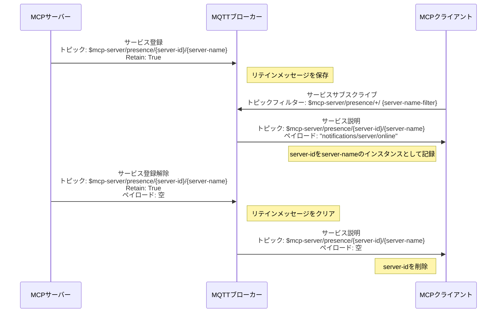
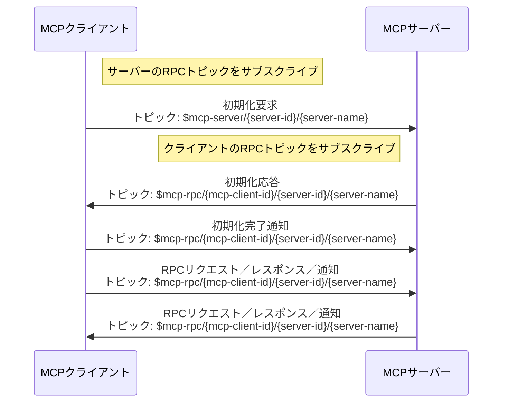
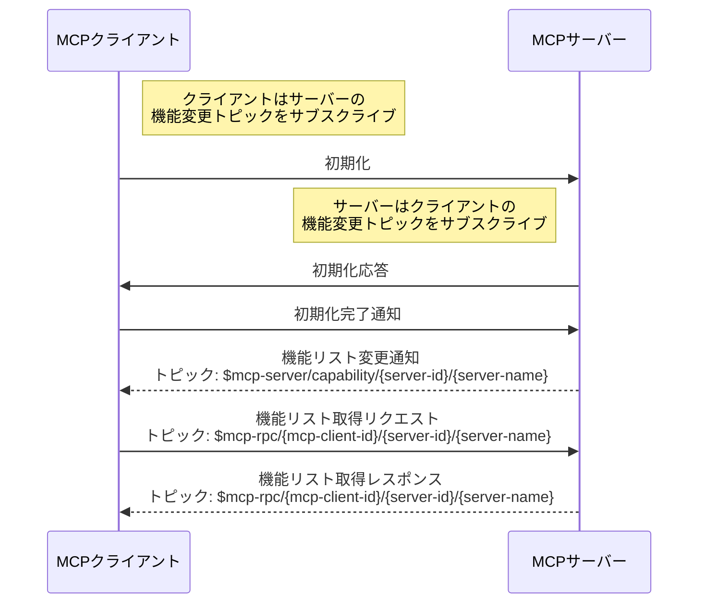
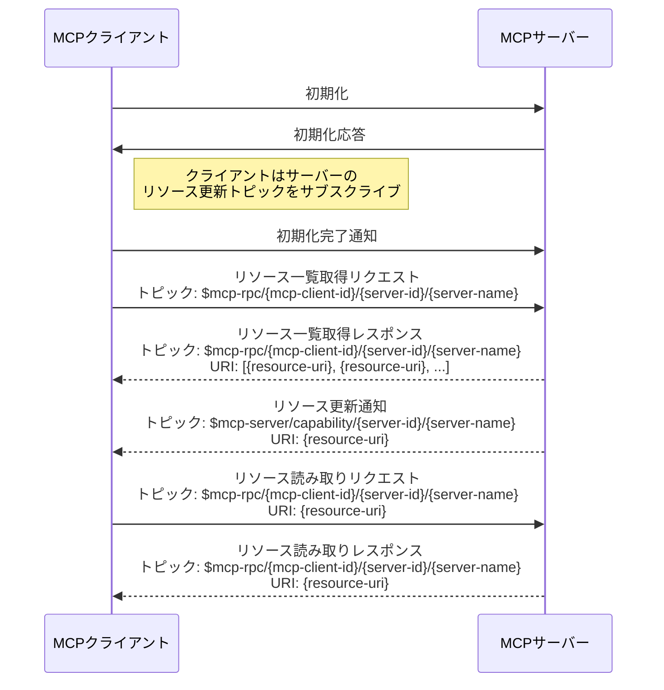

# 仕様

本仕様は、MQTT固有の要件（MQTTトピックやクライアントIDの形式など）を定義しています。また、サービスディスカバリー、初期化、機能リストの変更、リソース更新、シャットダウン手順を含むMQTTトランスポートのライフサイクルについても概説しています。

本仕様は、[MCP仕様](https://modelcontextprotocol.io/specification/2025-06-18)と併せて読む必要があります。

## 用語

- **server-name**: MCPサーバーの識別子であり、トピックに含まれます。

  同じ`server-name`を持つ複数の接続は、同一のMCPサーバーの複数インスタンスとみなされ、まったく同じサービスを提供します。MCPクライアントが初期化メッセージを送信する際は、クライアント側で決定した戦略に従ってその中の一つを選択すべきです。

  異なる`server-name`を持つ複数のMCPサーバーは、類似の機能を提供する場合があります。この場合、クライアントは初期化メッセージを送信する際に、必要に応じてその中の一つを選択して接続を確立すべきです。選択基準は、クライアントの権限、LLMからの推奨、ユーザーの選択などに基づくことができます。

  MQTTブローカーに接続後、ブローカーはMQTT CONNECTメッセージのユーザープロパティに`MCP-SERVER-NAME`を含めてMCPサーバーに`server-name`を提案することがあります。その場合、MCPサーバーは**必ず**この`server-name`をサーバー名として使用しなければなりません。ブローカーが`server-name`を提案しない場合、MCPサーバーは提供する機能に基づいたデフォルトの`server-name`を**推奨**して使用すべきです。

  `server-name`は階層的なトピックスタイルで`/`で区切られ、クライアントはMQTTトピックのワイルドカードを使って特定タイプのMCPサーバーをサブスクライブできます。例：`server-type/sub-type/name`。

  `server-name`には`+`や`#`の文字を含めてはいけません。

  `server-name`はすべてのMCPサーバー間で一意であるべきです。

- **server-name-filter**: `server-name`にマッチするMQTTトピックフィルターで、`/`、`+`、`#`を含むことがあります。詳細は**server-name**の説明を参照してください。

  MQTTブローカーに接続後、ブローカーはMQTT CONNACKメッセージのユーザープロパティに`MCP-SERVER-NAME-FILTERS`を含めてMCPクライアントに`server-name-filter`を提案することがあります。その場合、MCPクライアントは**必ず**この`server-name-filter`を使ってサーバーのプレゼンス（存在）トピックをサブスクライブしなければなりません。`MCP-SERVER-NAME-FILTERS`の値は文字列のJSON配列で、各文字列はMQTTトピックフィルターです。ブローカーが`server-name-filter`を提案しない場合、MCPクライアントは提供する機能に基づいたデフォルトの`server-name-filter`を**推奨**して使用すべきです。

- **server-id**: MCPサーバーインスタンスのMQTTクライアントID。`/`、`+`、`#`を除く任意の文字列で、グローバルに一意でなければならず、トピックにも含まれます。

- **mcp-client-id**: クライアントのMQTTクライアントID。`/`、`+`、`#`を除く任意の文字列で、グローバルに一意でなければならず、トピックに含まれます。初期化要求を送るたびに異なるクライアントIDを使用しなければなりません。

## メッセージトピック

MCP over MQTTはMQTTトピックを通じてメッセージを送受信します。本プロトコルには以下のメッセージトピックがあります：

| トピック名                      | トピック例                                                         | 説明                                                                                  |
|---------------------------------|-------------------------------------------------------------------|---------------------------------------------------------------------------------------|
| サーバーの制御トピック          | `$mcp-server/{server-id}/{server-name}`                           | 初期化メッセージやその他の制御メッセージの送受信用。                                  |
| サーバーの機能変更トピック      | `$mcp-server/capability/{server-id}/{server-name}`                | サーバーの機能リスト変更やリソース更新通知の送受信用。                                |
| サーバーのプレゼンストピック    | `$mcp-server/presence/{server-id}/{server-name}`                  | サーバーのオンライン／オフライン状態メッセージの送受信用。                            |
| クライアントのプレゼンストピック| `$mcp-client/presence/{mcp-client-id}`                            | クライアントのオンライン／オフライン状態メッセージの送受信用。                        |
| クライアントの機能変更トピック  | `$mcp-client/capability/{mcp-client-id}`                          | クライアントの機能リスト変更通知の送受信用。                                          |
| RPCトピック                     | `$mcp-rpc/{mcp-client-id}/{server-id}/{server-name}`              | RPCリクエスト／レスポンスおよび通知メッセージの送受信用。                            |

## MQTTプロトコルバージョン

MCPサーバーとクライアントは**必ず**MQTTプロトコルバージョン5.0を使用しなければなりません。

## ユーザープロパティ

`CONNECT`メッセージでは、以下のユーザープロパティを**必ず**設定します：
- `MCP-COMPONENT-TYPE`: `mcp-client` または `mcp-server`
- `MCP-META`: MCPコンポーネントのメタデータを含むJSONオブジェクト。バージョン、実装詳細、場所などを含み、ブローカーがMCPサーバーにサーバー名を提案したり、MCPクライアントにサーバー名フィルターを提案する際に使用されます。

ブローカーが送る`CONNACK`メッセージでは、以下のユーザープロパティを**任意で**設定できます：
- `MCP-SERVER-NAME`: MCPサーバー向けにブローカーが提案するサーバー名。MCPサーバーの場合のみ存在。
- `MCP-RBAC`: MCPクライアントがMCPサーバーに対して持つ役割を判断するための、サーバー名と対応する役割名のJSON配列。各要素は`server_name`と`role_name`の2つのフィールドを持つJSONオブジェクト。MCPクライアントの場合のみ存在。
- `MCP-SERVER-NAME-FILTERS`: MCPクライアント向けにブローカーが提案するサーバー名フィルター。文字列のJSON配列で、各文字列はMQTTトピックフィルター。クライアントはこれを使ってサーバーのプレゼンストピックをサブスクライブ可能。MCPクライアントの場合のみ存在。

`PUBLISH`メッセージでは、以下のユーザープロパティを**必ず**設定します：
- `MCP-COMPONENT-TYPE`: `mcp-client` または `mcp-server`
- `MCP-MQTT-CLIENT-ID`: 送信者のMQTTクライアントID

## セッション有効期限

セッション有効期限は**必ず**0に設定し、クライアント切断時にセッションがクリーンアップされるようにします。

## MQTTクライアントID

### MCPサーバー

MCPサーバーのクライアントIDは`/`、`+`、`#`を除く任意の文字列で、`server-id`と呼ばれます。

### MCPクライアント

MCPクライアントのクライアントIDは`/`、`+`、`#`を除く任意の文字列で、`mcp-client-id`と呼ばれます。初期化要求を送るたびに異なるクライアントIDを使用しなければなりません。

## MQTTトピックとトピックフィルター

### MCPサーバーのサブスクライブ

| トピックフィルター                                      | 説明                                                                                             |
|---------------------------------------------------------|-------------------------------------------------------------------------------------------------|
| `$mcp-server/{server-id}/{server-name}`                 | MCPサーバーの制御トピック。制御メッセージ受信用。                                              |
| `$mcp-client/capability/{mcp-client-id}`                | MCPクライアントの機能変更トピック。クライアントの機能リスト変更通知受信用。                     |
| `$mcp-client/presence/{mcp-client-id}`                  | MCPクライアントのプレゼンストピック。クライアントの切断通知受信用。                            |
| `$mcp-rpc/{mcp-client-id}/{server-id}/{server-name}`    | RPCトピック。MCPクライアントからのRPCリクエスト、レスポンス、通知受信用。                      |

::: info
- サーバーはRPCトピック（`$mcp-rpc/{mcp-client-id}/{server-id}/{server-name}`）のサブスクライブ時に**No Local**オプションを設定し、自身のメッセージを受信しないようにしなければなりません。
:::

### MCPサーバーのパブリッシュ

| トピック名                                             | メッセージ内容                                                                                     |
|---------------------------------------------------------|--------------------------------------------------------------------------------------------------|
| `$mcp-server/capability/{server-id}/{server-name}`      | 機能リスト変更またはリソース更新通知。                                                            |
| `$mcp-server/presence/{server-id}/{server-name}`        | MCPサーバーのプレゼンス（存在）メッセージ。<br>[サービスディスカバリー](#service-discovery)参照。 |
| `$mcp-rpc/{mcp-client-id}/{server-id}/{server-name}`    | RPCリクエスト、レスポンス、通知。                                                                |

::: info
- サーバーはサーバープレゼンスメッセージをパブリッシュする際、トピック`$mcp-server/presence/{server-id}/{server-name}`に対して**RETAIN**フラグを`True`に設定しなければなりません。
- MQTTブローカーに接続する際、サーバーは予期しない切断時にリテインメッセージをクリアするため、`$mcp-server/presence/{server-id}/{server-name}`をウィルトピックとして空ペイロードで設定しなければなりません。
:::

### MCPクライアントのサブスクライブ

| トピックフィルター                                     | 説明                                                                                               |
|--------------------------------------------------------|---------------------------------------------------------------------------------------------------|
| `$mcp-server/capability/{server-id}/{server-name-filter}` | MCPサーバーの機能変更トピック。機能リスト変更やリソース更新通知受信用。                            |
| `$mcp-server/presence/+/{server-name-filter}`          | MCPサーバーのプレゼンストピック。サーバーのプレゼンスメッセージ受信用。                            |
| `$mcp-rpc/{mcp-client-id}/{server-id}/{server-name-filter}` | MCPサーバーから送られるRPCリクエスト、レスポンス、通知受信用。                                   |

::: tip Note
- クライアントはRPCトピック（`$mcp-rpc/{mcp-client-id}/{server-id}/{server-name-filter}`）のサブスクライブ時に**No Local**オプションを設定し、自身のメッセージを受信しないようにしなければなりません。
:::

### MCPクライアントのパブリッシュ

| トピック名                                            | メッセージ内容                                                        |
|--------------------------------------------------------|----------------------------------------------------------------------|
| `$mcp-server/{server-id}/{server-name}`                | 初期化要求などの制御メッセージ送信用。                               |
| `$mcp-client/capability/{mcp-client-id}`               | クライアントの機能リスト変更通知送信用。                             |
| `$mcp-client/presence/{mcp-client-id}`                 | MCPクライアントの切断通知送信用。                                   |
| `$mcp-rpc/{mcp-client-id}/{server-id}/{server-name}`   | 特定サーバーへのRPCリクエスト／レスポンス送信用。                   |

::: tip Note
- MQTTブローカーに接続する際、クライアントは予期しない切断時にサーバーに通知するため、`$mcp-client/presence/{mcp-client-id}`をウィルトピックとして「disconnected」通知をペイロードに設定しておかなければなりません。
:::

## サービスディスカバリー

### サービス登録

MCPサーバー起動後、MQTTブローカーにサービスを登録します。サービスディスカバリーおよび登録用のプレゼンストピックは`$mcp-server/presence/{server-id}/{server-name}`です。

MCPサーバーは起動時に、サービスプレゼンス（存在）トピックに「server/online」通知を**必ず**パブリッシュし、**RETAIN**フラグを`True`に設定しなければなりません。

「server/online」通知はメッセージサイズが大きくなりすぎないよう、サーバーの限定的な情報のみを提供することが**推奨**されます。クライアントは初期化後に詳細情報を要求できます。

- MCPサーバーの機能の簡単な説明。クライアントが必要なMCPサーバーを判断するのに役立ちます。
- 役割や権限などのメタデータ。クライアントがMCPサーバーのアクセス制御ポリシーを理解するのに役立ちます。メタデータの`rbac`フィールドには役割が含まれ、それぞれ名前、説明、許可されたメソッド、許可されたツール、許可されたリソースを持ちます。これはMQTTブローカーがMCPサーバーのRBACを実装する際に利用される可能性があります。

```json
{
  "jsonrpc": "2.0",
  "method": "notifications/server/online",
  "params": {
      "server_name": "example/server",
      "description": "このMCPサーバーが提供する機能の簡単な説明です。クライアントが必要に応じて選択できるようにします。ツールが提供されている場合は利用可能なツールを説明しますが、メッセージサイズ削減のためツールのパラメータは含みません。",
      "meta": {
        "rbac": {
          "roles": [
            {
              "name": "admin",
              "description": "フルアクセス権を持つ管理者ロール",
              "allowed_methods": [
                "notifications/initialized",
                "ping", "tools/list", "tools/call", "resources/list", "resources/read",
                "resources/subscribe", "resources/unsubscribe"
              ],
              "allowed_tools": "all",
              "allowed_resources": "all"
            },
            {
              "name": "user",
              "description": "限定的なアクセス権を持つユーザーロール",
              "allowed_methods": [
                "notifications/initialized",
                "ping", "tools/list", "tools/call", "resources/list", "resources/read"
              ],
              "allowed_tools": [
                "get_vehicle_status", "get_vehicle_location"
              ],
              "allowed_resources": [
                "file:///vehicle/telemetry.data"
              ]
            }
          ]
        }
      }
  }
}
```

ツールのパラメータ詳細などのより詳細な情報は、クライアントが必要に応じて`**/list`リクエストをサーバーに送信して取得することが**推奨**されます。

クライアントはいつでも`$mcp-server/presence/+/{server-name-filter}`トピックをサブスクライブできます。ここで`{server-name-filter}`はサーバー名のフィルターです。

例えば、サーバー名が`{server-type}/{sub-type}/{name}`で、クライアントが権限により`{server-type}/{sub-type}`タイプのMCPサーバーのみアクセス可能と判断した場合、`$mcp-server/presence/+/{server-type}/{sub-type}/#`をサブスクライブし、`{sub-type}`タイプのすべてのMCPサーバーのサービスプレゼンスを一括で受信できます。

クライアントは`$mcp-server/presence/+/#`をサブスクライブしてすべてのタイプのMCPサーバーを取得可能ですが、管理者がMQTTブローカーのACL（アクセス制御リスト）で、`$mcp-rpc/{mcp-client-id}/{server-id}/{server-type}/{sub-type}/#`のようなRPCトピックのみ送受信を許可している場合があります。したがって、過度に広範なトピックのサブスクライブは有用ではありません。`{server-name-filter}`を適切に設計することで、クライアントは不要な情報の干渉を減らせます。

### サービス登録解除

MQTTブローカーに接続する際、サーバーは予期しない切断時に登録情報をクリアするため、`$mcp-server/presence/{server-id}/{server-name}`をウィルトピックとして空ペイロードで設定しなければなりません。

MQTTブローカーから積極的に切断する前に、サーバーは`$mcp-server/presence/{server-id}/{server-name}`トピックに空ペイロードのメッセージを送信し、登録情報をクリアしなければなりません。

`$mcp-server/presence/{server-id}/{server-name}`トピックでは：

- クライアントが`server/online`通知を受信した場合、その`{server-id}`を当該`{server-name}`のインスタンスの一つとして記録します。
- クライアントが空ペイロードメッセージを受信した場合、キャッシュされた`{server-id}`をクリアします。いずれかのインスタンスがオンラインである限り、クライアントはMCPサーバーをオンラインとみなします。

サービス登録および登録解除のメッセージフローは以下の通りです：



## 初期化

このセクションは初期化フェーズのMQTTトランスポート固有の部分のみを記述しています。詳細は[ライフサイクル](https://modelcontextprotocol.io/specification/2025-06-18/basic/lifecycle#initialization)を参照してください。

初期化フェーズはクライアントとサーバー間の最初のやり取りであることが**必須**です。

クライアントは初期化要求を送信する前に、RPCトピック（`$mcp-rpc/{mcp-client-id}/{server-id}/{server-name}`）を**No Local**サブスクリプションオプション付きでサブスクライブしなければなりません。

サーバーは初期化応答を送信する前に、RPCトピック（`$mcp-rpc/{mcp-client-id}/{server-id}/{server-name}`）を**No Local**サブスクリプションオプション付きでサブスクライブしなければなりません。



クライアントは`initialize`リクエストをトピック`$mcp-server/{server-id}/{server-name}`に送信してこのフェーズを開始しなければなりません。リクエストには以下を含みます：

- 対応するプロトコルバージョン
- クライアントの機能
- クライアントの実装情報

```json
{
  "jsonrpc": "2.0",
  "id": 1,
  "method": "initialize",
  "params": {
    "protocolVersion": "2024-11-05",
    "capabilities": {
      "roots": {
        "listChanged": true
      },
      "sampling": {}
    },
    "clientInfo": {
      "name": "ExampleClient",
      "version": "1.0.0"
    }
  }
}
```

サーバーは自身の機能と情報をトピック`$mcp-rpc/{mcp-client-id}/{server-id}/{server-name}`に応答として返さなければなりません。

```json
{
  "jsonrpc": "2.0",
  "id": 1,
  "result": {
    "protocolVersion": "2024-11-05",
    "capabilities": {
      "logging": {},
      "prompts": {
        "listChanged": true
      },
      "resources": {
        "subscribe": true,
        "listChanged": true
      },
      "tools": {
        "listChanged": true
      }
    },
    "serverInfo": {
      "name": "ExampleServer",
      "version": "1.0.0"
    }
  }
}
```

初期化成功後、クライアントは通常の操作を開始する準備ができたことを示すため、トピック`$mcp-rpc/{mcp-client-id}/{server-id}/{server-name}`に初期化完了通知を送信しなければなりません。

```json
{
  "jsonrpc": "2.0",
  "method": "notifications/initialized"
}
```

## 機能リスト変更

初期化要求を送信する前に、MCPクライアントはMCPサーバーの機能リスト変更トピック`$mcp-server/capability/{server-id}/{server-name-filter}`をサブスクライブしなければなりません。`{server-name-filter}`はサーバー名のフィルターです。

MCPサーバーは初期化応答を送る前に、MCPクライアントの機能リスト変更トピック`$mcp-client/capability/{mcp-client-id}`をサブスクライブしなければなりません。

機能リストの更新があった場合：

- サーバーは通知を`$mcp-server/capability/{server-id}/{server-name}`に送信します。
- クライアントは通知を`$mcp-client/capability/{mcp-client-id}`に送信します。

機能リスト変更通知のペイロードは、変更された特定の機能に依存します。例えばツールの場合は`notifications/tools/list_changed`などです。機能リスト変更通知を受信した後、クライアントまたはサーバーは更新された機能リストを取得する必要があります。詳細は各機能のドキュメントを参照してください。



## リソース更新

MCPプロトコルでは、クライアントが特定のリソースの変更をサブスクライブできます。

サーバーがリソースのサブスクライブ機能を提供する場合、クライアントは初期化完了通知を送信する前にリソース変更をサブスクライブできます。

クライアントがリソース変更をサブスクライブするトピックは`$mcp-server/capability/{server-id}/{server-name}`です。

リソースが変更された場合、サーバーは`$mcp-server/capability/{server-id}/{server-name}`に通知を**推奨**して送信します。



## シャットダウン

### サーバー切断

サーバーは予期しない切断時にクライアントに通知するため、ウィルメッセージを設定して接続しなければなりません。ウィルトピックは`$mcp-server/presence/{server-id}/{server-name}`で、ペイロードは空です。

MCPサーバーがMQTTブローカーから切断する前に、`$mcp-server/presence/{server-id}/{server-name}`トピックに空ペイロードのメッセージを送信し、登録情報をクリアしなければなりません。

MCPサーバーはMCPクライアントとの「デイニシャライズ」を行いたいがMQTTブローカーとの接続は維持したい場合、RPCトピック`$mcp-rpc/{mcp-client-id}/{server-id}/{server-name}`に「disconnected」通知を送信し、その後以下のトピックのサブスクライブを解除しなければなりません：
- `$mcp-client/capability/{mcp-client-id}`
- `$mcp-client/presence/{mcp-client-id}`
- `$mcp-rpc/{mcp-client-id}/{server-id}/{server-name}`

MCPサーバーの「disconnected」通知のメッセージ形式は以下の通りです：

```json
{
  "jsonrpc": "2.0",
  "method": "notifications/disconnected"
}
```

MCPクライアントがサーバーのプレゼンストピックで空ペイロードメッセージを受信した場合、またはRPCトピックで「disconnected」通知を受信した場合、サーバーをオフラインとみなし、当該`{server-name}`のキャッシュされた`{server-id}`をクリアし、以下のトピックのサブスクライブを解除しなければなりません：
- `$mcp-server/capability/{server-id}/{server-name-filter}`
- `$mcp-rpc/{mcp-client-id}/{server-id}/{server-name-filter}`

### クライアント切断

サーバーは初期化応答を送信する前に、クライアントのプレゼンストピック（`$mcp-client/presence/{mcp-client-id}`）をサブスクライブしなければなりません。

クライアントは予期しない切断時にサーバーに通知するため、ウィルメッセージを設定して接続しなければなりません。ウィルトピックは`$mcp-client/presence/{mcp-client-id}`で、ペイロードは「disconnected」通知です。

クライアントがMQTTブローカーから切断する前に、`$mcp-client/presence/{mcp-client-id}`トピックに「disconnected」通知を送信しなければなりません。

クライアントがMCPサーバーとの「デイニシャライズ」を行いたいがMQTTブローカーとの接続は維持したい場合、RPCトピック`$mcp-rpc/{mcp-client-id}/{server-id}/{server-name}`に「disconnected」通知を送信し、その後以下のトピックのサブスクライブを解除しなければなりません：
- `$mcp-server/capability/{server-id}/{server-name-filter}`
- `$mcp-rpc/{mcp-client-id}/{server-id}/{server-name-filter}`

MCPサーバーはクライアントから「disconnected」通知を受信後、以下のトピックのサブスクライブを解除しなければなりません：
- `$mcp-client/capability/{mcp-client-id}`
- `$mcp-client/presence/{mcp-client-id}`
- `$mcp-rpc/{mcp-client-id}/{server-id}/{server-name}`

MCPクライアントの「disconnected」通知のメッセージ形式は以下の通りです：

```json
{
  "jsonrpc": "2.0",
  "method": "notifications/disconnected"
}
```

## ヘルスチェック

クライアントまたはサーバーは、相手の状態を確認するために任意のタイミングでサーバーに`ping`リクエストを送信してもよいです。

- クライアントが合理的な時間内にサーバーから`ping`レスポンスを受信しなかった場合、クライアントはトピック`$mcp-client/presence/{mcp-client-id}`に「disconnected」通知を送信し、自身を切断しなければなりません。
- サーバーが合理的な時間内にクライアントからの`ping`レスポンスを受信しなかった場合、サーバーはクライアントに対して他のRPCリクエストを送信しなければなりません。

詳細は[Ping](https://modelcontextprotocol.io/specification/2025-06-18/basic/utilities/ping)を参照してください。

## タイムアウト

すべてのRPCリクエストはMQTTメッセージで非同期に送信されるため、タイムアウトの考慮が必要です。タイムアウト時間はRPCリクエストの種類によって異なりますが、設定可能であるべきです。

本プロトコルにおける各RPCリクエストの推奨デフォルトタイムアウト値は以下の通りです：

- "initialize": 30秒
- "ping": 10秒
- "roots/list": 30秒
- "resources/list": 30秒
- "tools/list": 30秒
- "prompts/list": 30秒
- "prompts/get": 30秒
- "sampling/createMessage": 60秒
- "resources/read": 30秒
- "resources/templates/list": 30秒
- "resources/subscribe": 30秒
- "tools/call": 60秒
- "completion/complete": 60秒
- "logging/setLevel": 30秒

<!-- {< callout type="info" >}
進捗リクエストは通知として送信され、レスポンスを必要としないためタイムアウトは不要です。
{< /callout >} -->

## エラーハンドリング

実装は以下のエラーケースに対応できるように**推奨**されます：

- プロトコルバージョン不一致
- 必須機能の交渉失敗
- 初期化要求のタイムアウト
- シャットダウンのタイムアウト

すべてのリクエストに適切なタイムアウトを実装し、接続のハングやリソース枯渇を防止することが**推奨**されます。

初期化エラーの例：

```json
{
  "jsonrpc": "2.0",
  "id": 1,
  "error": {
    "code": -32602,
    "message": "Unsupported protocol version",
    "data": {
      "supported": ["2025-03-26"],
      "requested": "1.0.0"
    }
  }
}
```
