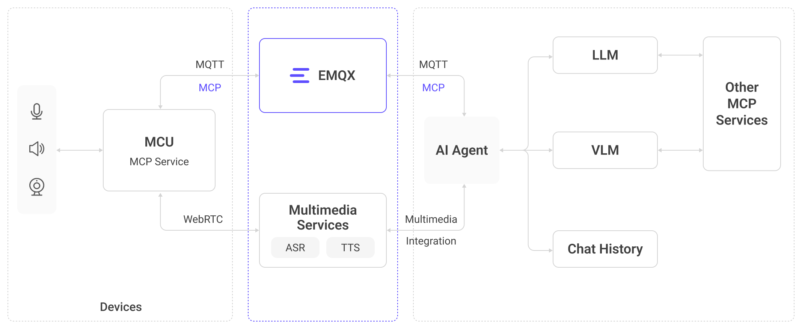

# EMQX AI

大規模言語モデル（LLM）の急速な進展により、AIは産業を前例のない速度で変革しており、IoTも根本的な変化を遂げています。従来のスマートハードウェアは固定機能を中心に構築され、主に受動的な実行者として動作していましたが、現在では、デバイスが知覚、理解、対話、行動の統合能力を備えたインテリジェントエージェントへと進化し、自律性とコンテキスト認識に基づく意思決定を可能にしています。この進化は多くの応用領域において破壊的なアップグレードを促進しています。

感情的なコンパニオンシップにおいては、単純な電子玩具が感情認識、コンテキスト理解、共感的対話を可能にするインテリジェントパートナーへと変わりつつあります。スマートホームでは、孤立したデバイスが自然言語で制御される協調的な全館エコシステムに置き換わっています。ロボティクス分野では、サービスロボットや産業用ロボットからヒューマノイドロボットまでの具現化されたインテリジェントシステムが、リアルタイムの知覚、意図理解、即時応答を必要としています。自動車分野では、インテリジェント車両が移動するインテリジェント空間として登場し、車載AIアシスタントが複雑な交通状況を管理し、継続的かつ自然な音声対話によって運転体験を向上させています。

## AIハードウェアの中核：リアルタイムで正確かつコンテキスト豊かな知覚とマルチモーダルインタラクション

大規模モデルは強力な推論と生成能力を持ちますが、その性能は根本的に受け取るコンテキストの質に依存します。システムが現在の状況、環境の変化、ユーザーの真の意図を正確に理解できなければ、モデルは幻覚を起こしたり、無関係な応答を生成したりします。人間も同様で、情報が限られれば誤った判断をし、完全なコンテキストがあれば正確な意思決定が可能です。インテリジェントハードウェアにおいては、AIが*現実世界を理解する*ことが、対話の安定性と信頼性を向上させるために不可欠です。信頼できるAIエージェントは、以下の3つの中核能力を備えている必要があります。

### マルチソースデータ：AIに現実世界の理解を可能にする

多様なソースからのデータがAIの*ワールドモデル*を形成します：

- **環境データ**：温度、湿度、明るさ、重力などの物理信号がリアルタイムの状態認識を提供します。
- **クラウドベースの知識**：地図、天気、交通状況、充電ステーションの空き情報などのサービスがデバイスのグローバルな認識を拡張します。
- **サードパーティのコンテキスト**：コンテンツサービスやナレッジベースにより、より複雑な質問やユーザーのニーズに対応可能です。

データソースが豊富であればあるほど、システムは*現在何が起きているか*、*ユーザーが本当に必要としていること*をより正確に把握できます。

### リアルタイムイベント認識：ミリ秒単位での変化理解

イベントはコンテキスト理解のアンカーであり、LLMやVLMを駆動する重要なトリガーです：

- **環境変化**：例えば、部屋の明るさが急に変わる場合。
- **状態変化**：例えば、玩具が予期せず倒れた場合。
- **特殊シナリオ**：例えば、車がロックされた後の後部座席圧力センサーの異常検知など。

ミリ秒レベルのレイテンシでイベントを捉える能力は、システムがどれだけ迅速かつ正確にインテリジェントに応答できるかを直接決定します。

### マルチメディアインタラクション：自然な人機コミュニケーションを実現

マルチメディアインタラクションは、従来の「音声アシスタント」から真に没入感のあるインテリジェント体験への飛躍を意味します：

- **音声**：感情表現、自然なプロソディ、多言語対応。
- **映像**：表情認識、シーン理解、リアルタイムの視覚フィードバック。
- **制御機能**：音声と視覚理解を組み合わせ、よりインテリジェントでコンテキスト認識されたシナリオを実現。

## インテリジェントハードウェア構築に必要な6つの要素

入力と出力の両面から、適格なインテリジェントハードウェアを構築するために必要な6つの要素を定義します。

### 入力能力

- **知覚**：エージェントは様々なセンサーを通じて物理世界を知覚します。温度センサーによる環境条件の把握、位置情報システムによる位置認識、加速度計による動きや姿勢の検出などです。
- **聴覚**：マイクロフォンが周囲の音やユーザーの発話を捉えます。ノイズ抑制やエコーキャンセレーション、多言語音声認識と組み合わせることで、デバイスは自然な人間の言語を「聴く」ことが可能になります。
- **視覚**：カメラが視覚情報を収集し、画像認識、物体検出、顔認識、ジェスチャー認識を実現します。これによりデバイスは周囲やユーザーの行動を「見て」理解できます。

### 出力能力

- **理解**：LLMとVLMモデルを統合することで、デバイスは意味理解、感情認識、コンテキスト記憶を実現し、正確な意図把握と一貫した多ターン対話を可能にします。
- **音声**：高品質スピーカーが複数の声色、感情表現、コンテキスト認識されたイントネーションで合成音声を出力し、自然で流暢なコミュニケーションを実現します。
- **行動**：MCPプロトコルを通じて、音量調整、カメラ起動、複数デバイスの連携などの機能を制御し、ユーザーの指示に応じた具体的なアクションを実行します。

## EMQXとRTCサービスを中心としたインテリジェントIoTアーキテクチャ

EMQXのエンドツーエンドソリューションは、デバイス層、通信層、処理層、アプリケーション層を統合した階層型アーキテクチャを採用しています。センサーからのデータ収集とエッジ処理、リアルタイム通信（MQTT＋WebRTC）、クラウド上の大規模モデルへとつながる**「知覚」→「理解」→「行動」**の閉ループチェーンを形成し、軽量デバイスからロボティクスや車載システムのような複雑なシナリオまで対応可能です。

### 知覚：AIワールドモデルのリアルタイムコンテキストを提供するEMQX

知覚はすべてのインテリジェント行動の基盤です。人間の場合、入力の大部分は視覚、聴覚、触覚から得られ、発話は日常活動の6～10％に過ぎません。同様に、リアルタイムの世界知覚を持たないAIエージェントは単なるアルゴリズムであり、物理世界で動作する実体ではありません。

EMQXはデバイス向けに包括的な*リアルタイムコンテキスト基盤*を提供します：

- **ミリ秒レベルのデータパイプライン**：デバイスからクラウドまでのエンドツーエンドメッセージ転送がミリ秒単位のレイテンシで行われ、即時のイベント処理を実現します。
- **フルスペクトラムSDK**：低消費電力MCUからLinuxベースのデバイスまで統一的にアクセスでき、センサー統合を簡素化します。
- **大規模デバイス管理**：大規模な同時接続、メッセージ処理、状態追跡をサポートし、玩具から自動車システムまで幅広いシナリオに対応可能です。

#### 詳細はこちら

[EMQXで構築する知覚から制御へのフィードバック](./rtc-services/volcengine-rtc/scenarios/device-triggered-voice.md)

### 聴覚・視覚・発話：音声・映像ストリームのアクセスと処理

WebRTCはリアルタイム音声・映像インタラクションの中核技術です。低レイテンシかつ高い互換性により、インテリジェントハードウェアのマルチメディアインタラクションに最適なソリューションとなっています。

- **音声入力**：デバイスがユーザーを真に「理解」するための基盤です。高品質マイクとノイズ抑制、エコーキャンセレーションにより、複雑な環境下でも明瞭な音声を確保します。リアルタイムASRは多言語対応で音声をテキスト化し、意味理解の基礎を形成します。
- **映像入力**：デバイスに「目」を与えます。高解像度カメラと物体認識、顔認識、行動理解により、ユーザーの状態や行動を知覚可能です。ジェスチャー操作は非接触でより自然な操作を実現します。
- **音声出力**：コミュニケーションをより自然にします。最新のTTSは複数の声色や感情合成をサポートし、コンテキストに応じてトーンやリズムを自動調整し、機械の応答をより人間らしく魅力的にします。

#### 詳細はこちら

[Volcano Engine RTCで構築する音声・映像アクセス](./rtc-services/volcengine-rtc/overview.md)

### 理解：LLMとVLMの統合

LLMは言語理解と生成を担当し、VLMは視覚と言語を統合します。これらにより、デバイスは単に「聴き、見」るだけでなく、真に*理解*することが可能になります。従来のルールベースエンジンと比較して、最新の大規模モデルは強力な推論、記憶、一般化能力を備え、極めて複雑かつオープンエンドな対話シナリオに適しています。

詳細：

- [Alibaba Tongyi Qianwenモデル](https://www.aliyun.com/product/tongyi)
- [Volcano Engine Doubao大規模モデル](https://www.volcengine.com/product/doubao)

### 行動：MCPデバイス制御 — AIとデバイスの架け橋

Model Context Protocol（MCP）は、AIが自然で標準化された動的な方法でデバイス機能を呼び出すことを可能にします。

- **MCPサーバー**：デバイス側に展開され、カメラ制御、音量調整、機械的動作コマンドなどのデバイス機能を登録します。
- **MCPクライアント**：クラウドまたはエッジで動作し、AIの意思決定を実行可能なデバイス制御コマンドに変換します。
- **MCPホスト**：AIアプリケーションに組み込まれ、ユーザーの意図をツール呼び出しに変換し、デバイスとの双方向連携を実現します。

MCPにより、AIは行動力を獲得し、デバイスは統一された制御インターフェースを得て、複数デバイスの連携や複雑なシナリオ制御が可能になります。

#### 詳細はこちら

- [MCP over MQTTプロトコル概要](./mcp-over-mqtt/overview.md)

### 代表的なインテリジェントエージェントの対話シナリオ

- **純音声対話**：音声のみを入力とし、WebRTC単独でリアルタイムかつ高品質な対話を実現。
- **音声／映像によるデバイス制御**：マイクやカメラを通じてデバイスを操作し、安定した制御パイプラインのためにWebRTCとMQTTの両方を使用。
- **知覚駆動の制御とマルチメディアインタラクション**：センサーでイベントを検知し、AIが意思決定を行い、音声や映像で応答する没入型インテリジェント体験。前述のシナリオ同様、WebRTCとMQTTの統合が必要。
