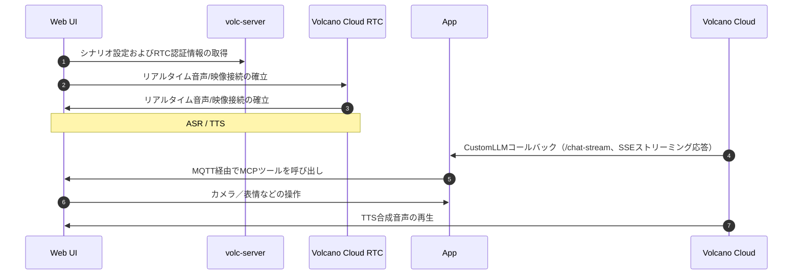

# EMQX + Volcano Engine RTCでリアルタイム音声エージェントを構築する

本ドキュメントでは、Docker Composeを用いてAIエージェントのデモをデプロイする方法を説明します。本デモでは、ブラウザ上の知能人形をスマートデバイスのシミュレーションとして使用し、[Volcano Engine RTC](https://www.volcengine.com/product/veRTC/ConversationalAI)を活用して低レイテンシの音声対話を実現します。さらに、MCPを介したMQTTプロトコルによるデバイス側機能（写真撮影、表情切替、音量調整など）の呼び出しや、Volcano Engineの`CustomLLM`モードを利用したカスタムAIエージェントサービスとの多ターン対話およびツール呼び出しの統合を示します。音声対話からデバイス制御までの一連のワークフローを紹介します。

[デモ動画](https://www.bilibili.com/video/BV1P2WTzBEu4/)で全体の動作をご覧いただけます。

## アーキテクチャ概要

### コンポーネント

システムは以下の3つの主要コンポーネントで構成されています。

| コンポーネント | 役割                  | ポート | 主な責任範囲                                               |
| -------------- | --------------------- | ------ | ---------------------------------------------------------- |
| volc-server    | Volcano Engineプロキシ | 3002   | RTCルーム・トークン管理、Volcano EngineからのCustomLLMコールバック先の設定 |
| web            | MCPサーバー            | 8080   | フロントエンドUI、ハードウェア制御ツール（カメラ／表情／音量）を公開    |
| app            | MCPクライアント＋AIエージェント | 8081   | `/chat-stream`エンドポイントを提供、LLM/VLM推論およびMCPツール呼び出しを処理 |

### 通信フロー



コア機能：

- MCP over MQTT：EMQXブローカーを介したネットワーク間ツール呼び出し。AIエージェントがデバイス機能（カメラ、表情、音量）を制御
- マルチモーダル理解：VLMを統合し、「私が持っているものは何？」などの視覚的ユースケースに対応
- リアルタイム音声対話：Volcano Engine RTC＋ASR/TTSによるエンドツーエンドの低レイテンシ音声認識・合成
- 並列処理アーキテクチャ：ツール呼び出しと音声合成を非同期で実行し、スムーズなユーザー体験を実現

## 前提条件

### 1. Docker環境

Docker 24以上（`docker --version`で確認可能）。

### 2. MQTTブローカー

本プロジェクトでは、webサービス（MCPサーバー）とappサービス（MCPクライアント＋AIエージェント）コンテナが接続可能なEMQXブローカーが必要です。

導入方法（いずれかを選択）：

- 自己ホスト型：[EMQXインストールガイド](https://docs.emqx.com/zh/emqx/latest/deploy/install.html)を参照
- マネージドサービス：[EMQX Cloud](https://docs.emqx.com/zh/cloud/latest/)を利用

設定例：

```
MQTT_BROKER_HOST=localhost        # EMQXブローカーのホスト名
MQTT_BROKER_PORT=1883             # MQTTポート
MQTT_USERNAME=your_username       # 認証有効時のユーザー名
MQTT_PASSWORD=your_password       # 認証有効時のパスワード
```

### 3. LLM APIキー

本プロジェクトはVolcano Engine CustomLLMモードを通じてカスタムAIエージェントを統合します。デフォルトではAlibaba Cloud Bailianの`qwen-flash`モデルを使用します。

#### Alibaba Cloud Bailianの有効化

1. [Alibaba Cloud Bailianコンソール](https://bailian.console.aliyun.com)にアクセス
2. ページ上部の有効化案内があればクリックしてサービスを有効化（無料枠内は無料、有料枠超過時のみ課金）
3. 必要に応じて本人確認を完了

#### APIキーの作成

1. [API-KEY管理ページ](https://bailian.console.aliyun.com/#/api-key)にアクセス
2. API-Keyタブで「API-KEY作成」をクリック
3. アカウントとワークスペース（通常はデフォルト）を選択し、説明を入力して確定
4. 作成したAPIキーのコピーアイコンをクリックしてシークレットを取得
5. `app/.env`の`DASHSCOPE_API_KEY`に設定

#### 他のモデルサービスの利用（任意）

別のOpenAI互換モデルサービスを使う場合は`app/.env`を以下のように更新：

```
LLM_API_BASE=https://your-model-service.com/v1  # モデルサービスのベースURL
LLM_API_KEY=your_api_key                        # モデルサービスのAPIキー
LLM_MODEL=your_model_name                       # モデル名
```

代表的なモデルサービスのエンドポイント：

- OpenAI: `https://api.openai.com/v1`
- DeepSeek: `https://api.deepseek.com/v1`
- その他互換サービスは各プロバイダーのドキュメント参照

LLMサービスによってレイテンシやコストが大きく異なるため、要件に応じて選択してください。低レイテンシを重視する場合はデフォルトのAlibaba Cloud Bailian `qwen-flash`を推奨します。

### 4. Volcano Engine認証情報

本プロジェクトでは複数のVolcano Engineサービスを使用します。[Volcano Engineコンソール](https://console.volcengine.com/home)で登録・ログインしてください。

有効化が必要なサービス：

1. RTCサービス — [有効化ガイド](https://www.volcengine.com/docs/6348/69865)
   - 有効化後、`VOLC_RTC_APP_ID`と`VOLC_RTC_APP_KEY`を取得
   - 取得場所：[RTCコンソール](https://console.volcengine.com/rtc/aigc/listRTC)
2. ASR/TTS音声サービス — [Doubao Speechコンソール](https://console.volcengine.com/speech/app)
   - アプリ作成時に以下を選択：
     - ASR：ストリーミング音声認識
     - TTS：音声合成
   - 以下の認証情報を取得：
     - `VOLC_ASR_APP_ID` - ASRアプリID
     - `VOLC_TTS_APP_ID` - TTSアプリID
     - `VOLC_TTS_APP_TOKEN` - TTSアプリトークン
     - `VOLC_TTS_RESOURCE_ID` - TTSリソースID（選択した音声による）
3. アカウント認証情報 — [キー管理](https://console.volcengine.com/iam/keymanage/)
   - `VOLC_ACCESS_KEY_ID` - アクセスキーID
   - `VOLC_SECRET_KEY` - シークレットアクセスキー

#### 権限設定

必須：RTCコンソールでクロスサービス認可を設定しないと、エージェントがASR/TTS/LLMサービスを正しく呼び出せません。

メインアカウント呼び出し（推奨、簡単）：

1. メインアカウントで[RTCコンソール](https://console.volcengine.com/rtc)にログイン
2. [クロスサービス認可](https://console.volcengine.com/rtc/aigc/iam)に移動
3. 「ワンクリックでクロスサービス認可を有効化」をクリックし、`VoiceChatRoleForRTC`ロールを設定
4. メインアカウントのAK/SKでサービスを呼び出す

サブアカウント呼び出し（任意、追加設定が必要）：

1. メインアカウントで[RTCコンソール](https://console.volcengine.com/rtc)にログイン
2. [クロスサービス認可](https://console.volcengine.com/rtc/aigc/iam)で「サブアカウントに権限付与」をクリック
3. サブアカウントを検索し、権限を追加

完全な有効化ガイド：[リアルタイム会話AIの前提条件](https://www.volcengine.com/docs/6348/1315561)

#### LLM設定

本プロジェクトはCustomLLMモードを使用し、Volcano EngineがアプリのカスタムAIエージェントサービスにコールバックしてLLM応答を取得します。

主な設定：

- `VOLC_LLM_URL`：アプリサービスの`/chat-stream`エンドポイント
  - ローカルデプロイ：`http://app:8081/chat-stream`（コンテナネットワーク内）
  - 本番環境：`https://your-domain.com/chat-stream`（公開アクセス可能であること）
- `VOLC_LLM_API_KEY`：カスタム認証キー。アプリの`CUSTOM_LLM_API_KEY`と完全に一致させる必要があります（後述の「ステップ2：環境変数設定」参照）

任意のモデルソース：

- Volcano Ark：[Arkコンソール](https://console.volcengine.com/ark/region:ark+cn-beijing/endpoint)で推論エンドポイントまたはアプリを作成
- Cozeプラットフォーム：[Coze](https://www.coze.cn)でエージェントを作成 — [ガイド](https://www.coze.cn/open/docs/guides/quickstart)
- サードパーティモデル：OpenAI互換サービスURLを用意 — [要件](https://www.volcengine.com/docs/6348/1399966)

注意：本プロジェクトのアプリサービスはすでにCustomLLMプロトコルを実装済みです。APIキー（例：`DASHSCOPE_API_KEY`）を設定するだけで追加のモデルサービスデプロイは不要です。

#### パラメータの素早い取得

推奨：公式Volcano Engineデモを使って設定をすばやく検証可能です。

1. [リアルタイム会話AIデモ](https://console.volcengine.com/rtc/aigc/run)を開く
2. デモ実行後、右上の「APIアクセス」ボタンをクリック
3. パラメータ設定スニペットをコピーし、必要な認証情報を抽出

### 5. ネットワーク要件

開放すべきポート（デフォルト、Composeファイルで調整可能）：

- `8080` - Web UI
- `8081` - Appバックエンド（SSEエンドポイント）
- `3002` - volc-serverプロキシ（Volcano Engineサービス設定）

アクセス要件：

重要：本プロジェクトでMCP over MQTTを完全に体験するには、appサービスの`/chat-stream`エンドポイントを公開可能なHTTPS環境にデプロイし、Volcano Engineからのコールバックを受けられる必要があります。

- 本番環境（推奨）：appを公開HTTPS URL（例：`https://your-domain.com/chat-stream`）にデプロイし、SSEストリームが`data: [DONE]`で正しく終了することを確認
- ローカルテスト：非公開環境ではLLM推論やMQTT経由のMCPツール呼び出しはAPI経由でのみテスト可能で、Volcano Engineの音声対話は完全には体験できません

## クイックチュートリアル：10分で音声対話＋デバイス制御デモを動かす

前提条件をすべて満たしたら、以下の手順で音声対話とデバイス制御を備えたAIエージェントデモをすばやくセットアップします（「デバイス」はWeb UI上でシミュレーションされます）。

### ステップ1：コードを取得

```bash
git clone -b volcengine/rtc https://github.com/emqx/mcp-ai-companion-demo.git
cd mcp-ai-companion-demo
```

### ステップ2：環境変数を設定

最も重要なステップです。前提条件で取得した認証情報を3つのサービスの設定ファイルに正しく入力してください。各項目の説明と取得元をよく確認してください。

#### 2.1 appサービス（AIエージェントバックエンド）の設定

設定ファイルを作成：

```bash
cp app/.env.example app/.env
```

`app/.env`を編集し、以下を入力：

```bash
# ===== LLM設定 =====
# 取得元：前提条件「3. LLM APIキー」
# 目的：AIエージェントがLLMを呼び出して対話推論を行う
DASHSCOPE_API_KEY=sk-xxxxxxxxxxxxx  # Alibaba Cloud BailianのAPIキーに置き換え

# 他モデルサービスを使う場合は以下も設定：
# LLM_API_BASE=https://api.openai.com/v1
# LLM_MODEL=gpt-4

# ===== CustomLLM認証キー =====
# 取得元：自分で生成（強力なランダム文字列を推奨）
# 目的：Volcano Engineがコールバックリクエストを検証するためのキー
# 要件：volc-serverのVOLC_LLM_API_KEYと完全に一致させること
CUSTOM_LLM_API_KEY=your-strong-random-secret-key-here

# 生成例（ターミナルで実行）：
# openssl rand -base64 32
# またはオンラインツール：https://www.random.org/strings/

# ===== MQTTブローカー設定 =====
# 取得元：前提条件「2. MQTTブローカー」
# 目的：EMQXブローカーに接続し、MCP over MQTT通信を行う
MQTT_BROKER_HOST=localhost        # EMQXブローカーのホスト名
MQTT_BROKER_PORT=1883             # MQTTポート

# EMQX認証有効時：
MQTT_USERNAME=your_mqtt_username  # EMQXユーザー名（任意）
MQTT_PASSWORD=your_mqtt_password  # EMQXパスワード（任意）

# ===== 任意設定 =====
MCP_TOOLS_WAIT_SECONDS=5          # MCPツール登録待機秒数
PHOTO_UPLOAD_DIR=uploads          # 写真アップロードディレクトリ
# APP_SSL_CERTFILE=/path/to/cert  # HTTPS証明書（本番環境）
# APP_SSL_KEYFILE=/path/to/key    # HTTPS秘密鍵（本番環境）
```

補足：

- `DASHSCOPE_API_KEY`と`CUSTOM_LLM_API_KEY`の違い：

  - `DASHSCOPE_API_KEY`：アプリがAlibaba Cloud Bailian（または他のLLMサービス）を呼び出す際に使用
  - `CUSTOM_LLM_API_KEY`：Volcano Engineからのコールバック認証に使用（APIゲートウェイトークンに類似）

- `CUSTOM_LLM_API_KEY`の生成方法例（いずれかを選択）：

  ```bash
  # オプション1：opensslで生成（推奨）
  openssl rand -base64 32
  
  # オプション2：Pythonで生成
  python3 -c "import secrets; print(secrets.token_urlsafe(32))"
  
  # オプション3：オンラインツール
  # https://www.random.org/strings/ （長さ32、英数字）
  ```

#### 2.2 volc-serverサービス（Volcano Engineプロキシ）の設定

設定ファイルを作成：

```bash
cp volc-server/.env.example volc-server/.env
```

`volc-server/.env`を編集し、Volcano Engine認証情報を入力：

```bash
# ===== Volcano Engineアカウント認証情報 =====
# 取得元：前提条件「4. Volcano Engine認証情報 > アカウント認証情報」
# 取得場所：https://console.volcengine.com/iam/keymanage/
VOLC_ACCESS_KEY_ID=AKLT*********************
VOLC_SECRET_KEY=************************************

# ===== RTCサービス認証情報 =====
# 取得元：前提条件「4. Volcano Engine認証情報 > RTCサービス」
# 取得場所：https://console.volcengine.com/rtc/aigc/listRTC
VOLC_RTC_APP_ID=your_rtc_app_id
VOLC_RTC_APP_KEY=your_rtc_app_key

# ===== ASR/TTS音声サービス認証情報 =====
# 取得元：前提条件「4. Volcano Engine認証情報 > ASR/TTS音声サービス」
# 取得場所：https://console.volcengine.com/speech/app
VOLC_ASR_APP_ID=your_asr_app_id
VOLC_TTS_APP_ID=your_tts_app_id
VOLC_TTS_APP_TOKEN=your_tts_app_token
VOLC_TTS_RESOURCE_ID=your_tts_resource_id

# ===== CustomLLM設定 =====
# 目的：Volcano EngineにLLM応答取得先を通知

# VOLC_LLM_URL - appの/chat-streamエンドポイント
# ローカルテスト：Dockerコンテナネットワーク内を使用
# VOLC_LLM_URL=http://app:8081/chat-stream
# 本番環境：公開可能なHTTPS URLである必要あり
VOLC_LLM_URL=https://your-domain.com/chat-stream

# VOLC_LLM_API_KEY - CustomLLM認証キー
# 要件：app/.envのCUSTOM_LLM_API_KEYと完全に一致させること
VOLC_LLM_API_KEY=your-strong-random-secret-key-here  # appと一致させる
```

設定チェックリスト：

| 項目                       | 設定項目                                                    | 取得元                                               |
| -------------------------- | ------------------------------------------------------------ | ---------------------------------------------------- |
| Volcano Engine認証情報     | `VOLC_ACCESS_KEY_ID`, `VOLC_SECRET_KEY`                      | Volcano Engineコンソール                             |
| RTCアプリ設定              | `VOLC_RTC_APP_ID`, `VOLC_RTC_APP_KEY`                        | RTCコンソール                                        |
| 音声サービス設定          | `VOLC_ASR_APP_ID`, `VOLC_TTS_APP_ID`, `VOLC_TTS_APP_TOKEN`, `VOLC_TTS_RESOURCE_ID` | Doubao Speechコンソール                              |
| LLMキー整合性             | `VOLC_LLM_API_KEY`                                           | `app/.env`の`CUSTOM_LLM_API_KEY`と完全一致させること |
| 権限設定                  | クロスサービス認可                                           | 前提条件「権限設定」を完了                             |

#### 2.3 webサービス（フロントエンドUI）の設定

webサービスはビルド時の環境変数を使用します。ローカル開発用のデフォルト設定で通常は十分です：

```bash
VITE_AIGC_PROXY_HOST=http://localhost:3002  # volc-serverプロキシのアドレス
```

以下の場合のみカスタマイズが必要です：

- volc-serverをリモートホストにデプロイしている場合
- volc-serverが3002以外のポートを使用している場合

カスタマイズ例（起動前にexport）：

```bash
export VITE_AIGC_PROXY_HOST=http://your-remote-host:3002
```

#### 設定対応表まとめ

```text
前提条件                             設定ファイル場所
├─ 3. LLM APIキー                ──►  app/.env (DASHSCOPE_API_KEY)
├─ 4. Volcano Engine認証情報
│  ├─ アカウント認証情報          ──►  volc-server/.env (VOLC_ACCESS_KEY_ID/SECRET_KEY)
│  ├─ RTCサービス                ──►  volc-server/.env (VOLC_RTC_APP_ID/APP_KEY)
│  ├─ ASR/TTSサービス            ──►  volc-server/.env (VOLC_ASR_*/VOLC_TTS_*)
│  └─ LLM設定                   ──►  volc-server/.env (VOLC_LLM_URL/API_KEY)
└─ 2. MQTTブローカー             ──►  app/.env (MQTT_BROKER_HOST/PORT/USERNAME/PASSWORD)

自分で生成
└─ CUSTOM_LLM_API_KEY           ──►  app/.env + volc-server/.env（両方で一致必須）
```

ポイント：

1. `CUSTOM_LLM_API_KEY`は唯一自分で生成し、`app/.env`と`volc-server/.env`で完全に一致させる必要があります
2. `DASHSCOPE_API_KEY`はLLM呼び出し用、`CUSTOM_LLM_API_KEY`はVolcano Engineコールバック認証用です
3. 本番環境では`VOLC_LLM_URL`を公開HTTPS URLに変更しないと、Volcano Engineからコールバックできません

### ステップ3：サービスを起動

Docker Composeで全サービスを起動：

```bash
docker compose -f docker/docker-compose.web-volc.yml up --build
```

起動処理：

1. イメージをビルド：`mcp-app`、`mcp-volc-server`、`mcp-web`
2. コンテナを起動し、以下のポートで待機：
   - `8080` - Web UI
   - `8081` - AIエージェントバックエンド
   - `3002` - Volcano Engineプロキシ

初回起動時は依存関係のダウンロードやイメージビルドに数分かかる場合があります。

ログ確認（任意）：

```bash
# 全サービスのログを追跡
docker compose -f docker/docker-compose.web-volc.yml logs -f

# 特定サービスのログを追跡
docker compose -f docker/docker-compose.web-volc.yml logs -f app
```

### ステップ4：動作確認

#### 4.1 Web UIを開く

ブラウザで http://localhost:8080 を開きます。

チャットボットのアバター、マイク、カメラボタンなどを備えた仮想デバイスインターフェースが表示されるはずです。

#### 4.2 MQTT接続設定（初回利用時）

1. 画面右上の設定アイコンをクリック
2. 設定パネルでEMQXブローカー情報を入力：
   - ブローカー：`ws://localhost:8083/mqtt`（MQTTポート1883ではなくWebSocketポート8083を使用）
   - ユーザー名：EMQX認証有効時は入力
   - パスワード：EMQX認証有効時は入力
3. 「保存」をクリック
4. 確認ダイアログで「確認」をクリックするとページが自動更新され、新設定が適用されてMQTT接続が自動確立されます

補足：

- デバイスIDは自動生成されます（形式：`web-ui-hardware-controller/{randomID}`）ので手動設定不要
- MQTT接続成功後、MCPツールが自動登録され、AIエージェントから呼び出し可能になります
- 接続失敗時はEMQXのWebSocketリスナーが有効か（デフォルト8083ポート）を確認してください

#### 4.3 音声対話を開始

画面下部のマイクボタンをクリックし、マイク使用許可を与えます。システムが自動的にRTC接続を確立します。接続成功するとマイクボタンが紫色になり、話しかけることができます。

推奨テスト例：

- 「こんにちは」や「物語を聞かせて」と話しかけて基本対話を確認
- 「私が持っているものは何？」で写真撮影と視覚認識をトリガー
- 「音量を80％にして」や「嬉しい表情にして」でデバイス制御をテスト

#### 4.4 成功判定基準

- 音声対話：ASRの文字起こしが正確、LLMがストリーミング応答し、TTS再生が正常に動作
- MCPツール呼び出し：写真撮影、表情切替、音量調整がすべて反映される
- ログにエラーなし：app、volc-server、ブラウザコンソールにエラーが表示されない

#### 4.5 部分機能テスト

カスタムAIエージェントを使わずUIとVolcano Engine設定だけを検証したい場合：

```
docker compose -f docker/docker-compose.web-volc.yml up --build volc-server web
```

モード特徴：

- 利用可能：ASR、TTS、基本対話
- 利用不可：MCPツール呼び出し（カメラ、表情、音量制御など）

Volcano ArkプラットフォームのLLMを使った対話：

1. [Arkコンソール](https://console.volcengine.com/ark)で推論エンドポイントまたはAgentアプリを作成
2. `EndpointId`（推論エンドポイント）または`BotId`（Agentアプリ）を取得
3. `volc-server/src/config.ts`でLLM設定を変更：

   ```typescript
   llm: {
     mode: 'ArkV3',                    // ArkプラットフォームLLMを使用
     endpointId: 'ep-xxx',             // オプション1：推論エンドポイントID（どちらか一方）
     // botId: 'bot-xxx',               // オプション2：AgentアプリID（どちらか一方）
     systemMessages: [
       { role: 'system', content: 'You are a friendly voice assistant' }
     ],
     historyLength: 5,                 // コンテキスト履歴ターン数
   }
   ```

4. volc-serverサービスを再起動し、ArkプラットフォームLLMで対話を実行

ヒント：スムーズな対話には、Doubao-proシリーズなどの深い思考を要さないモデルを推奨します。詳細な設定パラメータは[Volcano Engineドキュメント](https://www.volcengine.com/docs/6348/1581714)を参照してください。

### ステップ5：サービス停止

```bash
docker compose -f docker/docker-compose.web-volc.yml down
```

## FAQとトラブルシューティング

### 設定調整

#### ポート競合

ポートが使用中の場合は`docker/docker-compose.web-volc.yml`のポートマッピングを変更：

```yaml
services:
  web:
    ports:
      - "8888:8080"  # Web UIポートを変更
  app:
    ports:
      - "8082:8081"  # appポートを変更
  volc-server:
    ports:
      - "3003:3002"  # volc-serverポートを変更
```

注意：volc-serverのポートを変更した場合は、`VITE_AIGC_PROXY_HOST`環境変数も合わせて更新してください。

#### HTTPS有効化（本番環境）

1. 証明書ファイル（`fullchain.pem`、`privkey.pem`）を用意

   重要：単一証明書ファイルではなく、必ずフルチェーン（完全な証明書チェーン）を使用してください。Volcano Engineのコールバックはフルチェーン検証を行い、未満の場合はSSLハンドシェイクに失敗します。

   - Let’s Encrypt：`fullchain.pem`（証明書＋中間証明書を含む）
   - その他CA：サーバー証明書＋中間証明書を含むフルチェーンであることを確認

2. プロジェクトディレクトリ（例：`certs/`）に証明書ファイルを配置
3. `app/.env`に証明書パスを設定：

   ```bash
   APP_SSL_CERTFILE=./certs/fullchain.pem  # フルチェーン必須
   APP_SSL_KEYFILE=./certs/privkey.pem
   ```

4. `volc-server/.env`の`VOLC_LLM_URL`をHTTPSアドレス（例：`https://your-domain.com:8081`）に更新

#### イメージを個別にビルド

特定サービスのイメージをビルドする場合：

```bash
docker build -t mcp-web:local ./web
docker build -t mcp-app:local ./app
docker build -t volc-server:local ./volc-server
```

### よくある問題

#### サービス起動トラブル

| 問題                           | 原因例                   | 対処方法                                                   |
| ------------------------------ | ------------------------ | ---------------------------------------------------------- |
| コンテナが起動しない           | ポートが既に使用中       | 1) `lsof -i :8080`でプロセス確認 2) Composeのポート変更 3) 再度`docker compose up --build`実行 |
| 環境変数が反映されない         | `.env`ファイルが読み込まれていない | 1) `.env`の場所を確認 2) ファイル権限を確認 3) イメージを再ビルド |

#### Volcano Engineサービス関連

| 問題                         | 原因例                             | 対処方法                                                   |
| ---------------------------- | ---------------------------------- | ---------------------------------------------------------- |
| 「AI準備中」状態で停止       | クロスサービス認可未設定           | 1) 権限設定を完了 2) サービス有効化と残高確認 3) パラメータの大文字小文字を確認 |
| 401/403エラー                | AK/SKやトークン誤り               | 1) `VOLC_ACCESS_KEY_ID`/`VOLC_SECRET_KEY`を確認 2) トークン有効期限を確認 3) クロスサービス認可を確認 |
| サブアカウントのクォータ制限 | デフォルトクォータ不足             | [クォータセンター](https://console.volcengine.com/quota/productList/ParameterList?ProviderCode=iam)で増加申請 |

#### LLMリクエスト関連

| 問題                         | 原因例                   | 対処方法                                                   |
| ---------------------------- | ------------------------ | ---------------------------------------------------------- |
| LLMリクエスト失敗            | APIキー誤り             | 1) `DASHSCOPE_API_KEY`を確認 2) ネットワーク接続を確認 3) ログ確認：`docker compose logs app` |
| CustomLLMコールバック失敗    | 認証キー不一致           | 1) `CUSTOM_LLM_API_KEY`が両者で一致しているか確認 2) `VOLC_LLM_URL`を確認 3) volc-serverからappへの通信を確認 |
| HTTPSコールバック失敗        | 証明書チェーン不完全     | フルチェーン証明書を使用（`APP_SSL_CERTFILE`は`fullchain.pem`を指すこと）Volcano Engineはフルチェーン検証を必須とし、未満の場合はSSLハンドシェイク失敗 |

#### MCPツール呼び出し関連

| 問題                         | 原因例                     | 対処方法                                                   |
| ---------------------------- | -------------------------- | ---------------------------------------------------------- |
| ツールが利用できない         | MQTT接続またはdevice_id問題 | 1) ブラウザコンソールでMQTT状態を確認 2) Device IDが一致しているか確認 3) `MCP_TOOLS_WAIT_SECONDS=10`に増やす |
| カメラ写真撮影が失敗         | 権限が許可されていない     | 1) ブラウザのカメラ権限を確認 2) 許可を与える 3) ページをリロード |

#### MQTT接続関連

| 問題                         | 原因例                   | 対処方法                                                   |
| ---------------------------- | ------------------------ | ---------------------------------------------------------- |
| MQTT接続失敗                 | ブローカー設定誤り       | 1) EMQXブローカーが起動しているか確認 2) `MQTT_BROKER_HOST`/`PORT`を確認 3) 認証情報を確認 4) ネットワーク接続をテスト |
| Web UIが接続できない         | WebSocketポートが開いていない | 1) WebSocketリスナーが有効（デフォルト8083）か確認 2) `ws://`スキームを使用（例：`ws://localhost:8083/mqtt`） |

### ログの確認

```
# 全サービスのログを追跡
docker compose -f docker/docker-compose.web-volc.yml logs -f

# 特定サービスのログを追跡
docker compose -f docker/docker-compose.web-volc.yml logs -f app

# 最後の100行を表示
docker compose -f docker/docker-compose.web-volc.yml logs --tail=100 app
```

### パフォーマンス最適化

- LLMレイテンシ：低レイテンシモデルを使用（推奨：Alibaba Cloud Bailian `qwen-flash`）
- 音声品質：`volc-server/src/config.ts`でASRのVAD閾値やTTS音声選択を調整
- ツール呼び出しレイテンシ：appとweb間のネットワーク接続を良好に保つ。MQTTレイテンシを減らすために同一LANや低レイテンシ環境でのデプロイを推奨

ローカル開発（非Docker）：

- web：`pnpm dev`
- app：`uv run ...`
- volc-server：`bun run dev`
