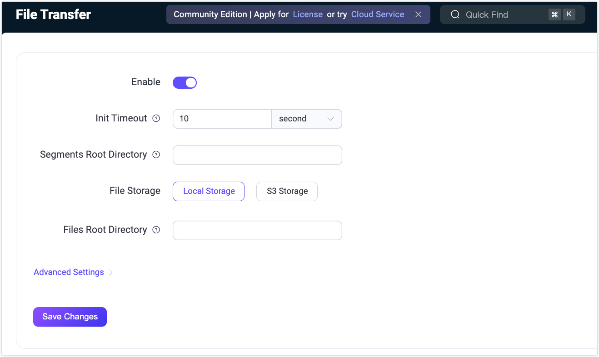

# ファイル転送サーバー側設定の構成

EMQXでは、MQTTファイル転送機能はデフォルトで有効になっていません。この機能を利用する場合は、設定ファイルで有効化する必要があります。

本ページでは、EMQXでファイル転送機能を有効化し、サーバー側でのファイル転送に関する各種機能を設定する方法を主に紹介します。これには、セグメントの保存やマージされたファイルのローカルディスクおよびS3バケットへのエクスポートが含まれます。また、ファイル転送の処理を最適化するためのMQTT転送設定についても説明します。以下のセクションでは、設定ファイルを通じたこれらの設定方法を詳細に解説します。

- [ファイル転送の有効化](#enable-file-transfer)
- [セグメント保存の設定](#configure-segment-storage)
- [ファイルエクスポートの設定](#configure-file-export)
- [MQTT転送設定の構成](#configure-mqtt-transfer-settings)

また、Dashboardからファイル転送機能の有効化および設定も可能です。詳細は[Dashboardからファイル転送を有効化および設定する](#enable-and-configure-file-transfer-via-dashboard)をご参照ください。

さらに、REST APIを使ったエクスポート済みファイルの管理方法も紹介します。詳細は[エクスポート済みファイルの管理](#manage-exported-files)をご覧ください。

## ファイル転送の有効化

EMQXではファイル転送機能はデフォルトで無効化されており、設定ファイルで有効化する必要があります。

```bash
file_transfer {
  enable = true
}
```

この設定により、EMQXはデフォルトでセグメントファイルを `data/file_transfer/segments` ディレクトリに保存し、ローカルディスクへのエクスポートを有効化して、マージされたファイルを `data/transfers/exports` ディレクトリにエクスポートします。

ファイル転送機能をさらに細かく設定する場合は、以下の設定例を参照してください。

## セグメント保存の設定

EMQXはクライアントからのファイルセグメントのアップロードをサポートしており、すべてのセグメントを受信後に完全なファイルとしてマージします。このため、EMQXはセグメントファイルを一時的に保存し管理する必要があります。

現時点では、EMQXはセグメントファイルの保存先としてディスクのみをサポートしており、セグメントの保存場所を設定できます。

ファイルアップロードが完了すると、セグメントは自動的にクリーンアップされます。アップロードがタイムアウト期間内に完了しなかったファイルについては、セグメントの有効期間やクリーンアップのスケジュールを設定し、ディスク容量の無駄な占有を防止できます。

```bash
file_transfer {
  # ファイル転送機能の有効化
  enable = true

  # セグメント保存の設定
  storage {
    local {
      segments {
        # セグメント保存ディレクトリ。高I/O性能のディスクに設定することを推奨します。
        root = "./data/file_transfer/segments"

        # 有効期限切れセグメントの定期クリーンアップ設定
        gc {
          # クリーンアップ間隔
          interval = "1h"

          # セグメント保存の最大有効期間。この期間を超えたセグメントはマージされていなくても削除されます。
          # クライアントが指定する有効期間はこの値を超えてはなりません。
          maximum_segments_ttl = "24h"
        }
      }
    }
  }
}
```

想定されるファイルサイズや同時転送数、利用可能なディスク容量に応じて適切な設定を行ってください。

## ファイルエクスポートの設定

すべてのセグメント転送完了後、EMQXはセグメントをマージして完全なファイルを生成し、ローカルディスクまたはS3バケットにエクスポートしてアプリケーションと連携できます。

:::tip

ファイルエクスポートが設定されていない場合は、デフォルトでローカルディスクへのエクスポートとなります。EMQXは両方のエクスポート方法を同時に設定することはできず、いずれか一方のみ利用可能です。

:::

### ローカルディスクへのファイルエクスポート

以下の設定例は、マージされた完全なファイルをローカルディスクに保存する方法です。エクスポートファイルの保存場所や有効期間を設定できます。

```bash
file_transfer {
  # ファイル転送機能の有効化
  enable = true

  # セグメント保存の設定
  # ...

  # ローカルディスクへのファイルエクスポートを有効化
  storage.local.exporter.local {
    # エクスポートファイル保存ディレクトリ。高I/O性能のディスクに設定することを推奨します。
    root = "./data/transfers/exports"
  }
}
```

### S3バケットへのファイルエクスポート

以下の設定例は、マージされた完全なファイルをS3バケットに保存する方法です。

```bash
file_transfer {
  # ファイル転送機能の有効化
  enable = true

  # セグメント保存の設定
  # ...

  storage.local.exporter.s3 {

    host = "s3.us-east-1.amazonaws.com"
    port = 443

    # S3アクセス用認証情報
    access_key_id = "AKIA27EZDDM9XLINWXFE"
    secret_access_key = "******"

    # エクスポートファイル保存バケット
    bucket = "my-bucket"

    # 共有URLの有効期限
    # EMQXはクライアントがS3から直接ファイルをダウンロードできる一時共有URLを生成します。
    # このパラメータはEMQX APIが返すファイルダウンロードURLの有効期限を指定します。
    # 有効期限切れ後はURLは無効になりますが、ファイル自体はS3に残ります。
    #url_expire_time = "1h"

    # S3とのHTTP(S)接続の設定。安全なファイルアップロードと接続プール管理を可能にします。
    transport_options {
      ssl.enable = true
      connect_timeout = 15s
    }
  }
}
```

## MQTT転送設定の構成

ファイル転送処理を最適化し、クライアントの待機時間を軽減するために、各種ファイル転送操作のタイムアウトを設定できます。以下のMQTT設定を構成可能です。

```bash
file_transfer {
    enable = true
    init_timeout = "10s"
    store_segment_timeout = "10s"
    assemble_timeout = "60s"
}
```

- `init_timeout`: 初期化操作のタイムアウト時間
- `store_segment_timeout`: ファイルセグメント保存のタイムアウト時間
- `assemble_timeout`: ファイル組み立てのタイムアウト時間

いずれかの操作が指定時間を超過すると、MQTTクライアントは `RC_UNSPECIFIED_ERROR` コード付きのPUBACKパケットを受け取ります。

## Dashboardからファイル転送を有効化および設定する

このセクションでは、Dashboard上でファイル転送機能を有効化し、各種機能を設定する方法を説明します。

EMQX Dashboardにアクセスし、**管理** -> **ファイル転送** をクリックします。ファイル転送ページで、**有効化** トグルスイッチをクリックしてファイル転送機能を有効化できます。[一般設定](#general-settings)および[詳細設定](#advanced-settings)を参照して機能を設定してください。設定完了後、**変更を保存** をクリックします。



### 一般設定

以下の一般設定を構成できます。

- **初期化タイムアウト**: `init` コマンドの実行がタイムアウトするまでの最大時間です。システムが過負荷で `init` コマンドをこの時間内に処理できない場合、タイムアウトとなり、エラーコード（0x80）付きのPUBACKメッセージが送信されます。デフォルトは `10s` です。
- **セグメントルートディレクトリ**: アップロードされたファイルの一時セグメントを保存するディレクトリパスです。絶対パスで指定し、高I/O性能のディスク上に配置することが推奨されます。これにより、特に負荷が高い場合のセグメント処理が効率化されます。
- **ファイル保存方法**: ファイルのエクスポート方法を選択します。`ローカルストレージ` または `S3ストレージ` から選択可能です。`S3ストレージ` を選択した場合は、以下の追加設定が必要です。
  - **ホスト**: S3サービスのエンドポイント（例: `s3.us-east-1.amazonaws.com`）
  - **ポート**: S3サービス接続に使用するポート（例: `443` は安全なHTTPS接続を示します）
  - **アクセスキーID** と **シークレットアクセスキー**: S3バケットへのアクセスに必要な認証情報です。安全に管理してください。
  - **バケット**: ファイルを保存するS3バケット名（例: `my-bucket`）
  - **TLSを有効化**: 安全なファイル転送のためにTLS（Transport Layer Security）を使用するかどうかを設定します。詳細は[外部リソースアクセスのTLS](../../guides/network/overview.md#tls-for-external-resource-access)を参照してください。
- **ファイルルートディレクトリ**: ファイル保存のルートディレクトリを絶対パスで指定します。`ローカルストレージ` を選択した場合に、組み立てられたファイルの保存先として使用されます。

### 詳細設定

一般設定で選択したファイル保存方法に応じて、異なる詳細設定を構成できます。

#### ローカルストレージ

ファイルをローカルストレージにエクスポートする場合、以下の詳細設定を構成できます。

| 項目名                 | 説明                                                                 | 推奨値           |
| ---------------------- | -------------------------------------------------------------------- | ---------------- |
| セグメント保存タイムアウト | `segment` コマンドでファイルセグメントを保存する際の最大許容時間。これを超えると（例：システム過負荷時）、エラーコード（0x80）付きのPUBACKメッセージが送信されタイムアウトとなります。 | 5分              |
| 組み立てタイムアウト       | `fin` コマンドでファイル組み立て処理を完了するまでの最大時間。タイムアウト時はエラーコード（0x80）付きPUBACKが送信されます。リソース不足による遅延を考慮した設定です。 | 5分              |
| ストレージGC間隔          | ファイル保存システムのガベージコレクション（不要データ削除）を実行する間隔です。 | 1時間            |
| 最大セグメントTTL         | 保存されたセグメントの最大有効期間。これを超えたセグメントは、マージ済みかどうかに関わらず自動的に削除されます。ファイル転送時に指定されたTTLより優先されます。 | 24時間           |
| 最小セグメントTTL         | セグメントの最小有効期間。マージ済みであっても、この期間内は削除されません。後処理や冗長性確保のために最低限の保持期間を保証します。 | 5分              |

#### S3ストレージ

S3ストレージにエクスポートする場合、[ローカルストレージ](#ローカルストレージ)と共通の設定以外に、以下の詳細設定も構成可能です。

| 項目名               | 説明                                                                 | 推奨値           |
| -------------------- | -------------------------------------------------------------------- | ---------------- |
| URL有効期限          | S3にアップロードされたファイルへのアクセス用に生成されるURLの有効期間です。有効期限切れ後はURLからファイルにアクセスできなくなります。 | -                |
| 最小パートサイズ      | ファイルを複数パートに分割してS3にアップロードする際の各パートの最小サイズ。小さいパートサイズはアップロード回数を増やしますが、不安定な接続環境で大きなファイルを扱う際に有用です。 | 5 MB             |
| 最大パートサイズ      | S3のマルチパートアップロードでの各パートの最大サイズ。大きなパートはアップロード回数を減らし、高帯域幅環境で効率的ですが、メモリ消費が増加します。 | 5 MB             |
| ACL（アクセス制御リスト） | アップロードされたオブジェクトのアクセス権限を指定します。以下のオプションがあります。<br />`private`: オーナーのみ完全アクセス<br />`public_read`: 全員が読み取り可能<br />`public_read_write`: 全員が読み書き可能<br />`authenticated_read`: 認証ユーザーのみ読み取り可能<br />`bucket_owner_read`: バケットオーナーが読み取り可能<br />`bucket_owner_full_control`: バケットオーナーが完全制御可能 | -                |
| IPV6プローブ          | IPv6接続の確認を行うかどうか。ネットワークがIPv6対応の場合、有効化すると互換性やパフォーマンス向上が期待できます。 | 有効             |
| 接続タイムアウト       | S3サーバーへの接続確立に許容される最大時間。これを超えるとタイムアウトとなり、サーバー応答の遅延を防ぎます。 | -                |
| プールタイプ          | S3接続管理に使用するコネクションプールのタイプ。<br />`random`: ランダム選択<br />`hash`: ハッシュ関数による選択。接続のパフォーマンスや信頼性に影響します。 | `random`         |
| プールサイズ          | S3接続用コネクションプールのサイズ。大きいほど同時接続数を処理可能ですが、リソース消費も増加します。 | 8                |
| HTTPパイプライニング  | レスポンスを待たずに送信するHTTPリクエスト数。スループット向上に寄与しますが、複雑さも増します。 | 100              |
| HTTPヘッダー          | S3リクエストに追加するカスタムHTTPヘッダー。キー・バリュー形式で追加可能です。**追加**ボタンで指定します。 | -                |
| 最大リトライ回数       | エラー発生時のS3リクエスト再試行の最大回数。増やすことで信頼性向上が期待できますが、遅延が増加する可能性があります。 | -                |
| リクエストタイムアウト | S3リクエストの完了に許容される最大時間。これを超えるとタイムアウトとなります。 | -                |

## エクスポート済みファイルの管理

エクスポート済みファイルの一覧表示や詳細情報の閲覧、移動、削除、ダウンロードなどの管理操作が可能です。これらの操作はREST APIまたは手動で行えます。将来的にはDashboard上での管理インターフェースも追加予定です。

### REST APIによるエクスポート済みファイル管理

EMQXはエクスポート済みファイル管理用のREST APIを提供しており、[MQTTファイル転送管理API](https://docs.emqx.com/en/enterprise/v5.3/admin/api-docs.html#tag/File-Transfer)を利用してファイルの閲覧やダウンロードが可能です。

:::warning 重要なお知らせ

ファイル転送ストアはグローバルであり、ネームスペースを認識しません。ネームスペース付きDashboardユーザーやAPIキーは、役割やスコープに関わらず、ファイル転送エンドポイントを使ってファイル一覧表示やローカル保存ファイルのダウンロードができません。グローバルDashboardユーザーまたはグローバルAPIキーで認証してください。`/file_transfer` 設定エンドポイントは影響を受けません。

:::

### ローカルディスクにエクスポートされたファイルの手動管理

ディスク上のエクスポートファイルを直接管理する場合（移動やFTP・HTTPサービスによるダウンロードなど）、以下のファイル保存場所のルールを参照してください。

ファイル名の衝突や単一ディレクトリ内のファイル数過多を防ぐため、EMQXはバケットストレージ方式でエクスポートファイルを保存します。動作原理は以下の通りです。

- まず、ファイルIDとクライアントIDのsha256ハッシュ値を計算します。例: `ABCDEFG012345...`
- 6階層のディレクトリ構造でファイルを保存します。各階層は以下のように定義されます。
  1. ハッシュの最初の2バイトを第1階層ディレクトリ名とする
  2. 次の2バイトを第2階層ディレクトリ名とする
  3. 残りのハッシュを第3階層ディレクトリ名とする
  4. エスケープ済みクライアントID
  5. エスケープ済みファイルID
  6. メタデータのファイル名（最下層）

例として、エクスポートファイルは以下のようなディレクトリ構造に保存されます。  
`AB/CD/EFGH.../{clientid}/{file_id}/{filename}`

### S3バケットにエクスポートされたファイルの手動管理

S3バケットの場合は、S3クライアントツールやS3のREST APIを使ってファイルの削除やダウンロードなどの管理が可能です。ファイル保存場所のルールは以下の通りです。

ローカルエクスポーターのバケットストレージ方式とは異なり、S3エクスポーターでエクスポートされたファイルはよりシンプルな3階層構造で保存されます。

1. エスケープ済みクライアントID
2. エスケープ済みファイルID
3. ファイル名

例として、エクスポートファイルは以下のようなディレクトリ構造に保存されます。  
`{clientid}/{file_id}/{filename}`

:::tip

S3クライアントツールやREST APIの利用方法については、以下のリソースを参照してください。

- [Amazon S3](https://aws.amazon.com/s3/?nc1=h_ls) およびその [ユーザーガイド](https://docs.aws.amazon.com/AmazonS3/latest/userguide/Welcome.html)
- [MinIO オブジェクトストレージシステム](https://min.io/)

:::
