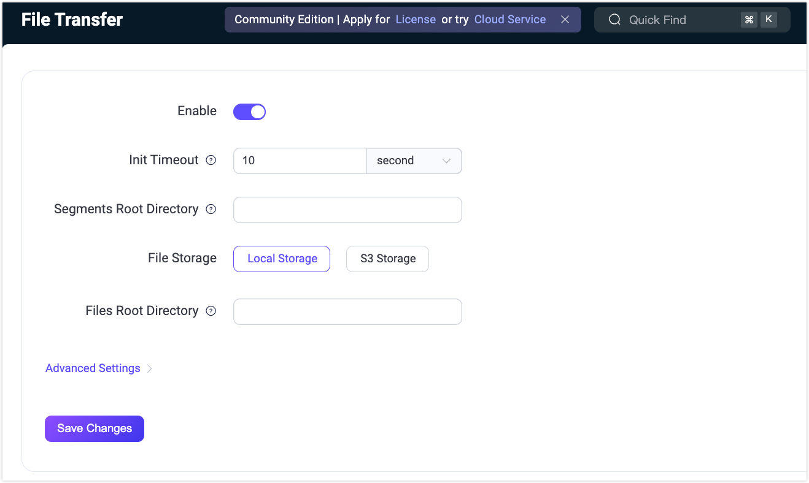

# ファイル転送サーバーサイド設定の構成

EMQXでは、MQTTファイル転送機能はデフォルトで有効になっていません。この機能を使用する場合は、設定ファイルで有効化する必要があります。

本ページでは、EMQXでファイル転送機能を有効化し、サーバーサイドでのファイル転送に関する各種機能を設定する方法を主に紹介します。これには、セグメントの保存やマージ後のファイルをローカルディスクやS3バケットにエクスポートする設定が含まれます。また、ファイル転送の処理を最適化するためのMQTT転送設定についても解説します。以下のセクションで、設定ファイルを通じた詳細な設定方法を紹介します。

- [ファイル転送の有効化](#enable-file-transfer)
- [セグメント保存の設定](#configure-segment-storage)
- [ファイルエクスポートの設定](#configure-file-export)
- [MQTT転送設定の構成](#configure-mqtt-transfer-settings)

また、Dashboardからもファイル転送機能の有効化および設定が可能です。詳細は[Dashboardによるファイル転送の有効化と設定](#enable-and-configure-file-transfer-via-dashboard)をご参照ください。

さらに、エクスポートされたファイルの管理方法についても紹介します。具体的な内容は[エクスポートファイルの管理](#manage-exported-files)をご覧ください。

## ファイル転送の有効化

EMQXではファイル転送機能はデフォルトで無効になっており、設定ファイルで有効化する必要があります。

```bash
file_transfer {
  enable = true
}
```

この設定により、EMQXはデフォルトでセグメントファイルを `data/file_transfer/segments` ディレクトリに保存し、ローカルディスクへのエクスポートを有効化してマージ済みファイルを `data/transfers/exports` ディレクトリに出力します。

ファイル転送機能をさらに細かく設定する場合は、以下の設定例を参照してください。

## セグメント保存の設定

EMQXはクライアントがアップロードするファイルセグメントを受け取り、すべてのセグメントを受信後に完全なファイルとしてマージします。これをサポートするために、EMQXはセグメントファイルを一時的に保存し管理する必要があります。

現時点では、EMQXはセグメントファイルの保存先としてディスクのみをサポートしており、セグメントの保存場所を設定可能です。

ファイルアップロード完了後はセグメントは自動的にクリーンアップされます。アップロードがタイムアウト期間内に完了しなかったファイルについては、セグメントの有効期間やクリーンアップのスケジュールを設定し、ディスク容量の圧迫を防止できます。

```bash
file_transfer {
  # ファイル転送機能を有効化
  enable = true

  # セグメント保存設定
  storage.local.segments = {
    # セグメント保存ディレクトリ。I/O性能の高いディスクに設定することが望ましい。
    root = "./data/file_transfer/segments"

    # 有効期限切れセグメントの定期クリーンアップ設定
    gc {
      # クリーンアップ間隔
      interval = "1h"

      # セグメント保存の最大有効期間。これを超えたセグメントはマージされていなくても削除される。
      # クライアントが指定する有効期間はこの値を超えてはならない。
      maximum_segments_ttl = "24h"
    }
  }
}
```

想定されるファイルサイズや同時転送数、利用可能なディスク容量に応じて適切な設定を行ってください。

## ファイルエクスポートの設定

すべてのセグメント転送完了後、EMQXはセグメントをマージして完全なファイルを生成し、ローカルディスクまたはS3バケットにエクスポートしてアプリケーションと連携可能です。

:::tip

ファイルエクスポートが未設定の場合はローカルディスクへのエクスポートがデフォルトとなります。EMQXでは両方のエクスポート方法を同時に設定することはできず、いずれか一方のみ利用可能です。

:::

### ローカルディスクへのファイルエクスポート

以下の設定例は、マージ済みの完全ファイルをローカルディスクに保存する方法です。エクスポートファイルの保存場所や有効期間を設定できます。

```bash
file_transfer {
  # ファイル転送機能を有効化
  enable = true

  # セグメント保存設定
  # ...

  # ローカルディスクへのファイルエクスポートを有効化
  storage.local.exporter.local {
    # エクスポートファイル保存ディレクトリ。I/O性能の高いディスクに設定することが望ましい。
    root = "./data/transfers/exports"
  }
}
```

### S3バケットへのファイルエクスポート

以下の設定例は、マージ済みの完全ファイルをS3バケットに保存する方法です。

```bash
file_transfer {
  # ファイル転送機能を有効化
  enable = true

  # セグメント保存設定
  # ...

  storage.local.exporter.s3 {

    host = "s3.us-east-1.amazonaws.com"
    port = 443

    # S3アクセス用認証情報
    access_key_id = "AKIA27EZDDM9XLINWXFE"
    secret_access_key = "******"

    # エクスポートファイル保存バケット
    bucket = "my-bucket"

    # 共有URLの有効期限
    # EMQXはクライアントがS3から直接ファイルをダウンロードできる一時共有URLを生成します。このパラメータはEMQX APIが返すファイルダウンロードURLの有効期限を指定します。有効期限切れ後はURLは無効になりますが、実際のファイルはS3に残ります。
    #url_expire_time = "1h"

    # S3とのHTTP(S)接続の設定。安全なファイルアップロードや接続プール管理を可能にします。
    transport_options {
      ssl.enable = true
      connect_timeout = 15s
    }
  }
}
```

## MQTT転送設定の構成

ファイル転送処理を最適化し、クライアントの待機時間を過度に長くしないために、各ファイル転送操作に対してタイムアウトを設定できます。以下のMQTT設定が可能です。

```bash
file_transfer {
    enable = true
    init_timeout = "10s"
    store_segment_timeout = "10s"
    assemble_timeout = "60s"
}
```

- `init_timeout`：初期化操作のタイムアウト時間
- `store_segment_timeout`：ファイルセグメント保存のタイムアウト時間
- `assemble_timeout`：ファイル組み立てのタイムアウト時間

これらの操作が指定時間を超過した場合、MQTTクライアントは `RC_UNSPECIFIED_ERROR` コードを含むPUBACKパケットを受信します。

## Dashboardによるファイル転送の有効化と設定

このセクションでは、Dashboard上でファイル転送機能を有効化し、各種機能を設定する方法を示します。

EMQX Dashboardにアクセスし、**管理** -> **ファイル転送**をクリックします。ファイル転送ページで、**有効化**のトグルスイッチをクリックしてファイル転送機能を有効化できます。[一般設定](#general-settings)および[詳細設定](#advanced-settings)を参照して機能を設定してください。設定完了後、**変更を保存**をクリックします。



### 一般設定

以下の一般設定を構成できます。

- **初期化タイムアウト**：`init` コマンドの実行がタイムアウトするまでの最大許容時間。例えば、システムが過負荷で `init` コマンドをこの時間内に処理できない場合、タイムアウトとなりエラーコード（0x80）付きのPUBACKメッセージが送信されます。デフォルトは `10s` です。
- **セグメントルートディレクトリ**：アップロードされたファイルの一時セグメントを保存するディレクトリパス。絶対パスで指定し、I/O性能の高いディスク上に配置することが望ましいです。これにより、負荷の高い状況でも効率的にセグメントを処理できます。
- **ファイル保存方法**：ファイルのエクスポート方法を選択します。選択肢は「ローカルストレージ」と「S3ストレージ」です。S3ストレージを選択した場合は以下の追加設定が必要です：
  - **ホスト**：S3サービスのエンドポイント（例：`s3.us-east-1.amazonaws.com`）
  - **ポート**：S3サービス接続に使用するポート（例：`443`、HTTPS接続を示す）
  - **アクセスキーID**および**シークレットアクセスキー**：S3バケットへのアクセスに必要な認証情報。安全に管理してください。
  - **バケット**：ファイルを保存するS3バケット名（例：`my-bucket`）
  - **TLSの有効化**：安全なファイル転送のためにTLS（Transport Layer Security）を使用するかどうかを指定します。詳細は[外部リソースアクセスのTLS](../../guides/network/overview.md#tls-for-external-resource-access)を参照してください。
- **ファイルルートディレクトリ**：ファイル保存のルートディレクトリ。絶対パスで指定し、ローカルストレージを選択した場合の組み立て済みファイル保存先として使用されます。

### 詳細設定

一般設定で構成したファイル保存方法に応じて、異なる詳細設定項目があります。

#### ローカルストレージ

ファイルをローカルストレージにエクスポートする場合、以下の詳細設定を構成できます。

| 項目名                 | 説明                                                         | 推奨値            |
| ---------------------- | ------------------------------------------------------------ | ----------------- |
| セグメント保存タイムアウト | `segment` コマンドでファイルセグメントを保存する最大許容時間。これを超えると（例：システム過負荷時）エラーコード（0x80）付きのPUBACKメッセージが送信されタイムアウトとなる。 | `5` 分            |
| 組み立てタイムアウト       | `fin` コマンドでファイル組み立て処理を完了する最大許容時間。タイムアウト時はエラーコード（0x80）付きのPUBACKメッセージが送信される。リソース制約下での遅延対策に重要。 | `5` 分            |
| ストレージGC間隔          | ファイル保存システムのガベージコレクション（不要データ削除）処理の実行間隔。 | `1` 時間          |
| 最大セグメントTTL         | 保存されたセグメントの最大有効期間。これを超えたセグメントは自動的に削除される。ファイル転送時に指定されたTTLより長くてもこの値が優先される。 | `24` 時間         |
| 最小セグメントTTL         | セグメントの最小有効期間。マージ済みや短いTTL指定があっても、この期間内は削除されない。後処理や冗長性確保のために最低限の保持期間を保証。 | `5` 分            |

#### S3ストレージ

ファイルをS3ストレージにエクスポートする場合、ローカルストレージと共通の設定を除き、以下の詳細設定も構成可能です。

| 項目名               | 説明                                                         | 推奨値            |
| -------------------- | ------------------------------------------------------------ | ----------------- |
| URL有効期限          | S3にアップロードされたファイルへのアクセス用URLの有効期間。期限切れ後はURLでのアクセスができなくなる。 | -                 |
| 最小パートサイズ      | マルチパートアップロード時の各パートの最小サイズ。小さいとアップロード回数が増えるが、不安定な環境で大きなファイルを扱う際に有効。 | `5 MB`            |
| 最大パートサイズ      | マルチパートアップロード時の各パートの最大サイズ。大きいとアップロード回数は減るがメモリ消費が増える。 | `5 MB`            |
| ACL                  | アップロードオブジェクトのアクセス制御リスト。以下のオプションがある：<br />`private`：所有者のみフルアクセス。<br />`public_read`：全員が読み取り可能。<br />`public_read_write`：全員が読み書き可能。<br />`authenticated_read`：認証ユーザーのみ読み取り可能。<br />`bucket_owner_read`：バケット所有者が読み取り可能。<br />`bucket_owner_full_control`：バケット所有者がフルコントロール可能。 | -                 |
| IPV6プローブ          | IPv6接続の有無をチェックするか。IPv6対応ネットワークでは有効化推奨。 | 有効              |
| 接続タイムアウト      | S3サーバーへの接続確立に許容される最大時間。これを超えるとタイムアウトとなる。 | -                 |
| プールタイプ          | S3接続管理のコネクションプールタイプ：<br />`random`：ランダム選択。<br />`hash`：ハッシュ関数による選択。接続の性能や信頼性に影響。 | `random`          |
| プールサイズ          | S3接続のコネクションプールのサイズ。大きいほど同時接続数を増やせるがリソース消費も増加。 | `8`               |
| HTTPパイプライニング | レスポンスを待たずに送信可能なHTTPリクエスト数。スループット向上に寄与するが複雑性が増す。 | `100`             |
| HTTPヘッダー          | S3リクエストに付加するカスタムHTTPヘッダー。キー・バリュー形式で追加可能。 | -                 |
| 最大リトライ回数      | エラー発生時のS3リクエストの最大リトライ回数。信頼性向上に寄与するが遅延増加の可能性あり。 | -                 |
| リクエストタイムアウト | S3リクエストの最大許容時間。超過するとタイムアウトとなる。 | -                 |

## エクスポートファイルの管理

エクスポートされたファイルは、一覧表示や詳細情報の閲覧、移動、削除、ダウンロードなどの管理が可能です。これらの管理操作はREST APIまたは手動で実行できます。将来的にはDashboard上での管理インターフェースも追加予定です。

### REST APIによるエクスポートファイル管理

EMQXはエクスポートファイル管理用のREST APIを提供しており、[MQTTファイル転送管理API](https://docs.emqx.com/en/enterprise/v5.3/admin/api-docs.html#tag/File-Transfer)を利用してファイルの閲覧やダウンロードが可能です。

::: warning 重要なお知らせ

ファイル転送ストアはグローバルであり、ネームスペースを認識しません。ネームスペース付きDashboardユーザーおよびAPIキーは、ロールやスコープに関係なくファイル転送エンドポイントでファイル一覧表示やローカル保存ファイルのダウンロードを行えません。グローバルDashboardユーザーまたはグローバルAPIキーで認証してください。`/file_transfer`設定エンドポイントは影響を受けません。

:::

### ディスクにエクスポートされたファイルの手動管理

ディスク上のエクスポートファイルを直接管理（移動やFTP/HTTPサービスでのダウンロードなど）する場合は、以下のファイル保存場所の説明を参照してください。

ファイル名の競合や単一ディレクトリ内のファイル数過多を防ぐため、EMQXはバケットストレージ方式でエクスポートファイルを保存します。方式の動作原理は以下の通りです。

- まず、ファイルIDとクライアントIDのsha256ハッシュ値を計算します。例：`ABCDEFG012345...`
- 6階層のディレクトリ構造に保存します。各階層は以下の通り：
  1. ハッシュの最初の2バイトを第1階層ディレクトリ名にする
  2. 次の2バイトを第2階層ディレクトリ名にする
  3. 残りのハッシュを第3階層ディレクトリ名にする
  4. エスケープ済みクライアントID
  5. エスケープ済みファイルID
  6. メタデータのファイル名を最下層に配置

例として、エクスポートファイルは以下のようなディレクトリ構造に保存されます：  
`AB/CD/EFGH.../{clientid}/{file_id}/{filename}`

### S3バケットにエクスポートされたファイルの手動管理

S3バケットの場合は、S3クライアントツールやS3のREST APIを利用してファイルの削除やダウンロードなど管理が可能です。ファイル保存場所は以下の通りです。

ローカルエクスポーターのバケットストレージ方式とは異なり、S3エクスポーターでエクスポートされたファイルはシンプルな3階層構造で保存されます。

1. エスケープ済みクライアントID
2. エスケープ済みファイルID
3. ファイル名

例として、エクスポートファイルは以下のようなディレクトリ構造に保存されます：  
`{clientid}/{file_id}/{filename}`

:::tip

S3クライアントツールやREST APIの利用方法については、以下のリソースを参照してください。

- [Amazon S3](https://aws.amazon.com/s3/?nc1=h_ls) およびその [ユーザーガイド](https://docs.aws.amazon.com/AmazonS3/latest/userguide/Welcome.html)
- [MinIOオブジェクトストレージシステム](https://min.io/)

:::
