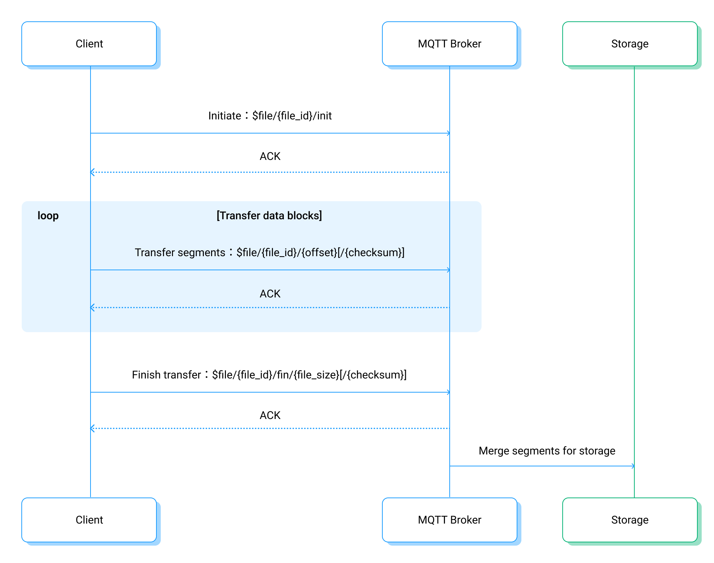

# ファイル転送クライアント開発

このページでは、クライアント視点でのファイル転送プロセスの概要と、EMQXへのファイルアップロードコマンドの詳細情報を提供します。クライアント側のファイル転送機能の開発に役立ててください。

## ファイル転送プロセス

既存のMQTT接続を再利用しつつ、クライアントは特定のプレフィックス付きトピックにあらかじめ定められたメッセージをパブリッシュすることで、ファイル転送セッションを制御できます。

::: warning リスナーマウントポイントとの非互換性
ファイル転送は、[マウントポイント](../../guides/configuration/listener.md#mountpoint)が設定されたリスナー経由で接続されたクライアントでは動作しません。EMQXは`$file/`および`$file-async/`コマンドプレフィックスのマッチング前にマウントポイントを適用するため、ファイル転送コマンドはマウントされたリテラルトピックへの通常メッセージとしてルーティングされます。`$file-response/`のレスポンストピックへのサブスクライブもマウントされるため、クライアントはEMQXからのコマンド結果メッセージを受信できません。クライアントにはエラーは報告されません。
:::

クライアント側のファイル転送プロセスは以下の通りです：

1. **転送準備**：クライアントデバイスはアップロードするファイルを選択し、転送セッションを識別するための一意の`file_id`を生成します。
2. **ファイル転送の初期化**：クライアントデバイスは`$file/{file_id}/init`トピックに`init`コマンドをパブリッシュします。メッセージはJSON形式で、ファイル名、サイズ、チェックサムなどのファイルメタデータを含みます。
3. **分割ファイル転送**：クライアントは`$file/{file_id}/{offset}[/{checksum}]`トピックに連続してメッセージをパブリッシュし、ファイルを転送します。メッセージ内容は現在のファイルセグメントのデータブロックで、オプションでデータブロックのチェックサムを含む`checksum`フィールドがあります。
4. **ファイル転送の完了**：クライアントは`$file/{file_id}/fin/{file_size}[/{checksum}]`トピックに`fin`コマンドをパブリッシュし、ファイル転送の完了を示します。メッセージ内容は空で、`file_size`パラメータはファイルの合計サイズを示し、`checksum`フィールドはファイル全体のチェックサムです。

転送コマンドの各ステップの詳細な説明と注意点は、以下のセクションを参照してください。



## ファイル転送コマンド

ファイル転送コマンドは、特定のトピック形式とメッセージ内容を持つMQTTメッセージです：

- **トピック**：トピックプレフィックスは`$file/`および`$file-async/`があり、それぞれ同期転送と非同期転送に使用されます。クライアントは同一ファイル転送セッション内で異なるコマンドに対して両者を混在して使用できます。
  - **同期転送**：クライアントは次の操作に進む前に、EMQXからコマンドの実行結果の確認を待つ必要があります。
  - **非同期転送**：クライアントはEMQXのコマンド実行確認を待たずに、コマンド送信後すぐに新しいコマンドを送信でき、処理速度を向上させることが可能です。
- **QoS**：すべてのコマンドはQoSレベル1でパブリッシュされ、信頼性を確保します。
- **メッセージ本文**：JSON形式またはデータブロックを含むメッセージ本文のいずれかです。

各コマンドのパブリッシュ後、コマンド実行結果はPUBACKメッセージまたはレスポンストピックを通じて取得できます。詳細は[コマンド実行結果の取得](#retrieve-command-execution-results)を参照してください。

:::tip

1. すべてのファイル転送コマンドはEMQXブローカーで処理され、他のMQTTクライアントには送信されません。
2. 非同期転送モードはEMQX v5.3.2以降で利用可能です。
3. MQTT v3.1/v3.1.1クライアントはPUBACK Reason Codeが利用できないため、非同期転送モードの使用を推奨します。

:::

### init コマンド

`init`コマンドはファイル転送セッションを初期化するために使用します。

- トピック：`$file/{file_id}/init` または `$file-async/{file_id}/init`

- メッセージ本文：以下のフィールドを持つJSONオブジェクト

  ```json
  {
    "name": "{name}",
    "size": {size},
    "checksum": "{checksum}",
    "expire_at": {expire_at},
    "segments_ttl": {segments_ttl},
    "user_data": {user_data}
  }
  ```

| フィールド       | 説明                                                                                  |
| -------------- | ------------------------------------------------------------------------------------- |
| `file_id`      | ファイル転送セッションの一意識別子。                                                  |
| `name`         | ファイル名。予約ファイル名（例：".", ".."）と衝突する場合や特殊文字を含む場合はパーセントエンコードされます。ファイル名のバイナリ長は240バイトを超えないようにしてください。 |
| `size`         | ファイルのサイズ。                                                                     |
| `checksum`     | ファイルのSHA256チェックサム（任意）。指定するとEMQXがファイルのチェックサム検証を行います。 |
| `expire_at`    | ファイルがストレージから削除される可能性のあるタイムスタンプ（エポック秒）。           |
| `segments_ttl` | ファイルセグメントの有効期間（秒）。`minimum_segments_ttl`と`maximum_segments_ttl`で設定された範囲に制限されます。詳細は[セグメントストレージ](./broker.md#segment-storage)を参照。 |
| `user_data`    | ファイルに関する追加情報やメタデータを格納する任意のJSONオブジェクト。                 |

メッセージ本文で必須なのは`name`フィールドのみです。

例：

```json
{
  "name": "ml-logs-data.log",
  "size": 12345,
  "checksum": "1234567890abcdef1234567890abcdef1234567890abcdef1234567890abcdef",
  "expire_at": 1696659943,
  "segments_ttl": 600
}
```

### segment コマンド

`segment`コマンドはファイルのデータブロックをアップロードするために使用します。

- トピック：`$file/{file_id}/{offset}[/{checksum}]` または `$file-async/{file_id}/{offset}[/{checksum}]`
- メッセージ本文：ファイルブロックのバイナリデータ

| フィールド    | 説明                                                                                 |
| ------------ | ------------------------------------------------------------------------------------ |
| `file_id`    | ファイル転送セッションの一意識別子。                                                 |
| `offset`     | ファイルブロックの開始オフセット（バイト単位）、ファイル先頭からの位置で計算されます。 |
| `checksum`   | ファイルブロックのSHA256チェックサム（任意）。                                       |

### fin コマンド

`fin`コマンドはファイル転送セッションの完了を示すために使用します。

- トピック：`$file/{file_id}/fin/{file_size}[/{checksum}]` または `$file-async/{file_id}/fin/{file_size}[/{checksum}]`
- メッセージ本文：空のメッセージ本文

| フィールド    | 説明                                                                                  |
| ------------ | ------------------------------------------------------------------------------------- |
| `file_id`    | ファイル転送セッションの一意識別子。                                                  |
| `file_size`  | ファイルの合計サイズ（バイト単位）。                                                  |
| `checksum`   | ファイル全体のSHA256チェックサム（任意）。指定すると、`init`コマンドの`checksum`より優先されます。 |

`fin`コマンド受信後、EMQXはファイルを組み立てるために必要なすべてのセグメントを受信済みか検証します。ファイルのエクスポートが成功し、チェックサムが有効であれば、EMQXは成功のReason Codeで応答します。エラーがある場合は適切なエラー応答が送信されます。

## コマンド実行結果の取得

コマンド実行結果はMQTTのPUBACK Reason Codeで示されます：

- **同期転送**：PUBACKのReason Codeが操作の最終結果を表します。
- **非同期転送**：非ゼロのPUBACK Reason Codeは即時の失敗を示し、ゼロはコマンドが処理のため受理されたことを示します。結果は処理完了後にレスポンスメッセージで返されます。

### PUBACK Reason Code

| Reason Code | MQTTでの意味           | ファイル転送での意味                                             |
| ----------- | --------------------- | -------------------------------------------------------------- |
| None        |                       | 0x00と同じ意味。                                               |
| 0x00        | 成功                  | ファイルブロックが正常に永続化された。                          |
| 0x10        | 該当サブスクライバーなし | サーバーはクライアントに全ファイルブロックの再送を要求。        |
| 0x80        | 未指定のエラー         | `segment`コマンドの場合、サーバーは現在のファイルブロックの再送を要求。`fin`コマンドの場合、全ファイルブロックの再送を要求。 |
| 0x83        | 特定のエラー           | サーバーはクライアントに送信のキャンセルを要求。                |
| 0x97        | クォータ超過           | サーバーはクライアントに送信の一時停止を要求。クライアントは再送まで待機すべき。 |

### レスポンスメッセージ

- トピック：`$file-response/{clientId}`（`clientId`はクライアントID）
- メッセージ：レスポンス結果を含むJSONオブジェクト

例：

```json
{
  "vsn": "0.1",
  "topic": "$file-async/[COMMAND]",
  "packet_id": 1,
  "reason_code": 0,
  "reason_description": "success"
}
```

| フィールド              | 説明                                                                                   |
| ---------------------- | -------------------------------------------------------------------------------------- |
| `vsn`                  | レスポンスメッセージフォーマットのバージョン                                         |
| `topic`                | 応答対象のコマンドトピック（例：`$file-async/somefileid/init`）                       |
| `packet_id`            | 応答対象のコマンドのMQTTメッセージID                                                 |
| `reason_code`          | コマンドの実行結果コード。詳細は[Reason Codes](#PUBACK-Reason-Codes)を参照           |
| `reason_description`   | 実行結果の説明                                                                       |

クライアントは同期・非同期にかかわらず、`$file-response/{clientId}`トピックを通じてコマンドの実際の操作結果を取得できます。

## 注意事項

1. ファイル転送中にクライアントが切断された場合や、優先度の高いメッセージ送信のために転送を中断する必要がある場合は、未アックのデータブロックやコマンドを転送再開後に再送信してください。この方法によりファイル全体の再送を避け、転送効率が向上します。
2. EMQXは受信したファイルセグメントからファイルを組み立て、設定されたストレージにエクスポートする必要があるため、`fin`コマンドの処理には時間がかかる場合があります。この間、クライアントは他のコマンド送信を継続できます。`fin`コマンド処理中に切断が発生した場合は、単にコマンドを再送して転送を再開してください。ファイル転送が完了していれば、EMQXは即座に成功応答を返します。

## クライアントコード例

さまざまな言語とクライアントライブラリのファイル転送クライアントコード例を参照できます：

- [C - Paho](https://github.com/emqx/MQTT-Client-Examples/blob/master/mqtt-client-C-paho/emqx_file_transfer.c)
- [Python3 - Paho](https://github.com/emqx/MQTT-Client-Examples/blob/master/mqtt-client-Python3/file_transfer.py)
- [Java - Paho](https://github.com/emqx/MQTT-Client-Examples/blob/master/mqtt-client-Java/src/main/java/io/emqx/mqtt/MqttFileTransferSample.java)
- [Golang - Paho](https://github.com/emqx/MQTT-Client-Examples/pull/110/files#diff-ea542153b4dd7109626626beff78b699ed649f9a7c05af362e5d67cce0866a94)
- [Node.js - MQTT.js](https://github.com/emqx/MQTT-Client-Examples/blob/master/mqtt-client-Node.js/emqx-file-transfer.js)
