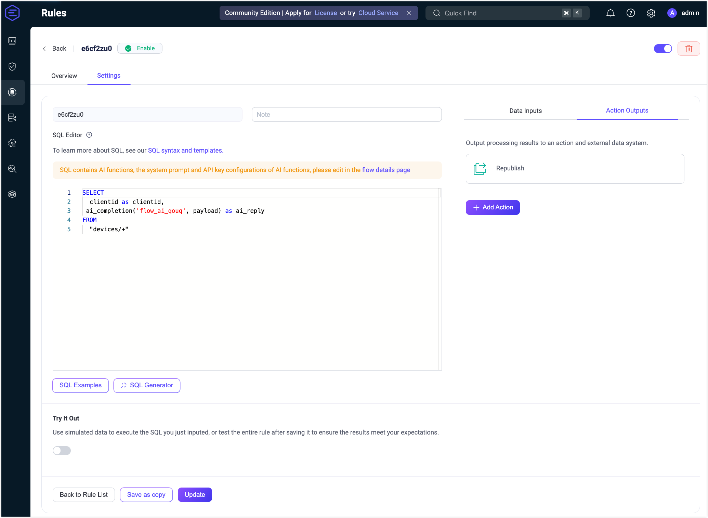
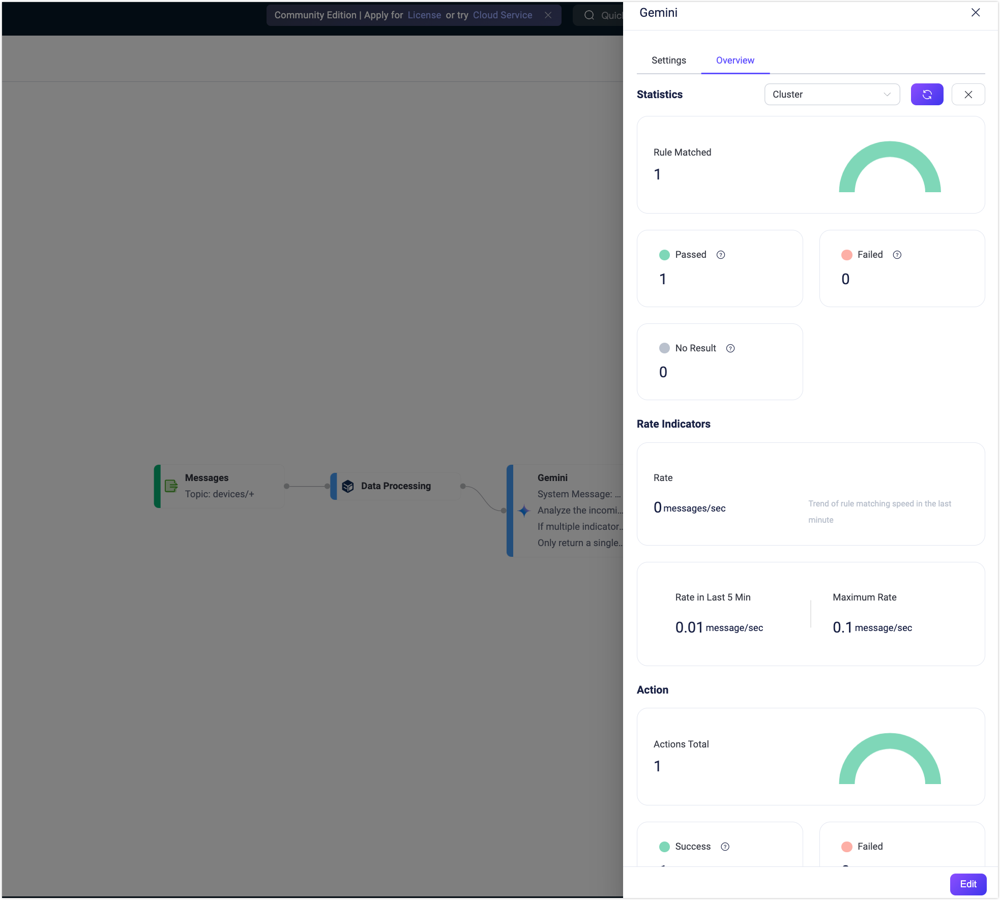

# クイックスタート：Geminiノードを使ったFlowの作成

このセクションでは、Geminiノードを用いた実践的なユースケースを通じて、FlowデザイナーでLLMベースのFlowを素早く作成・テストする方法を説明します。

この例では、構造化されたセンサーデータを含むMQTTデバイスのメッセージを処理しつつ、ルーティングのために`clientid`を保持するFlowの構築方法を示します。Geminiノードはメッセージのペイロードに基づいて返信を生成し、RepublishノードはAIの返信をクライアントごとのトピック`devices/${clientid}/reply`にパブリッシュすることで、各デバイスにカスタマイズされた返信を届けます。

## シナリオ説明

産業用モニタリングのシナリオでは、各デバイスがJSON形式の構造化センサーデータを定期的にトピック`devices/<device_id>`にパブリッシュします。従来のルールベースのアラート（例：温度の閾値超過）では、隠れたパターンや異常指標の組み合わせを見逃す可能性があります。

このFlowはGeminiを活用し、振動、温度、圧力など複数のフィールドの全体的な文脈を分析して、潜在的な機械故障を示唆する複雑な異常を検出します。例えば、振動と温度が同時に高い場合、Geminiはより深刻なリスク（例：ベアリング過負荷）を推測し、正確で説明可能なアラートを出力します。

- **データ処理**：ペイロードからデバイスの読み取り値を抽出し、後続で利用できるように`clientid`（例：`device_1`）を公開します。
- **LLMベース処理**：全ペイロードをGeminiに送信し、全フィールドにわたる包括的な分析を行います。
- **メッセージ再パブリッシュ**：AI生成のアラートをクライアントごとのトピック`devices/<district_id>/reply`にパブリッシュします。

**受信メッセージの例（`devices/device_1`宛）:**

```json
{
  "vibration": 9.5,
  "temperature": 85,
  "pressure": 1.2
}
```

**期待される再パブリッシュ出力（`devices/device_1/reply`宛）:**

```
Critical Alert: Simultaneous severe vibration and high temperature detected, indicating an immediate critical equipment malfunction risk.
```

## Flowの作成

::: tip 前提条件

有効なGemini APIキーを用意してください。

:::

1. **Flows**ページで**Create Flow**ボタンをクリックします。

2. **Messages**ノードを追加します。

   - ソースパネルから**Messages**ノードをドラッグします。
   - トピックを`devices/+`に設定します。
   - **Save**をクリックします。

3. **Data Processing**ノードを追加します。

   - **Processing**セクションから**Data Processing**ノードをドラッグします。
   - 以下の設定をフォームに入力します。この設定により、後続のノードで利用可能なように`clientid`を公開します（例：再パブリッシュのトピック`${clientid}`で使用）。
     
     - **Field**: `clientid`
     - **Transform**: 空欄のまま
     - **Alias**: `clientid`
   - **Save**をクリックします。
   
4. **Gemini**ノードを追加します。

   - **Processing**セクションから**Gemini**ノードをドラッグします。

   - ノードを設定します：

     - **Input**: `payload`を入力します。

     - **System Message**: 以下のプロンプトを入力します：

       ```
       You are an industrial anomaly detection assistant.
       Analyze the incoming sensor data (vibration, temperature, pressure) as a whole.
       If multiple indicators exceed risk thresholds at the same time, for example, if vibration > 8 and temperature > 80 in the same reading, the combined risk is significantly higher than a single abnormal value. In such cases, generate a precise, high-priority alert.
       Only return a single alert sentence—no extra explanation.
       ```
       
     - **Model**: デフォルトの`gemini-2.0-flash`のままで構いません。

     - **API Key**: Gemini APIキーを入力します。

     - **Base URL**: 空欄のままにしてGeminiのデフォルトエンドポイントを使用します。

     - **Output Result Alias**: `ai_reply`を入力します。

   - **Save**をクリックします。

5. **Republish**ノードを追加します。

   - **Sink**セクションから**Republish**ノードをドラッグします。
   - トピックを`devices/${clientid}/reply`に設定します。
   - ペイロードを`${ai_reply}`に設定します。
   - **Save**をクリックします。

6. すべてのノードを接続し、右上の**Save**をクリックしてFlowを保存します。

   

   Flowとフォームルールは相互運用可能です。ルールページでSQLや関連ルール設定も確認できます。

   

## Flowのテスト

1. MQTTクライアントをEMQXに接続します。

   Flowを素早くテストするには、ダッシュボードの**Diagnostic Tools** -> **WebSocket Client**を使ってMQTTクライアントをシミュレートできます。あるいは、[MQTTX](https://mqttx.app/)などのツールや実際のMQTTクライアントも利用可能です：

   - EMQXサーバーに接続します。
   - 例えばトピック`devices/device_1/reply`をサブスクライブします。

2. テストを開始します。

   - Flowデザイナーで任意のノードをクリックして編集パネルを開きます。

   - **Edit**をクリックし、続けて**Start Test**をクリックすると、画面下部にテストパネルが開きます。

   - **Input Simulated Data**をクリックし、以下のメッセージをトピック`devices/device_1`にパブリッシュするために**Submit Test**をクリックします：

     ```json
     {
       "vibration": 9.5,
       "temperature": 85,
       "pressure": 1.2
     }
     ```
   
3. 結果を確認します。

   - Flowの実行結果が成功したことを確認できます。

     

   - **WebSocket Client**ページに戻ると、以下のようなAI生成の要約を受信できます：

     > “High-priority alert: Simultaneous high vibration and high temperature detected.”

   - テスト結果が失敗の場合は、エラーメッセージが表示されます。

   - **Gemini**ノードの実行統計やメトリクスを確認するには、編集ページを閉じてノードをクリックし、編集パネルの**Overview**タブを開きます。

     
