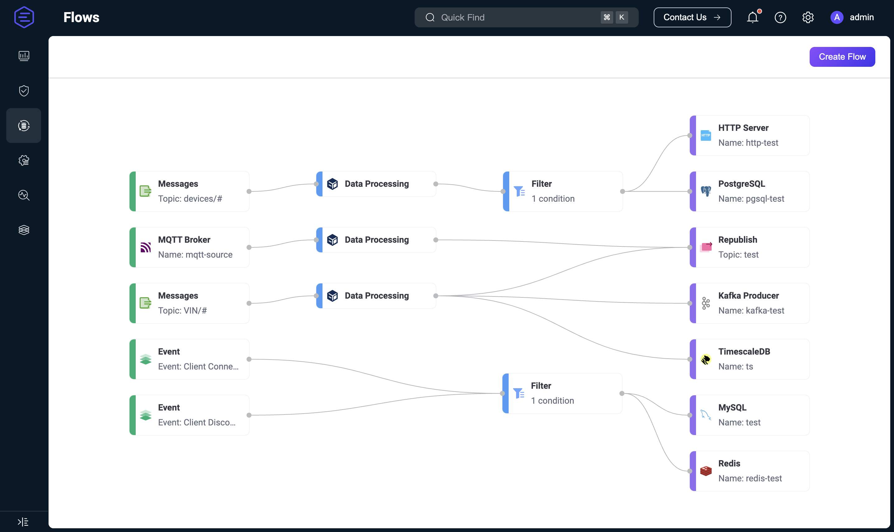
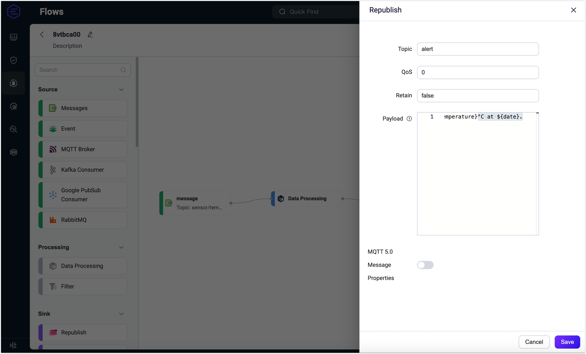
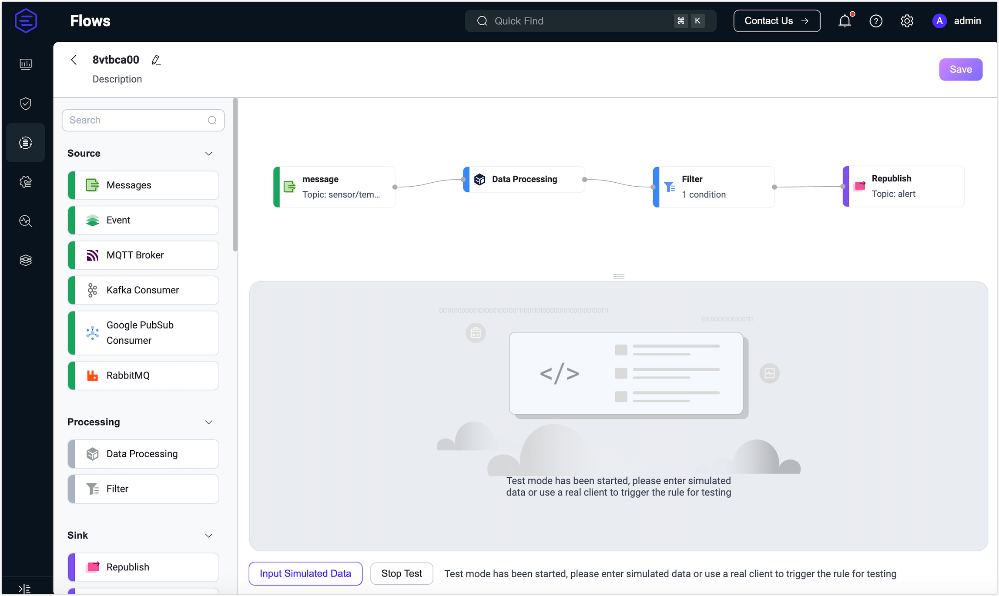
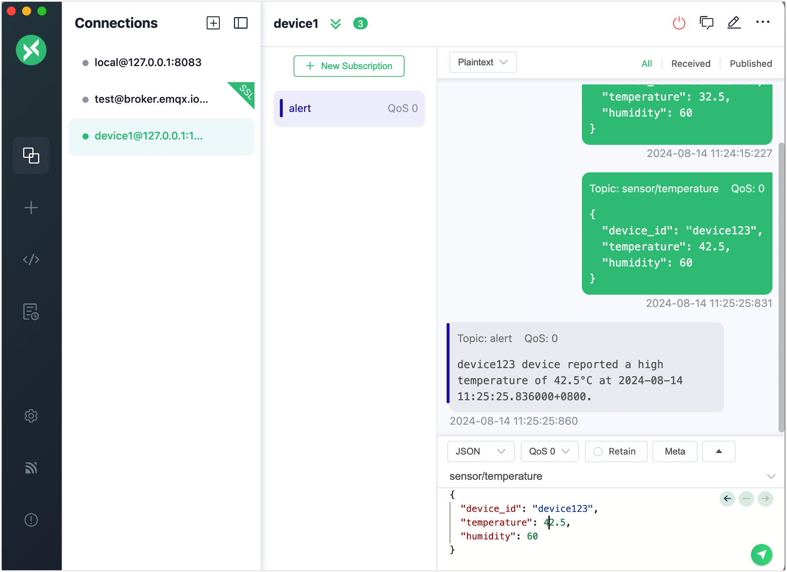

# Flowデザイナー

Flowデザイナーは、従来のビジュアルツールであるFlowsの機能を拡張し、データ処理ワークフロー（Flows）の作成および編集機能を追加した強力なビジュアルツールです。この拡張により、データ処理および統合の設定がより簡単かつ効率的になります。EMQX v5.8.0以降では、作成したデータ処理ワークフローのテストも可能です。

Data IntegrationとFlowデザイナーで作成したルールは相互運用可能です。つまり、Flowデザイナーでルールを作成すると、そのSQLや関連設定をData Integrationで確認でき、逆にData IntegrationのSQLエディターでルールを作成すると、そのデータフロー処理設定をFlowデザイナーで確認できます。



## 主な機能

EMQXダッシュボードの左メニューから **Integrations** -> **Flow Designer** をクリックするとFlowsページにアクセスできます。すでにルールやデータ統合を作成している場合、複数のノードで構成された有向非巡回グラフが表示されます。各ノードは、トピックやイベント、[Source](../data-integration/data-bridges.md#source)からのデータ読み取り、ルールによるデータ変換、アクションや[Sinks](../data-integration/data-bridges.md#source)を使ったデータ転送などのデータ処理ステップを表しています。

Flowsページでは、Rules、Webhook、Flowデザイナーで作成されたすべてのデータ処理ワークフローを表示します。Flowsを通じて、デバイスやクライアントからルール処理を経て外部データシステムへ、またはその逆に外部データシステムからルール処理を経てデバイスへとデータがどのように流れているかを可視化できます。ページを更新すると、ルールやデータ統合の最新の変更が反映されます。

**Create Flow** ボタンをクリックすると、Flow作成ページに入り、ビジュアル設定が可能です。各ステップに必要なノードをドラッグ＆ドロップで選択し、接続してワークフローを実装します。


### Source

データ入力はメッセージ、イベント、または外部データシステムからのメッセージをサポートします。Flowには少なくとも1つのSourceノードが必要で、複数のデータ入力ノードを同時にサポートできます。現在サポートされているSourceは以下の通りです：

- **Messages:** クライアントがパブリッシュしたメッセージのトピックおよびトピックワイルドカードで指定。
- **Event:** EMQX内のすべてのクライアントイベントをサポート。詳細は[Client Events](../data-integration/rule-sql-events-and-fields.md#mqtt-events)を参照。
- **外部データシステム**:
  - [MQTTサービス](../data-integration/data-bridge-mqtt.md)
  - [Kafkaコンシューマー](../data-integration/data-bridge-kafka.md)
  - [GCP PubSubコンシューマー](../data-integration/data-bridge-gcp-pubsub.md)
  - [RabbitMQ](../data-integration/data-bridge-rabbitmq.md)

### Processing

関数ノードとフィルターノードを使ってデータ処理およびフィルタリングを行います。このステップは任意で、Flowは最大で1つの関数ノードと1つのフィルターノードをサポートします：

- **データ処理:** ルールエンジンのすべての[SQL組み込み関数](../data-integration/rule-sql-builtin-functions.md)をサポート。
- **フィルター:** Sourceからのデータフィールドに対する比較フィルタリングをサポート。サポートされる比較演算子は `>, <, <=, >=, <>, !=, =, =~` です。

ビジュアルフォーム編集に加え、ProcessingノードはRule SQL構文で編集可能な式モードへの切り替えもサポートします。フィルターノードは関数ノードの後にのみ接続可能で、データはまず処理されてからフィルタリングされます。

### Sink

データソースおよび処理結果を特定のノードや外部データシステムに出力します。Flowには少なくとも1つのSinkノードが必要で、サポートされているSinkノードは以下の通りです：

- **Republish:** ローカルで指定したMQTTトピックにメッセージをパブリッシュ。
- **Console Output:** デバッグ用にメッセージをログに出力。
- **外部データシステム:** MySQLやKafkaなど40種類以上のデータシステムをサポート。詳細は[Data Integration](../data-integration/data-bridges.md)を参照。

### Flowの編集とテスト

Flow作成時にシステムがランダムなIDを生成します。IDの横にある編集アイコンをクリックすると、Flowの名前や説明を変更できます。

Flow内のノードを削除するには、ノードにカーソルを合わせて右上の削除アイコンをクリックします。ノードをクリックすると編集モードに入り、設定内容を変更して保存できます。全体のFlowは **Save** をクリックして保存します。**Start Test** ボタンをクリックすると、シミュレートデータの入力や実際のクライアントを使ったFlowの動作確認が可能です。

## 利点

Flowデザイナーは機能豊富で使いやすいツールであり、ユーザーがより効率的にデータ処理と統合を行い、ビジネスのイノベーションを促進し、データ管理の可視性と制御性を向上させます。主な特徴と利点は以下の通りです：

- **直感的なビジュアルインターフェース:** ユーザーはドラッグ＆ドロップの簡単な操作でデータ処理ワークフローを作成・調整・カスタマイズでき、プログラミング経験がなくても複雑なデータ統合ロジックを扱えます。
- **高速なリアルタイム処理:** Flowデザイナーにより、メッセージやイベントのリアルタイム処理ワークフローを数分で構築可能。これにより、ビジネスは新たなデータやイベントに迅速に対応でき、リアルタイムのビジネスニーズを支援します。
- **豊富な統合機能:** 40種類以上のデータシステムとシームレスに統合し、柔軟なデータ接続と交換オプションを提供します。
- **統合管理と監視:** ユーザーは統一されたビューでデータ統合全体を明確に管理でき、各処理ノードの状態やパフォーマンスを把握可能。これによりリアルタイムでの監視とデータフローの追跡が可能となり、高い信頼性とデータの完全性を確保します。
- **EMQXのデータ処理能力:** EMQXのルールSQLおよびSink/Source機能を活用し、その強力なデータ処理性能とパフォーマンスを継承。UIとSQLエディターを切り替え可能で、SQL編集の柔軟性とよりシンプルかつ高速なユーザー体験を両立し、EMQXルールSQL構文の深い知識なしにビジネスのイノベーションとデータ駆動型意思決定を促進します。

## クイックスタート

このセクションでは、サンプルユースケースを通じてFlowデザイナーでのFlowの迅速な作成とテスト方法を示します。

このデモでは、高温アラートを処理するデータ処理ワークフローの作成方法を紹介します。ワークフローは、温度・湿度センサーからMQTTトピック経由でデータを受信し、データのフィルタリングと変換ルールを設定し、温度が40°Cを超えた場合にアラートメッセージを新しいトピック `alert` にパブリッシュします。また、テストによってルールの有効性とデータ処理結果の検証方法も示します。

### シナリオ説明

デバイスに温度・湿度センサーが搭載されており、5秒ごとにMQTTトピック `sensor/temperature` にデータを送信すると仮定します。EMQXルールエンジンはこのデータを処理し、以下のステップを含みます：

1. **データフィルタリング:** 温度が40°Cを超えるデータのみ処理。
2. **データ変換**:
   - デバイスIDを抽出。
   - 温度情報を抽出。
   - ペイロード内のタイムスタンプを組み込み関数で読みやすい日時形式に変換。
3. **メッセージの再パブリッシュ:** 処理済みデータをアラートメッセージ形式に整形し、新しいトピック `alert` にパブリッシュ。

再パブリッシュされるサンプルデータ：

```json
{
  "device_id": "device123",
  "temperature": 22.5,
  "humidity": 60
}
```

### Flowの作成

1. Flowsページで **Create Flow** ボタンをクリック。

2. **Source** セクションから **Messages** ノードをキャンバスにドラッグし、メッセージソースのトピック（例：`sensor/temperature`）を設定して **Save** をクリック。これはクライアントがパブリッシュするメッセージのソースを指定します。

   

3. **Processing** セクションから **Data Processing** ノードをドラッグし、メッセージから以下のフィールドを抽出するデータ処理ルールを設定：

   - `payload.device_id`: エイリアスを `device_id` に設定。
   - `payload.temperature`: エイリアスを `temperature` に設定。
   - `timestamp`: `format_date` 関数を使い、メッセージのタイムスタンプを読みやすい日時形式に変換。エイリアスは `date` に設定。
     - `Time Unit`: `millisecond` を選択。
     - `Time Offset`: `+08:00` を入力。
     - `Data Format`: `%Y-%m-%d %H:%M:%S.%6N%z` を入力。詳細は[日時変換関数](../data-integration/rule-sql-builtin-functions.md#format-date-unit-string-offset-string-integer-formatstring-string-time-integer-string)を参照。
     - `Timestamp`: `timestamp` を入力。

   設定完了後、**Save** をクリック。

   

4. **Processing** から **Filter** ノードをドラッグし、データフィルタリングルールを設定。フィルター項目を追加し、`payload.temperature` を入力、演算子に `>=` を選択、値に `40` を入力して **Save** をクリック。

   

5. **Sink** から **Republish** ノードを選択し、メッセージ転送先のトピックを `alert` に設定。処理・変換済みデータを以下のペイロード形式でアラートメッセージとして整形：

   ```bash
   ${device_id} device reported a high temperature of ${temperature}°C at ${date}.
   ```

   **Save** をクリック。

   

6. 新しく作成したFlowがページに表示されます。右上の **Save** をクリックしてFlowを保存します。

   
   
   Flowとフォームルールは相互運用可能です。先に作成したルールのSQLや関連設定はルールページで確認できます。
   
   

### Flowのテスト

1. Flowデザイナーで任意のノードをクリックし、編集パネルを開きます。パネル下部の **Edit Flow** ボタンをクリック。

2. **Save** ボタン横の **Start Test** をクリックすると、下部にポップアップが表示されます。

   ポップアップで **Input Simulated Data** をクリックしてシミュレートデータを入力するか、実際のクライアントからメッセージをパブリッシュして結果を確認できます。このデモでは[MQTTX](https://mqttx.app)を使って実データをパブリッシュします。

   

3. [MQTTX Web](https://mqttx.app/web-client#/recent_connections)を開き、**New Connection** をクリックしてパブリッシャークライアント接続を作成。以下の項目を設定：

   - **Name**: `device1` と入力。
   - **Host**: EMQXサーバーの接続アドレスを入力。
   - **Port**: `8084` を入力。
   - **Username** と **Password**: **Access Control** -> **Authentication** ページで設定した認証情報を入力。

   他の設定はデフォルトのままにして **Connect** をクリック。

4. 新規サブスクリプションを作成し、トピックを `alert` に設定。

5. 温度が40°C未満のメッセージをパブリッシュすると、条件を満たさずルールSQLは実行されません。

   

6. 温度が40°C以上のメッセージをパブリッシュすると、`alert` トピックでアラートメッセージを受信できます。

   

7. テストページに戻り、成功したテスト結果を確認します。

   

   テストが失敗した場合は、エラーメッセージが表示されます。

   
