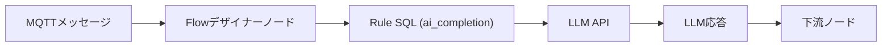

# LLMベースのMQTTデータ処理

EMQX 5.10.0以降、FlowデザイナーはOpenAI GPTやAnthropic Claudeなどの大規模言語モデル（LLM）との統合をサポートしています。この機能により、ログの要約、センサーデータの分類、MQTTメッセージの拡張、リアルタイムインサイトの生成など、自然言語プロンプトを用いたインテリジェントなメッセージフローを構築できます。

## 機能概要

FlowデザイナーのLLMベース処理ノードは、外部のLLM APIに接続してメッセージ内容を処理するAI搭載コンポーネントです。これらのノードを使うことで、MQTTデータを`gpt-4o`や`claude-3-sonnet`などのモデルに送信し、応答を受け取ってフローの下流に渡すことが可能です。

::: tip 注意

LLMの呼び出しとデータ処理には時間がかかります。モデルの応答速度によっては数秒から10秒以上かかる場合があります。そのため、LLM処理ノードは高スループット（TPS）のメッセージ処理には適していません。

:::

### 主要な概念

- **LLMプロバイダー**：AIサービス（OpenAI / Anthropic）の名前付き設定。
- **Completion Profile**：LLMモデルパラメータ（モデルID、システムプロンプト、トークン制限など）をまとめた再利用可能な設定。
- **AI Completionノード**：入力をLLMに送信し、その結果をユーザー定義のエイリアスとして保存するフローコンポーネント。
- `ai_completion`：テキストやバイナリデータをLLMに送信し応答を返すRule SQL関数。

### 動作の仕組み

FlowデザイナーでMQTTメッセージを受信すると、AI Completionノードは内部で組み込みのSQL関数`ai_completion/2,3`を呼び出し、設定されたLLMにデータを送信します。

1. メッセージは**Messages**ノード（例：トピックをサブスクライブ）を通じてフローに入ります。
2. **Data Processing**ノード（任意）で`device_id`、`payload`、`timestamp`などのフィールドを抽出または変換できます。
3. **OpenAI**または**Anthropic**ノードは背後で`ai_completion`関数を使い、

     - 選択された**Completion Profile**（プロバイダー情報、モデル名、システムメッセージなど）を参照します。
     - 選択された入力（例：`payload`）をLLMに送信します。
     - LLM APIからの応答（要約や分類結果など）を受け取ります。
4. 応答は**Output Result Alias**に格納され、以下のような下流ノードで利用可能になります。

     - **Republish**（別トピックへパブリッシュ）

     - **Database**（PostgreSQL、MongoDBなどに結果を挿入）

     - **Bridge**（リモートブローカーやクラウドサービスへ転送）

### 対応LLMプロバイダー

EMQX 5.10.0は以下のプロバイダーをサポートしています：

- **OpenAI**：GPT-3.5、GPT-4、GPT-4oなど
- **Anthropic**：Claude 3モデル

## LLMベース処理ノードの設定

FlowデザイナーでLLMを利用するには、OpenAIノードまたはAnthropicノードのいずれかを選択して専用の処理ノードを設定します。各ノードでは、MQTTメッセージデータのどのフィールドをLLMに送るか、システムプロンプトによるモデルの動作指定、AI生成結果の保存先エイリアスなどを定義できます。設定後は、これらのノードが背後で`ai_completion`関数を自動的に呼び出し、選択したLLMでデータ処理を行います。

### OpenAIノードの設定方法

OpenAIノードを使用するには：

1. **Processing**パネルから**OpenAI**ノードをドラッグします。

2. ソースまたは前処理ノードに接続します。

3. 以下の項目を設定します：

   - **Input**：ソースフィールドを入力または選択します。選択肢は`event`、`id`、`clientid`、`username`、`payload`などです。

   - **System Message**：AIモデルに期待される出力を生成させるためのプロンプトメッセージを入力します。例：「入力JSONデータの数値キーの値を合計し、結果のみを出力してください」。

   - **Model**：LLMプロバイダーのモデルを選択します。例：`gpt-4o`、`gpt-3.5-turbo`。

   - **API Key**：OpenAIのAPIキーを入力します。

   - **Base URL**：任意のカスタムエンドポイントを入力します。空欄の場合はOpenAIのデフォルトエンドポイントが使用されます。

   - **Output Result Alias**：LLMの出力結果を保持する変数名です。アクションや後続処理で参照するために使用します。例：`summary`。

     ::: tip

     エイリアスに英数字とアンダースコア以外の文字が含まれる場合、数字で始まる場合、またはSQLキーワードの場合は、エイリアスをダブルクォーテーションで囲んでください。

     :::

4. **保存**をクリックして設定を適用します。

### Anthropicノードの設定方法

Anthropicノードを使用するには：

1. **Processing**パネルから**Anthropic**ノードをドラッグします。

2. メッセージ入力ノードまたはData Processingノードに接続します。

3. 以下の項目を設定します：

   - **Input**：ソースフィールドを入力または選択します。選択肢は`event`、`id`、`clientid`、`username`、`payload`などです。

   - **System Message**：AIモデルに期待される出力を生成させるためのプロンプトメッセージを入力します。例：「入力JSONデータの数値キーの値を合計し、結果のみを出力してください」。

   - **Model**：LLMプロバイダーのモデルを選択します。例：`claude-3-sonnet-20240620`。

   - **Max Tokens**：応答の長さを制御します（デフォルト：`100`）。

   - **Anthropic Version**：Anthropicのバージョンを選択します（デフォルト：`2023-06-01`）。

   - **API Key**：AnthropicのAPIキーを入力します。

   - **Base URL**：任意のカスタムエンドポイントを入力します。空欄の場合はAnthropicのデフォルトエンドポイントが使用されます。

   - **Output Result Alias**：

   - LLMの出力結果を保持する変数名です。アクションや後続処理で参照するために使用します。例：`summary`。

     ::: tip

     エイリアスに英数字とアンダースコア以外の文字が含まれる場合、数字で始まる場合、またはSQLキーワードの場合は、エイリアスをダブルクォーテーションで囲んでください。

     :::

4. **保存**をクリックして設定を適用します。

## クイックスタート

以下の2つの例では、EMQXでLLMベース処理ノードを使ったフローの簡単な構築とテスト方法を示しています：

- [OpenAIノードを使ったフロー作成](./openai-node-quick-start.md)：GPTモデルを使ってMQTTメッセージの要約や変換を行います。
- [Anthropicノードを使ったフロー作成](./anthropic-node-quick-start.md)：Claudeモデルを使ってMQTTメッセージ内の数値処理を行います。

## さらに詳しく

LLM搭載のMQTTデータ処理機能については、ブログ記事をご覧ください：[IoT向けリアルタイムAI：EMQX 5.10におけるLLM統合の紹介](https://www.emqx.com/en/blog/introducing-llm-integration-in-emqx-5-10)。
