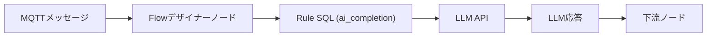

# LLMベースのMQTTデータ処理

EMQX 5.10.0以降、FlowデザイナーはOpenAI GPT、Anthropic Claude、Google Geminiなどの大規模言語モデル（LLM）との統合をサポートしています。この機能により、ログの要約、センサーデータの分類、MQTTメッセージの拡充、リアルタイムインサイトの生成など、自然言語プロンプトを用いたインテリジェントなメッセージフローを構築できます。

## 機能概要

FlowデザイナーのLLMベース処理ノードは、外部のLLM APIに接続してメッセージ内容を処理するAI搭載コンポーネントです。これらのノードを使うことで、MQTTデータを`gpt-4o`や`claude-3-sonnet`などのモデルに送信し、応答を受け取り、フローの下流に渡すことが可能です。

::: tip 注意

LLMの呼び出しとデータ処理には時間がかかります。モデルの応答速度によっては、数秒から10秒以上かかる場合があります。そのため、LLM処理ノードは高いメッセージスループット（TPS）が求められるシナリオには適していません。

:::

### 主要な概念

- **LLMプロバイダー**：AIサービス（OpenAI、Anthropic、Gemini）の名前付き設定。
- **Completion Profile**：LLMモデルパラメータ（モデルID、システムプロンプト、トークン制限など）の再利用可能なバンドル。
- **AI Completion Node**：入力をLLMに送信し、その結果をユーザー定義のエイリアスとして格納するフローコンポーネント。
- `ai_completion`：テキストやバイナリデータをLLMに送信し応答を返すRule SQL関数。

### 動作の仕組み

FlowデザイナーでMQTTメッセージを受信すると、AI Completion Nodeは内部的に組み込みのSQL関数`ai_completion/2,3`を呼び出して、設定されたLLMにデータを送信します。

1. メッセージは**Messages**ノード（例：トピックをサブスクライブ）を通じてフローに入ります。
2. **データ処理**ノード（任意）で`device_id`、`payload`、`timestamp`などのフィールドを抽出または変換できます。
3. **AI Completion Node**（OpenAI、Anthropic、Gemini）は背後で`ai_completion`関数を使い、

     - 選択された**Completion Profile**（プロバイダー情報、モデル名、システムメッセージなど）を参照し、
     - 選択された入力（例：`payload`）をLLMに送信、
     - LLM APIからの応答（要約や分類結果など）を受け取ります。
4. 応答は**Output Result Alias**に格納され、以下のような下流ノードで利用可能になります。

     - **Republish**（別トピックにパブリッシュする）
     - **Database**（PostgreSQLやMongoDBなどに結果を挿入）
     - **Bridge**（リモートブローカーやクラウドサービスへ転送）

### 対応LLMプロバイダー

EMQX 5.10.0は以下のプロバイダーをサポートしています：

- **OpenAI**：GPT-4.1、o4-miniなど
- **Anthropic**：claude-3-5-haiku、claude-3-7-sonnet、claude-sonnet-4など
- **Gemini**：gemini-2.0-flash、gemini-2.5-flash、gemini-2.5-proなど

::: tip 互換性について

公式にリストされているプロバイダーに加え、EMQXはOpenAIプラットフォームとAPI互換のある任意のLLMサービスもサポートしています。

:::

## LLMベース処理ノードの設定

FlowデザイナーでLLMを利用するには、OpenAIノードまたはAnthropicノードなど、選択したプロバイダー専用の処理ノードを設定する必要があります。各ノードでは、MQTTメッセージデータをLLMに送信する方法（入力フィールドの選択、システムプロンプトによるモデルの動作指定、AI生成結果の格納先など）を定義できます。設定後、これらのノードは背後で`ai_completion`関数をシームレスに呼び出し、選択したLLMを使ってデータ処理を行います。

### OpenAIノードの設定

OpenAIノードを使用するには：

1. **Processing**パネルから**OpenAI**ノードをドラッグします。

2. ソースまたは前処理ノードに接続します。

3. 以下の項目を設定します：

   - **Input**：ソースフィールドを入力または選択します。選択肢は`event`、`id`、`clientid`、`username`、`payload`などです。

   - **System Message**：AIモデルに期待される出力を生成させるためのプロンプトメッセージを入力します。例：「入力JSONデータの数値キーの値を合計し、結果のみを出力してください」。

   - **Model**：LLMプロバイダーを選択します。例：`gpt-4o`、`gpt-3.5-turbo`。

   - **API Key**：OpenAIのAPIキーを入力します。

   - **Base URL**：任意のカスタムエンドポイントを入力します。空欄の場合はOpenAIのデフォルトエンドポイントが使用されます。

     ::: tip

     このフィールドに他のOpenAI互換サービスのAPIベースURLとAPIキーを入力することで接続可能です。

     :::

   - **Output Result Alias**：LLM出力を格納する変数名です。アクションや後続処理で参照します。例：`summary`。
   
     ::: tip
   
     エイリアスに英数字とアンダースコア以外の文字が含まれる、数字で始まる、またはSQLキーワードの場合は、ダブルクォーテーションで囲んでください。
   
     :::

4. **保存**をクリックして設定を適用します。

### Anthropicノードの設定

Anthropicノードを使用するには：

1. **Processing**パネルから**Anthropic**ノードをドラッグします。

2. メッセージ入力またはデータ処理ノードに接続します。

3. 以下の項目を設定します：

   - **Input**：ソースフィールドを入力または選択します。選択肢は`event`、`id`、`clientid`、`username`、`payload`などです。

   - **System Message**：AIモデルに期待される出力を生成させるためのプロンプトメッセージを入力します。例：「入力JSONデータの数値キーの値を合計し、結果のみを出力してください」。

   - **Model**：LLMプロバイダーを選択します。例：`claude-3-sonnet-20240620`。

   - **Max Tokens**：応答の長さを制御します（デフォルト：`100`）。

   - **Anthropic Version**：Anthropicのバージョンを選択します（デフォルト：`2023-06-01`）。

   - **API Key**：AnthropicのAPIキーを入力します。

   - **Base URL**：任意のカスタムエンドポイントを入力します。空欄の場合はAnthropicのデフォルトエンドポイントが使用されます。

   - **Output Result Alias**：LLM出力を格納する変数名です。アクションや後続処理で参照します。例：`summary`。

     ::: tip

     エイリアスに英数字とアンダースコア以外の文字が含まれる、数字で始まる、またはSQLキーワードの場合は、ダブルクォーテーションで囲んでください。

     :::

4. **保存**をクリックして設定を適用します。

### Geminiノードの設定

Geminiノードを使用するには：

1. **Processing**パネルから**Gemini**ノードをドラッグします。

2. ソースまたは前処理ノードに接続します。

3. 以下の項目を設定します：

   - **Input**：ソースフィールドを入力または選択します。選択肢は`event`、`id`、`clientid`、`username`、`payload`などです。

   - **System Message**：AIモデルに期待される出力を生成させるためのプロンプトメッセージを入力します。例：「入力JSONデータの数値キーの値を合計し、結果のみを出力してください」。

   - **Model**：LLMプロバイダーを選択します。例：`gemini-2.0-flash`、`gemini-2.5-pro`。

   - **API Key**：GeminiのAPIキーを入力します。

   - **Base URL**：任意のカスタムエンドポイントを入力します。空欄の場合はGeminiのデフォルトエンドポイントが使用されます。

   - **Output Result Alias**：LLM出力を格納する変数名です。アクションや後続処理で参照します。例：`summary`。

     ::: tip

     エイリアスに英数字とアンダースコア以外の文字が含まれる、数字で始まる、またはSQLキーワードの場合は、ダブルクォーテーションで囲んでください。

     :::

4. **保存**をクリックして設定を適用します。

## クイックスタート

以下の2つの例は、EMQXでLLMベース処理ノードを使ってフローを素早く構築・テストする方法を示しています：

- [OpenAIノードを使ったフローの作成](./openai-node-quick-start.md)：GPTモデルを使ってMQTTメッセージを要約または変換します。
- [Anthropicノードを使ったフローの作成](./anthropic-node-quick-start.md)：Claudeモデルを使ってMQTTメッセージの数値を処理します。
- [Geminiノードを使ったフローの作成](./gemini-node-quick-start.md)：Geminiモデルを使ってMQTTメッセージ内のプロンプトに基づくコンテキスト応答を生成し、MQTTクライアントIDを使ってクライアント別トピックにルーティングします。

## 詳細情報

LLM搭載のMQTTデータ処理機能については、ブログ記事をご覧ください：[Real-Time AI for IoT: Introducing LLM Integration in EMQX 5.10](https://www.emqx.com/en/blog/introducing-llm-integration-in-emqx-5-10)。
