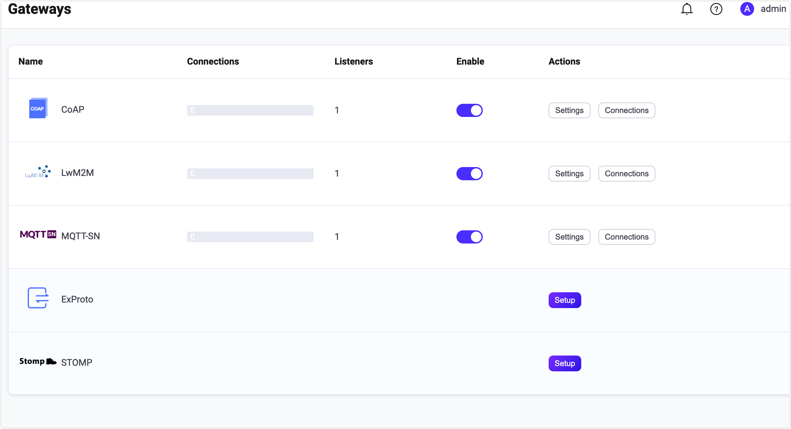

# CoAP ゲートウェイ

EMQX の CoAP ゲートウェイは、[Publish-Subscribe Broker for the CoAP](https://datatracker.ietf.org/doc/html/draft-ietf-core-coap-pubsub-09) プロトコルに準拠し、標準的なパブリッシュ、サブスクライブ、およびメッセージ受信を実装可能にします。

以下は、コネクションモードとコネクションレスモードでサポートされる機能一覧です。

| 機能               | コネクションレスモード | コネクションモード |
| ------------------ | ---------------------- | ------------------ |
| メッセージパブリッシュ | √                      | √                  |
| トピックサブスクライブ | √                      | √                  |
| トピックのサブスクライブ解除 | ×                      | √                  |
| コネクション作成       | ×                      | √                  |
| コネクション終了       | ×                      | √                  |
| ハートビート           | ×                      | √                  |
| 認証                 | ×                      | √                  |

<!--アーキテクチャの簡単な紹介-->

## CoAP ゲートウェイの有効化

EMQX 5 では、CoAP ゲートウェイはダッシュボード、REST API、設定ファイル `base.hocon` を通じて設定および有効化が可能です。本節では、ダッシュボードを例に操作手順を説明します。

EMQX ダッシュボードの左ナビゲーションメニューで **Extensions** -> **Gateways** をクリックします。**Gateway** ページにはサポートされているすべてのゲートウェイが一覧表示されます。**CoAP** を見つけ、**Actions** 列の **Setup** をクリックすると、**Initialize CoAP** ページに遷移します。

::: tip

EMQX をクラスターで稼働している場合、ダッシュボードや REST API で行った設定はクラスター全体に影響します。特定のノードのみ設定を変更したい場合は、[`base.hocon`](../../guides/configuration/configuration.md) で設定してください。

:::

EMQX CoAP ゲートウェイは、コネクションレスモードとコネクションモードの両方をサポートします。コネクションレスモードでは、メッセージは一回限りの送信として扱われ、センサーの読み取りや単純なコマンド送信などの短時間のやり取りに適しています。コネクションモードでは、クライアントはデータ転送開始前にブローカーとコネクションを確立します。

**Connection Requested** の設定で、コネクションモードを有効にするかコネクションレスモードにするかを選択できます。デフォルトは `false`（コネクションレスモード）です。

コネクションモードを確認後、設定を続けられます。特別なカスタマイズが不要な場合は、以下の3クリックで CoAP ゲートウェイを有効化できます。

1. **Basic Configuration** タブで **Next** をクリックし、すべてのデフォルト設定を受け入れます。
2. 次に **Listeners** タブに遷移し、EMQX はポート `5683` に UDP リスナーを事前設定しています。ここで再度 **Next** をクリックして設定を確定します。
3. 最後に **Enable** ボタンをクリックして CoAP ゲートウェイを有効化します。

ゲートウェイの有効化が完了すると、**Gateways** ページに戻り、CoAP ゲートウェイのステータスが **Enabled** と表示されていることを確認できます。



上記の設定は REST API でも可能です。

**例:**

```bash
curl -X 'PUT' 'http://127.0.0.1:18083/api/v5/gateways/coap' \
  -u <your-application-key>:<your-security-key> \
  -H 'Content-Type: application/json' \
  -d '{
  "name": "coap",
  "enable": true,
  "mountpoint": "coap/",
  "connection_required": false,
  "listeners": [
    {
      "type": "udp",
      "name": "default",
      "bind": "5683",
      "max_conn_rate": 1000,
      "max_connections": 1024000
    }
  ]
}'
```

詳細な REST API の説明は [REST API - Gateway](../../guides/api.md) をご参照ください。

カスタマイズが必要な場合やリスナーの追加、認証ルールの追加を行いたい場合は、[CoAP ゲートウェイのカスタマイズ](#customize-your-coap-gateway) セクションをお読みください。

CoAP ゲートウェイは UDP および DTLS タイプリスナーのみをサポートします。設定可能なパラメータの完全な一覧は [Gateway Configuration - Listeners](https://docs.emqx.com/en/enterprise/v@EE_VERSION@/hocon/) を参照してください。

## CoAP クライアントとの連携

### クライアントライブラリ

CoAP ゲートウェイを構築した後、CoAP クライアントツールを使って接続テストを行い、正常に動作することを確認できます。以下は推奨される CoAP クライアントツールの例です。

- [libcoap](https://github.com/obgm/libcoap)
- [californium](https://github.com/eclipse/californium)

## パブリッシュ／サブスクライブ

CoAP ゲートウェイは、[Publish-Subscribe Broker for the CoAP](https://datatracker.ietf.org/doc/html/draft-ietf-core-coap-pubsub-09) 標準で定義された URI パスとメソッドを使用します。

詳細なパラメータは [メッセージパブリッシュ](#message-publish)、[トピックサブスクライブ](#topic-subscribe)、[トピックサブスクライブ解除](#topic-unsubscribe) を参照してください。

## CoAP ゲートウェイのカスタマイズ

デフォルト設定に加え、EMQX はさまざまな設定オプションを提供し、特定のビジネス要件により適合させることができます。本節では、**Gateways** ページにある各フィールドの詳細を説明します。以下のスクリーンショット下の説明もご参照ください。


- **Connection Required**: コネクションレスモードかコネクションモードかを設定します。デフォルトは `false`（コネクションレスモード）。選択肢は `false`（コネクションレス）、`true`（コネクション）です。

- **Notification Message Type**: 配信される CoAP メッセージのタイプを設定します。デフォルトは `qos`。選択肢は以下の通りです。

  - **qos**: 受信したメッセージの QoS レベルに応じて CoAP 通知のアック（ACK）要否を決定します。
    - QoS 0 の場合、クライアントからのアックは不要
    - QoS 1/2 の場合、クライアントからのアックが必要
  - **con**: CoAP 通知はクライアントからのアックが必要
  - **non**: CoAP 通知はクライアントからのアックは不要

- **Heartbeat**: **Connection Required** が `true` の場合のみ必要。接続を維持するための最小ハートビート間隔を設定します。デフォルトは 30 秒。

- **Enable Statistics**: ゲートウェイの統計収集とレポートを許可するか設定します。デフォルトは `true`。選択肢は `true`、`false`。

- **Subscriber QoS**: サブスクライブ要求のデフォルト QoS レベルを設定します。デフォルトは `coap`。選択肢は以下の通りです。

  - **coap**: **Notification Message Type** の設定に従い QoS レベルを決定
    - アック不要の場合は QoS 0
    - アック必要の場合は QoS 1
  - **qos0**, **qos1**, **qos2**

- **Publish QoS**: パブリッシュ要求のデフォルト QoS レベルを設定します。デフォルトは `coap`。選択肢は `coap`、`qos0`、`qos1`、`qos2`。

- **MountPoint**: パブリッシュやサブスクライブ時にすべてのトピックの前に付加される文字列を設定します。これにより異なるプロトコル間でのメッセージルーティングの分離を実現できます。例: *CoAP*。

  **注意**: このトピックプレフィックスはゲートウェイが管理します。CoAP クライアントはパブリッシュやサブスクライブ時にこのプレフィックスを明示的に付加する必要はありません。

### リスナーの追加

デフォルトで、名前が **default** の UDP リスナーがポート `5683` に設定されており、最大 1,024,000 の同時接続をサポートしています。**Settings** をクリックすると詳細設定が可能で、**Delete** でリスナー削除、**Add Listener** で新規リスナー追加ができます。


**Add Listener** をクリックすると **Add Listener** ページが開き、以下の設定項目を続けて設定できます。

**基本設定**

- **Name**: リスナーの一意識別子を設定します。
- **Type**: プロトコルタイプを選択します。CoAP では `udp` または `dtls` を選択可能です。
- **Bind**: リスナーが接続を受け付けるポート番号を設定します。
- **MountPoint**（任意）: パブリッシュやサブスクライブ時にトピックの前に付加される文字列を設定し、異なるプロトコル間のメッセージルーティング分離を実現します。

**リスナー設定**

- **Max Connections**: リスナーが処理可能な最大同時接続数を設定します。デフォルトは 1024000。
- **Max Connection Rate**: リスナーが1秒あたり受け入れる新規接続の最大レートを設定します。デフォルトは 1000。

**UDP 設定**

- **ActiveN**: ソケットの `{active, N}` オプションを設定します。これはソケットが能動的に処理可能な受信パケット数です。詳細は [Erlang Documentation - setopts/2](https://www.erlang.org/doc/apps/kernel/inet.html#setopts/2) を参照してください。
- **Buffer**: 受信および送信パケットを格納するバッファサイズを KB 単位で設定します。
- **Receive Buffer**: 受信バッファサイズを KB 単位で設定します。
- **Send Buffer**: 送信バッファサイズを KB 単位で設定します。
- **SO_REUSEADDR**: ポート番号のローカル再利用を許可するかどうかを設定します。

**DTLS 設定**（DTLS リスナーのみ）

TLS Verify の有効化はトグルスイッチで設定可能ですが、その前に関連する **TLS Cert**、**TLS Key**、**CA Cert** の情報をファイル内容の入力または **Select File** ボタンでアップロードして設定する必要があります。詳細は [Enable SSL/TLS Connections](https://docs.emqx.com/en/enterprise/v5.0/network/emqx-mqtt-tls.html) を参照してください。

### 認証の設定

クライアント ID、ユーザー名、パスワードはクライアントの [Create Connection](#create-connection) リクエストで提供されます。CoAP ゲートウェイは以下の認証方式をサポートします。

- [組み込みデータベース認証](../../guides/access-control/authn/mnesia.md)
- [MySQL 認証](../../guides/access-control/authn/mysql.md)
- [MongoDB 認証](../../guides/access-control/authn/mongodb.md)
- [PostgreSQL 認証](../../guides/access-control/authn/postgresql.md)
- [Redis 認証](../../guides/access-control/authn/redis.md)
- [HTTP サーバ認証](../../guides/access-control/authn/http.md)
- [JWT 認証](../../guides/access-control/authn/jwt.md)
- [LDAP 認証](../../guides/access-control/authn/ldap.md)

ここではダッシュボードを例に認証設定方法を説明します。

**Gateways** ページで **CoAP** を見つけ、**Actions** 列の **Setup** をクリックし、**Authentication** タブに入ります。

**Create Authentication** をクリックし、**Mechanism** に **Password-Based** または **JWT** を選択し、必要に応じて **Backend** を選択します。

認証方式の詳細な設定方法は、本節冒頭に記載の各ページを参照してください。

ダッシュボード以外にも REST API で認証設定が可能です。例えば、CoAP ゲートウェイ用に組み込みデータベース認証を作成する場合、以下のコードを使用します。

```bash
curl -X 'POST' \
  'http://127.0.0.1:18083/api/v5/gateway/coap/authentication' \
  -u <your-application-key>:<your-security-key> \
  -H 'accept: application/json' \
  -H 'Content-Type: application/json' \
  -d '{
  "backend": "built_in_database",
  "mechanism": "password_based",
  "password_hash_algorithm": {
    "name": "sha256",
    "salt_position": "suffix"
  },
  "user_id_type": "username"
}'
```

::: tip

MQTT プロトコルとは異なり、**ゲートウェイは認証器の作成のみをサポートし、認証器リスト（または認証チェーン）はサポートしません**。認証器が有効化されていない場合、すべての CoAP クライアントのログインが許可されます。

:::

## リファレンス: CoAP クライアントガイド

### Create Connection

`Connection Mode` のみ利用可能です。

このインターフェースは、CoAP ゲートウェイへのクライアントコネクションを作成するために使用されます。CoAP ゲートウェイの認証が有効な場合、このリクエストで提供された `clientid`、`username`、`password` の検証を行い、不正ユーザーを防止します。

**リクエストパラメータ:**

- メソッド: `POST`
- URI: `mqtt/connection{?QueryString*}`、`QueryString` は以下の通り:
  - `clientid`: 必須パラメータ、UTF-8 文字列。ゲートウェイはこの文字列をコネクションの一意識別子として使用します。
  - `username`: 任意パラメータ、UTF-8 文字列。接続認証に使用。
  - `password`: 任意パラメータ、UTF-8 文字列。接続認証に使用。
- ペイロード: 空

**レスポンス:**

- ステータスコード:
  - `2.01`: コネクション作成成功。このコネクション用のトークン文字列がメッセージボディに返されます。
  - `4.00`: 不正なリクエスト。詳細なエラー情報がメッセージボディに返されます。
  - `4.01`: 認可されていません。リクエスト形式は正しいが認可に失敗。
- ペイロード: ステータスコードが `2.01` の場合は `Token`、それ以外は `ErrorMessage`。
  - `Token`: 以降のリクエストで使用するトークン文字列。
  - `ErrorMessage`: エラー内容の説明。

`libcoap` を例に示します。

```bash
# clientid 123、username と password に admin/public を指定して接続リクエストを送信。
# 返却されたトークンは 3404490787
coap-client -m post -e "" "coap://127.0.0.1/mqtt/connection?clientid=123&username=admin&password=public"

3404490787
```

:::tip
コネクション作成成功後、ダッシュボード、REST API、CLI で CoAP ゲートウェイのクライアント一覧を確認できます。
:::

### Close Connection

`Connection Mode` のみ利用可能です。

このインターフェースは CoAP コネクションを終了するために使用されます。

**リクエストパラメータ:**

- メソッド: `DELETE`
- URI: `mqtt/connection{?QueryString*}`、`QueryString` は以下の通り:
  - `clientid`: 必須パラメータ、UTF-8 文字列。ゲートウェイはこの文字列をコネクションの一意識別子として使用します。
  - `token`: 必須パラメータ。`Create Connection` リクエストで返されたトークン文字列を使用します。
- ペイロード: 空

**レスポンス:**

- ステータスコード:
  - `2.01`: コネクション終了成功。
  - `4.00`: 不正なリクエスト。詳細なエラー情報がメッセージボディに返されます。
  - `4.01`: 認可されていません。リクエスト形式は正しいが認可に失敗。
- ペイロード: ステータスコードが `2.01` の場合は `Token`、それ以外は `ErrorMessage`。

例:

```bash
coap-client -m delete -e "" "coap://127.0.0.1/mqtt/connection?clientid=123&token=3404490787"
```

### Heartbeat

`Connection Mode` のみ利用可能です。

このインターフェースは CoAP クライアントとゲートウェイ間のコネクションを維持するために使用されます。ハートビートが期限切れになると、ゲートウェイはセッションとサブスクリプションを削除し、そのクライアントのすべてのリソースを解放します。

**リクエストパラメータ:**

- メソッド: `PUT`
- URI: `mqtt/connection{?QueryString*}`、`QueryString` は以下の通り:
  - `clientid`: 必須パラメータ、UTF-8 文字列。ゲートウェイはこの文字列をコネクションの一意識別子として使用します。
  - `token`: 必須パラメータ。`Create Connection` リクエストで返されたトークン文字列を使用します。
- ペイロード: 空

**レスポンス:**

- ステータスコード:
  - `2.01`: コネクション維持成功。
  - `4.00`: 不正なリクエスト。詳細なエラー情報がメッセージボディに返されます。
  - `4.01`: 認可されていません。リクエスト形式は正しいが認可に失敗。
- ペイロード: ステータスコードが `2.01` の場合は `Token`、それ以外は `ErrorMessage`。

例:

```bash
coap-client -m put -e "" "coap://127.0.0.1/mqtt/connection?clientid=123&token=3404490787"
```

:::tip
ハートビート間隔は CoAP ゲートウェイの `heartbeat` オプションで決定され、デフォルトは 30 秒です。
:::

### メッセージパブリッシュ

このインターフェースは CoAP クライアントが指定したトピックにメッセージを送信するために使用されます。`Connection Mode` が有効な場合は追加の識別情報を付与する必要があります。

**リクエストパラメータ:**

- メソッド: `POST`
- URI: `ps/{+topic}{?QueryString*}`
  - `{+topic}` はパブリッシュするメッセージのトピックです。例: `coap/test` にパブリッシュする場合、URI は `ps/coap/test` となります。
  - `{?QueryString}` はリクエストパラメータ:
    - `clientid`: `Connection Mode` では必須、`Connectionless Mode` では任意。
    - `token`: `Connection Mode` のみ必須。
    - `retain`（任意）: リテインメッセージとしてパブリッシュするかどうか。ブール値で、デフォルトは `false`。
    - `qos`: メッセージの QoS。メッセージの QoS レベルを示し、MQTT クライアントの受信方法にのみ影響します。値は `0`、`1`、`2` のいずれか。
    - `expiry`: メッセージの有効期限（秒単位）。デフォルトは 0（期限なし）。

- ペイロード: メッセージペイロード

**レスポンス:**

- ステータスコード:
  - `2.04`: パブリッシュ成功
  - `4.00`: 不正なリクエスト。詳細なエラー情報がメッセージボディに返されます。
  - `4.01`: 認可されていません。リクエスト形式は正しいが認可に失敗。
- ペイロード: ステータスコードが `2.04` の場合は空、そうでなければ `ErrorMessage`。

例: `Connectionless Mode` でメッセージをパブリッシュする場合

```bash
coap-client -m post -e "Hi, this is libcoap" "coap://127.0.0.1/ps/coap/test"
```

または、`Connection Mode` で `clientid` と `token` を付与する場合

```bash
coap-client -m post -e "Hi, this is libcoap" "coap://127.0.0.1/ps/coap/test?clientid=123&token=3404490787"
```

### トピックサブスクライブ

このインターフェースは CoAP クライアントがトピックをサブスクライブするために使用されます。`Connection Mode` が有効な場合は追加の識別情報を付与する必要があります。

**リクエストパラメータ:**

- メソッド: `GET`
- オプション: `observer` を `0` に設定
- URI: `ps/{+topic}{?QueryString*}`
  - `{+topic}` はサブスクライブするトピックです。例: `coap/test` にサブスクライブする場合、URI は `ps/coap/test` となります。
  - `{?QueryString}` はリクエストパラメータ:
    - `clientid`: `Connection Mode` では必須、`Connectionless Mode` では任意。
    - `token`: `Connection Mode` のみ必須。
    - `qos`: サブスクライブ QoS。ゲートウェイが CoAP クライアントにメッセージを配信する際に使用する MessageType（`CON` または `NON`）を示します。値は以下の通りです。
      - `0`: `NON` メッセージで配信
      - `1` または `2`: `CON` メッセージで配信

- ペイロード: 空

**レスポンス:**

- ステータスコード:
  - `2.05`: サブスクライブ成功
  - `4.00`: 不正なリクエスト。詳細なエラー情報がメッセージボディに返されます。
  - `4.01`: 認可されていません。リクエスト形式は正しいが認可に失敗。
- ペイロード: ステータスコードが `2.05` の場合は空、そうでなければ `ErrorMessage`。

例: `Connectionless Mode` で `coap/test` をサブスクライブする場合

```bash
coap-client -m get -s 60 -O 6,0x00 -o - -T "obstoken" "coap://127.0.0.1/ps/coap/test"
```

または、`Connection Mode` で `clientid` と `token` を付与してサブスクライブする場合

```bash
coap-client -m get -s 60 -O 6,0x00 -o - -T "obstoken" "coap://127.0.0.1/ps/coap/test?clientid=123&token=3404490787"
```

### トピックサブスクライブ解除

このインターフェースは CoAP クライアントがトピックのサブスクライブを解除するために使用されます。

現状の実装では、サブスクライブ解除操作は `Connection Mode` のみで利用可能です。

**リクエストパラメータ:**

- メソッド: `GET`
- URI: `ps/{+topic}{?QueryString*}`
  - `{+topic}` はサブスクライブ解除するトピックです。例: `coap/test` のサブスクライブを解除する場合、URI は `ps/coap/test` となります。
  - `{?QueryString}` はリクエストパラメータ:
    - `clientid`: `Connection Mode` では必須、`Connectionless Mode` では任意。
    - `token`: `Connection Mode` のみ必須。

- ペイロード: 空

**レスポンス:**

- ステータスコード:
  - `2.07`: サブスクライブ解除成功
  - `4.00`: 不正なリクエスト。詳細なエラー情報がメッセージボディに返されます。
  - `4.01`: 認可されていません。リクエスト形式は正しいが認可に失敗。
- ペイロード: ステータスコードが `2.07` の場合は空、そうでなければ `ErrorMessage`。

例: `Connection Mode` で `coap/test` のサブスクライブを解除する場合

```bash
coap-client -m get -O 6,0x01 "coap://127.0.0.1/ps/coap/test?clientid=123&token=3404490787"
```

### 短縮パラメータ名

メッセージサイズ削減のため、CoAP ゲートウェイは短縮パラメータ名をサポートしています。

例えば、`clientid=barx` は `c=bar` と書くことができます。サポートされる短縮パラメータ名は以下の通りです。

| パラメータ名    | 短縮名  |
| --------------- | ------- |
| `clientid`      | `c`     |
| `username`      | `u`     |
| `password`      | `p`     |
| `token`         | `t`     |
| `qos`           | `q`     |
| `retain`        | `r`     |
