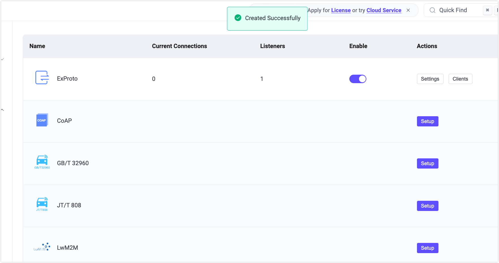
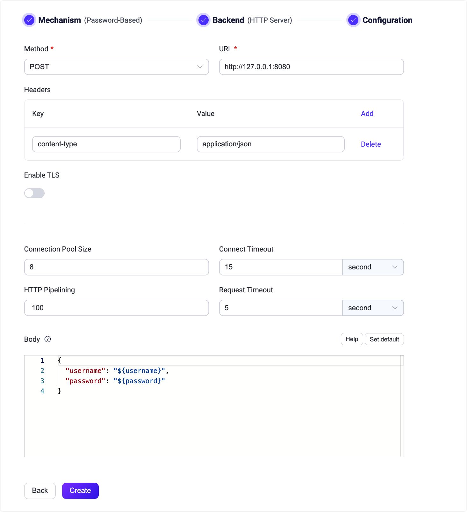
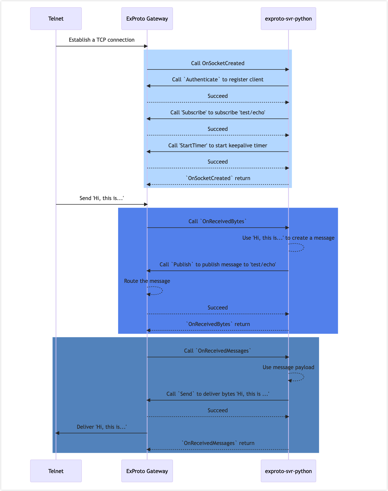

# ExProto ゲートウェイ

Extension Protocol（ExProto）は、gRPC通信を用いて実装されたカスタムプロトコルパースゲートウェイです。Java、Python、Goなどの好みのプログラミング言語でgRPCサービスを開発でき、これらのサービスはデバイスのネットワークプロトコルを解析し、デバイス接続、認証、メッセージ送信などの機能を実現します。

本ページでは、ExProtoゲートウェイの動作原理とEMQXにおけるExProtoゲートウェイの設定および使用方法を紹介します。

<!--アーキテクチャの簡単な紹介-->

## ExProtoゲートウェイとgRPCサービスの動作

EMQXでExProtoゲートウェイを有効にすると、特定のポート（例：7993）でデバイス接続を待ち受けます。クライアントデバイスからの接続を受け取ると、クライアントデバイスから生成されたバイトデータやイベントをユーザーのgRPCサービスに渡します。これには、ExProtoゲートウェイ内にgRPCクライアントがあり、ユーザーのgRPCサーバーで実装された`ConnectionUnaryHandler`サービスのメソッドを呼び出す必要があります。

ユーザーのgRPCサーバーにあるgRPCサービスは、ExProtoゲートウェイから受け取ったバイトデータやイベントを解析し、クライアントのネットワークプロトコルを解釈してバイトデータやイベントをPub/Subリクエストに変換し、再びExProtoゲートウェイに送信します。ExProtoゲートウェイで実装された`ConnectionAdapter`サービスは、ユーザーのgRPCサーバーとやり取りするためのインターフェースを提供します。これにより、クライアントデバイスはExProtoゲートウェイを通じてEMQXにメッセージをパブリッシュしたり、トピックをサブスクライブしたり、クライアント接続を管理したりできます。

以下の図は、ExProtoゲートウェイとgRPCサービスの動作アーキテクチャを示しています。


### `exproto.proto` ファイル

`exproto.proto`ファイルは、ExProtoゲートウェイとユーザーのgRPCサービス間のインターフェースを定義しています。ファイルには以下の2つのサービスが指定されています。

- `ConnectionAdapter`サービス：ExProtoゲートウェイによって実装され、gRPCサーバーへのインターフェースを提供します。
- `ConnectionUnaryHandler`サービス：ユーザーのgRPCサーバーによって実装され、クライアントソケットの接続およびバイト解析を処理するメソッドを定義します。

### `ConnectionUnaryHandler` サービス

`ConnectionUnaryHandler`サービスは、ユーザーのgRPCサーバーによって実装され、クライアントソケットの接続およびバイト解析を処理します。

このサービスには以下のメソッドが含まれます。

| メソッド名           | 説明                                                         |
| -------------------- | ------------------------------------------------------------ |
| OnSocketCreated      | 新しいソケットがExProtoゲートウェイに接続されるたびに呼び出されるコールバックです。 |
| OnSocketClosed       | ソケットが閉じられるたびに呼び出されるコールバックです。     |
| OnReceivedBytes      | クライアントのソケットからデータを受信するたびに呼び出されるコールバックです。 |
| OnTimerTimeout       | タイマーがタイムアウトするたびに呼び出されるコールバックです。 |
| OnReceivedMessages   | サブスクライブされたトピックにメッセージが届くたびに呼び出されるコールバックです。 |

ExProtoゲートウェイがこれらのメソッドを呼び出す際、どのソケットがこのイベントを発生させたかを識別するために、パラメータにユニークな識別子`conn`を渡します。例えば、`OnSocketCreated`の関数パラメータは以下のようになります。

```
message SocketCreatedRequest {
  string conn = 1;
  ConnInfo conninfo = 2;
}
```

::: tip

ExProtoゲートウェイはプライベートプロトコルのメッセージフレームの開始と終了を認識できないため、TCPパケットのスティッキングやスプリッティングが発生した場合は、`OnReceivedBytes`コールバック内で処理する必要があります。

:::

### `ConnectionAdapter` サービス

`ConnectionAdapter`サービスはExProtoゲートウェイによって実装され、gRPCサービスがサブスクリプションの開始、メッセージのパブリッシュ、タイマーの開始、接続のクローズなどの接続管理機能を呼び出すための機能を提供します。以下のメソッドが含まれます。

| メソッド名      | 説明                                                         |
| --------------- | ------------------------------------------------------------ |
| Send            | 指定された接続にバイトを送信します。                         |
| Close           | 指定された接続を閉じます。                                   |
| Authenticate    | クライアントをExProtoゲートウェイに登録し、認証を完了します。 |
| StartTimer      | 指定された接続のタイマーを開始します。通常は生存確認に使用されます。 |
| Publish         | 指定された接続からEMQXにメッセージをパブリッシュします。     |
| Subscribe       | 指定された接続のサブスクリプションを作成します。             |
| Unsubscribe     | 指定された接続のサブスクリプションを削除します。             |
| RawPublish      | EMQXにメッセージをパブリッシュします。                       |

## ExProtoゲートウェイの有効化

EMQXのExProtoゲートウェイは、ダッシュボード、REST API、または設定ファイル`base.hocon`を通じて設定および有効化できます。本節では、ダッシュボードを使ったExProtoゲートウェイの有効化方法を説明します。

EMQXダッシュボードの左側ナビゲーションメニューから**Management** -> **Gateways**をクリックします。**Gateways**ページにはサポートされているすべてのゲートウェイが一覧表示されます。**ExProto**を探し、**Actions**列の**Setup**をクリックします。すると、**Initialize ExProto**ページに遷移します。

::: tip

EMQXをクラスターで運用している場合、ダッシュボードやREST APIで行った設定はクラスター全体に影響します。特定のノードのみ設定を変更したい場合は、[`base.hocon`](../../guides/configuration/configuration.md)でゲートウェイを設定してください。

:::

設定を簡略化するため、EMQXは**Gateways**ページのすべての必須フィールドにデフォルト値を用意しています。大幅なカスタマイズが不要な場合は、以下の3クリックでExProtoゲートウェイを有効化できます。

1. **Basic Configuration**ステップページで**Next**をクリックし、すべてのデフォルト設定を受け入れます。
2. 次に遷移する**Listeners**ステップページでは、EMQXがポート7993でTCPリスナーを事前設定しています。設定を確認して**Next**をクリックします。
3. **Enable**ボタンをクリックしてExProtoゲートウェイを有効化します。

有効化が完了すると、**Gateways**ページに戻り、ExProtoゲートウェイのステータスが**Enabled**と表示されます。



上記の設定はREST APIでも可能です。

**例：**

```bash
curl -X 'PUT' 'http://127.0.0.1:18083/api/v5/gateway/exproto' \
  -u <your-application-key>:<your-security-key> \
  -H 'Content-Type: application/json' \
  -d '{
  "name": "exproto",
  "enable": true,
  "mountpoint": "exproto/",
  "server": {
    "bind": "0.0.0.0:9100"
  }
  "handler": {
    "address": "http://127.0.0.1:9001"
    "ssl_options": {"enable": false}
  }
  "listeners": [
    {
      "type": "tcp",
      "bind": "7993",
      "name": "default",
      "max_conn_rate": 1000,
      "max_connections": 1024000
    }
  ]
}'
```

詳細なREST APIの説明は[REST API](../../guides/api.md)を参照してください。

カスタマイズが必要でリスナーを追加したり認証ルールを設定したい場合は、[Customize Your ExProto Gateway](#customize-your-exproto-gateway)を参照してください。

## ExProtoゲートウェイのカスタマイズ

デフォルト設定に加えて、EMQXはさまざまな設定オプションを提供し、特定のビジネス要件に合わせて調整可能です。本節では、**Gateways**ページで利用可能な設定オプションを詳しく説明します。

### 基本設定

**Gateways**ページで**ExProto**を探し、**Actions**列の**Settings**をクリックします。**Settings**タブでは、`ConnectionUnaryHandler`サービスのアドレス、`ConnectionAdapter`のリスニングポート、ゲートウェイのMountPoint文字列をカスタマイズできます。


- **Enable Statistics**：ゲートウェイが統計情報を収集・報告するかどうかを設定します。デフォルトは`true`、選択肢は`true`または`false`です。
- **Idle Timeout**：非アクティブ状態が続いた後、クライアントを切断済みとみなすまでの秒数を設定します。デフォルトは`30秒`です。
- **MountPoint**：パブリッシュやサブスクライブ時にすべてのトピックにプレフィックスとして付加される文字列を設定します。これにより異なるプロトコル間でメッセージルーティングの分離が可能です。例：`mqttsn/`。このトピックプレフィックスはゲートウェイで管理され、クライアントは明示的に追加する必要はありません。
- **gRPC ConnectionAdapter**：`ConnectionAdapter`サービス起動のための設定を行います。
  - **Bind**：gRPCサーバーのリスニングアドレスとポート。デフォルトは`0.0.0.0:9100`。
    - **TLS Verify Client**：ピア認証の有効・無効を設定します。デフォルトは無効。有効にすると、関連する**TLS Cert**、**TLS Key**、**CA Cert**をファイル内容入力またはファイルアップロードで設定可能です。詳細は[Enable SSL/TLS Connection](../../guides/network/emqx-mqtt-tls.md)を参照してください。
- **gRPC ConnectionHandler**：`ConnectionUnaryHandler`を実装したコールバックサーバーの設定を行います。
  - **Server**：コールバック用gRPCサーバーのアドレス。
    - **Enable TLS**：gRPCサーバーのTLS接続を有効にします。デフォルトは無効。有効時は以下の設定が可能です。
      - **TLS Verify**：ピア認証の有効・無効。デフォルトは無効。有効時は関連する**TLS Cert**、**TLS Key**、**CA Cert**をファイル内容入力またはファイルアップロードで設定可能です。
      - **SNI**：TLSのServer Name Indication拡張で使用するホスト名を指定します。

### リスナーの追加

デフォルトで、ポート`7993`に名前`default`のTCPリスナーが1つ設定されています。これは1秒あたり最大1,000接続、最大1,024,000の同時接続をサポートします。よりカスタマイズしたい場合は、**Listeners**タブをクリックし、編集、削除、新規リスナー追加が可能です。


**+ Add Listener**をクリックすると**Add Listener**ページが開き、以下の設定項目を入力できます。

**基本設定**

- **Name**：リスナーの一意識別子を設定します。
- **Type**：プロトコルタイプを選択します。ExProtoでは`udp`または`dtls`が選べます。
- **Bind**：リスナーが接続を受け付けるポート番号を設定します。
- **MountPoint**（任意）：パブリッシュやサブスクライブ時にすべてのトピックに付加される文字列を設定し、異なるプロトコル間でメッセージルーティングの分離を実現します。

**リスナー設定**

- **Acceptor**：アクセプタープールのサイズを設定します。デフォルトは`16`。
- **Max Connections**：リスナーが処理可能な最大同時接続数。デフォルトは`1024000`。
- **Max Connection Rate**：リスナーが1秒あたり受け入れ可能な新規接続の最大レート。デフォルトは`1000`。
- **Proxy Protocol**：EMQXクラスターがHAProxyやNGINXの背後にある場合、Proxy Protocol V1/V2を有効にします。デフォルトは`false`。
- **Proxy Protocol Timeout**：Proxy Protocolパケット受信のタイムアウト時間。タイムアウト内に受信できなければTCP接続を閉じます。デフォルトは`3秒`。

**TCP設定**

- **ActiveN**：ソケットの`{active, N}`オプションを設定します。これはソケットが積極的に処理可能な受信パケット数を意味します。詳細は[Erlang Documentation - setopts/2](https://erlang.org/doc/man/inet.html#setopts-2)を参照してください。
- **Buffer**：受信および送信パケットを格納するバッファサイズ（KB単位）を設定します。
- **TCP_NODELAY**：接続に対してTCP_NODELAYフラグを設定します。デフォルトは`false`。
- **SO_REUSEADDR**：ローカルポート番号の再利用を許可するかどうかを設定します。デフォルトは`true`。
- **Send Timeout**：接続のTCP送信タイムアウト時間。デフォルトは`15秒`。
- **Send Timeout Close**：送信タイムアウト時に接続を閉じるかどうか。デフォルトは`true`。

**TLS設定**（SSLリスナーのみ）

TLS Verifyの有効化はトグルスイッチで設定可能ですが、その前に関連する**TLS Cert**、**TLS Key**、**CA Cert**をファイル内容入力またはファイルアップロードで設定する必要があります。詳細は[Enable SSL/TLS Connection](../../guides/network/emqx-mqtt-tls.md)を参照してください。

続いて以下の設定が可能です。

- **SSL Versions**：サポートするTLSバージョンを設定します。デフォルトは`tlsv1`、`tlsv1.1`、`tlsv1.2`、`tlsv1.3`です。
- **SSL Fail If No Peer Cert**：クライアントが空の証明書を送信した場合に接続を拒否するかどうか。デフォルトは`false`。選択肢は`true`または`false`。
- **CACert Depth**：ピア証明書に続く有効な認証パスに含まれる自己発行でない中間証明書の最大数。デフォルトは`10`。
- **Key File Passphrase**：プライベートキーがパスワード保護されている場合のパスワード。

### 認証の設定

ExProtoゲートウェイは以下のような多様な認証方式をサポートしています。

- [組み込みデータベース認証](../../guides/access-control/authn/mnesia.md)
- [MySQL認証](../../guides/access-control/authn/mysql.md)
- [MongoDB認証](../../guides/access-control/authn/mongodb.md)
- [PostgreSQL認証](../../guides/access-control/authn/postgresql.md)
- [Redis認証](../../guides/access-control/authn/redis.md)
- [HTTPサーバー認証](../../guides/access-control/authn/http.md)
- [JWT認証](../../guides/access-control/authn/jwt.md)
- [LDAP認証](../../guides/access-control/authn/ldap.md)

クライアント情報のClient ID、Username、Passwordはすべて`ConnectionAdapter`の`Authenticate`メソッドのパラメータから取得されます。

本節ではダッシュボードを例に認証設定方法を説明します。

ExProtoページで**Authentication**タブをクリックします。

**+ Create Authentication**をクリックし、**Mechanism**に`Password-Based`を選択、**Backend**に`HTTP Server`を選択して**Next**をクリックします。**Configuration**では認証ルールを設定できます。各フィールドの詳細は[HTTP Server Authentication](../../guides/access-control/authn/http.md)を参照してください。



上記設定はREST APIでも可能です。

**例：**

```bash
curl -X 'POST' 'http://127.0.0.1:18083/api/v5/gateway/exproto/authentication' \
  -u <your-application-key>:<your-security-key> \
  -H 'Content-Type: application/json' \
  -d '{
  "method": "post",
  "url": "http://127.0.0.1:8080",
  "headers": {
    "content-type": "application/json"
  },
  "body": {
    "username": "${username}",
    "password": "${password}"
  },
  "pool_size": 8,
  "connect_timeout": "5s",
  "request_timeout": "5s",
  "enable_pipelining": 100,
  "ssl": {
    "enable": false,
    "verify": "verify_none"
  },
  "backend": "http",
  "mechanism": "password_based",
  "enable": true
}'
```

## テスト用のサンプルgRPCサービスの起動

本節では、ExProtoゲートウェイとgRPCサービスが連携して動作する様子を、サンプルgRPCサービスを起動して示します。

このデモでは、`telnet`コマンドを使ってTCPプロトコルのクライアントをシミュレートし、メッセージの送受信を行います。実際の環境では、カスタムプライベートプロトコルを実装したデバイスがポート7993のTCPリスナーに接続します。ExProtoゲートウェイはポート7993でクライアント接続を待ち受けるとともに、ポート9100で`exproto.proto`ファイルに定義された`ConnectionAdapter`サービスを提供しています。

[emqx-extension-examples](https://github.com/emqx/emqx-extension-examples)には様々な言語で書かれたサンプルgRPCサービスが用意されています。本デモでは、Pythonで`ConnectionUnaryHandler`サービスを実装したエコープログラム`exproto-svr-python`を例に使用します。これはTCPクライアントから受信したデータをそのまま送り返す単純な動作をします。実際の環境では、これらのアップストリームメッセージをEMQXにパブリッシュしたり、トピックをサブスクライブしてEMQXからのメッセージをクライアント接続に届けたりします。

以下は`exproto-svr-python`を例にした手順です。

::: tip 前提条件

開始前に以下を完了していることを確認してください。

- EMQX 5.1.0以上を実行し、ExProtoゲートウェイをデフォルト設定で有効化している。
- Python 3.7以上をインストールし、以下の依存パッケージをインストールしている。

  ```
  python -m pip install grpcio
  python -m pip install grpcio-tools
  ```

:::

1. EMQXが稼働している同一マシンでサンプルコードをクローンし、`exproto-svr-python`ディレクトリに移動します。

   ```bash
   git clone https://github.com/emqx/emqx-extension-examples
   cd exproto-svr-python
   ```

2. 以下のコマンドでgRPCサーバーを起動します。

   ```
   python exproto_server.py
   ```

   起動に成功すると、以下のような出力が表示されます。

   ```
   ConnectionUnaryHandler started successfully, listening on 9001

   Tips: If the Listener of EMQX ExProto gateway listen on 7993:
         You can use the telnet to test the server, for example:

         telnet 127.0.0.1 7993

   Waiting for client connections...
   ```

3. `telnet`を使ってExProtoゲートウェイが待ち受けているポート`7993`にアクセスし、`Hi, this is tcp client!`と入力してgRPCサーバーが正常に動作しているかテストします。例：

   ```
   $ telnet 127.0.0.1 7993
   Trying 127.0.0.1...
   Connected to 127.0.0.1.
   Escape character is '^]'.
   Hi, this is tcp client!
   Hi, this is tcp client!
   ```

4. EMQXダッシュボードの左ナビゲーションメニューから**Management** -> **Gateways**をクリックし、ExProtoの**Clients**をクリックします。ExProtoページで、telnetで接続したクライアントが表示されていることを確認できます。

   

### サンプルのシーケンス図

以下の図は、このサンプルでの接続とメッセージ配信のシーケンスを示しています。



<!--```mermaid sequenceDiagram
    Telnet ->> ExProto Gateway: Establish a TCP connection
rect rgb(191, 223, 255)
    ExProto Gateway ->> exproto-svr-python: Call OnSocketCreated
  exproto-svr-python ->> ExProto Gateway: Call `Authenticate` to register client
  ExProto Gateway -->> exproto-svr-python: Succeed
  exproto-svr-python ->> ExProto Gateway: Call 'Subscribe' to subscribe 'test/echo'
    ExProto Gateway -->> exproto-svr-python: Succeed
  exproto-svr-python ->> ExProto Gateway: Call 'StartTimer' to start keepalive timer
    ExProto Gateway -->> exproto-svr-python: Succeed
    exproto-svr-python -->> ExProto Gateway: `OnSocketCreated` return
end
  Telnet ->> ExProto Gateway: Send 'Hi, this is...'
rect rgb(100,150, 240)
  ExProto Gateway ->> exproto-svr-python: Call `OnReceivedBytes`
  exproto-svr-python --> exproto-svr-python: Use 'Hi, this is...' to create a message
  exproto-svr-python ->> ExProto Gateway: Call `Publish` to publish message to 'test/echo'
  ExProto Gateway -->> ExProto Gateway: Route the message
  ExProto Gateway -->> exproto-svr-python: Succeed
  exproto-svr-python -->> ExProto Gateway: `OnReceivedBytes` return
end
rect rgb(100, 150, 200)
  ExProto Gateway ->> exproto-svr-python: Call `OnReceivedMessages`
  exproto-svr-python -->> exproto-svr-python: Use message payload
  exproto-svr-python ->> ExProto Gateway: Call `Send` to deliver bytes 'Hi, this is ...'
  ExProto Gateway -->> exproto-svr-python: Succeed
  ExProto Gateway ->> Telnet: Deliver 'Hi, this is...'
  exproto-svr-python -->> ExProto Gateway: `OnReceivedMessages` return
end ```-->
