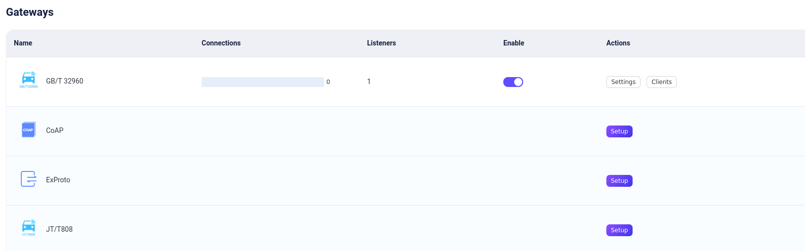
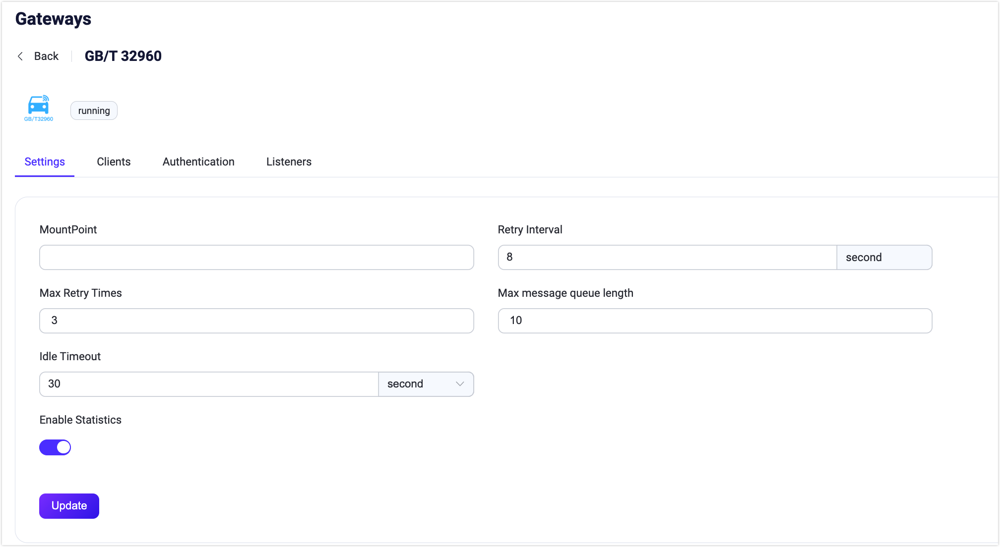
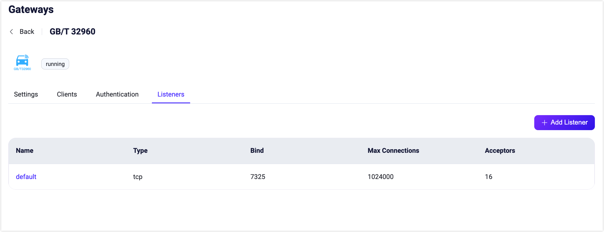

# GB/T 32960 ゲートウェイ

EMQX GB/T 32960 ゲートウェイは、GB/T 32960 と MQTT プロトコル間のメッセージングプロトコル変換を行うブリッジであり、クライアントがこれらのプロトコルを用いて相互に通信できるようにします。この GB/T 32960 ゲートウェイは、クライアントとサーバーに対して軽量かつシンプルなメッセージングソリューションを提供し、多様なメッセージング環境でのメッセージ交換を可能にします。TCP および SSL タイプのリスナーをサポートしているため、GB/T 32960 ゲートウェイは柔軟かつ多用途なメッセージングシステム構築ツールです。

本ページでは、EMQX における GB/T 32960 ゲートウェイの設定および利用方法を紹介します。

## GB/T 32960 ゲートウェイの有効化

EMQX 5.4 以降、GB/T 32960 ゲートウェイはダッシュボード、REST API、および設定ファイル `base.hocon` を通じて設定および有効化が可能です。

::: tip

EMQX をクラスターで稼働させている場合、ダッシュボードまたは REST API で行った設定はクラスター全体に影響します。特定のノードのみ設定を変更したい場合は、[`base.hocon`](../../guides/configuration/configuration.md) で設定してください。

:::

このセクションでは、ダッシュボードおよび REST API を用いて GB/T 32960 ゲートウェイを有効化する方法を説明します。

EMQX ダッシュボードの左側ナビゲーションメニューから **Management** -> **Gateways** をクリックします。**Gateways** ページにはサポートされているすべてのゲートウェイが一覧表示されます。**GB/T 32960** を探し、**Actions** 列の **Setup** をクリックすると、**Initialize GB/T 32960** ページに遷移します。

設定を簡略化するために、EMQX は **Gateways** ページのすべての必須フィールドにデフォルト値を用意しています。大幅なカスタマイズが不要な場合、以下の3クリックで GB/T 32960 ゲートウェイを有効化できます：

1. **Basic Configuration** タブで **Next** をクリックし、すべてのデフォルト設定を受け入れます。
2. 次に表示される **Listeners** タブでは、EMQX がポート `7325` で TCP リスナーを事前設定しています。再度 **Next** をクリックして設定を確認します。
3. 最後に **Enable** ボタンをクリックして GB/T 32960 ゲートウェイを有効化します。

ゲートウェイの有効化が完了すると、**Gateways** ページに戻り、GB/T 32960 ゲートウェイのステータスが **Enabled** と表示されていることを確認できます。



上記の設定は REST API でも行えます。

**例:**

```bash
curl -X 'PUT' 'http://127.0.0.1:18083/api/v5/gateway/gbt32960' \
  -u <your-application-key>:<your-security-key> \
  -H 'Content-Type: application/json' \
  -d '{
  "name": "gbt32960",
  "enable": true,
  "mountpoint": "gbt32960/${clientid}/",
  "retry_interval": "8s",
  "max_retry_times": 3,
  "message_queue_len": 10,
  "listeners": [
    {
      "type": "tcp",
      "name": "default",
      "bind": "7325",
      "max_conn_rate": 1000,
      "max_connections": 1024000
    }
  ]
}'
```

REST API の詳細については、[REST API](../../guides/api.md) を参照してください。

カスタマイズが必要な場合やリスナーの追加、認証ルールの追加を行いたい場合は、[GB/T 32960 ゲートウェイのカスタマイズ](#customize-your-gbt-32960-gateway) をご覧ください。

## GB/T 32960 クライアントとの連携

EMQX で GB/T 32960 ゲートウェイを有効化すると、GB/T 32960 プロトコルと MQTT の間の翻訳およびルーティングを行い、GB/T 32960 クライアントと MQTT を用いるシステム間の通信を可能にします。GB/T 32960 プロトコルと MQTT 仕様の違いにより、GB/T 32960 コマンドを直接 MQTT メッセージにマッピングすることはできません。これを解決するために、両システム間の通信を可能にする特定の変換ルールを設けています：

1. **コマンドの MQTT への変換**：GB/T 32960 クライアントから発行されるすべてのコマンドは MQTT メッセージに変換されます。このメッセージのトピックは `${mountpoint}/upstream/${command}` 形式で、ペイロードはコマンドの詳細を含む JSON 形式です。
2. **GB/T 32960 クライアントへのコマンド送信**：ユーザーは `${mountpoint}/dnstream` トピックに JSON 形式のメッセージをパブリッシュすることで、GB/T 32960 クライアントにコマンドを送信できます。
3. **GB/T 32960 クライアントからの応答処理**：GB/T 32960 クライアントから受信した応答は、トピック `${mountpoint}/upstream/response` の MQTT メッセージに変換されます。

GB/T 32960 コマンドと MQTT メッセージの相互変換の詳細については、[GB/T 32960 データ交換フォーマット](./gbt32960_data_exchange.md) を参照してください。

## GB/T 32960 ゲートウェイのカスタマイズ

デフォルト設定に加え、EMQX は特定のビジネス要件に合わせて柔軟に対応できる多様な設定オプションを提供しています。このセクションでは、**Gateways** ページで利用可能な各種フィールドについて詳しく解説します。

### 基本設定

**Gateways** ページで **GB/T 32960** を探し、**Actions** 列の **Settings** をクリックします。**Settings** パネルでは、最大ヘッダー長や許容ヘッダー長、統計情報の有効化、ゲートウェイの MountPoint 文字列の設定が可能です。以下のスクリーンショット下の説明をご覧ください。



- **MountPoint**：パブリッシュやサブスクライブ時にすべてのトピックにプレフィックスとして付与される文字列を設定します。これにより異なるプロトコル間でのメッセージルーティングの分離を実現できます。例：`stomp/`

- **Retry Interval**：再送信の間隔（デフォルト：`8s`）

- **Max Retry Times**：最大再送回数（デフォルト：`3`）

- **Message Queue Length**：最大メッセージキュー長（デフォルト：`10`）

- **Idle Timeout**：GB/T 32960 フレームを待機する最大秒数。接続がアイドル状態の場合、タイムアウト後に切断されます。

- **Enable Statistics**：ゲートウェイの統計収集とレポートを許可するかどうか。デフォルトは `true`。選択肢は `true` または `false`。

  **注意**：このトピックプレフィックスはゲートウェイが管理しており、クライアントはパブリッシュやサブスクライブ時に明示的にこのプレフィックスを追加する必要はありません。

### リスナーの追加

ポート `7325` で名前が **default** の TCP リスナーが既に設定されており、最大 16 個のアクセプターをプールし、最大 1,024,000 の同時接続をサポートしています。より詳細な設定を行いたい場合は、**Listeners** タブをクリックして編集、削除、新規リスナーの追加が可能です。

::: tip

GB/T 32960 ゲートウェイは TCP および SSL タイプのリスナーのみをサポートしています。

:::



**Add Listener** をクリックすると **Add Listener** ページが開き、以下の設定が可能です。

**基本設定**

- **Name**：リスナーの一意識別子を設定します。
- **Type**：プロトコルタイプを選択します。GB/T 32960 では `tcp` または `ssl` を選べます。
- **Bind**：リスナーが接続を受け付けるポート番号を設定します。
- **MountPoint**（任意）：パブリッシュやサブスクライブ時にすべてのトピックにプレフィックスとして付与される文字列を設定し、異なるプロトコル間でのメッセージルーティングの分離を実現します。

**リスナー設定**

- **Acceptor**：アクセプタープールのサイズを設定します。デフォルトは `16`。
- **Max Connections**：リスナーが処理できる最大同時接続数を設定します。デフォルトは `1024000`。
- **Max Connection Rate**：リスナーが1秒あたりに受け入れる新規接続の最大レートを設定します。デフォルトは `1000`。
- **Proxy Protocol**：EMQX が [ロードバランサー](../../guides/cluster/lb.md) の背後にある場合に、プロトコル V1/V2 を有効にします。
- **Proxy Protocol Timeout**：プロキシプロトコルパッケージを待機する最大秒数。タイムアウトすると接続が切断されます。デフォルトは `3s`。

**TCP 設定**

- **ActiveN**：ソケットの `{active, N}` オプションを設定します。これはソケットが能動的に処理できる受信パケット数です。詳細は [Erlang Documentation - setopts/2](https://www.erlang.org/doc/apps/kernel/inet.html#setopts/2) を参照してください。
- **Buffer**：受信および送信パケットを格納するバッファサイズを KB 単位で設定します。
- **TCP_NODELAY**：接続に対して `TCP_NODELAY` フラグを有効にするかどうかを設定します。これはクライアントが前回のデータのアックを待たずに追加データを送信できるかどうかを制御します。デフォルトは `false`。選択肢は `true` または `false`。
- **SO_REUSEADDR**：ローカルでのポート番号の再利用を許可するかどうかを設定します。
- **Send Timeout**：送信タイムアウトの最大秒数を設定します。タイムアウト時に接続が切断されます。デフォルトは `15s`。
- **Send Timeout**：送信タイムアウト時に接続を切断するかどうかを設定します。

**SSL 設定**（SSL リスナーのみ）

TLS Verify の有効化はトグルスイッチで設定可能です。ただし、その前に関連する **TLS Cert**、**TLS Key**、および **CA Cert** の情報をファイルの内容を入力するか、**Select File** ボタンでアップロードして設定する必要があります。詳細は [SSL/TLS 接続の有効化](../../guides/network/emqx-mqtt-tls.md) を参照してください。

続いて以下の設定が可能です：

- **SSL Versions**：サポートする SSL バージョンを設定します。デフォルトは `tlsv1.3`、`tlsv1.2`、`tlsv1.1`、`tlsv1`。
- **Fail If No Peer Cert**：クライアントが空の証明書を送信した場合に接続を拒否するかどうかを設定します。デフォルトは `false`。選択肢は `true` または `false`。
- **Intermediate Certificate Depth**：ピア証明書に続く有効な認証パスに含まれる自己発行でない中間証明書の最大数を設定します。デフォルトは `10`。
- **Key Password**：プライベートキーがパスワード保護されている場合に使用するユーザーパスワードを設定します。

## 認証の設定

GB/T 32960 ゲートウェイは [HTTP サーバー認証](../../guides/access-control/authn/http.md) のみをサポートしています。`login` コマンドの情報を用い、`vin` コードを `clientid` としてクライアントの認証フィールドを生成します：

- クライアント ID：`vin` コード
- ユーザー名：`vin` コード

以下の例は、REST API または設定ファイルを用いて GB/T 32960 ゲートウェイの HTTP 認証を作成する方法を示しています。

:::: tabs type:card

::: tab REST API

```bash
curl -X 'POST' 'http://127.0.0.1:18083/api/v5/gateway/gbt32960/authentication' \
  -u <your-application-key>:<your-security-key> \
  -H 'Content-Type: application/json' \
  -d '{
  "method": "post",
  "url": "http://127.0.0.1:8080",
  "headers": {
    "content-type": "application/json"
  },
  "body": {
    "vin": "${clientid}"
  },
  "pool_size": 8,
  "connect_timeout": "5s",
  "request_timeout": "5s",
  "enable_pipelining": 100,
  "ssl": {
    "enable": false,
    "verify": "verify_none"
  },
  "backend": "http",
  "mechanism": "password_based",
  "enable": true
}'
```

:::

::: tab 設定ファイル

```properties
gateway.gbt32960 {
  authentication {
    backend = "http"
    mechanism = "password_based"
    method = "post"
    connect_timeout = "5s"
    enable_pipelining = 100
    url = "http://127.0.0.1:8080"
    headers {
      "content-type" = "application/json"
    }
    body {
      "vin": "${clientid}"
    }
    pool_size = 8
    request_timeout = "5s"
    ssl.enable = false
  }
}
```

:::

::::
