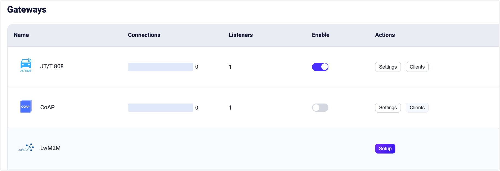
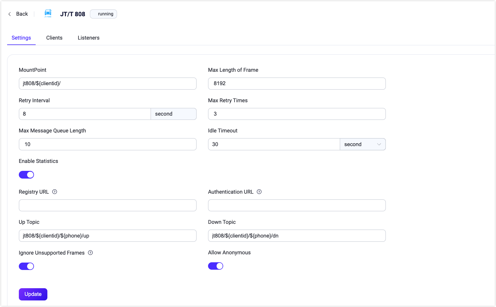

# JT/T 808 ゲートウェイ

EMQX 5.4 には、中国で広く使われている車両端末通信プロトコルである JT/T 808 プロトコルが含まれています。これは車両と監視センター間のデータ通信に用いられます。EMQX の JT/T 808 ゲートウェイは、JT/T 808 クライアントからの接続を受け入れ、そのイベントやメッセージを MQTT のパブリッシュメッセージに変換します。

現状の実装では、以下の制限があります：

- TCP 伝送に基づいています。
- JT/T 808 2013 のみサポートし、JT/T 808 2021 は未対応です。
- 端末の登録・登録解除メッセージを SMS 経由で送信できません。
- EMQX の組み込み認証システムは使用できず、端末登録・アクセス認証用の HTTP サービスアドレスの設定が必要です。

## JT/T 808 ゲートウェイの有効化

JT/T 808 ゲートウェイは、ダッシュボード、HTTP API、または `base.hocon` 設定ファイルから有効化および設定できます。

### ダッシュボードからゲートウェイを有効化する

このセクションでは、ダッシュボードを使って JT/T 808 ゲートウェイを有効化する方法を説明します。

EMQX ダッシュボードの左側ナビゲーションバーで **Management** -> **Gateway** をクリックします。**Gateway** ページにはサポートされているすべてのゲートウェイが一覧表示されます。**JT/T 808** を探し、**Action** 列の **Configure** ボタンをクリックすると、**Initialize JT/T 808** ページに移動します。

::: tip

EMQX がクラスターで稼働している場合、ダッシュボードや HTTP API での設定はクラスター全体に反映されます。単一ノードのみを設定したい場合は、[`base.hocon`](../../guides/configuration/configuration.md) でゲートウェイを設定してください。

:::

設定を簡略化するために、EMQX は **Gateway** ページの必須フィールドに対してすべてデフォルト値を用意しています。カスタム設定が不要な場合、以下の3ステップで JT/T 808 ゲートウェイを有効化できます：

1. **Basic Parameters** ステップページでデフォルト設定をすべて受け入れ、**Next** をクリックします。
2. 次に **Listeners** ステップページに移動し、EMQX はポート 6207 で TCP リスナーを事前設定しています。再度 **Next** をクリックして設定を確認します。
3. **Enable** ボタンをクリックして JT/T 808 ゲートウェイを有効化します。

ゲートウェイの有効化が完了すると、**Gateway** ページに戻り、JT/T 808 ゲートウェイのステータスが **Enabled** になっていることを確認できます。



### HTTP API または設定ファイルからゲートウェイを有効化する

JT/T 808 ゲートウェイは HTTP API または設定ファイルからも有効化および設定可能です：

:::: tabs type:card

::: tab HTTP API

```bash
curl -X 'PUT' 'http://127.0.0.1:18083/api/v5/gateways/jt808' \
  -u <your-application-key>:<your-security-key> \
  -H 'Content-Type: application/json' \
  -d '{
  "name": "jt808",
  "frame": {
    "max_length": 8192
  },
  "proto": {
    "auth": {
      "allow_anonymous": true
    },
    "up_topic":"jt808/${clientid}/${phone}/up",
    "dn_topic":"jt808/${clientid}/${phone}/dn"
  },
  "mountpoint": "jt808/${clientid}/",
  "retry_interval": "8s",
  "max_retry_times": 3,
  "message_queue_len": 10,
  "enable_stats": true,
  "idle_timeout": "30s",
  "listeners": [
    {
      "type":"tcp",
      "name":"default",
      "bind":"6207",
      "acceptors":16,
      "max_conn_rate":1000,
      "max_connections":1024000,
      "id":"jt808:tcp:default"
    }
  ]
  }'
```

:::

::: tab Configuration File

```properties
gateway {
  jt808 {
    enable_stats = true
    frame {max_length = 8192}
    idle_timeout = 30s
    listeners {
      tcp {
        default {
          acceptors = 16
          bind = "6207"
          max_conn_rate = 1000
          max_connections = 1024000
        }
      }
    }
    max_retry_times = 3
    message_queue_len = 10
    mountpoint = "jt808/${clientid}/"
    proto {
      auth {allow_anonymous = true}
      dn_topic = "jt808/${clientid}/${phone}/dn"
      up_topic = "jt808/${clientid}/${phone}/up"
    }
    retry_interval = 8s
  }
}
```

:::

::::

::: tip

EMQX がクラスターで稼働している場合、ダッシュボードや HTTP API での設定はクラスター全体に反映されます。単一ノードのみを設定したい場合は、[`base.hocon`](../../guides/configuration/configuration.md) でゲートウェイを設定してください。

:::

JT/T 808 ゲートウェイは TCP タイプリスナーのみをサポートしています。設定可能なパラメータの完全な一覧については、以下を参照してください：[Gateway Configuration - Listeners](https://docs.emqx.com/en/enterprise/v@EE_VERSION@/hocon/)。

## JT/T 808 ゲートウェイのカスタマイズ

デフォルト設定に加え、EMQX はさまざまな設定オプションを提供しており、特定のビジネス要件に合わせて調整可能です。このセクションでは、**Gateways** ページで利用可能な設定オプションを詳しく解説します。

### 基本設定

Gateways ページで **JT/T 808** を探し、**Actions** 列の **Settings** をクリックします。**Settings** パネルで JT/T 808 ゲートウェイをカスタマイズできます。



- **MountPoint**：パブリッシュやサブスクライブ時にすべてのトピックにプレフィックスとして付与される文字列を設定します。これにより異なるプロトコル間でメッセージルーティングの分離が可能です。例：`jt808/${clientid}/`。このトピックプレフィックスはゲートウェイ側で管理され、クライアントはパブリッシュやサブスクライブ時に明示的に追加する必要はありません。
- **Max Length of Frame**：ゲートウェイが処理可能なフレームの最大サイズです。デフォルトは `8192` で、多様なデータパケットサイズに対応します。
- **Retry Interval**：メッセージ配信失敗時の再試行間隔です。デフォルトは `8s`。
- **Max Retry Times**：メッセージ配信の最大再試行回数です。これを超えると配信できないメッセージは破棄されます。デフォルトは `3`。
- **Max message queue length**：ダウンロードストリームメッセージ配信の最大メッセージキュー長です。デフォルトは `100`。
- **Idle Timeout**：接続中のクライアントが非アクティブとみなされ切断されるまでの秒数です。デフォルトは `30` 秒。
- **Enable Statistics**：ゲートウェイによる統計収集・報告を許可するかどうかの設定です。デフォルトは `true`。選択肢は `true` または `false`。
- **Registry**：JT/T 808 デバイスのレジストリセンターです。`allow_anonymous` が `false` の場合に必須です。ゲートウェイが JT/T 808 登録メッセージを受信すると、登録情報を HTTP リクエストとしてこのアドレスに送信します。詳細は [Configure Client Authentication/Authorization](#configure-client-authentication-authorization) を参照してください。
- **Authentication URL**：クライアント認証を行う外部サービスの URL を指定します。
- **Up Topic**：ゲートウェイから EMQX へメッセージをパブリッシュする際の MQTT トピックパターンです。JT/T 808 クライアントからのメッセージが上り通信としてどのように MQTT トピックにマッピングされるかを定義します。デフォルトは `jt808/${clientid}/${phone}/up`。
- **Down Topic**：ブローカーからゲートウェイを経由して JT/T 808 クライアントへ送信されるメッセージの MQTT トピックパターンです。MQTT ブローカーから JT/T 808 クライアントへの下り通信のルーティングを定義します。デフォルトは `jt808/${clientid}/${phone}/dn`。
- **Ignore Unsupported Frames**：標準プロトコルに準拠しない JT/T 808 フレームの処理方法を決定します。
  - `true` の場合、非対応フレームはログに記録されますが、他の有効なメッセージの処理は継続され、カスタムや非標準メッセージによる切断を防ぎます。デフォルトは `true`。
  - `false` の場合、非対応フレーム受信時にクライアントを切断します。

- **Allow Anonymous**：ゲートウェイが認証なしでクライアントの接続を許可するかどうかを設定します。`true` の場合、認証情報なしで接続可能です。

### リスナーの追加

デフォルトで、名前が **default** の TCP リスナーがポート `6207` に設定されており、1秒あたり最大1,000接続、最大1,024,000の同時接続をサポートします。より詳細な設定を行うには、**Listeners** タブをクリックしてリスナーの編集、削除、新規追加が可能です。


**+ Add Listener** をクリックすると **Add Listener** ページが開き、以下の設定項目を入力できます：

**基本設定**

- **Name**：リスナーの一意識別子を設定します。
- **Type**：プロトコルタイプを選択します。MQTT-SN の場合は `udp` または `dtls` が選択可能です。
- **Bind**：リスナーが接続を受け付けるポート番号を設定します。
- **MountPoint**（任意）：パブリッシュやサブスクライブ時にすべてのトピックに付与される文字列を設定し、異なるプロトコル間でのメッセージルーティング分離を実現します。

**リスナー設定**

- **Acceptor**：アクセプタープールのサイズを設定します。デフォルトは `16`。
- **Max Connections**：リスナーが処理可能な最大同時接続数を設定します。デフォルトは `1024000`。
- **Max Connection Rate**：リスナーが1秒あたり受け入れ可能な新規接続の最大レートを設定します。デフォルトは `1000`。
- **Proxy Protocol**：EMQX クラスターが HAProxy や NGINX の背後に配置されている場合に Proxy Protocol V1/V2 を有効化します。デフォルトは `false`。
- **Proxy Protocol Timeout**：Proxy Protocol パケット受信のタイムアウト時間です。タイムアウト内に受信できない場合、EMQX は TCP 接続を切断します。デフォルトは `3` 秒。

**TCP 設定**

- **ActiveN**：ソケットの `{active, N}` オプションを設定します。これはソケットが能動的に処理可能な受信パケット数を示します。詳細は [Erlang Documentation -  setopts/2](https://erlang.org/doc/man/inet.html#setopts-2) を参照してください。
- **Buffer**：受信および送信パケットを格納するバッファサイズを KB 単位で設定します。
- **TCP_NODELAY**：接続に対して TCP_NODELAY フラグを設定します。デフォルトは `false`。
- **SO_REUSEADDR**：ローカルのポート番号再利用を許可するかどうかを設定します。デフォルトは `true`。
- **Send Timeout**：接続の TCP 送信タイムアウト時間を設定します。デフォルトは `15` 秒。
- **Send Timeout Close**：送信タイムアウト時に接続を切断するかどうかを設定します。デフォルトは `true`。

### クライアント認証／認可の設定

JT/T 808 プロトコル仕様における独自の登録／認証ロジックのため、JT/T 808 ゲートウェイは特定の登録サービス HTTP サービスに登録／認証をリクエストする方式の認証のみをサポートしています。

::: tip

ここでの「認証」は、JT/T 808 プロトコルで定義される認証を指し、MQTT の Pub/Sub アクセス制御とは異なります。

:::

また、`gateway.jt808.proto.auth.allow_anonymous = true` を設定することで匿名認証を有効にでき、クライアントの登録／認証ロジックをスキップ可能です。

登録／認証リクエストの詳細フォーマットは以下の通りです：

#### 登録リクエスト

```properties
URL: http://127.0.0.1:8991/jt808/registry
Method: POST
Body:
   { "province": 58,
     "city": 59,
     "manufacturer": "Infinity",
     "model": "Q2",
     "license_number": "ZA334455",
     "dev_id": "xx11344",
     "color": 3,
     "phone", "00123456789"
   }
```

**登録レスポンス：**

:::: tabs type:card

::: tab 例1

```json
{
  "code": 0,
  "authcode": "132456789"
}
```

:::

::: tab 例2

```json
{
  "code": 1
}
```

:::

::::

戻りコードは以下の通りです：

0: 成功
1: 車両は既に登録済み
2: データベースに該当車両なし
3: 端末は既に登録済み
4: データベースに該当端末なし

#### 認証リクエスト

```properties
URL: http://127.0.0.1:8991/jt808/auth
Method: POST
Body:
   { "code": "authcode",
     "phone", "00123456789"
   }
```

**認証レスポンス：**

```
HTTP ステータスコード 200: 認証成功
その他: 認証失敗
```

注：認証リクエストは、システムに認証コードが保存されていない場合（端末が直接認証メッセージを送信してシステムにログインする際）にのみ呼び出されます。

## データ交換フォーマット

詳細は [JT/T 808 Gateway Data Exchange Format](./jt808_data_exchange.md) を参照してください。

## ユーザーレイヤーインターフェース

- 詳細な設定手順は以下を参照してください：[Gateway Configuration - JT/T 808 Gateway](https://docs.emqx.com/en/enterprise/v5.4.0/hocon/)
- 詳細な HTTP API インターフェースは以下を参照してください：[HTTP API - Gateway](../../guides/api.md)
