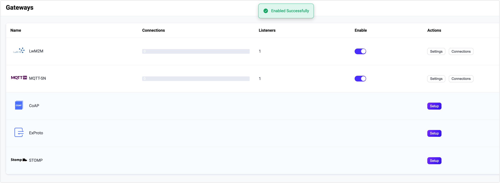
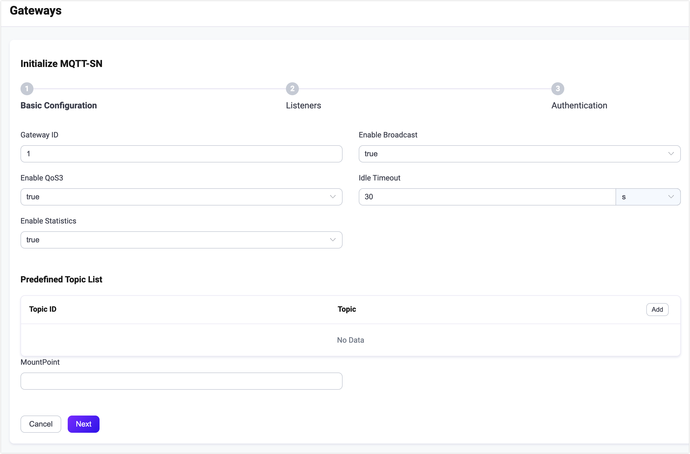
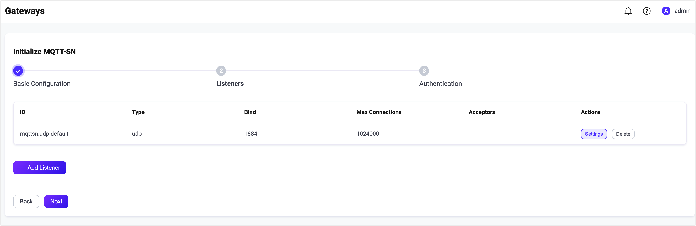

# MQTT-SN ゲートウェイ

MQTT-SN（MQTT for Sensor Networks）は、ワイヤレスセンサーネットワーク向けの軽量なパブリッシュ／サブスクライブプロトコルです。EMQX MQTT-SN ゲートウェイは、これらのデバイスが EMQX に接続して通信できるようにし、MQTT-SN と標準 MQTT プロトコルの橋渡しを行います。

このページでは、EMQX における MQTT-SN ゲートウェイの設定方法と使用方法を紹介します。

::: tip

MQTT-SN ゲートウェイは [MQTT-SN v1.2](https://www.oasis-open.org/committees/download.php/66091/MQTT-SN_spec_v1.2.pdf) に基づいています。

:::

<!--a brief introduction of the architecture-->

## MQTT-SN ゲートウェイの有効化

EMQX 5.0 では、MQTT-SN ゲートウェイはダッシュボード、REST API、および設定ファイル `base.hocon` を通じて設定および有効化できます。本節ではダッシュボードを使った設定例をもとに操作手順を説明します。

EMQX ダッシュボードの左ナビゲーションメニューで **Management** -> **Gateways** をクリックします。**Gateways** ページにはサポートされているすべてのゲートウェイが一覧表示されます。**MQTT-SN** を見つけ、**Actions** 列の **Setup** をクリックすると、**Initialize MQTT-SN** ページに遷移します。

::: tip

EMQX をクラスターで運用している場合、ダッシュボードや REST API で行った設定はクラスター全体に影響します。特定のノードのみ設定を変更したい場合は、[`base.hocon`](../../guides/configuration/configuration.md) にて設定してください。

:::

設定を簡略化するため、EMQX は **Gateways** ページのすべての必須フィールドにデフォルト値を用意しています。大幅なカスタマイズが不要な場合は、以下の3クリックで MQTT-SN ゲートウェイを有効化できます。

1. **Basic Configuration** タブで **Next** をクリックし、すべてのデフォルト設定を受け入れます。
2. 続いて表示される **Listeners** タブでは、EMQX がポート1884で UDP リスナーを事前設定しています。設定を確認して **Next** をクリックします。
3. 最後に **Enable** ボタンをクリックして MQTT-SN ゲートウェイを有効化します。

ゲートウェイの有効化が完了すると、**Gateways** ページに戻り、MQTT-SN ゲートウェイのステータスが **Enabled** と表示されていることを確認できます。



上記の設定は REST API でも可能です。

**例:**

```bash
curl -X 'PUT' 'http://127.0.0.1:18083/api/v5/gateways/mqttsn' \
  -u <your-application-key>:<your-security-key> \
  -H 'Content-Type: application/json' \
  -d '{
  "name": "mqttsn",
  "enable": true,
  "gateway_id": 1,
  "mountpoint": "mqttsn/",
  "listeners": [
    {
      "type": "udp",
      "bind": "1884",
      "name": "default",
      "max_conn_rate": 1000,
      "max_connections": 1024000
    }
  ]
}'
```

詳細な REST API の説明は [REST API - Gateway](../../guides/api.md) をご参照ください。

カスタマイズが必要な場合やリスナーの追加、認証ルールの追加を行いたい場合は、[Customize Your MQTT-SN Gateway セクション](#customize-your-mqtt-sn-gateway)をご覧ください。

## MQTT-SN クライアントとの連携

### クライアントライブラリ

MQTT-SN ゲートウェイを構築した後は、MQTT-SN クライアントツールを使って接続をテストし、正常に動作していることを確認できます。以下は推奨される MQTT-SN クライアントツールの例です。

- [paho.mqtt-sn.embedded-c](https://github.com/eclipse/paho.mqtt-sn.embedded-c)
- [mqtt-sn-tools](https://github.com/njh/mqtt-sn-tools)

### パブリッシュ／サブスクライブ

MQTT-SN プロトコルはすでにパブリッシュ／サブスクライブの動作を定義しています。例えば：

- MQTT-SN プロトコルの `PUBLISH` メッセージはパブリッシュ操作に使われ、トピックと QoS はこのメッセージで指定されます。
- `SUBSCRIBE` メッセージはサブスクライブ操作に使われ、トピックと QoS はこのメッセージで指定されます。
- `UNSUBSCRIBE` メッセージはサブスクライブ解除操作に使われ、トピックはこのメッセージで指定されます。

## MQTT-SN ゲートウェイのカスタマイズ

デフォルト設定に加え、EMQX はさまざまな設定オプションを提供し、特定のビジネス要件により適合させることができます。本節では **Gateways** ページで利用可能な各フィールドについて詳しく解説します。

### 基本設定

**Basic Configuration** タブでは、ゲートウェイ ID のカスタマイズ、事前定義トピックリストの設定、ゲートウェイの MountPoint 文字列の設定が可能です。以下のスクリーンショット下の説明をご参照ください。



- **Gateway ID**：ゲートウェイの一意の識別子を設定します。例：1。

- **Enable Broadcast**：ゲートウェイがクライアントにゲートウェイ広告をブロードキャストするかどうかを設定します。指定した Gateway ID を含むメッセージをブロードキャストします。デフォルト：`true`。選択肢：`true`、`false`。

- **Enable QoS 3**：QoS -1 とも呼ばれ、アックやサブスクライブを必要とせず、単に `PUBLISH` メッセージをゲートウェイに送信するだけの基本クライアント向け設定です。デフォルト：`true`。選択肢：`true`、`false`。

- **Idle Timeout**：MQTT-SN クライアントが非アクティブ状態とみなされ、切断されるまでの秒数を設定します。デフォルト：`30s`。

- **Enable Statistics**：ゲートウェイが統計情報を収集・報告するかどうかを設定します。デフォルト：`true`。選択肢：`true`、`false`。

- **Predefined Topic List**：事前定義されたトピック ID と対応するトピック名を設定します。**Add** をクリックして新しいエントリを追加できます。

  - **Topic ID**：トピック ID を設定します。1 から 65535 の整数である必要があります。
  - **Topic**：トピック名を設定します。

- **MountPoint**：パブリッシュやサブスクライブ時にすべてのトピックにプレフィックスとして付加される文字列を設定します。これにより異なるプロトコル間でのメッセージルーティングの分離が可能になります。例：`mqttsn/`。

  **注意**：このトピックプレフィックスはゲートウェイが管理します。MQTT-SN クライアントはパブリッシュやサブスクライブ時にこのプレフィックスを明示的に追加する必要はありません。

### リスナーの追加

デフォルトでは、ポート `1884` に名前が **default** の UDP リスナーが1つ設定されており、1秒あたり最大1,000接続、最大1,024,000の同時接続をサポートしています。**Settings** をクリックすると詳細設定が可能で、**Delete** でリスナーの削除、**+ Add Listener** で新規リスナーの追加ができます。



**Add Listener** をクリックすると **Add Listener** ページが開き、以下の設定が行えます。

**基本設定**

- **Name**：リスナーの一意の識別子を設定します。
- **Type**：プロトコルタイプを選択します。MQTT-SN では **udp** または **dtls** のいずれかを選択可能です。
- **Bind**：リスナーが接続を受け付けるポート番号を設定します。
- **MountPoint**（任意）：パブリッシュやサブスクライブ時にすべてのトピックに付加されるプレフィックス文字列を設定し、異なるプロトコル間でのメッセージルーティング分離を実現します。

**リスナー設定**

- **Acceptor**（DTLS リスナーのみ）：アクセプタプールのサイズを設定します。デフォルト：**16**。
- **Max Connections**：リスナーが処理可能な最大同時接続数を設定します。デフォルト：**1024000**。
- **Max Connection Rate**：リスナーが1秒あたりに受け入れ可能な新規接続の最大レートを設定します。デフォルト：**1000**。

**UDP 設定**

- **ActiveN**：ソケットの `{active, N}` オプションを設定します。これはソケットが能動的に処理できる受信パケット数を表します。詳細は [Erlang Documentation - setopts/2](https://erlang.org/doc/man/inet.html#setopts-2) をご参照ください。
- **Buffer**：受信および送信パケットを格納するバッファのサイズを KB 単位で設定します。
- **Receive Buffer**：受信バッファのサイズを KB 単位で設定します。
- **Send Buffer**：送信バッファのサイズを KB 単位で設定します。
- **SO_REUSEADDR**：ローカルでのポート番号の再利用を許可するかどうかを設定します。

**DTLS 設定**（DTLS リスナーのみ）

TLS Verify の有効化はトグルスイッチで設定可能ですが、その前に関連する **TLS Cert**、**TLS Key**、および **CA Cert** の情報を設定する必要があります。ファイルの内容を直接入力するか、**Select File** ボタンでアップロードしてください。詳細は [Enable SSL/TLS Connection](../../guides/network/emqx-mqtt-tls.md) をご参照ください。

続いて以下の設定が可能です。

- **DTLS Versions**：サポートする DTLS バージョンを設定します。デフォルトは **dtlsv1.2** と **dtlsv1**。
- **Fail If No Peer Cert**：クライアントが空の証明書を送信した場合に EMQX が接続を拒否するかどうかを設定します。デフォルト：**false**。選択肢：**true**、**false**。
- **Intermediate Certificate Depth**：ピア証明書に続く有効な認証パスに含まれる自己発行でない中間証明書の最大数を設定します。デフォルト：**10**。
- **Key Password**：プライベートキーがパスワード保護されている場合に使用するユーザーパスワードを設定します。

### 認証の設定

MQTT-SN プロトコルの接続メッセージはクライアントの Client ID のみを提供するため、MQTT-SN ゲートウェイは [HTTP サーバー認証](../../guides/access-control/authn/http.md) のみをサポートしています。

クライアント情報の生成ルールは以下の通りです。

- Client ID：`CONNECT` メッセージの Client ID フィールドを使用
- Username：未定義
- Password：未定義

ここではダッシュボードを例に認証設定方法を説明します。

**Gateways** ページで **MQTT-SN** を見つけ、**Actions** 列の **Setup** をクリックし、**Authentication** タブに入ります。

**Create Authentication** をクリックし、**Mechanism** に **Password-Based** を選択、**Backend** に **HTTP Server** を選択します。続いて **Configuration** タブで認証ルールを設定します。


各フィールドの詳細は [HTTP サーバー認証](../../guides/access-control/authn/http.md) をご参照ください。

上記の設定は REST API でも行えます。

**例:**

```bash
curl -X 'POST' 'http://127.0.0.1:18083/api/v5/gateway/mqttsn/authentication' \
  -u <your-application-key>:<your-security-key> \
  -H 'Content-Type: application/json' \
  -d '{
  "method": "post",
  "url": "http://127.0.0.1:8080",
  "headers": {
    "content-type": "application/json"
  },
  "body": {
    "clientid": "${clientid}"
  },
  "pool_size": 8,
  "connect_timeout": "5s",
  "request_timeout": "5s",
  "enable_pipelining": 100,
  "ssl": {
    "enable": false,
    "verify": "verify_none"
  },
  "backend": "http",
  "mechanism": "password_based",
  "enable": true
}'
```
