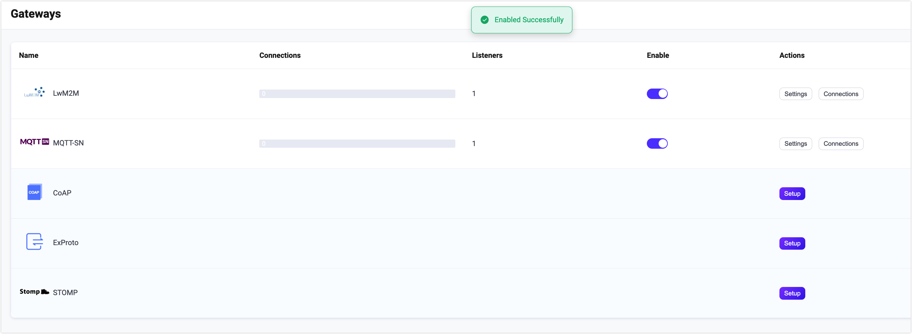
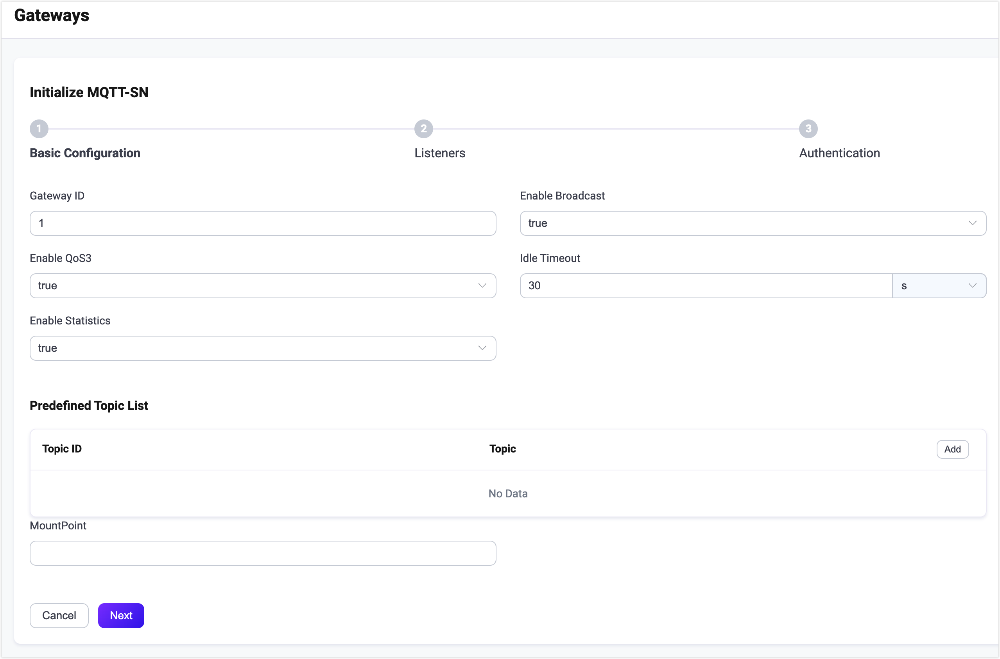
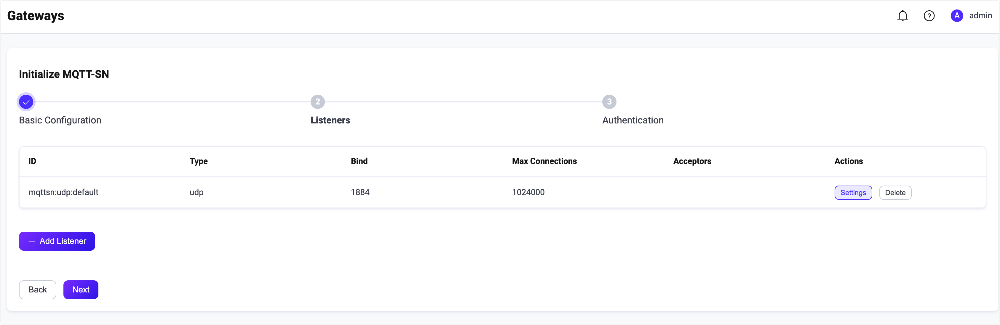
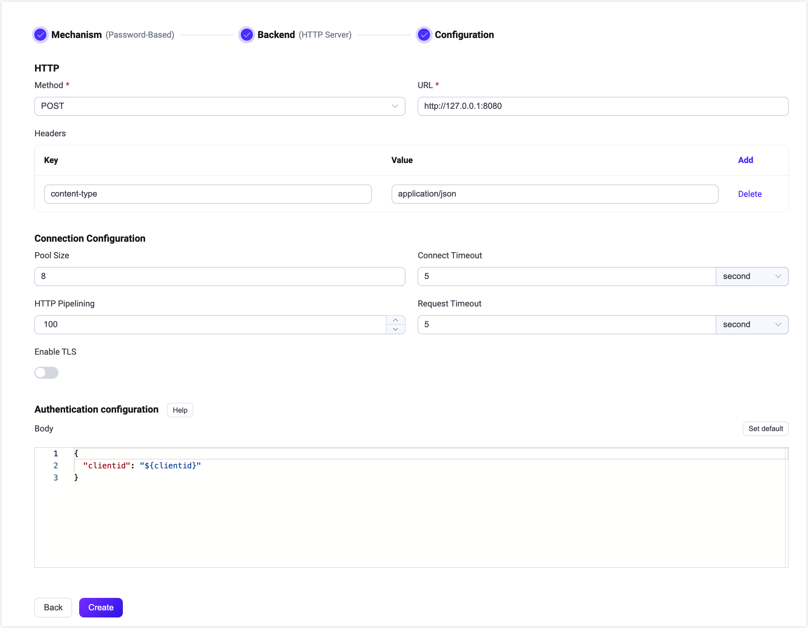

# MQTT-SN ゲートウェイ

MQTT-SN（MQTT for Sensor Networks）は、ワイヤレスセンサーネットワーク向けの軽量なパブリッシュ／サブスクライブプロトコルです。EMQX MQTT-SN ゲートウェイは、これらのデバイスが EMQX に接続して通信できるようにし、MQTT-SN と標準 MQTT プロトコル間の橋渡しを行います。

本ページでは、EMQX における MQTT-SN ゲートウェイの設定方法と使用方法について紹介します。

::: tip

MQTT-SN ゲートウェイは [MQTT-SN v1.2](https://www.oasis-open.org/committees/download.php/66091/MQTT-SN_spec_v1.2.pdf) に基づいています。

:::

<!--a brief introduction of the architecture-->

## MQTT-SN ゲートウェイの有効化

EMQX 5.0 では、MQTT-SN ゲートウェイはダッシュボード、REST API、設定ファイル `base.hocon` を通じて設定および有効化できます。本節では、ダッシュボードを使った設定手順を例に操作方法を説明します。

EMQX ダッシュボードの左側ナビゲーションメニューで **Management** -> **Gateways** をクリックします。**Gateways** ページにはサポートされているすべてのゲートウェイが一覧表示されます。**MQTT-SN** を見つけ、**Actions** 列の **Setup** をクリックすると、**Initialize MQTT-SN** ページに遷移します。

::: tip

EMQX をクラスターで稼働している場合、ダッシュボードや REST API で行った設定はクラスター全体に影響します。特定のノードのみ設定を変更したい場合は、[`base.hocon`](../../guides/configuration/configuration.md) で設定してください。

:::

設定を簡略化するために、EMQX は **Gateways** ページのすべての必須フィールドにデフォルト値を用意しています。大幅なカスタマイズが不要な場合は、以下の3クリックで MQTT-SN ゲートウェイを有効化できます。

1. **Basic Configuration** タブで **Next** をクリックし、すべてのデフォルト設定を受け入れます。
2. 次に遷移する **Listeners** タブでは、EMQX がポート 1884 で UDP リスナーを事前設定しています。ここでも **Next** をクリックして設定を確定します。
3. 最後に **Enable** ボタンをクリックして MQTT-SN ゲートウェイを有効化します。

ゲートウェイの有効化が完了すると、**Gateways** ページに戻って MQTT-SN ゲートウェイのステータスが **Enabled** と表示されていることを確認できます。



上記の設定は REST API でも行えます。

**例:**

```bash
curl -X 'PUT' 'http://127.0.0.1:18083/api/v5/gateways/mqttsn' \
  -u <your-application-key>:<your-security-key> \
  -H 'Content-Type: application/json' \
  -d '{
  "name": "mqttsn",
  "enable": true,
  "gateway_id": 1,
  "mountpoint": "mqttsn/",
  "listeners": [
    {
      "type": "udp",
      "bind": "1884",
      "name": "default",
      "max_conn_rate": 1000,
      "max_connections": 1024000
    }
  ]
}'
```

REST API の詳細は [REST API - Gateway](../../guides/api.md) をご覧ください。

カスタマイズが必要な場合やリスナーの追加、認証ルールの設定を行いたい場合は、[MQTT-SN ゲートウェイのカスタマイズ](#customize-your-mqtt-sn-gateway) セクションを参照してください。

## MQTT-SN クライアントとの連携

### クライアントライブラリ

MQTT-SN ゲートウェイを構築した後は、MQTT-SN クライアントツールを使って接続テストを行い、正常に動作することを確認できます。以下は推奨される MQTT-SN クライアントツールの例です。

- [paho.mqtt-sn.embedded-c](https://github.com/eclipse/paho.mqtt-sn.embedded-c)
- [mqtt-sn-tools](https://github.com/njh/mqtt-sn-tools)

### パブリッシュ／サブスクライブ

MQTT-SN プロトコルはすでにパブリッシュ／サブスクライブの動作を定義しています。例として：

- MQTT-SN プロトコルの `PUBLISH` メッセージはパブリッシュ操作に使用され、トピックと QoS はこのメッセージで指定されます。
- `SUBSCRIBE` メッセージはサブスクライブ操作に使用され、トピックと QoS はこのメッセージで指定されます。
- `UNSUBSCRIBE` メッセージはサブスクライブ解除操作に使用され、トピックはこのメッセージで指定されます。

## MQTT-SN ゲートウェイのカスタマイズ

デフォルト設定に加えて、EMQX はさまざまな設定オプションを提供し、特定のビジネス要件により適合させることが可能です。本節では、**Gateways** ページで利用可能な各種フィールドについて詳しく解説します。

### 基本設定

**Basic Configuration** タブでは、ゲートウェイ ID のカスタマイズ、事前定義トピックリストの設定、ゲートウェイの MountPoint 文字列の設定が可能です。以下のスクリーンショット下の説明をご参照ください。



- **Gateway ID**：ゲートウェイの一意識別子を設定します。例：1。

- **Enable Broadcast**：ゲートウェイがゲートウェイ広告をクライアントにブロードキャストするかどうかを設定します。指定した Gateway ID を含むメッセージをブロードキャストします。デフォルト：`true`。選択肢：`true`、`false`。

- **Enable QoS 3**：QoS -1 とも呼ばれ、アックやサブスクライブを必要とせず、`PUBLISH` メッセージのみをゲートウェイに送信する基本クライアント向けの設定です。デフォルト：`true`。選択肢：`true`、`false`。

- **Idle Timeout**：接続中の MQTT-SN クライアントが非アクティブ状態と見なされ切断されるまでの秒数を設定します。デフォルト：`30s`。

- **Enable Statistics**：ゲートウェイが統計情報を収集・報告するかどうかを設定します。デフォルト：`true`。選択肢：`true`、`false`。

- **Predefined Topic List**：事前定義されたトピック ID と対応するトピック名を設定します。**Add** をクリックして新しいエントリを追加できます。

  - **Topic ID**：1～65535 の整数でトピック ID を設定します。
  - **Topic**：トピック名を設定します。

- **MountPoint**：パブリッシュやサブスクライブ時にすべてのトピックの前に付加される文字列を設定します。異なるプロトコル間でメッセージルーティングの分離を実現するために使用します。例：`mqttsn/`。

  **注意**：このトピックプレフィックスはゲートウェイが管理し、MQTT-SN クライアントはパブリッシュやサブスクライブ時に明示的に付加する必要はありません。

### リスナーの追加

デフォルトでは、ポート `1884` に名前が **default** の UDP リスナーが1つ設定されており、1秒あたり最大1,000接続、最大1,024,000の同時接続をサポートします。より詳細な設定を行うには **Settings** をクリックし、リスナーを削除する場合は **Delete** をクリック、新しいリスナーを追加する場合は **+ Add Listener** をクリックしてください。



**Add Listener** をクリックすると **Add Listener** ページが開き、以下の設定項目を続けて設定できます。

**基本設定**

- **Name**：リスナーの一意識別子を設定します。
- **Type**：`udp` または `dtls` を選択します。`dtls` リスナーは Datagram Transport Layer Security (DTLS) を使用します。
- **Bind**：リスナーが接続を受け付けるポート番号を設定します。
- **MountPoint**（任意）：パブリッシュやサブスクライブ時にすべてのトピックの前に付加される文字列を設定し、異なるプロトコル間でメッセージルーティングの分離を実現します。

**リスナー設定**

- **Acceptor**（DTLS リスナーのみ）：アクセプタプールのサイズを設定します。デフォルト：**16**。
- **Max Connections**：リスナーが処理可能な最大同時接続数を設定します。デフォルト：**1024000**。
- **Max Connection Rate**：リスナーが1秒あたり受け入れる新規接続の最大レートを設定します。デフォルト：**1000**。

**UDP 設定**

- **ActiveN**：ソケットの `{active, N}` オプションを設定します。これはソケットが積極的に処理できる受信パケット数です。詳細は [Erlang Documentation - setopts/2](https://www.erlang.org/doc/apps/kernel/inet.html#setopts/2) を参照してください。
- **Buffer**：受信および送信パケットを格納するバッファサイズを KB 単位で設定します。
- **Receive Buffer**：受信バッファのサイズを KB 単位で設定します。
- **Send Buffer**：送信バッファのサイズを KB 単位で設定します。
- **SO_REUSEADDR**：ローカルのポート番号再利用を許可するかどうかを設定します。

**DTLS 設定**（DTLS リスナーのみ）

**TLS Verify** の有効化はトグルスイッチで設定できます。ただし、その前に関連する **TLS Cert**、**TLS Key**、**CA Cert** の情報をファイルの内容を入力するか、**Select File** ボタンでアップロードして設定する必要があります。詳細は [Enable SSL/TLS Connections](../../guides/network/emqx-mqtt-tls.md) を参照してください。

続いて以下の設定が可能です。

- **DTLS Versions**：サポートする DTLS バージョンを設定します。デフォルトは **dtlsv1.2** と **dtlsv1**。
- **Fail If No Peer Cert**：クライアントが証明書を送信しなかった場合に接続を拒否するかどうかを設定します。デフォルト：**false**。選択肢：**true**、**false**。
- **Intermediate Certificate Depth**：ピア証明書に続く有効な認証パスに含まれる自己発行でない中間証明書の最大数を設定します。デフォルト：**10**。
- **Key Password**：秘密鍵がパスワード保護されている場合に使用するパスワードを設定します。

### スリーピングクライアントのセキュアなセッション再開

MQTT-SN クライアントは、非ゼロの `Duration` を指定した `DISCONNECT` を送信することで `asleep` 状態に入ります。復帰時には Client ID を含む `PINGREQ` を送信し、ゲートウェイはセッションを再開してスリープ中にバッファされたメッセージを配信します。MQTT-SN デバイスは NAT の背後で動作することが多いため、スリープと復帰の間で送信元 IP アドレスやポートが変わることがあります。

`PINGREQ` にはパスワードやトークンが含まれません。セッションがクライアント証明書に紐づいていない場合、ゲートウェイは Client ID のみで識別するため、以下のセキュリティリスクがあります。

::: warning クライアント証明書なしの未認証セッション再開について
平文 UDP リスナー、またはクライアント証明書なしの DTLS セッションでは、リスナーに到達可能で Client ID を知っているか推測できる誰でも `PINGREQ` を送信して、そのクライアントのスリーピングセッションを再開し、バッファされたメッセージを受信できます。このリスクが許容される環境でのみこれらのリスナー設定を使用してください。
:::

セッション再開を検証済みクライアント証明書に紐づけるには、以下の DTLS リスナー設定を行います。

- **TLS Verify** (`verify`)：`verify_peer` に設定し、提示されたクライアント証明書を検証します。デフォルトは `verify_none`。
- **Fail If No Peer Cert** (`fail_if_no_peer_cert`)：`true` に設定し、証明書なしのクライアントを拒否します。

これら両方を設定すると、ゲートウェイは接続時に使用されたクライアント証明書にセッションを紐づけます。新しい DTLS アソシエーションは同一証明書でのみセッションを再開可能であり、証明書なし、異なる証明書、または再発行された証明書を用いた復帰は拒否されます。証明書の比較は送信元 IP アドレスやポートの変更を無視するため、NAT 再バインドはサポートされます。証明書ローテーション後はクライアントは `CONNECT` で再接続し、通常の認証とセッション引き継ぎを完了する必要があります。

`verify_peer` のみの設定は不十分です。`fail_if_no_peer_cert` が `false` の場合、証明書なしで接続可能であり、セッションは Client ID のみで再開可能なままです。

### 認証の設定

MQTT-SN プロトコルの接続メッセージはクライアントの Client ID のみを提供するため、MQTT-SN ゲートウェイは [HTTP サーバー認証](../../guides/access-control/authn/http.md) のみをサポートしています。

クライアント情報の生成ルールは以下の通りです。

- Client ID：`CONNECT` メッセージの Client ID フィールドを使用
- Username：未定義
- Password：未定義

以下はダッシュボードを例に認証設定の手順を説明します。

**Gateways** ページで **MQTT-SN** を見つけ、**Actions** 列の **Setup** をクリックし、**Authentication** タブに入ります。

**Create Authentication** をクリックし、**Mechanism** に **Password-Based** を選択、**Backend** に **HTTP Server** を選択します。続いて **Configuration** タブで認証ルールを設定できます。



各フィールドの詳細は [HTTP サーバー認証](../../guides/access-control/authn/http.md) を参照してください。

上記の認証設定は REST API でも行えます。

**例:**

```bash
curl -X 'POST' 'http://127.0.0.1:18083/api/v5/gateway/mqttsn/authentication' \
  -u <your-application-key>:<your-security-key> \
  -H 'Content-Type: application/json' \
  -d '{
  "method": "post",
  "url": "http://127.0.0.1:8080",
  "headers": {
    "content-type": "application/json"
  },
  "body": {
    "clientid": "${clientid}"
  },
  "pool_size": 8,
  "connect_timeout": "5s",
  "request_timeout": "5s",
  "enable_pipelining": 100,
  "ssl": {
    "enable": false,
    "verify": "verify_none"
  },
  "backend": "http",
  "mechanism": "password_based",
  "enable": true
}'
```
