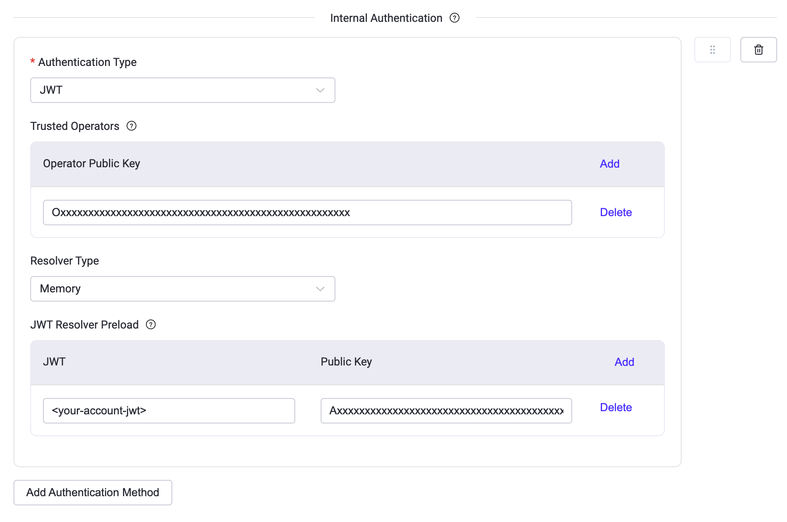

# NATS プロトコルゲートウェイ

EMQX 5.10.0 以降、EMQX は [NATS プロトコル](https://docs.nats.io/reference/reference-protocols/nats-protocol) に基づく NATS プロトコルゲートウェイを導入しました。これにより、EMQX は NATS クライアントからの接続を受け入れ、MQTT とのメッセージ相互運用を実現します。本ドキュメントでは、その機能概要と NATS ゲートウェイの有効化および設定方法について説明します。

## 機能概要

NATS プロトコルゲートウェイは現在、以下の主要機能をサポートしています。

### プロトコルサポート

- **NATS プロトコルのメッセージタイプを完全サポート**：
  - 接続およびセッション管理：`INFO`、`CONNECT`
  - メッセージのパブリッシュ／サブスクライブ：`PUB`、`HPUB`、`SUB`、`UNSUB`
  - メッセージ配信および応答：`MSG`、`HMSG`
  - ハートビートおよびステータス：`PING`、`PONG`、`+OK`、`-ERR`
- **冗長モード（Verbose mode）対応**：クライアントが `CONNECT verbose=true` で接続した場合に応答確認を有効化。
- **豊富な認証方式のサポート**：Token、NKey、JWT、ユーザー名／パスワード認証に対応。

### MQTT との相互運用性

- **MQTT との双方向メッセージ相互運用**：
  - NATS クライアントからパブリッシュされたメッセージは MQTT のパブリッシュに変換されます。
  - MQTT メッセージは対応するトピックをサブスクライブしている NATS クライアントに転送されます。
- **NATS のワイルドカードサブスクリプションをサポート**し、自動的に MQTT 互換のトピック形式に変換。
- **キューグループ共有サブスクリプションをサポート**：NATS のキューグループサブスクリプションは MQTT の共有サブスクリプション形式に変換されます。
- **リクエスト／リプライモードをサポート**：
  - NATS クライアントからのリクエストは MQTT リクエストに変換されます。
  - 対象トピックに MQTT サブスクライバーが存在しない場合、EMQX は迅速にエラー応答を返します。

### ネットワークおよび接続性

- **複数のトランスポートプロトコルをサポート**：TCP、TLS、WebSocket（WS）、および TLS 上の WebSocket（WSS）。

## NATS と MQTT 間のクロスプロトコルメッセージング

NATS プロトコルはパブリッシュ／サブスクライブメッセージングモデルと完全に互換性があり、NATS ゲートウェイを介して MQTT メッセージングと相互運用します。変換ルールは以下の通りです。

- **PUB および HPUB メッセージはパブリッシュ操作として扱われます**：
  - トピックは PUB メッセージの `subject` フィールドから派生します。例：`t.a` は MQTT トピック `t/a` に変換されます。
  - メッセージのペイロードは PUB メッセージ本文から直接取得します。
  - クライアントが `CONNECT verbose=1` で接続した場合、変換後の MQTT メッセージは QoS 1 を使用し、それ以外は QoS 0 となります。
- **SUB メッセージはサブスクリプション要求として扱われます**：
  - トピックは SUB メッセージの `subject` フィールドから派生します。例：`t.a` は MQTT トピック `t/a` に変換されます。
  - QoS は同様に `verbose=1` なら QoS 1、それ以外は QoS 0 です。
  - ワイルドカードをサポートします。例：`*.b.>` は `+/b/#` に変換されます。
  - キューグループをサポートします。SUB メッセージのキューグループ値は MQTT の共有サブスクリプションのグループ名に変換されます。
- **UNSUB メッセージはサブスクリプション解除要求として扱われ、サブスクリプション ID（sid）で解除対象を特定します。**

::: tip

NATS ゲートウェイはパブリッシュ／サブスクライブ操作に対する独自のアクセス制御を実装していません。トピック権限は統一された [認可設定](../../guides/access-control/authz/authz.md) で管理してください。

:::

## NATS ゲートウェイの有効化

EMQX 5.10.0 以降、NATS ゲートウェイは以下の3つの方法で有効化できます。

- ダッシュボードから
- REST API を使用して
- `base.hocon` 設定ファイルを編集して

::: tip

クラスター環境では、ダッシュボードや REST API での設定は全ノードに自動的に適用されます。特定のノードのみに設定を反映させたい場合は、そのノードの `base.hocon` 設定ファイルを使用してください。

:::

### ダッシュボードからの有効化

EMQX ダッシュボードから NATS ゲートウェイを素早く有効化する手順は以下の通りです。

1. 左メニューの **管理** -> **ゲートウェイ** に移動します。
2. **ゲートウェイ** ページで **NATS** を探し、**操作** 列の **設定** ボタンをクリックして **NATS 初期設定** ウィザードを開きます。
3. ウィザードの手順に従います：
   - **基本設定** ステップではデフォルト値を受け入れ、**次へ** をクリック。
   - **リスナー** ステップではリスナーを設定するかスキップして **次へ** をクリック。
     （リスナーの詳細設定は [リスナーの追加](#add-a-listener) を参照してください。）
   - **有効化** をクリックして NATS ゲートウェイを起動します。

有効化が完了すると、**ゲートウェイ** ページにリダイレクトされ、NATS ゲートウェイのステータスが **有効** と表示されます。

### REST API での有効化

以下の例は REST API を使って NATS ゲートウェイを有効化する方法です。

```bash
curl -X 'PUT' 'http://127.0.0.1:18083/api/v5/gateway/nats' \
  -u <your-application-key>:<your-security-key> \
  -H 'Content-Type: application/json' \
  -d '{
  "name": "nats",
  "enable": true,
  "mountpoint": "nats/",
  "listeners": [
    {
      "type": "tcp",
      "name": "default",
      "bind": "4222",
      "max_conn_rate": 1000,
      "max_connections": 1024000
    }
  ]
}'
```

### 設定ファイルでの有効化

`base.hocon` で NATS ゲートウェイを有効化する設定例は以下の通りです。

```properties
gateway.nats {

  mountpoint = "nats/"

  listeners.tcp.default {
    bind = 4222
    acceptors = 16
    max_connections = 1024000
    max_conn_rate = 1000
  }
}
```

NATS ゲートウェイは TCP、SSL、WS、WSS タイプリスナーをサポートします。設定可能なパラメータの完全な一覧は [EMQX Enterprise 設定マニュアル](https://docs.emqx.com/en/enterprise/v@EE_VERSION@/hocon/) のゲートウェイ設定 - リスナーセクションを参照してください。

## NATS ゲートウェイのカスタマイズ

デフォルト設定に加え、EMQX は特定のビジネス要件に合わせて様々な設定オプションを提供しています。このセクションでは **ゲートウェイ** ページで利用可能なオプションを詳述します。

### 基本設定

1. **ゲートウェイ** ページで **NATS** を探し、**操作** 列の **設定** ボタンをクリックします。

2. **設定** タブで、ゲートウェイの接続パラメータ、マウントポイントプレフィックス、クライアント識別情報の上書きを設定できます。

   - **サーバー名**：ゲートウェイの内部参照用の一意識別子。デフォルトは `emq_nats_gateway`。

   - **マウントポイント**：ゲートウェイを通過するすべてのトピックに自動的に付加される文字列プレフィックス。プロトコル間のトピック分離に役立ちます。例として `nats/` を使用すると、クライアントがプレフィックスを手動で含めることなくクロスプロトコルルーティングが可能になります。

   - **デフォルトハートビート間隔**：サーバーがクライアントの生存確認のために `PING` パケットを送信する間隔。デフォルトは 60 秒。

   - **ハートビートタイムアウト閾値**：クライアントが応答しなかった場合に切断とみなす時間。

   - **最大ペイロードサイズ**：単一の `PUB` または `HPUB` メッセージペイロードの最大サイズ（バイト単位）。デフォルトは 1048576 バイト。

   - **アイドルタイムアウト**：非アクティブなクライアント接続を切断するまでの秒数。デフォルトは 30 秒。

   - **統計収集の有効化**：このゲートウェイの統計収集とレポートを有効にするかどうか。デフォルトは有効。

   - **クライアント情報の上書き**：`CONNECT` パケットから認証情報を抽出する方法を定義。

     ::: tip

     認証が有効な場合は、`username` と `password` の正しいフィールドマッピングを設定し、認証情報が正しく処理されるようにしてください。

     :::

     - **ユーザー名**：`CONNECT` パケットの `user` フィールドにマッピング。
     - **パスワード**：`CONNECT` パケットの `pass` フィールドにマッピング。
     - **クライアント ID**：`${generated}` に設定すると自動生成されます。特定のロジックでカスタマイズも可能。

3. **更新** をクリックして変更を適用します。

### リスナーの追加

**リスナー** タブでリスナーの編集、削除、新規追加が可能です。

1. **リスナー** タブで **+ リスナー追加** をクリックします。

2. **リスナー追加** ダイアログで以下のオプションを設定します。

   **基本設定**

   - **名前**：リスナーを識別する一意の名前。
   - **タイプ**：リスナーの種類を選択。NATS では `tcp`、`ssl`、`ws`、`wss` がサポートされています。
   - **バインド**：リスナーが接続を受け入れるポート番号。

   **リスナー設定**

   - **最大接続数**：同時接続の最大数。デフォルトは 1024000。
   - **最大接続レート（リスナー）**：1秒あたりに受け入れる新規接続の最大数。デフォルトは 1000。
   - **プロキシプロトコル**：Proxy Protocol v1/v2 の有効化。デフォルトは無効（false）。
   - **プロキシプロトコルタイムアウト**：Proxy Protocol ヘッダー受信のタイムアウト。指定時間内にヘッダーがなければ接続を切断。デフォルトは 3 秒。

   **ピア検証設定**（SSL および WSS リスナーのみ適用）

   相互 TLS はデフォルトで有効です。TLS 証明書、秘密鍵、CA 証明書を設定する必要があります。これらはアップロードまたはフォームに直接貼り付け可能です。詳細は [SSL/TLS 接続の有効化](../../guides/network/emqx-mqtt-tls.md) を参照してください。

   - **TLS 証明書**：TLS 証明書ファイルのパスまたは内容。
   - **TLS 秘密鍵**：TLS 秘密鍵ファイルのパスまたは内容。
   - **CA 証明書**：CA 証明書ファイルのパスまたは内容。
   - **ピア証明書の強制検証**：クライアント証明書検証を必須にするか。デフォルトは有効（true）。

3. **追加** をクリックしてリスナー作成を完了します。

#### 転送クライアントアドレスの設定

EMQX 6.3.0 以降、`proxy_address_header` と `proxy_port_header` のデフォルト値は `""` となり、NATS WebSocket リスナーは明示的に転送ヘッダー名を設定しない限り TCP ピアアドレスとポートを使用します。

NATS リスナーが信頼できるプロキシの背後にあり、転送ヘッダーを書き換える場合は、`base.hocon` にヘッダー名を設定してください。例：

```hocon
gateway.nats.listeners.ws.default.websocket {
  proxy_address_header = "x-forwarded-for"
  proxy_port_header = "x-forwarded-port"
}
```

WSS リスナーの場合は `gateway.nats.listeners.wss.<listener-name>.websocket` を使用します。EMQX は各ヘッダーの最初（左端）の値を使用します。ヘッダーが存在しないか無効な場合は、TCP ピアアドレスまたはポートを使用します。

これらの設定は、信頼できるプロキシがクライアントからの値を書き換える場合のみ行ってください。そうでないと、クライアントが偽装した送信元アドレスを EMQX に使わせる可能性があります。

EMQX 6.3.0 はゲートウェイ WebSocket リスナーのヘッダー名マッチングの不具合も修正しています。6.3.0 より前は設定した名前がリクエストヘッダーと一致せず、TCP ピアアドレスとポートが使われていました。

### 認証の設定

NATS ゲートウェイは以下の2つの認証方法をサポートします。

- **ゲートウェイ認証（`authentication`）**：EMQX ゲートウェイ認証機構で、主にユーザー名／パスワード方式のバックエンドに使用。
- **内部ゲートウェイ認証（`internal_authn`）**：NATS ネイティブのユーザー名／パスワード以外の認証。

両方が有効な場合、EMQX は以下の順序で認証を評価します。

1. `internal_authn` のメソッドを上から順に評価。
2. 必要な認証情報が欠けている場合は次のメソッドを試す。
3. 認証情報があるが検証に失敗した場合は即座に接続拒否。
4. すべての内部メソッドがスキップされ、`authentication` が設定されている場合はゲートウェイ認証にフォールバック。
5. 内部メソッドもゲートウェイ認証も設定されていない場合は、すべての NATS クライアントの接続を許可。

#### ゲートウェイ認証の設定

他のゲートウェイ同様、NATS ゲートウェイは標準の EMQX 認証機構と連携可能です。以下の認証バックエンドをサポートしています。

- [組み込みデータベース認証](../../guides/access-control/authn/mnesia.md)
- [MySQL 認証](../../guides/access-control/authn/mysql.md)
- [MongoDB 認証](../../guides/access-control/authn/mongodb.md)
- [PostgreSQL 認証](../../guides/access-control/authn/postgresql.md)
- [Redis 認証](../../guides/access-control/authn/redis.md)
- [HTTP サーバー認証](../../guides/access-control/authn/http.md)
- [JWT 認証](../../guides/access-control/authn/jwt.md)
- [LDAP 認証](../../guides/access-control/authn/ldap.md)

ゲートウェイ認証では、NATS の `CONNECT` パケットから以下のフィールドを抽出します。

- **クライアント ID**：デフォルトで自動生成。
- **ユーザー名**：`user` フィールドの値。
- **パスワード**：`pass` フィールドの値。

MQTT プロトコルと異なり、ゲートウェイ認証は単一の認証機構のみをサポートし、複数の認証機構のリスト（チェーン）はサポートしません。

##### ダッシュボードでの設定例

HTTP サーバーを使ったパスワード認証の設定例：

1. NATS ゲートウェイ設定の **認証** タブに移動。
2. **+ 認証作成** をクリックし、メカニズムに **パスワードベース** を選択、データソースに **HTTP サーバー** を選択して **次へ**。
3. 設定パラメータを入力。詳細は [HTTP パスワード認証](../../guides/access-control/authn/http.md) を参照。
4. **作成** をクリックし、設定内容を確認して **更新** をクリック。

##### REST API での設定例

組み込みデータベース認証を REST API で設定する例：

```bash
curl -X 'POST' \
  'http://127.0.0.1:18083/api/v5/gateway/nats/authentication' \
  -u <your-application-key>:<your-security-key> \
  -H 'accept: application/json' \
  -H 'Content-Type: application/json' \
  -d '{
  "backend": "built_in_database",
  "mechanism": "password_based",
  "password_hash_algorithm": {
    "name": "sha256",
    "salt_position": "suffix"
  },
  "user_id_type": "username"
}'
```

##### 設定ファイルでの設定例

組み込みデータベース認証を設定ファイルで指定する例：

```properties
gateway.nats {

  authentication {
    backend = built_in_database
    mechanism = password_based
    password_hash_algorithm {
      name = sha256
      salt_position = suffix
    }
    user_id_type = username
  }
}
```

その他の認証タイプについては [EMQX 認証機構](../../guides/access-control/authn/authn.md#emqx-authenticators) のドキュメントを参照してください。

#### 内部認証（`internal_authn`）の設定

これは NATS ゲートウェイ固有の認証機能で、NATS サーバーの標準的な3つの認証方式をサポートします。

##### トークン認証

- NATS `CONNECT` パケットの `auth_token` フィールドを使用。
- プレーンなトークンおよび bcrypt ハッシュ（`$2a$`、`$2b$`、`$2y$`）をサポート。
- NATS リファレンス：[Token authentication](https://docs.nats.io/running-a-nats-service/configuration/securing_nats/auth_intro/tokens)

ダッシュボード設定例：


設定ファイル例：

```properties
gateway.nats {
  internal_authn = [
    {
      type = token
      token = "nats_token"
    }
  ]
}
```

##### NKey 認証

- NATS `CONNECT` パケットの `nkey` + `sig` チャレンジ／レスポンスを使用。
- `nkeys` は有効な NATS ユーザーパブリックキー（`U...`）でなければなりません。
- NATS リファレンス：[NKey authentication](https://docs.nats.io/running-a-nats-service/configuration/securing_nats/auth_intro/nkey_auth)

ダッシュボード設定例：


設定ファイル例：

```properties
gateway.nats {
  internal_authn = [
    {
      type = nkey
      nkeys = [
        "Uxxxxxxxxxxxxxxxxxxxxxxxxxxxxxxxxxxxxxxxxxxxxxxxxxxxx"
      ]
    }
  ]
}
```

##### JWT 認証（ACL サポート付き）

- NATS `CONNECT` パケットの `jwt` + `sig`（およびオプションの `nkey`）を使用。
- 信頼されたオペレーターリストと JWT プリロードリストの両方が必要。
- リゾルバータイプは現在 `memory` のみ対応。つまり、有効なアカウント JWT は設定で事前ロードされます。
- NATS リファレンス：[JWT authentication](https://docs.nats.io/running-a-nats-service/configuration/securing_nats/auth_intro/jwt)

ダッシュボード設定例：



設定ファイル例：

```properties
gateway.nats {
  internal_authn = [
    {
      type = jwt
      trusted_operators = [
        "Oxxxxxxxxxxxxxxxxxxxxxxxxxxxxxxxxxxxxxxxxxxxxxxxxxxxx"
      ]
      resolver {
        type = memory
        resolver_preload = [
          {
            pubkey = "Axxxxxxxxxxxxxxxxxxxxxxxxxxxxxxxxxxxxxxxxxxxxxxxxxxxx"
            jwt = "<your-account-jwt>"
          }
        ]
      }
    }
  ]
}
```

JWT ユーザークレームは ACL ルールも含めることができます。EMQX は `permissions` および `nats.pub` / `nats.sub` クレームをサポートし、最終的な認可結果は JWT ACL と EMQX 認可ルールの積集合となります。

JWT ACL クレームの例：

```json
{
  "sub": "Uxxxxxxxxxxxxxxxxxxxxxxxxxxxxxxxxxxxxxxxxxxxxxxxxxxxx",
  "iss": "Axxxxxxxxxxxxxxxxxxxxxxxxxxxxxxxxxxxxxxxxxxxxxxxxxxxx",
  "nats": {
    "pub": {
      "allow": ["sensors.>"],
      "deny": ["sensors.secret.>"]
    },
    "sub": {
      "allow": ["alerts.>"],
      "deny": ["alerts.internal.>"]
    }
  }
}
```

### ユーザーレベルのインターフェース設定

- 完全な設定リファレンスは：[NATS ゲートウェイ設定](https://docs.emqx.com/en/enterprise/v@EE_VERSION@/hocon/)
- REST API の詳細は：[ゲートウェイ REST API ドキュメント](https://docs.emqx.com/en/enterprise/v@EE_MINOR_VERSION@/admin/api-docs)

## さらに詳しく

NATS プロトコルゲートウェイとそのユースケースについては、以下のブログ記事をご覧ください。

[EMQX NATS Gateway: Enabling MQTT-NATS Bidirectional Interoperability](https://www.emqx.com/en/blog/emqx-nats-gateway)
