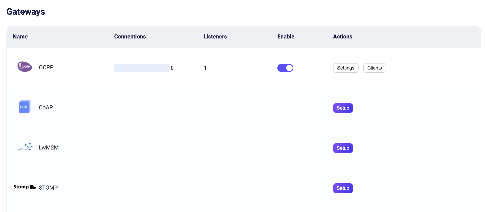
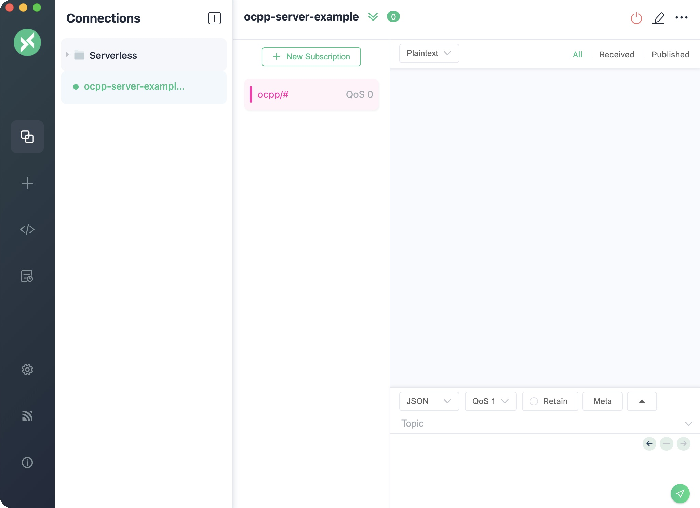
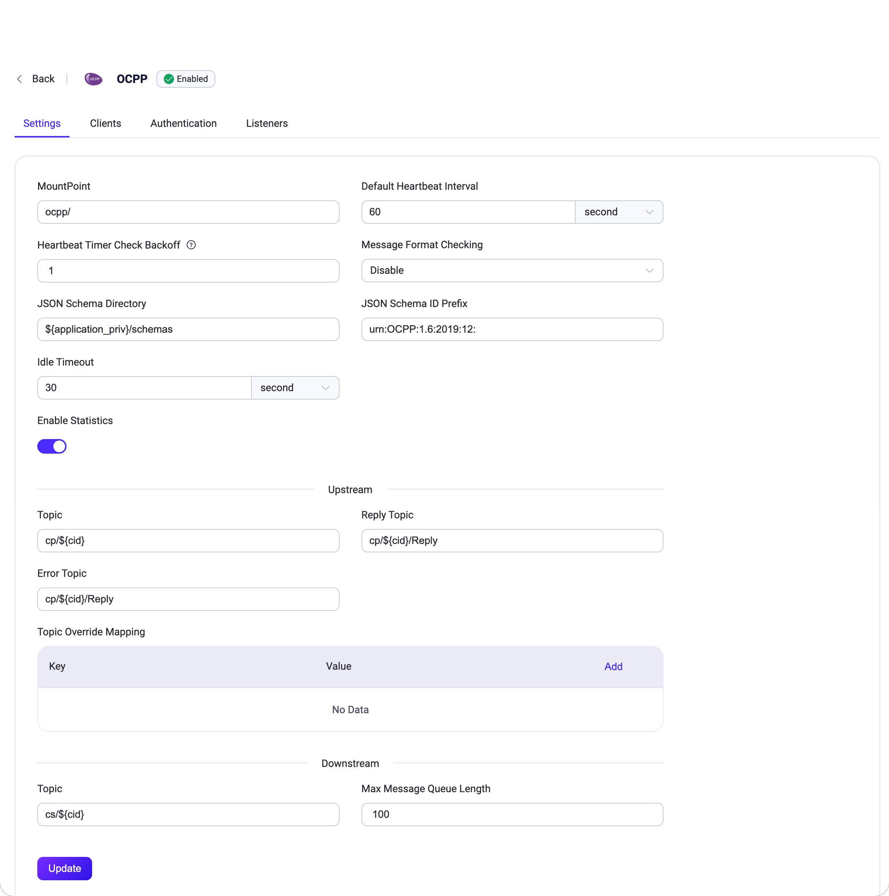

# OCPP ゲートウェイ

[OCPP](https://www.openchargealliance.org/)（Open Charge Point Protocol）は、充電ステーションと中央管理システムを接続するためのオープンな通信プロトコルであり、電気自動車充電インフラ向けの統一された通信標準を提供することを目的としています。OCPPゲートウェイはプロトコルの翻訳機として機能し、OCPPとMQTTプロトコル間の橋渡しを行うことで、これらのプロトコルを使用するクライアント同士の通信を可能にします。

EMQXは[OCPP 1.6-J](https://www.openchargealliance.org/protocols/ocpp-16/)向けのプロトコルゲートウェイを追加しており、OCPP仕様に準拠したさまざまなブランドの充電ステーション機器と接続可能です。ルールエンジン、データ統合、REST APIなどを通じて管理システム（Central System）と連携し、ユーザーが迅速に電気自動車充電インフラを構築できるよう支援します。

本ページでは、EMQXにおけるOCPPゲートウェイの設定および使用方法について紹介します。

## OCPPゲートウェイの有効化

EMQXのOCPPゲートウェイは、ダッシュボード、HTTP API、設定ファイル`base.hocon`を通じて設定および有効化できます。本節ではダッシュボードを用いた設定手順を例に説明します。

EMQXダッシュボードの左側ナビゲーションメニューで **Management** -> **Gateways** をクリックします。**Gateways** ページにはサポートされているすべてのゲートウェイが一覧表示されます。**OCPP** を見つけ、**Actions** 列の **Setup** をクリックすると、**Initialize OCPP** ページに遷移します。

::: tip

EMQXをクラスターで運用している場合、ダッシュボードやHTTP APIで行った設定はクラスター全体に影響します。特定のノードのみ設定を変更したい場合は、[`base.hocon`](../../operate/configuration/configuration.md)で設定してください。

:::

設定を簡略化するため、EMQXは**Gateways**ページのすべての必須項目にデフォルト値を用意しています。大幅なカスタマイズが不要であれば、以下の3クリックでOCPPゲートウェイを有効化できます。

1. **Basic Configuration** タブで **Next** をクリックし、すべてのデフォルト設定を受け入れます。
2. 続いて **Listeners** タブに遷移し、EMQXがポート`33033`でWebsocketリスナーを事前設定しています。再度 **Next** をクリックして設定を確定します。
3. 最後に **Enable** ボタンをクリックしてOCPPゲートウェイを有効化します。

ゲートウェイの有効化が完了すると、**Gateways** ページに戻り、OCPPゲートウェイのステータスが **Enabled** と表示されます。



上記の設定はHTTP APIでも行えます。

**例:**

```bash
curl -X 'PUT' 'http://127.0.0.1:18083/api/v5/gateways/ocpp' \
  -u <your-application-key>:<your-security-key> \
  -H 'Content-Type: application/json' \
  -d '{
  "name": "ocpp",
  "enable": true,
  "mountpoint": "ocpp/",
  "listeners": [
    {
      "type": "ws",
      "name": "default",
      "bind": "33033",
      "websocket": {
        "path": "/ocpp"
      }
    }
  ]
}'
```

## OCPPクライアントとの連携

OCPPゲートウェイが稼働したら、OCPPクライアントツールを使って接続テストや動作確認が可能です。

ここでは実例として[ocpp-go](https://github.com/lorenzodonini/ocpp-go)を用いて、EMQXのOCPPゲートウェイに接続する方法を紹介します。

1. まず、OCPPゲートウェイとインターフェースするMQTTクライアントを準備します。例えば[MQTTX](https://mqttx.app/downloads)を使い、EMQXに接続してトピック `ocpp/#` をサブスクライブするよう設定します。

   

2. ocpp-goクライアントを起動し、OCPPゲートウェイに接続します。

   **注意**：以下のコマンド内の `<host>` はEMQXサーバーのアドレスに置き換えてください。

   ```shell
   docker run -e CLIENT_ID=chargePointSim -e CENTRAL_SYSTEM_URL=ws://<host>:33033/ocpp -it --rm --name charge-point ldonini/ocpp1.6-charge-point:latest
   ```

   接続成功時は以下のようなログが出力されます。

   ```css
   INFO[2023-12-01T03:08:39Z] connecting to server logger=websocket
   INFO[2023-12-01T03:08:39Z] connected to server as chargePointSim logger=websocket
   INFO[2023-12-01T03:08:39Z] connected to central system at ws://172.31.1.103:33033/ocpp
   INFO[2023-12-01T03:08:39Z] dispatched request 1200012677 to server logger=ocppj
   ```

3. MQTTXで以下のようなメッセージが受信されることを確認します。

   ```json
   Topic: ocpp/cp/chargePointSim
   {
     "UniqueId": "1200012677",
     "Payload": {
       "chargePointVendor": "vendor1",
       "chargePointModel": "model1"
     },
     "Action": "BootNotification"
   }
   ```

   このメッセージはocpp-goクライアントがOCPPゲートウェイに接続し、`BootNotification`リクエストを送信したことを示しています。

4. MQTTXでトピック `ocpp/cs/chargePointSim` に以下の内容のメッセージを作成し、送信します。

   **注意**：`UniqueId` は前のメッセージで受信した値に置き換えてください。

   ```json
   {
     "MessageTypeId": 3,
     "UniqueId": "***",
     "Payload": {
       "currentTime": "2023-12-01T14:20:39+00:00",
       "interval": 300,
       "status": "Accepted"
     },
     "Action": "BootNotification"
   }
   ```

5. その後、MQTTXで `StatusNotification` ステータスレポートが受信されます。これはOCPPクライアントがOCPPゲートウェイとの接続を正常に確立したことを示します。

   ```json
   Topic: ocpp/cp/chargePointSim
   Payload:
   {
     "UniqueId": "3062609974",
     "Payload": {
       "status": "Available",
       "errorCode": "NoError",
       "connectorId": 0
     },
     "MessageTypeId": 2,
     "Action": "StatusNotification"
   }
   ```

## OCPPゲートウェイのカスタマイズ

デフォルト設定に加え、EMQXはさまざまな設定オプションを提供しており、特定のビジネス要件に合わせて柔軟に調整可能です。本節では**Gateways**ページで設定可能な各項目について詳しく解説します。

### 基本設定

GatewaysページのOCPPゲートウェイの**Actions**列にある**Settings**ボタンをクリックすると、**Basic Configuration**タブで以下の項目を設定できます。



- **MountPoint**: パブリッシュやサブスクライブ時にすべてのトピックの前に付加される文字列です。異なるプロトコル間でメッセージルーティングの分離を実現できます。例：`ocpp/`
- **Default Heartbeat Interval**: デフォルトのハートビート間隔（秒）、デフォルトは`60s`
- **Heartbeat Checking Times Backoff**: ハートビートチェックのバックオフ回数、デフォルトは`1`
- **Message Format Checking**: メッセージ形式の妥当性チェックを有効にするかどうか。EMQXはアップロードおよびダウンロードストリームのメッセージ形式をjson-schemaで定義された形式に照らして検証します。チェックに失敗した場合、EMQXは対応する応答メッセージを返します。設定可能な値は以下の通りです。

    - `all`: すべてのメッセージをチェック
    - `upstream_only`: アップロードストリームメッセージのみチェック
    - `dnstream_only`: ダウンロードストリームメッセージのみチェック
    - `disable`: チェックを行わない
- **JSON Schema Directory**: OCPPメッセージ定義のJSONスキーマディレクトリ、デフォルトは`${application}/priv/schemas`
- **JSON Schema ID Prefix**: OCPPメッセージスキーマのIDプレフィックス、デフォルトは`urn:OCPP:1.6:2019:12:`
- **Idle Timeout**: 非アクティブ状態が続いた場合に接続を切断するまでの最大待機時間（秒）
- **Upstream**: アップロードストリームの設定グループ
    - **Topic**: アップロードストリームのCall Requestメッセージ用トピック、デフォルトは`cp/${cid}`
    - **Reply Topic**: アップロードストリームのReplyメッセージ用トピック、デフォルトは`cp/${cid}/Reply`
    - **Error Topic**: アップロードストリームのErrorメッセージ用トピック、デフォルトは`cp/${cid}/Reply`
    - **Topic Override Mapping**: メッセージ名ごとのアップロードストリームトピックの上書きマッピング
- **Downstream**: ダウンロードストリームの設定グループ
    - **Topic**: EMQXからのリクエスト／制御メッセージを受信するダウンロードストリームのトピック。すべての接続されたチャージポイントがサブスクライブするワイルドカードトピック。デフォルトは`cs/${cid}`
    - **Max Message Queue Length**: ダウンロードストリームのメッセージ配信における最大メッセージキュー長、デフォルトは`100`

### リスナーの追加

ポート`33033`で名前が**default**のWebsocketリスナーが既に設定されており、プール内の最大アクセプター数は16、最大同時接続数は1,024,000です。リスナーの**Settings**をクリックすると詳細設定が可能で、**Delete**でリスナーの削除、**+ Add Listener**で新規リスナーの追加ができます。

::: tip

OCPPゲートウェイはWebsocketおよびWebsocket over TLSタイプのリスナーのみサポートしています。

:::

**Add Listener**をクリックすると**Add Listener**ページが開き、以下の設定項目を入力できます。

**基本設定**

- **Name**: リスナーの一意識別子を設定
- **Type**: プロトコルタイプを選択。OCPPでは`ws`または`wss`を選択可能
- **Bind**: リスナーが接続を受け付けるポート番号を設定
- **MountPoint**: パブリッシュやサブスクライブ時にすべてのトピックの前に付加される文字列。異なるプロトコル間でメッセージルーティングの分離を実現

**リスナー設定**

- **Path**: 接続アドレスのパスプレフィックスを設定。クライアントはこのアドレス全体を用いて接続する。デフォルトは`/ocpp`
- **Acceptor**: アクセプタープールのサイズを設定。デフォルトは`16`
- **Max Connections**: リスナーが処理可能な最大同時接続数。デフォルトは`1024000`
- **Max Connection Rate**: リスナーが1秒あたり受け入れ可能な新規接続の最大レート。デフォルトは`1000`
- **Proxy Protocol**: EMQXが[ロードバランサー](../../operate/cluster/lb.md)の背後にある場合にプロトコルV1/V2を有効化
- **Proxy Protocol Timeout**: プロキシプロトコルパッケージ受信待機の最大時間（秒）。非アクティブ時に接続を切断。デフォルトは`3s`

**TCP設定**

- **ActiveN**: ソケットの `{active, N}` オプションを設定。ソケットが能動的に処理可能な受信パケット数。詳細は[Erlangドキュメント - setopts/2](https://erlang.org/doc/man/inet.html#setopts-2)参照
- **Buffer**: 受信および送信パケットを格納するバッファサイズ（KB単位）
- **TCP_NODELAY**: `TCP_NODELAY`フラグの有効化設定。前のデータのアックを待たずに追加データ送信を行うかどうか。デフォルトは`false`。選択肢は`true`、`false`
- **SO_REUSEADDR**: ポート番号のローカル再利用を許可するかどうか
- **Send Timeout**: 送信タイムアウト時間（秒）。非アクティブ時に接続を切断。デフォルトは`15s`
- **Send Timeout Close**: 送信タイムアウト時に接続を閉じるかどうか

**SSL設定**（wssリスナーのみ）

TLS検証の有効化はトグルスイッチで設定可能ですが、その前に**TLS Cert**、**TLS Key**、**CA Cert**の情報をファイル内容の入力か**Select File**ボタンによるアップロードで設定する必要があります。詳細は[SSL/TLS接続の有効化](../../operate/network/emqx-mqtt-tls.md)を参照してください。

続いて以下の設定が可能です。

- **SSL Versions**: サポートするSSLバージョンを設定。デフォルトは`tlsv1.3`、`tlsv1.2`、`tlsv1.1`、`tlsv1`
- **Fail If No Peer Cert**: クライアントが空の証明書を送信した場合にEMQXが接続を拒否するかどうか。デフォルトは`false`。選択肢は`true`、`false`
- **Intermediate Certificate Depth**: ピア証明書に続く有効な認証パスに含まれる非自己発行中間証明書の最大数。デフォルトは`10`
- **Key Password**: プライベートキーがパスワード保護されている場合のユーザーパスワード

## 認証の設定

OCPPプロトコルの接続メッセージにはユーザー名とパスワードの概念が既に定義されているため、OCPPは以下のような多様な認証方式をサポートしています。

- [組み込みデータベース認証](../../operate/access-control/authn/mnesia.md)
- [MySQL認証](../../operate/access-control/authn/mysql.md)
- [MongoDB認証](../../operate/access-control/authn/mongodb.md)
- [PostgreSQL認証](../../operate/access-control/authn/postgresql.md)
- [Redis認証](../../operate/access-control/authn/redis.md)
- [HTTPサーバー認証](../../operate/access-control/authn/http.md)
- [JWT認証](../../operate/access-control/authn/jwt.md)
- [LDAP認証](../../operate/access-control/authn/ldap.md)

OCPPゲートウェイはWebsocketハンドシェイクメッセージのBasic認証情報を用いてクライアントの認証フィールドを生成します。

- クライアントID：固定パスプレフィックスの後の接続アドレス部分の値
- ユーザー名：Basic認証のUsernameの値
- パスワード：Basic認証のPasswordの値

また、HTTP APIを使ってOCPPゲートウェイ用の組み込みデータベース認証を作成することも可能です。

**例:**

```bash
curl -X 'POST' \
  'http://127.0.0.1:18083/api/v5/gateways/ocpp/authentication' \
  -u <your-application-key>:<your-security-key> \
  -H 'accept: application/json' \
  -H 'Content-Type: application/json' \
  -d '{
  "backend": "built_in_database",
  "mechanism": "password_based",
  "password_hash_algorithm": {
    "name": "sha256",
    "salt_position": "suffix"
  },
  "user_id_type": "username"
}'
```

::: tip

MQTTプロトコルとは異なり、**ゲートウェイは認証機構の作成のみをサポートし、認証機構のリスト（または認証チェーン）はサポートしていません**。

認証機構が有効化されていない場合、すべてのOCPPクライアントのログインが許可されます。

:::
