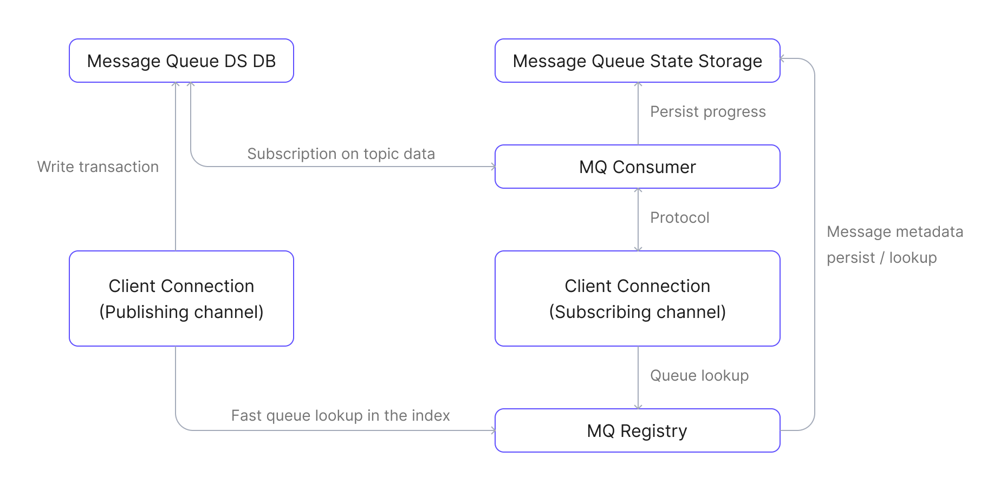

# メッセージキュー

EMQX 6.0で導入されたメッセージキュー機能は、MQTTのサブスクライブ／パブリッシュパターンを耐久性のあるキューセマンティクスで拡張し、信頼性の高い非同期メッセージ配信を可能にします。RabbitMQなどのエンタープライズグレードのメッセージキューで一般的に見られる機能を、追加のインフラなしでネイティブMQTT機能に付加します。

本ページでは、EMQXのメッセージキュー機能について、その設計動機、主要概念、内部アーキテクチャ、メッセージフロー、実際の適用シナリオまで包括的に解説します。

## メッセージキューとは？

EMQXにおけるメッセージキューは、サブスクライバーの有無に依存せずMQTTメッセージを格納する名前付きの耐久性サーバー側バッファです。各キューは一意のキュー名で識別され、トピックフィルターはどのパブリッシュされたメッセージをキューに格納するかを定義します（キューの識別子としては機能しません）。設定されたトピックフィルターにマッチするメッセージは、キューの保持および配信ポリシーに従って自動的に永続化されます。

従来のMQTTの動作とは異なり、メッセージキューはクライアントがオンラインでない場合でもメッセージを永続化します。クライアントは特別な`$queue/<name>`または`$queue/<name>/<topic_filter>`形式をサブスクライブすることでこれらのメッセージを消費できます。

メッセージキューは組み込みの耐久ストレージを使用します。メッセージキューを有効にする前に、EMQXのデータディレクトリがローカルファイルシステムを使用していることを確認してください。[組み込み耐久ストレージバックエンド](../design/durable-storage.md#embedded-backends)はNFSやSMB/CIFSなどのネットワークファイルシステムをサポートしていません。

::: warning リスナーマウントポイントとの非互換性
メッセージキューは、[マウントポイント](../../guides/configuration/listener.md#mountpoint)が設定されたリスナー経由で接続したクライアントには機能しません。EMQXは`$queue/`プレフィックスのマッチ前にマウントポイントを適用するため、サブスクリプションはマウントされたリテラルトピックへの通常のサブスクリプションとして扱われます。クライアントにはエラーは報告されません。
:::


## なぜメッセージキューを使うのか？

MQTTは軽量で広く採用されているパブリッシュ／サブスクライブプロトコルですが、デフォルトの動作はメッセージ配信をサブスクライバーのオンライン状態に強く依存しており、非同期や遅延消費のシナリオでは制約となります。

### MQTTの制約

MQTTは[共有サブスクリプション](../../get-started/messaging/mqtt-shared-subscription.md)（`$share/{group}/topic`）を通じてキューのような機能を一部サポートしますが、以下の制約があります：

- サブスクライバーがオンラインでない場合、メッセージは保持されません。
- TTL（有効期限）、キューサイズ制限、オーバーフロー制御の組み込みサポートがありません。
- キーごとに最新値のみを保持するようなメッセージの重複排除機能がありません。
- キューの明示的なライフサイクル管理がありません。

これらの制約により、以下のようなパターンの実装が困難です：

- デバイスがオンラインになる前にコマンドを送信する。
- 常時接続していないワーカーにタスクを送る。
- 最新の状態や設定更新のみを保持する。

### メッセージキューによるMQTTの拡張

メッセージキューはEMQXにおけるMQTTプロトコルの拡張であり、サブスクライバーのオンライン状態に関わらずメッセージを永続化し、後続の処理を可能にします。主な特徴は：

- **クライアントがオフラインでもメッセージを永続化**：キューは厳密な順序付けは保証しませんが、信頼性の高い非同期配信を実現し、軽量MQTT通信と高度なエンタープライズメッセージングの橋渡しをします。
- **明示的なキュー宣言とプロパティ設定**：各キューはTTL、サイズ制限、配信戦略などの設定が可能で、メッセージの保持と配信を細かく制御できます。
- **オプションのラストバリューセマンティクス**：同じキーを持つメッセージは古いものを上書きし、最新の状態や設定更新のみを保持する用途に適しています。

## メッセージキューの概念

- **キュー名**

   メッセージキューを明示的に識別する一意の識別子です。

   キュー名に使用できる文字は以下のみです：

   - 英数字（`A–Z`、`a–z`、`0–9`）
   - アンダースコア（`_`）
   - ハイフン（`-`）
   - ドット（`.`）

   ::: tip

   EMQX 6.1.1以降、キューはトピックフィルターではなく名前で指定します。トピックフィルターはキューの設定の一部であり、識別子ではありません。

   :::

- **トピックフィルター**

   `devices/+/command`のようなMQTTトピックフィルターで、どのパブリッシュメッセージをキューに書き込むかを決定します。設定されたフィルターにマッチするメッセージのみがキューに格納されます。1つのパブリッシュメッセージが複数のキューにマッチし、複数のキューに書き込まれることもあります。

   ::: tip

   トピックフィルターは名前付きキューの設定メタデータであり、キュー作成後に変更できません。

   :::

- **キューサブスクリプション**

   キューからメッセージを消費するための特別なMQTTサブスクリプションです。クライアントは以下の形式でサブスクライブします：

   ```
   SUBSCRIBE $queue/<name>
   SUBSCRIBE $queue/<name>/<topic_filter>
   ```

   ここで：

   - `<name>`はキュー名（必須）
   - `<topic_filter>`は既存キューにサブスクライブする際は省略可能
   - 自動作成が有効な場合、`$queue/<name>/<topic_filter>`はキューが存在しなければ指定されたトピックフィルターでキューを作成します。

   キューサブスクリプションは通常のMQTTサブスクリプションとは独立して動作し、メッセージキューのコンシューマーメカニズムで処理されます。

- **ラストバリューセマンティクス**

   キュー宣言時に**キューキー式**を設定して有効化できるオプション機能です。有効化すると、EMQXはキューに入る各メッセージから`キューキー`を抽出し、同じキーの未消費メッセージがあれば新しいメッセージで上書きします。この動作は状態管理メッセージや設定更新で、最新値のみを保持し古いメッセージを破棄してよい場合に適しています。

   詳細は[キューキー式](./message-queue-task.md#queue-key-expression)を参照してください。

- **キュー宣言**

   耐久性のあるキューを作成し、トピックフィルター、配信戦略、保持制限、キー式などのプロパティで動作を定義するプロセスです。

- **キュー削除**

   キューとその格納されたメッセージおよび関連状態をすべて削除する操作です。

- **キュープロパティ**

   メッセージ保持時間や配信戦略など、キューの動作を制御するカスタマイズ可能な設定です。

- **QoS（サービス品質）**

   メッセージキュー内のすべてのメッセージは、パブリッシュやサブスクライブ時のQoSレベルに関わらずQoS 1（少なくとも一度配信）で配信されます。これにより信頼性の高いメッセージ配信が保証され、キューの配信動作が統一されます。

- **メッセージ永続化**

   サブスクライバーが接続していなくてもメッセージは保持されます。デフォルトでキューはラストバリューセマンティクスを適用します。キー式を設定しない通常のキューでは、受信順にメッセージを格納します。

## メッセージキューの動作

EMQXのメッセージキュー機能は疎結合の拡張として実装されており、内部フックでパブリッシュとサブスクライブ操作をインターセプトします。これらのフックはレジストリやストレージ層と連携し、メッセージの永続化と配信を信頼性高く行います。

### 主なコンポーネント

以下の主要コンポーネントが関与します：

- **メッセージキューレジストリ**：すべてのメッセージキューのライフサイクルを管理し、キューの作成、削除、検索を担当します。
- **メッセージキューメッセージDB**：キューにパブリッシュされた実際のメッセージを格納し、EMQXの[耐久ストレージ](../../guides/durability/durability_introduction.md#durable-storage-architecture)上に構築されています。
- **メッセージキュー状態ストレージ**：消費進捗やキューメタデータ（TTL、プロパティなど）を永続化します。
- **メッセージキューコンシューマー**：キューからメッセージを取得し、接続されたサブスクライバーに配信戦略に基づいて配信します。
- **メッセージキューサブスクリプションレジストリ**：どのチャネル（クライアント）がどのキューにサブスクライブしているかを追跡し、各チャネルのコンテキストにサブスクリプション状態を保持します。
- **メッセージキューフック**：パブリッシュおよびサブスクライブイベントにフックし、メッセージをキューやコンシューマーにルーティングします。

### メッセージキューデータフローダイアグラム

以下の図は、主要なメッセージキューコンポーネント間のデータフローを示しています：



### パブリッシュのワークフロー

1. クライアントが通常のトピック（例：`some/topic`）にメッセージをパブリッシュします。
2. 内部のMQフックがトリガーされてメッセージを処理します。
3. フックはメッセージキューレジストリで、パブリッシュトピックにマッチするキューを検索します。
4. マッチするキューがあれば、メッセージをそのキューのメッセージDBに書き込みます。

### サブスクライブおよび消費のワークフロー

1. クライアントが`$queue/<name>`または`$queue/<name>/<topic_filter>`でキューにサブスクライブします。
2. MQフックがトリガーされ、サブスクリプションを処理します。
3. フックはキュー名でキューを解決し、クライアントセッションコンテキスト内にサブスクリプションを初期化し、メッセージキューコンシューマーへの接続を確立します。
4. キューに対応するコンシューマープロセスがなければ、新たにメッセージキューコンシューマーを起動します。
5. コンシューマーはメッセージ消費の進捗を復元し、メッセージDBからデータの取得を開始します。
6. コンシューマーは設定された配信戦略に従い、受信したメッセージをサブスクライバーのクライアントセッションに配信します。
7. サブスクライバーのクライアントセッションは標準MQTTメカニズムでクライアントにメッセージを届けます。

## メッセージキューのコア機能

EMQXのメッセージキュー機能は、信頼性が高く疎結合で設定可能なメッセージ配信を実現する一連のコア機能を提供します。

- **メッセージのエンキュー**

  キューのトピックフィルターにマッチするトピックにパブリッシュされたメッセージは自動的にキューに格納されます。

  キューキー式（ラストバリューセマンティクス用）が設定されている場合、EMQXは各メッセージに対して式を評価します：

  - キーが導出されれば、同じキーの未消費メッセージを置き換えます。
  - ラストバリューキューでキーの評価に失敗したメッセージは破棄されます。

- **メッセージのデキュー**

  サブスクライブしたクライアントは設定された配信戦略に従いキューからメッセージを受け取ります。メッセージキュー内のすべてのメッセージはQoS 1（少なくとも一度配信）で配信され、信頼性の高い配信を保証します。クライアントがメッセージをアックすると、そのメッセージはキューから削除されます。

- **配信戦略**

   メッセージをサブスクライバーにどのように分配するかを定義できます：

  - `random`：ランダムに分配
  - `round_robin`：利用可能なサブスクライバー間で順番に分配
  - `least_inflight`：処理中メッセージ数が少ないサブスクライバーを優先

- **キュー管理**

   キューの作成、更新、削除、クエリなどのフルライフサイクル操作はREST APIで利用可能です。

## 利用ケース

メッセージキューは、デバイスやコンシューマーが常時オンラインでない多くのIoTおよびイベント駆動型アプリケーションシナリオで重要な、信頼性の高い非同期メッセージングパターンを実現します。

- **デバイスコマンドキューイング**：クラウドアプリケーションがIoTデバイス向けコマンドをキューイングし、デバイスがオフラインでもコマンドが失われないようにします。
- **バッチ処理**：大規模データセットや作業負荷を小さなタスクに分割し、ワーカークライアントに並列または遅延処理で配布します。
- **センサーデータ処理**：高頻度のセンサーデータを一時的にキューイングし、後でバッチ処理や集約、分析を行います。
- **最新設定の配信**：デバイスが常に最新の設定コマンドを取得・処理するようにし、同じ設定項目／キーの古い未処理コマンドはキュー内で上書きまたは無効化されます。

## 関連機能リファレンス

メッセージキューはMQTTを基盤とし、EMQXの他のメッセージング機能を補完します：

- [共有サブスクリプション](../../get-started/messaging/mqtt-shared-subscription.md)：複数サブスクライバー間でメッセージを分配しますが、クライアントがオンラインでない場合はメッセージを保持しません。
- [保持メッセージ](../../get-started/messaging/mqtt-retained-message.md)：トピックごとに最後のメッセージを保存しますが、新規サブスクライバーに1件のみ配信します。
- [MQTT耐久セッション](../../guides/durability/durability_introduction.md)：個々のクライアントのセッション状態（サブスクリプションやQoS 1/2メッセージ）を再接続間で保持します。
- [ルールエンジン](../data-integration/rules.md)：SQLライクなルールでキュー内メッセージのフィルタリングや処理、転送を行えます。

## セキュリティ考慮事項

EMQXはキューサブスクリプションを`$queue/`プレフィックスとキュー名を含む完全なサブスクリプショントピックフィルターに対して認可します。完全なフィルターに対する書き込み認可ルールを作成してください。キューサブスクリプションは、サブスクリプション作成前にキューが保持していたメッセージも配信します。

### キューサブスクリプションには専用ルールが必要

通常のトピックスペース用のルールは対応するキューサブスクリプションをカバーしません：

- `t/#`用のルールは`$queue/orders/t/#`には適用されません。EMQXは両者を異なるトピックとして扱います。
- 認可トピックフィルターが`#`や`+`で始まる場合、`$`で始まるサブスクリプショントピックフィルターとはマッチしません。デフォルトの`acl.conf`の`{eq, "#"}`ルールを含む`#`拒否ルールは`$queue/orders/#`を拒否しません。

`#`が拒否されているクライアントでも`$queue/orders/#`にサブスクライブしてキュー内のすべてのメッセージを受信可能です。`$queue/`ネームスペースに対して明示的なルールを追加し、キューのトピックフィルターに対する通常トピックの認可ルールと同等かそれ以上に厳しくしてください：

```erlang
%% 自動作成を許可せず、事前作成済みの"orders"キューの読み取りを1つのコンシューマに許可
{allow, {username, "order_worker"}, subscribe, ["$queue/orders"]}.

%% その他すべてのキューサブスクリプションを拒否（非推奨プレフィックスも含む）
{deny, all, subscribe, ["$queue/#", "$q/#"]}.
```

非推奨の`$q/`プレフィックスは、まだクライアントが使用している間はルールに残してください。[非推奨プレフィックス](#deprecated-prefix)を参照。

この動作は[共有サブスクリプション](../../get-started/messaging/mqtt-shared-subscription.md)とは異なります。`$share/<group>/t/#`の場合、EMQXはプレフィックスを除去して`t/#`を認可しますが、`$queue/<name>/t/#`の場合は完全なサブスクリプショントピックフィルターを認可します。

### 自動作成はクライアント指定のトピックフィルターを許可

キューの自動作成が有効な場合、サブスクライブするクライアントが新規キューのトピックフィルターを決定します。EMQXは`$queue/<name>/<topic_filter>`の`<topic_filter>`を使ってキューを作成し、クライアントが直接`<topic_filter>`にサブスクライブする権限があるかは別途チェックしません。

例えば、`$queue/+/#`にサブスクライブ許可があるクライアントは`$queue/orders/#`にサブスクライブ可能です。`orders`キューが存在しなければEMQXはトピックフィルター`#`で作成します。キューは`$`で始まらないすべてのトピックのメッセージを保持するため、クライアントは直接サブスクライブ権限のないトピックのメッセージも受信する可能性があります。

自動作成はデフォルトでラストバリューキューに対して有効、通常キューには無効ですが、メッセージキュー機能が有効な間のみ有効です。デフォルトの`mq.enable = auto`では、少なくとも1つのキューが存在してからメッセージキューが有効になるため、サブスクリプションで最初のキューを作成できません。信頼できないクライアントを受け入れる環境では、`$queue/orders`のような特定の事前作成済みキューへのアクセスのみ許可し、`$queue/#`や`$q/#`にマッチするその他のサブスクリプションはすべて拒否してください。あるいは自動作成を無効にして、ダッシュボードやREST APIからキューを作成してください。[ダッシュボードからのキュー自動作成](./message-queue-task.md#automatically-create-queues-via-dashboard)を参照。

## 互換性に関する注意点

本節はEMQX 6.1.1で導入された互換性に関する考慮点をまとめています。

### 名前付きキュー

EMQX 6.1.1以降、すべてのキューは明示的に名前付きリソースとなりました。キューの識別はトピックフィルターではなく一意の名前に基づきます。

### 旧式キュー

以前に作成された名前なしキューは、トピックフィルターから派生した名前が自動的に割り当てられます。

派生名の形式：

```
/<topic_filter>
```

> この派生名は既存の`$q/<topic_filter>`サブスクリプションとの互換性を維持します。

### 非推奨プレフィックス

`$q`プレフィックスは旧式サブスクリプションのために引き続きサポートされますが非推奨です。

新規導入では以下を使用してください：

```
$queue/<name>
```

### 共有サブスクリプションの制限

メッセージキューが有効な場合、`$queue/`プレフィックスはキューサブスクリプション専用に予約されており、共有サブスクリプションには使用できません。

## 次のステップ

メッセージキューの基本を理解したら、実践的な使い方を学びましょう：

- [キューの作成と設定](./message-queue-task.md)：ダッシュボードやREST APIでのキュー宣言、配信戦略や保持ポリシーの定義方法を解説します。
- [クイックスタートチュートリアル](./message-queue-quick-start.md)：MQTTXを使った実践的なパブリッシャー／サブスクライバーシナリオのステップバイステップガイドです。
