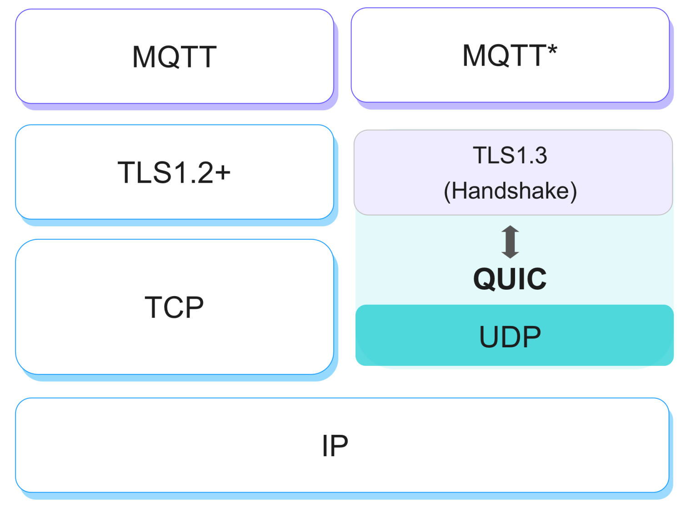
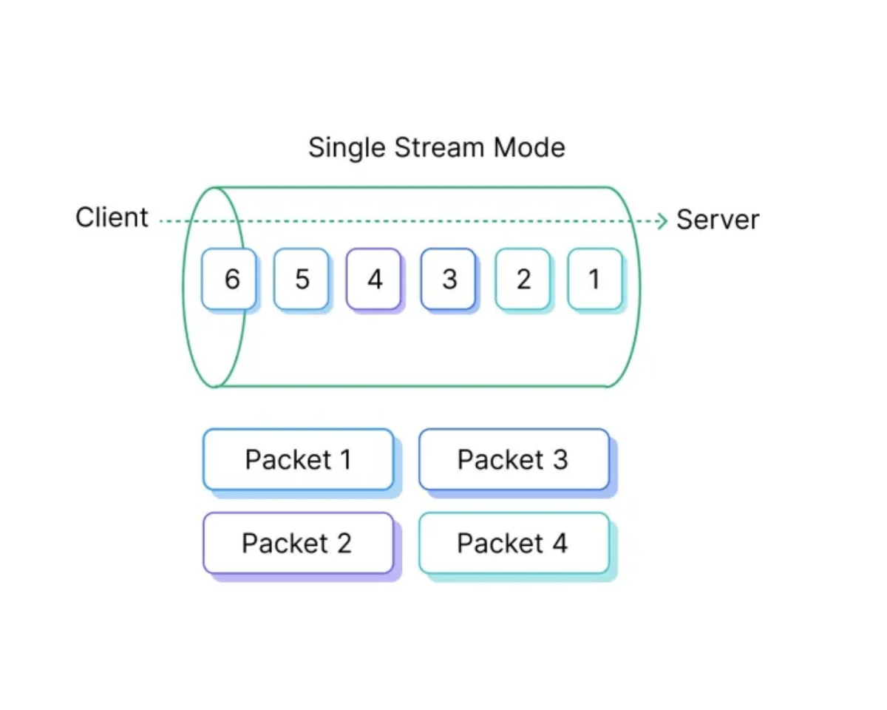
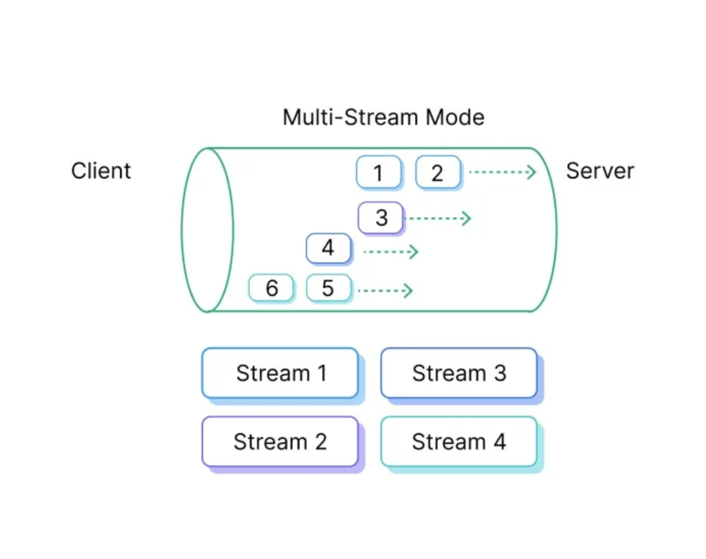

# 機能と利点

EMQXは、MQTT over QUIC向けに独自のメッセージ伝送機構と管理方法を設計しており、現代の複雑なネットワーク上でMQTTメッセージをより効率的かつ安全に伝送する方法を提供します。これにより、特定のシナリオにおけるMQTTのパフォーマンスが向上します。

本ページでは、MQTT over QUICの利点と、各QUIC動作モードのメリットおよびユースケースについて紹介します。

## MQTT over QUICの利点

QUICはTCPとUDPの機能を統合しつつ、現代のネットワークにおけるレイテンシ問題に対処するための追加改善を導入しています。QUICの利点は以下の通りです。

- **レイテンシの低減**  
  QUICは接続確立時間を最小化するよう明確に設計されています。従来のMQTT over TCPでは、TCPハンドシェイク後に別途TLSハンドシェイクが必要であり、特にモバイルネットワークや不安定な接続環境で遅延が発生します。QUICはトランスポートとTLSのハンドシェイクを統合しており、MQTT接続をより迅速に確立できる可能性があります。

- **ヘッドオブラインブロッキングのない多重化**  
  QUICは単一接続上で複数のストリームを多重化できます。TCPでは、あるストリームでパケット損失が発生するとヘッドオブラインブロッキングにより他のストリームもブロックされますが、QUICでは各ストリームが独立しているため、この問題を回避できます。これは複数のトピックやメッセージストリームを同時に扱うMQTTアプリケーションに有利です。

- **不安定なネットワーク環境での優れたパフォーマンス**  
  QUICの設計は、TCPに比べてパケット損失やネットワーク変動（例：Wi-Fiとセルラー間の切り替え）に強く、頻繁にネットワークが途切れる環境やモバイル端末上で動作するMQTTアプリケーションにおいて、よりレジリエントな接続を提供します。

- **組み込みのセキュリティ**  
  QUICはTLSに相当するセキュリティ機能を標準で備えているため、MQTT over QUICは追加設定なしに常に暗号化および認証が行われます。

- **接続マイグレーション**  
  クライアントのIPアドレスやポートが変わっても接続を再確立することなくシームレスに対応可能です。移動中のMQTTデバイスにとって、基盤となるネットワークが変わっても接続を維持できることは大きなメリットです。

- **改善された輻輳制御**  
  TCPの輻輳制御アルゴリズムは長年の実績がありますが、QUICは新しく柔軟な手法を導入しており、新しいアルゴリズムの実験が可能です。これにより、特に混雑したネットワーク環境でMQTTメッセージのスループットや応答性が向上する可能性があります。

## QUICの動作モード

EMQXの現行実装では、トランスポート層をQUICストリームに置き換えており、クライアントが接続を開始し双方向ストリームを作成します。EMQXとクライアントはこのストリーム上でやり取りを行います。複雑なネットワーク環境を考慮し、クライアントが何らかの理由でQUICハンドシェイクに失敗した場合は、自動的に従来のTCPにフォールバックし、サーバーとの通信障害を回避します。EMQXとクライアント間のやり取りには、[シングルストリームモード](#single-stream-mode)と[マルチストリームモード](#multi-streams-mode)の2つのモードがあります。以下では各モードの特徴と利点を紹介します。

### シングルストリームモード

シングルストリームモードは、MQTTパケットを単一の双方向QUICストリームにカプセル化する基本モードです。高速なハンドシェイク、順序通りのデータ配信、接続再開、0-RTT、クライアントアドレスのマイグレーション、強化されたパケット損失検出と回復を提供します。このモードにより、クライアントとEMQX間の通信が高速かつ効率的になり、順序を維持しつつ接続を迅速に回復し、クライアントがローカルアドレスを大きな中断なく移行できるようになります。

#### 特徴と利点

シングルストリームモードの特徴と利点は以下の通りです。

- 高速なハンドシェイク  
  クライアントとEMQX間のQUIC接続は1往復以内で確立可能です。

- 順序通りのデータ配信  
  TCP同様、MQTTパケットの配信はストリーム上で送信されたメッセージの順序に従います。基盤のUDPデータグラムが順不同で受信されても順序は保持されます。

- 接続再開と0-RTT  
  0-RTT方式を用いることで、クライアントは接続を再開し、最初のQUICパケットまたは直後にアプリケーションデータをサーバーに送信可能です。EMQXの応答を待ってラウンドトリップを完了する必要がありません。これはネットワーク障害で切断された接続を迅速に回復し、アプリケーションを早期にオンラインに戻すのに特に有効です。

- クライアントアドレスのマイグレーション  
  切断や新規接続の確立なしに、クライアントはNATリバインディングなどによりローカルアドレスを新しいアドレスに能動的または受動的に移行できます。QUIC接続は大きな中断なく維持されるため、MQTT層以上に影響を与えません。

- パケット損失検出と回復  
  QUICは他のプロトコルに比べパケット損失の検出と回復に迅速に対応します。動作はユースケースごとに調整可能です。

### マルチストリームモード

マルチストリームモードは、QUICのストリーム多重化機能を活用し、MQTTパケットを複数のストリームで伝送します。これにより、単一のMQTT接続で複数トピックのデータを扱え、接続制御とMQTTデータ交換の分離、ヘッドオブラインブロッキングの回避、アップリンクとダウンリンクデータの分割、異なるデータの優先順位付け、並列処理の向上、堅牢性の強化、データストリームのトラフィック制御、サブスクリプションレイテンシの低減など多くの改善が可能です。

クライアントからEMQXへ最初に確立されるストリームはコントロールストリームと呼ばれ、MQTT接続の維持や更新を担当します。続いて、クライアントは1つまたは複数のデータストリームを開始し、トピックのパブリッシュやサブスクライブをストリームごとに行います。

クライアントはストリームのマッピング方法を自由に選択できます。例として：

- トピックごとに1つのストリームを使用する  
- QoS 1用のストリームとQoS 0用のストリームを分ける  
- パブリッシュ用とサブスクライブ用でストリームを分ける（コントロールストリーム上でのパブリッシュ／サブスクライブも可能）

ブローカーであるEMQXはストリームパケットのバインディングを行います：

- QoS 1のPUBLISHを受信したストリーム上でPUBACKパケットを送信し、QoS 2パケットも同様に処理します。  
- トピックサブスクリプションを受けたストリーム上でPUBLISHパケットを送り、同じストリームからQoS 1のPUBACKを期待します。

::: tip

データの順序はストリームごとに維持されます。そのため、2つのトピックのデータが相関し順序が重要な場合は、同じストリームにマッピングすべきです。  
:::

#### 特徴と利点

マルチストリームモードの特徴と利点は以下の通りです。

- 接続制御とMQTTデータ交換の分離  
  CONNECT、CONNACK、PINGなどのMQTT接続制御パケットはコントロールストリームで処理し、パブリッシュやサブスクライブなどのデータ交換はデータストリームで行います。データストリームが遅くても、PINGREQとPINGRESPの処理により接続は維持されます。

- トピック間のヘッドオブラインブロッキング回避  
  MQTT over QUICは異なるトピックごとに複数のデータストリームを許可し、異なるトピックのメッセージを独立して配信可能です。

- アップリンク（パブリッシュ）とダウンリンク（サブスクライブ）データの分割  
  例えば、クライアントは1つのストリームでQoS 1メッセージをパブリッシュして同じストリームでPUBACKを処理し、別のストリームでブローカーからQoS 0メッセージを受信できます。

- 異なるデータの優先順位付け  
  MQTT over QUICはマルチストリームを通じて異なるMQTTトピックのデータを優先順位付けし、トピックデータを適切に配信することで接続全体のパフォーマンスと応答性を向上させます。

- クライアントおよびEMQX側の処理並列性向上  
  データストリームを利用することで、EMQXとクライアントは複数ストリームを並行処理でき、システム全体の効率とリソース利用率が向上し、レイテンシ低減とアプリケーション層の応答速度向上につながります。

- エラー処理のオーバーヘッド削減  
  単一のデータストリームがアプリケーションエラーで中断されても、接続全体が閉じることはありません。アプリケーションはストリームを再作成してデータを回復でき、より信頼性とレジリエンスの高いMQTT通信を実現します。

- データストリーム単位のフロー制御  
  データストリームごとに異なるフロー制御ポリシーを適用でき、トピックやQoSレベルごとに柔軟な制御が可能です。

- サブスクリプションレイテンシの低減  
  クライアントはMQTTのCONNACKを待たずにサブスクライブやパブリッシュパケットを送信可能です。ただし、EMQXはクライアントが接続を確立し接続が許可されてから処理を開始します。
