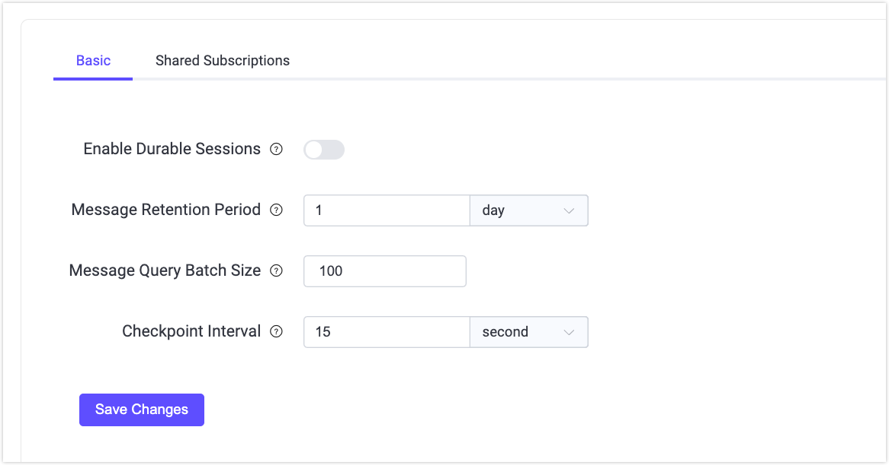

# Durable Sessionsの設定と管理

本ドキュメントでは、EMQXにおける[MQTT Durable Sessions](./durability_introduction.md)機能の設定、管理、および最適化に関するリファレンスと手順を提供します。セッションおよびストレージの設定も含みます。

## 設定パラメータ

MQTT Durable Sessionsの設定は大きく2つのカテゴリに分かれています。

- `durable_sessions`：MQTTクライアントのセッションに関する設定で、耐久ストレージからのデータ消費方法やデータ保持パラメータを含みます。
- `durable_storage`：MQTTメッセージデータを保持する耐久ストレージシステムの設定を管理します。

### Durable Sessionsの設定

DashboardでDurable Sessionsのパラメータを設定できます。Dashboardの左メニューから **Management** -> **MQTT Settings** をクリックし、**Durable Session** タブを選択してパラメータを設定してください。



| パラメータ                                   | Dashboard UI 表示名           | 説明                                                         |
| ------------------------------------------- | ----------------------------- | ------------------------------------------------------------ |
| `durable_sessions.enable`                   | Enable Durable Sessions       | セッションの耐久性を有効化します。この設定はDashboard、REST API、CLIから変更できず、設定ファイルでのみ設定可能です。変更後はEMQXノードの再起動が必要です。 |
| `durable_sessions.message_retention_period` | Message Retention Period      | Durable Sessions内のMQTTメッセージの保持期間を定義します。注意：このパラメータはグローバル設定です。 |
| `durable_sessions.batch_size`               | Message Query Batch Size      | Durable Sessionsがストレージから消費するメッセージの最大バッチサイズを制御します。 |
| `durable_sessions.checkpoint_interval`      | Session Checkpoint Interval   | セッションメタデータを保存する間隔を指定します。              |

以下のパラメータは[ゾーン](../configuration/configuration.md#zone-override)ごとに上書き可能です。

- `durable_sessions.enable`
- `durable_sessions.batch_size`
- `durable_sessions.checkpoint_interval`

### Durable Storageの設定

`<DS>` は「durable storage（耐久ストレージ）」のプレースホルダーです。現在、利用可能な `<DS>` のパラメータは `message` です。

#### コア耐久ストレージパラメータ

| パラメータ                                 | 説明                                                         |
| ----------------------------------------- | ------------------------------------------------------------ |
| `durable_storage.n_sites`                 | [サイト数](./managing-replication.md#number-of-sites)を指定します。 |
| `durable_storage.<DS>.data_dir`           | EMQXがデータを保存するファイルシステム上のディレクトリです。   |
| `durable_storage.<DS>.n_shards`           | [シャード数](./managing-replication.md#number-of-shards)を指定します。 |
| `durable_storage.<DS>.replication_factor` | [レプリケーションファクター](./managing-replication.md#replication-factor)は各シャードのレプリカ数を決定します。 |
| `durable_storage.<DS>.transaction`        | メッセージのバッファリングに関するパラメータを含みます。詳細は[バッファリング](#buffering)を参照してください。 |
| `durable_storage.<DS>.layout`             | EMQXがディスク上にデータを配置する方法を制御するパラメータを含みます。詳細は[ストレージレイアウト設定](#storage-layout-configuration)を参照してください。 |

#### データベースグループの設定

EMQX 6.0.2以降、Durable Storageは[データベースグループ](../design/durable-storage.md#durable-storage-database-groups)を導入し、ノードレベルのリソースガバナンスをサポートしています。データベースグループにより、複数の耐久ストレージデータベースを論理データモデルを変更せずに、共有リソース制限のもとで一括管理できます。

デフォルトでは、各耐久ストレージデータベースは自身の名前を持つデータベースグループに属し、そのグループには単一のデータベースのみが含まれ、従来の動作を維持します。

データベースグループは `durable_storage.db_groups` ネームスペースで設定します。

| パラメータ                                                 | 説明                                                      |
| --------------------------------------------------------- | --------------------------------------------------------- |
| `durable_storage.db_groups.<group>.storage_quota`         | グループのSSTファイル合計ディスク使用量のソフトクォータです。 |
| `durable_storage.db_groups.<group>.write_buffer_size`     | グループのRocksDBメモリテーブルの最大合計サイズです。       |
| `durable_storage.db_groups.<group>.rocksdb_nthreads_high` | 高優先度のRocksDBバックグラウンドスレッド数です。           |
| `durable_storage.db_groups.<group>.rocksdb_nthreads_low`  | 低優先度のRocksDBバックグラウンドスレッド数です。           |

#### バッファリング

EMQXはクライアントからのMQTTメッセージを耐久ストレージにバッチ単位で書き込み、スループットを最大化します。バッチングは `durable_storage.<DS>.transaction` のサブツリーの以下パラメータで設定します。

| パラメータ             | 説明                                                         |
| --------------------- | ------------------------------------------------------------ |
| `max_pending`         | 指定したメッセージ数に達した時点でバッファをフラッシュします。 |
| `flush_interval`      | バッファに1件以上のメッセージがある場合、この時間間隔でフラッシュします。 |
| `idle_flush_interval` | 新規メッセージがこの間隔内に到着しない場合、早期にバッファをフラッシュします。 |

#### ストレージレイアウト設定

ストレージレイアウトはEMQXがディスク上にデータをどのように配置するかを決定します。`durable_storage.<DS>.layout.type` パラメータを設定することで、新しい[世代](./durability_introduction.md#generation)で使用するレイアウトを変更できます。この変更は既存の世代には影響しません。各レイアウトタイプの設定は `durable_storage.<DS>.layout` サブツリーに含まれます。現在は `wildcard_optimized` レイアウトタイプが利用可能です。

##### `wildcard_optimized` レイアウトタイプの設定

`wildcard_optimized` レイアウトは、多数のMQTTトピックに対するワイルドカードサブスクライブのマッチングを最適化することを目的としています。時間経過でトピック構造に関する知識を自律的に蓄積し、軽量な機械学習アルゴリズムを活用してクライアントがサブスクライブしそうなワイルドカードトピックフィルターを予測します。その後、これらのトピックを統合されたストリームに整理し、一度のスイープで効率的に消費できるようにします。

| パラメータ               | 説明                                                      |
| ----------------------- | --------------------------------------------------------- |
| `bytes_per_topic_level` | トピックレベルのハッシュサイズを決定します。              |
| `topic_index_bytes`     | ストリーム識別子のバイト数を指定します。                   |

## CLIコマンド

耐久ストレージの管理に利用可能なCLIコマンドは以下の通りです。

### `emqx ctl ds info`

耐久ストレージの状態概要を表示します。

例：

```bash
$ emqx ctl ds info

THIS SITE:
D8894F95DC86DFDB

SITES:
.------------------.-------------------.----------.
: Site             : Node              : Status   :
:------------------:-------------------:----------:
: 5C6028D6CE9459C7 : 'emqx@n2.local'   : up       :
: D8894F95DC86DFDB : 'emqx@n1.local'   : up       :
: F4E92DEA197C8EBC : 'emqx@n3.local'   : (x) down :
`------------------`-------------------`----------`

SHARDS:
.-------------.------------------.-------------.
: DB/Shard    : Replicas         : Transitions :
:-------------:------------------:-------------:
:-messages/0--:------------------:-------------:
:             : 5C6028D6CE9459C7 :             :
:-messages/1--:------------------:-------------:
:             : 5C6028D6CE9459C7 :             :
:-messages/10-:------------------:-------------:
:             : 5C6028D6CE9459C7 :             :
:-messages/11-:------------------:-------------:
:             : 5C6028D6CE9459C7 :             :
:-messages/12-:------------------:-------------:
:             : 5C6028D6CE9459C7 :             :
:-messages/2--:------------------:-------------:
:             : 5C6028D6CE9459C7 :             :
:-messages/3--:------------------:-------------:
:             : 5C6028D6CE9459C7 :             :
:-messages/4--:------------------:-------------:
:             : 5C6028D6CE9459C7 :             :
:-messages/5--:------------------:-------------:
:             : 5C6028D6CE9459C7 :             :
:-messages/6--:------------------:-------------:
:             : 5C6028D6CE9459C7 :             :
:-messages/7--:------------------:-------------:
:             : 5C6028D6CE9459C7 :             :
:-messages/8--:------------------:-------------:
:             : 5C6028D6CE9459C7 :             :
:-messages/9--:------------------:-------------:
:             : 5C6028D6CE9459C7 :             :
`-------------`------------------`-------------`
```

このコマンドの出力には以下が含まれます：

- `THIS SITE`：ローカルEMQXノードが管理するサイトのID。
- `SITES`：既知のすべてのサイトの一覧。EMQXノード名とステータスを含みます。
- `SHARDS`：耐久ストレージのシャード一覧と、そのレプリカが存在するサイトID。

### `emqx ctl ds set-replicas all <site1> <site2> ...`

クラスタ内の耐久ストレージのレプリカを保持するサイトのリストを設定します。このコマンドを実行すると、シャードをサイト間で公平に割り当てるための操作計画が作成され、バックグラウンドで実行されます。

::: warning 重要なお知らせ
耐久ストレージのレプリカリストの更新は、サイト間で大量のデータコピーが発生する可能性があるためコストがかかる場合があります。
:::

例：

```bash
$ emqx ctl ds set-replicas all 5C6028D6CE9459C7 D8894F95DC86DFDB F4E92DEA197C8EBC
ok
```

このコマンド実行後、`ds info` の出力は以下のようになる場合があります：

```bash
$ emqx ctl ds info

THIS SITE:
D8894F95DC86DFDB

SITES:
.------------------.-------------------.----------.
: Site             : Node              : Status   :
:------------------:-------------------:----------:
: 5C6028D6CE9459C7 : 'emqx@n2.local'   : up       :
: D8894F95DC86DFDB : 'emqx@n1.local'   : up       :
: F4E92DEA197C8EBC : 'emqx@n3.local'   : up       :
`------------------`-------------------`----------`

SHARDS:
.-------------.------------------.--------------------.
: DB/Shard    : Replicas         : Transitions        :
:-------------:------------------:--------------------:
:-messages/0--:------------------:--------------------:
:             : 5C6028D6CE9459C7 : + F4E92DEA197C8EBC :
:             : D8894F95DC86DFDB :                    :
:-messages/1--:------------------:--------------------:
:             : 5C6028D6CE9459C7 : + F4E92DEA197C8EBC :
:             : D8894F95DC86DFDB :                    :
:-messages/10-:------------------:--------------------:
:             : 5C6028D6CE9459C7 : + F4E92DEA197C8EBC :
:             :                  : + D8894F95DC86DFDB :
:-messages/11-:------------------:-------------------:
:             : 5C6028D6CE9459C7 : + F4E92DEA197C8EBC :
:             : D8894F95DC86DFDB :                    :
:-messages/2--:------------------:--------------------:
:             : 5C6028D6CE9459C7 : + F4E92DEA197C8EBC :
:             : D8894F95DC86DFDB :                    :
:-messages/3--:------------------:--------------------:
:             : 5C6028D6CE9459C7 : + F4E92DEA197C8EBC :
:             :                  : + D8894F95DC86DFDB :
:-messages/4--:------------------:-------------------:
:             : 5C6028D6CE9459C7 : + F4E92DEA197C8EBC :
:             : D8894F95DC86DFDB :                    :
:-messages/5--:------------------:--------------------:
:             : 5C6028D6CE9459C7 : + F4E92DEA197C8EBC :
:             : D8894F95DC86DFDB :                    :
:-messages/6--:------------------:--------------------:
:             : 5C6028D6CE9459C7 : + F4E92DEA197C8EBC :
:             :                  : + D8894F95DC86DFDB :
:-messages/7--:------------------:-------------------:
:             : 5C6028D6CE9459C7 : + F4E92DEA197C8EBC :
:             : D8894F95DC86DFDB :                    :
:-messages/8--:------------------:--------------------:
:             : 5C6028D6CE9459C7 : + F4E92DEA197C8EBC :
:             : D8894F95DC86DFDB :                    :
:-messages/9--:------------------:--------------------:
:             : 5C6028D6CE9459C7 : + F4E92DEA197C8EBC :
:             :                  : + D8894F95DC86DFDB :
`-------------`------------------`--------------------`
```

新たに追加された `REPLICA TRANSITIONS` セクションには保留中の操作が一覧表示されます。すべての操作が完了すると、このリストは空になります。

### `emqx ctl ds join all <site>` / `emqx ctl ds leave all <site>`

これらのコマンドは、耐久ストレージのレプリカサイトリストにサイトを追加または削除します。`set_replicas` コマンドと似ていますが、一度に1サイトずつ更新します。

例：

```bash
$ emqx ctl ds join all B2A7DBB2413CD6EE
ok
```

詳細は[サイトの追加](./managing-replication.md#add-sites)および[サイトの削除](./managing-replication.md#remove-sites)を参照してください。

## REST API

組み込みDurable Sessionsの管理および監視に利用可能なREST APIエンドポイントは以下の通りです。

- `/ds/sites`：既知のサイト一覧を取得します。
- `/ds/sites/:site`：サイトの情報（ステータス、現在そのサイトを管理しているEMQXノード名など）を取得します。
- `/ds/storages`：耐久ストレージ一覧を取得します。
- `/ds/storages/:ds`：耐久ストレージおよびそのシャードの情報を取得します。
- `/ds/storages/:ds/replicas`：耐久ストレージのレプリカを保持するサイトの一覧取得および更新を行います。
- `/ds/storages/:ds/replicas/:site`：特定サイトの耐久ストレージレプリカの追加または削除を行います。

詳細はEMQX OpenAPIスキーマを参照してください。

## メトリクス

Durable Sessionsに関連するPrometheusメトリクスは以下の通りです。

### `emqx_ds_egress_batches`

耐久ストレージへのメッセージバッチの書き込みが成功するたびにインクリメントされます。

### `emqx_ds_egress_messages`

耐久ストレージへのメッセージの書き込み成功数をカウントします。

### `emqx_ds_egress_bytes`

耐久ストレージに正常に書き込まれたペイロードデータの合計バイト数をカウントします。注意：このメトリクスはメッセージのペイロードのみを対象としているため、実際の書き込みデータ量はこれより多い場合があります。

### `emqx_ds_egress_batches_failed`

耐久ストレージへの書き込みが何らかの理由で失敗するたびにインクリメントされます。

### `emqx_ds_egress_flush_time`

耐久ストレージへのバッチ書き込みに要した時間（μ秒）のローリング平均です。レプリケーション速度の重要な指標です。

### `emqx_ds_store_batch_time`

ローカルのRocksDBストレージへのバッチ書き込みに要した時間（μ秒）のローリング平均です。`emqx_ds_egress_flush_time`とは異なり、ネットワークレプリケーションのコストを除外しているため、ディスクI/O効率の重要な指標となります。

### `emqx_ds_builtin_next_time`

耐久ストレージからメッセージバッチを消費するのに要した時間（μ秒）のローリング平均です。

### `emqx_ds_storage_bitfield_lts_counter_seek` および `emqx_ds_storage_bitfield_lts_counter_next`

これらのカウンターは「wildcard optimized」ストレージレイアウト固有のもので、ローカルストレージからのデータ消費効率を測定します。`seek` 操作は一般的に遅いため、`emqx_ds_storage_bitfield_lts_counter_next` の増加速度が `seek` より速いことが望ましいです。

`durable_storage.messages.layout.epoch_bits` パラメータを増やすことで、この比率を改善できます。

### `emqx_ds_raft_db_shards_num`

DBが分割されているシャード数です。

### `emqx_ds_raft_db_sites_num`

DS DBがレプリケートされている現在および割り当てられたサイト数を追跡するゲージです。

通常、現在のサイト数は割り当てられたサイト数と等しいはずです。長期間異なる場合は、レプリカ転送に問題がある可能性があります。

### `emqx_ds_raft_shard_replication_factor`

DS DBシャードのレプリカセット内のレプリカ数を追跡します。

この数が設定および期待されるレプリケーションファクターを下回ると、耐久性が危険にさらされます。より多くのサイトにレプリカを再分散することを検討してください。

### `emqx_ds_raft_db_shards_online_num`

このノードでアクティブに管理されているDS DBシャードの数を追跡します。

この数は現在このノードに割り当てられているシャード数と等しいはずです。異なる場合は可用性に問題がある可能性があるため、ログを確認してください。

### `emqx_ds_raft_shard_transition_queue_len`

DS DBシャードのレプリカセット遷移の保留数を追跡します。

長期間ゼロでない場合は、レプリカ転送に問題があります。

### `emqx_ds_raft_shard_transitions`

DBシャードのレプリカセット遷移の開始／完了／スキップ／クラッシュの回数をカウントします。

クラッシュした遷移は常にゼロであるべきです。そうでない場合はログを確認してください。

### `emqx_ds_raft_shard_transition_errors`

DBシャードのレプリカセット遷移のオーケストレーション中に発生した一時的なエラーの数をカウントします。

このカウンターが増加する場合は、レプリカ転送に問題がある可能性があるためログを確認してください。

### `emqx_ds_raft_snapshot_reads`

シャードがスナップショットレプリケーションのソースであった際のスナップショット読み込み開始／完了数をカウントします。

### `emqx_ds_raft_snapshot_read_errors`

スナップショット読み込み中に発生し、スナップショットレプリケーションが中止されたエラー数をカウントします。

エラーは発生しないことが期待されるため、ログで原因を調査してください。

### `emqx_ds_raft_snapshot_read_chunks`

スナップショット転送のソースとなったDS DBシャードで読み込まれ、その後受信側に転送されたチャンク数をカウントします。

### `emqx_ds_raft_snapshot_read_chunk_bytes`

スナップショット転送のソースDS DBシャードでチャンクとして読み込まれたバイト数をカウントします。

### `emqx_ds_raft_snapshot_writes`

シャードがスナップショットレプリケーションの受信側であった際のスナップショット書き込み開始／完了数をカウントします。

### `emqx_ds_raft_snapshot_write_errors`

スナップショットを書き込む際に発生し、スナップショットレプリケーションが中止されたエラー数をカウントします。

これも増加しないことが期待されるため、詳細はログを確認してください。

### `emqx_ds_raft_snapshot_write_chunks`

ソースDS DBシャードから受信し、受信側に書き込まれた個別チャンク数をカウントします。

### `emqx_ds_raft_snapshot_write_chunk_bytes`

受信側DS DBシャードでチャンクとして書き込まれたバイト数をカウントします。

### `emqx_ds_raft_current_timestamp_us`

シャードサーバーが現在レプリケートしている最新の操作タイムスタンプ（マイクロ秒単位）を追跡します。

通常、各レプリカは同じタイムスタンプを持つべきです。異なる場合はレプリケーションに問題があります。

### `emqx_ds_raft_rasrv_state_changes`

Raftサーバーが候補者／フォロワー／リーダーに変わった回数をカウントします。

頻繁な状態変化は不安定の兆候です。ログを確認してください。

### データベースグループのメトリクス

以下のPrometheusメトリクスはノードレベルで耐久ストレージのデータベースグループの状態を可視化します。

#### `emqx_ds_disk_usage`

グループ内のすべてのデータベースが使用するSSTファイルの合計サイズ。

#### `emqx_ds_write_buffer_memory_usage`

グループのRocksDBメモリテーブルの合計メモリ使用量。

#### `emqx_ds_total_trash_size`

削除待ちの不要なSSTファイルのディスク使用量。

これらのメトリクスはノードおよびデータベースグループごとに報告されます。クラスタ環境では、運用者が外部で集計してクラスタ全体の容量を評価できます。
