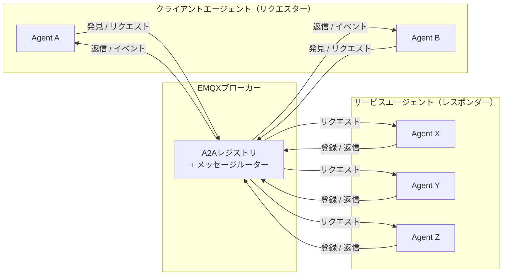
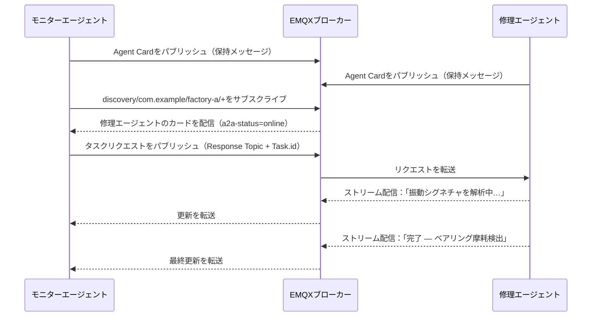

# MQTTによるA2Aの仕組み

本ページでは、MQTTによるA2Aの基本概念について説明します。エージェント、クライアント、ブローカーの構成、エージェント同士の識別と発見方法、Agent Cardの内容、エージェント間の通信パターンを解説します。これらの概念を理解することが、EMQXのA2Aレジストリを利用する基礎となります。

## アーキテクチャ

MQTTによるA2Aは、ブローカー中心モデルで以下の3者が参加します。

- **エージェント（レスポンダー）**: 自身のAgent Cardを保持メッセージとして発見トピックにパブリッシュし、自身のリクエストトピックをサブスクライブして、受信したタスクリクエストに応答します。
- **クライアントエージェント（リクエスター）**: 発見トピックをサブスクライブして利用可能なエージェントを検出し、タスクリクエストを送信し、返信を受け取ります。
- **MQTTブローカー（EMQX）**: すべてのメッセージをルーティングし、Agent CardをA2Aレジストリに記録し、認証・認可を実施し、発見メッセージにライブネスメタデータを付与します。



## エージェント識別

各エージェントは3階層の階層構造で識別されます。

```
{org_id} / {unit_id} / {agent_id}
```

- **org_id**: エージェントが所属する組織（例：`com.example`）。
- **unit_id**: 組織内の区分、例えばチームやデプロイ環境（例：`factory-a`）。
- **agent_id**: orgおよびunit内で一意のエージェント識別子（例：`iot-ops-agent-001`）。

3つのセグメントすべてが `^[A-Za-z0-9_.-]+$` にマッチし、`/`、`+`、`#`、空白を含んではいけません。エージェントのMQTTクライアントIDは、結合形式 `{org_id}/{unit_id}/{agent_id}` を使用します。

## トピックモデル

| トピック | 用途 |
|---|---|
| `$a2a/v1/discovery/{org_id}/{unit_id}/{agent_id}` | エージェント登録および発見（保持メッセージ） |
| `$a2a/v1/request/{org_id}/{unit_id}/{agent_id}` | 特定エージェントへのタスクリクエスト受信 |
| `$a2a/v1/reply/{org_id}/{unit_id}/{agent_id}/{suffix}` | 推奨される返信トピックパターン（下記参照） |
| `$a2a/v1/event/{org_id}/{unit_id}/{agent_id}` | 要求なしのイベントパブリッシュ |
| `$a2a/v1/request/{org_id}/{unit_id}/pool/{pool_id}` | ロードバランスされた共有プールトピック |

::: tip 補足
返信トピックは固定のプロトコルトピックではありません。リクエスターは任意のトピックを返信トピックとして使用可能です。レスポンダーはMQTT v5の`Response Topic`プロパティから返信先を知ります。上記パターンは一貫性を保ちACL設定を簡素化するための推奨例です。
:::

発見サブスクリプションはワイルドカードを用いて範囲を指定します。

```
$a2a/v1/discovery/com.example/+/+     # 組織内の全エージェント
$a2a/v1/discovery/com.example/factory-a/+  # ユニット内の全エージェント
```

## Agent Card

Agent Cardはエージェントが自身の発見トピックにパブリッシュするJSONドキュメントです。エージェントの識別情報、機能、HTTPエンドポイント、任意のセキュリティメタデータを記述します。EMQXは受信時にA2Aレジストリにカードを記録します。

必須フィールド：

| フィールド | 型 | 説明 |
|---|---|---|
| `name` | 文字列 | 人間が読みやすいエージェント名。 |
| `description` | 文字列 | エージェントの簡単な説明。 |
| `version` | 文字列 | バージョン文字列（例：`"1.0.0"`）。 |
| `url` | 文字列（URI） | エージェントのエンドポイントURI。任意。 |
| `skills` | 配列 | 少なくとも1つのスキルオブジェクト（`id`、`name`、`description`を含む）。 |

最小限のAgent Card例：

```json
{
  "name": "IoT Operations Agent",
  "description": "工場のテレメトリを監視し、修復アクションを調整します。",
  "version": "1.2.3",
  "url": "mqtts://broker.example.com:8883",
  "skills": [
    {
      "id": "device-diagnostics",
      "name": "デバイス診断",
      "description": "テレメトリを解析し、デバイス異常を検出します。"
    }
  ]
}
```

`capabilities`、`securitySchemes`、`supportedInterfaces`、拡張パラメータを含む完全なAgent Cardスキーマは、[A2A仕様](https://a2a-protocol.org/latest/specification/)をご参照ください。

## エージェントのライブネス

Agent Cardはエージェントが切断後も保持メッセージとして残ります。EMQXは接続状態を追跡し、発見メッセージをサブスクライバーに転送する際にMQTT v5のユーザープロパティを付与します。

| ユーザープロパティ | 値 | 意味 |
|---|---|---|
| `a2a-status` | `online` | エージェントのMQTT接続がアクティブ。 |
| `a2a-status` | `offline` | エージェントが切断済み（正常終了またはLWTによる）。 |
| `a2a-status-source` | `broker` | EMQXによって状態が設定された。 |
| `a2a-status-source` | `agent` | エージェント自身によって状態が設定された。 |
| `a2a-status-source` | `lwt` | 予期しない切断（Last Will）を反映。 |

エージェントは自身の発見トピックに対して、`a2a-status=offline` と `a2a-status-source=lwt` を含むLast Willメッセージを設定し、非正常切断時にサブスクライバーへ自動通知されるようにしてください。

## インタラクションパターン

MQTTによるA2Aは、以下のエージェント間インタラクションパターンをサポートします。いずれもMQTT v5の`Response Topic`と`Correlation Data`プロパティを用いてリクエスト／返信のルーティングを行い、リクエスター生成の`Task.id`でタスク状態をライフサイクル全体にわたり追跡します。

| パターン | 説明 |
|---|---|
| 1リクエスト1レスポンス | リクエスターがタスクリクエストをパブリッシュし、レスポンダーが指定された`Response Topic`に単一の返信をパブリッシュ。 |
| ストリーミングレスポンス | レスポンダーが複数のステータスや成果物更新メッセージをパブリッシュし、最終的なタスク完了状態に至るまで継続。 |
| マルチターン会話 | 関連タスクを`Task.context_id`でグループ化し、中断したタスクを再開可能に。 |
| 共有プールディスパッチ | 複数エージェントインスタンスがプールトピックを共有し、MQTT共有サブスクリプションでロードバランスされたリクエスト処理。 |
| タスクハンドオーバー | レスポンダーが進行中のタスクを`a2a-responder-agent-id`ユーザープロパティを使って別インスタンスに委譲。 |
| OAuth 2.0認可 | リクエストごとにベアラートークンを`a2a-authorization` MQTTユーザープロパティとして渡す。 |
| エンドツーエンドセキュリティ | オプションの`ubsp-v1`セキュリティプロファイルが、信頼できないブローカー環境向けにペイロードのエンドツーエンド暗号化を提供。 |

各パターンの詳細な仕様は、[MQTTによるA2Aトランスポート仕様](https://www.emqx.com/mqtt-for-ai/a2a-over-mqtt/specification/0.1/basic/mqtt_transport.html)をご覧ください。

## 例：工場アラート対応ワークフロー

2つのエージェントが協力して工場フロアのアラートに対応します。異常を検知し診断タスクを委譲する**モニターエージェント**と、それを処理し結果をストリームで返す**修理エージェント**です。

**ステップ1: 両エージェントが登録。** 各エージェントは自身のAgent Cardを保持メッセージとして発見トピックにパブリッシュします。EMQXはカードを記録し、両エージェントをオンラインとしてマークします。

**ステップ2: モニターエージェントが修理エージェントを発見。** モニターエージェントは`$a2a/v1/discovery/com.example/factory-a/+`をサブスクライブし、修理エージェントの保持されたカードを即座に受信、設備故障の診断が可能であることを確認します。

**ステップ3: モニターエージェントがタスクリクエストを送信。** モーター`line-7`から異常振動の読み取りが届きます。モニターエージェントは修理エージェントのリクエストトピックに、ユニークな`Task.id`とMQTTの`Response Topic`プロパティで返信トピックを指定してリクエストをパブリッシュします。

**ステップ4: 修理エージェントがステータス更新をストリーム配信。** 修理エージェントは返信トピックに進捗更新をパブリッシュし、最終的に`completed`ステータスを送信します：ベアリング摩耗検出、検査予定。各更新は元の`Correlation Data`をエコーし、モニターエージェントがリクエストに紐づけられるようにします。


