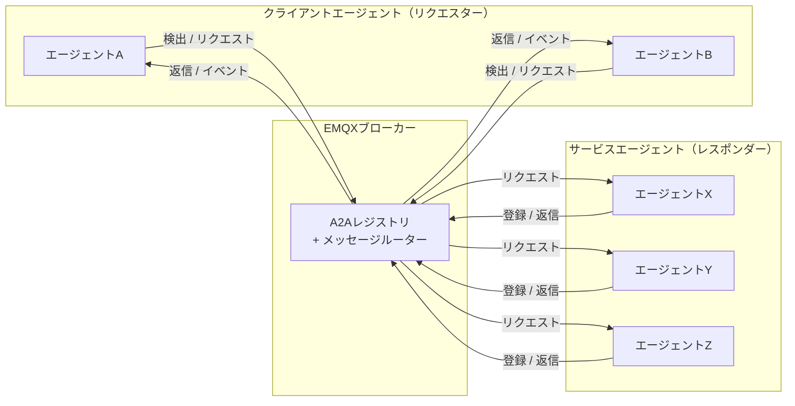
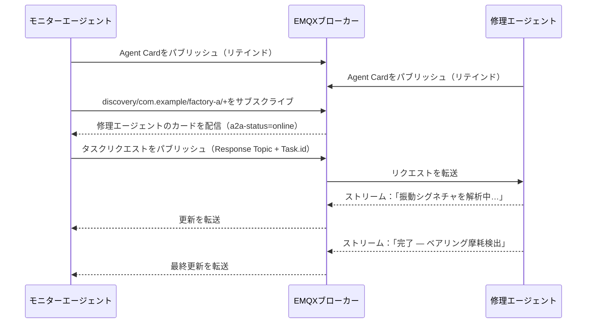

# MQTTによるA2Aの仕組み

このページでは、MQTTによるA2Aの基本概念について説明します。エージェント、クライアント、ブローカーの構成、エージェント同士の識別と検出方法、Agent Cardの内容、エージェント間の通信パターンなどを解説します。これらの概念を理解することは、EMQXのA2Aレジストリを活用するための基礎となります。

## アーキテクチャ

MQTTによるA2Aは、ブローカー中心のモデルで3つの参加者が存在します。

- **エージェント（レスポンダー）**：自身のAgent Cardを検出トピックにリテインドメッセージとしてパブリッシュし、リクエストトピックをサブスクライブして、受信したタスクリクエストに応答します。
- **クライアントエージェント（リクエスター）**：検出トピックをサブスクライブして利用可能なエージェントを探索し、タスクリクエストを送信し、返信を受信します。
- **MQTTブローカー（EMQX）**：すべてのメッセージをルーティングし、A2AレジストリにAgent Cardを記録し、認証と認可を実施し、検出メッセージにライブネスメタデータを付加します。



## エージェントの識別

各エージェントは3階層の階層構造で識別されます。

```
{org_id} / {unit_id} / {agent_id}
```

- **org_id**：エージェントが所属する組織（例：`com.example`）
- **unit_id**：組織内の部署やチーム、デプロイ環境などの区分（例：`factory-a`）
- **agent_id**：組織・部署内で一意のエージェント識別子（例：`iot-ops-agent-001`）

3つのセグメントはすべて `^[A-Za-z0-9_.-]+$` にマッチし、`/`、`+`、`#`、空白文字を含んではいけません。エージェントのMQTTクライアントIDは、これらを組み合わせた形式 `{org_id}/{unit_id}/{agent_id}` を使用します。

## トピックモデル

| トピック | 用途 |
|---|---|
| `$a2a/v1/discovery/{org_id}/{unit_id}/{agent_id}` | エージェントの登録および検出（リテインド） |
| `$a2a/v1/request/{org_id}/{unit_id}/{agent_id}` | 特定エージェントへのタスクリクエスト受信 |
| `$a2a/v1/reply/{org_id}/{unit_id}/{agent_id}/{suffix}` | 推奨される返信トピックパターン（下記注記参照） |
| `$a2a/v1/event/{org_id}/{unit_id}/{agent_id}` | 要求なしのイベントパブリッシュ |
| `$a2a/v1/request/{org_id}/{unit_id}/pool/{pool_id}` | ロードバランスされた共有プールトピック |

::: tip 注記
返信トピックは固定のプロトコルトピックではありません。リクエスターは任意のトピックを返信トピックとして使用できます。レスポンダーはMQTT v5の`Response Topic`プロパティから返信先を知ります。上記パターンは一貫性を保ちACL設定を簡素化するための推奨例です。
:::

検出サブスクリプションはワイルドカードを使って範囲を指定します。

```
$a2a/v1/discovery/com.example/+/+     # 組織内のすべてのエージェント
$a2a/v1/discovery/com.example/factory-a/+  # 部署内のすべてのエージェント
```

## Agent Card

Agent Cardは、エージェントが自身の検出トピックにパブリッシュするJSONドキュメントです。エージェントの識別情報、機能、HTTPエンドポイント、任意のセキュリティメタデータを記述します。EMQXは受信時にA2Aレジストリにカードを記録します。

最低限必要なフィールド：

| フィールド | 型 | 説明 |
|---|---|---|
| `name` | 文字列 | 人間が読めるエージェント名 |
| `description` | 文字列 | エージェントの概要説明 |
| `version` | 文字列 | バージョン文字列（例："1.0.0"） |
| `url` | 文字列（URI） | エージェントのエンドポイントURI。任意 |
| `skills` | 配列 | 少なくとも1つのスキルオブジェクト。各スキルは`id`、`name`、`description`を持つ |

最小限のAgent Cardの例：

```json
{
  "name": "IoT Operations Agent",
  "description": "工場のテレメトリを監視し、修復アクションを調整します。",
  "version": "1.2.3",
  "url": "mqtts://broker.example.com:8883",
  "skills": [
    {
      "id": "device-diagnostics",
      "name": "デバイス診断",
      "description": "テレメトリを解析し、デバイス異常を検出します。"
    }
  ]
}
```

`capabilities`、`securitySchemes`、`supportedInterfaces`、拡張パラメータを含む完全なAgent Cardスキーマは、[A2A仕様](https://a2a-protocol.org/latest/specification/)をご参照ください。

## エージェントのライブネス

Agent Cardはエージェントが切断された後もリテインドメッセージとして残ります。EMQXは接続状態を追跡し、検出メッセージをサブスクライバーに転送する際にMQTT v5のユーザープロパティを付加します。

| ユーザープロパティ | 値 | 意味 |
|---|---|---|
| `a2a-status` | `online` | エージェントのMQTT接続がアクティブ |
| `a2a-status` | `offline` | エージェントが切断済み（正常切断またはLWTによる） |
| `a2a-status-source` | `broker` | EMQXが状態を設定 |
| `a2a-status-source` | `agent` | エージェント自身が状態を設定 |
| `a2a-status-source` | `lwt` | 予期しない切断（Last Will）を反映 |

エージェントは検出トピックに`a2a-status=offline`、`a2a-status-source=lwt`のLast Willメッセージを設定し、異常切断時にサブスクライバーへ自動通知されるようにしてください。

## インタラクションパターン

MQTTによるA2Aは、エージェント間で以下のインタラクションパターンをサポートします。いずれもMQTT v5の`Response Topic`と`Correlation Data`プロパティを使用し、リクエスター側で生成する`Task.id`によりタスクの状態をライフサイクル全体で追跡します。

| パターン | 説明 |
|---|---|
| 1リクエスト1レスポンス | リクエスターがタスクリクエストをパブリッシュし、レスポンダーが指定された`Response Topic`に単一の返信をパブリッシュ |
| ストリーミングレスポンス | レスポンダーが複数のステータスや成果物更新メッセージをパブリッシュし、最終的なタスク完了状態に達するまで続ける |
| マルチターン会話 | 関連タスクを`Task.context_id`でグループ化し、中断したタスクの再開を可能にする |
| 共有プールディスパッチ | 複数のエージェントインスタンスがプールトピックを共有し、MQTT共有サブスクリプションでロードバランスされたリクエスト処理を行う |
| タスクハンドオーバー | レスポンダーが進行中のタスクを`a2a-responder-agent-id`ユーザープロパティを使って別インスタンスに委譲する |
| OAuth 2.0認可 | リクエストごとにベアラートークンを`a2a-authorization` MQTTユーザープロパティとして渡す |
| エンドツーエンドセキュリティ | 任意の`ubsp-v1`セキュリティプロファイルにより、信頼できないブローカー環境でもペイロードのエンドツーエンド暗号化を提供 |

各パターンの詳細な仕様は、[MQTTによるA2Aトランスポート仕様](https://www.emqx.com/mqtt-for-ai/a2a-over-mqtt/specification/0.1/basic/mqtt_transport.html)をご覧ください。

## 例：工場アラート対応のワークフロー

2つのエージェントが協力して工場フロアのアラートを処理します。異常を検知して診断タスクを委譲する**モニターエージェント**と、タスクを処理して結果をストリーム配信する**修理エージェント**です。

**ステップ1：両エージェントが登録。** 各エージェントは自身のAgent Cardを検出トピックにリテインドメッセージとしてパブリッシュします。EMQXはカードを記録し、両エージェントをオンライン状態としてマークします。

**ステップ2：モニターエージェントが修理エージェントを検出。** モニターエージェントは`$a2a/v1/discovery/com.example/factory-a/+`をサブスクライブし、修理エージェントのリテインドカードを即座に受信、設備故障の診断が可能であることを確認します。

**ステップ3：モニターエージェントがタスクリクエストを送信。** モーター`line-7`から異常振動の読み取りが届きます。モニターエージェントは修理エージェントのリクエストトピックに、ユニークな`Task.id`とMQTTの`Response Topic`プロパティを設定してリクエストをパブリッシュします。

**ステップ4：修理エージェントがステータス更新をストリーム配信。** 修理エージェントは返信トピックに進捗更新をパブリッシュし、最終的に`completed`ステータス（ベアリング摩耗検出、検査予定）を送信します。各更新は元の`Correlation Data`をエコーし、モニターエージェントがリクエストと対応付けられるようにします。


