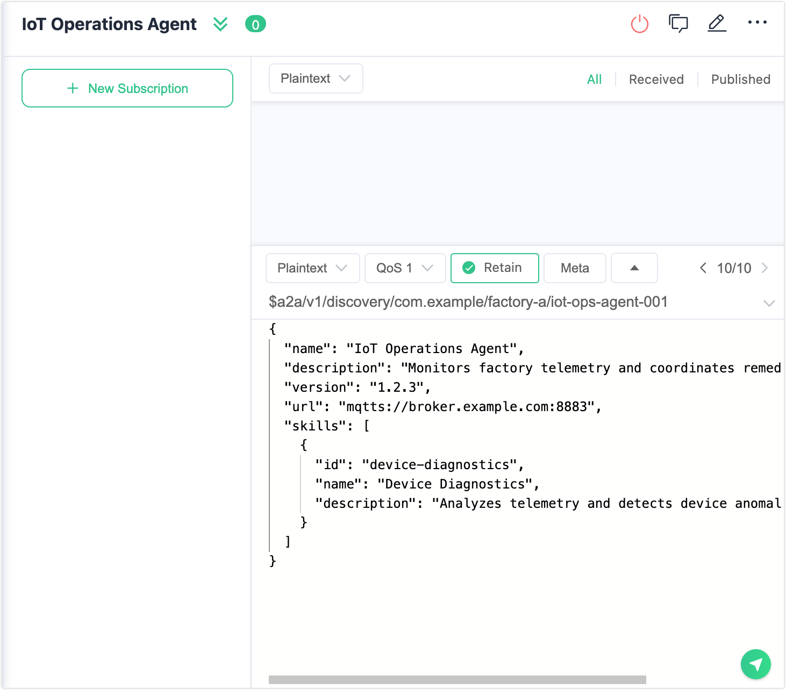

# Manage Agents

This page describes how to enable the A2A Registry and how to register, view, and remove agents using the Dashboard UI, the CLI, or MQTT.

## Prerequisites

- EMQX 6.2.0 or later.
- Administrator access to the Dashboard or the EMQX node.

## Enable the A2A Registry

The A2A Registry is disabled by default. Enable it before registering any agents.

### Via the Dashboard

1. In the left navigation panel, click **A2A Registry**.
2. Click **Settings**.
3. Toggle **Enable A2A Registry** to on.
4. **Validate Schema** is enabled by default. When enabled, EMQX validates Agent Card payloads against the A2A schema on registration and rejects non-conforming cards. Disable it only if you need to accept cards that deviate from the schema.
5. Click **Save Changes**.

### Via Configuration File

Add the following to your `emqx.conf`:

```hocon
a2a_registry {
  enable = true
  validate_schema = true
}
```

Full configuration options:

| Parameter | Type | Default | Description |
|---|---|---|---|
| `enable` | Boolean | `false` | Enables the A2A Registry. |
| `validate_schema` | Boolean | `true` | Validates Agent Card payloads against the A2A schema on registration. Invalid cards are rejected. |
| `max_card_size` | Integer | `65536` | Maximum Agent Card payload size in bytes. |
| `registration_rate_limit` | Integer | `10` | Maximum registration updates per minute per agent. |
| `require_security_metadata` | Boolean | `false` | When enabled, requires Agent Cards to include a `jwksUri` in their security metadata extension. |
| `trusted_jkus` | Array | `[]` | If non-empty, the `jwksUri` in any Agent Card must match one of the listed prefixes. An empty list disables JKU enforcement (permissive mode). |
| `verify_jku_tls` | Boolean | `true` | Validates TLS certificates when fetching JWKS endpoints. |

## Register an Agent

An agent registers itself by publishing its Agent Card to the A2A Registry, making it discoverable by other agents. You can register an agent through the Dashboard, via MQTT, or using the CLI.

### Via the Dashboard

1. Click **A2A Registry** -> **+ Register Agent**.
2. Fill in the identity fields:

   - **Organization ID**: The organization or trust domain the agent belongs to, for example, `com.example`. Use reverse-DNS notation for uniqueness across deployments.
   - **Unit ID**: A subdivision within the organization, such as a business unit or deployment environment, for example, `factory-a`.
   - **Agent ID**: A unique identifier for this agent within the organization and unit, for example, `iot-ops-agent-001`.

   All three values must contain only alphanumeric characters, hyphens, underscores, or periods (`^[A-Za-z0-9._-]+$`), and must not contain `/`, `+`, `#`, or whitespace. Together they form the agent's full address: `{org_id}/{unit_id}/{agent_id}`.

3. Paste the Agent Card JSON into the editor. Click the **Help** button to see the required fields and a template.
4. Click **Register Agent**.

### Via MQTTX

Agents register by publishing their Agent Card as a retained message to their discovery topic. The requirements are:

- MQTT protocol version 5.
- Client ID set to `{org_id}/{unit_id}/{agent_id}`.
- Retain flag enabled, QoS 1.
- Payload: Agent Card JSON with at least `name`, `description`, `version`, `url`, and `skills`.

**Use MQTTX Desktop:**

1. Open MQTTX and click **New Connection**.

2. Fill in the connection details:
   - **Name**: Name of the connection, for example, `IoT Operations Agent`
   - **Host**: Your EMQX broker address.
   - **Port**: `1883` (or the appropriate port).
   - **Client ID**: Set to `com.example/factory-a/iot-ops-agent-001`.
   - **MQTT Version**: `5.0`.
   
   
   
3. Click **Connect**.

4. In the message compose area at the bottom, fill in:
   - **Topic**: `$a2a/v1/discovery/com.example/factory-a/iot-ops-agent-001`
   - **QoS**: `1`
   - **Retain**: Enabled
   - **Payload**: The Agent Card JSON (see example below).
   
5. Click the send button.

```json
{
  "name": "IoT Operations Agent",
  "description": "Monitors factory telemetry and coordinates remediation actions.",
  "version": "1.2.3",
  "url": "mqtts://broker.example.com:8883",
  "skills": [
    {
      "id": "device-diagnostics",
      "name": "Device Diagnostics",
      "description": "Analyzes telemetry and detects device anomalies."
    }
  ]
}
```



**Use MQTTX CLI:**

```bash
mqttx pub \
  -h localhost -p 1883 \
  -V 5 \
  -i "com.example/factory-a/iot-ops-agent-001" \
  -t '$a2a/v1/discovery/com.example/factory-a/iot-ops-agent-001' \
  -m '{"name":"IoT Operations Agent","description":"Monitors factory telemetry and coordinates remediation actions.","version":"1.2.3","url":"mqtts://broker.example.com:8883","skills":[{"id":"device-diagnostics","name":"Device Diagnostics","description":"Analyzes telemetry and detects device anomalies."}]}' \
  -q 1 -r
```

If **Validate Schema** is enabled, EMQX validates the payload before recording it. An invalid card is rejected with a PUBACK reason code.

### Via the CLI

```bash
emqx ctl a2a-registry register <path-to-agent-card.json>
```

The JSON file must contain the Agent Card fields as well as the identity fields used for routing:

```json
{
  "org_id": "com.example",
  "unit_id": "factory-a",
  "agent_id": "iot-ops-agent-001",
  "name": "IoT Operations Agent",
  "description": "Monitors factory telemetry and coordinates remediation actions.",
  "version": "1.2.3",
  "url": "mqtts://broker.example.com:8883",
  "skills": [
    {
      "id": "device-diagnostics",
      "name": "Device Diagnostics",
      "description": "Analyzes telemetry and detects device anomalies."
    }
  ]
}
```

## View Registered Agents

You can browse and inspect registered agents through the Dashboard or query them using the CLI.

### Via the Dashboard

The **A2A Registry** page lists all registered agents. Each row has two action buttons: **Agent Card JSON** and **Delete**.

Use the **Organization ID**, **Unit ID**, and **Agent ID** filter fields at the top to narrow the list.

Click **Agent Card JSON** on any row to view the full Agent Card as raw JSON with a copy button.


### Via the CLI

```bash
# List all agents
emqx ctl a2a-registry list

# Filter by org and status
emqx ctl a2a-registry list --org com.example --status online

# Get the full Agent Card for a specific agent
emqx ctl a2a-registry get com.example factory-a iot-ops-agent-001

# Show registry statistics
emqx ctl a2a-registry stats
```

## Remove an Agent

Removing an agent deregisters it from the A2A Registry and clears its retained Agent Card, making it no longer discoverable.

### Via the Dashboard

In the agent list, click the delete action for the agent you want to remove. Confirm by typing the full `{org_id}/{unit_id}/{agent_id}` when prompted.

### Via MQTT

Publish an empty retained message to the agent's discovery topic. This clears the retained card and removes the agent from the registry.

**Use MQTTX Desktop:**

1. Connect using the agent's Client ID (`com.example/factory-a/iot-ops-agent-001`).
2. Set the topic to `$a2a/v1/discovery/com.example/factory-a/iot-ops-agent-001`, QoS `1`, **Retain** enabled, and leave the payload empty.
3. Click the send button.

**Using MQTTX CLI:**

```bash
mqttx pub \
  -h localhost -p 1883 \
  -V 5 \
  -i "com.example/factory-a/iot-ops-agent-001" \
  -t '$a2a/v1/discovery/com.example/factory-a/iot-ops-agent-001' \
  -m '' \
  -q 1 -r
```

### Via the CLI

```bash
emqx ctl a2a-registry delete com.example factory-a iot-ops-agent-001
```

## Discover Agents via MQTT

Client agents subscribe to discovery topics using wildcards to find available agents. Because the cards are retained, they are delivered immediately on subscribe.

**Use MQTTX Desktop:**

1. Connect to your EMQX broker.
2. Click **+ New Subscription** and enter a wildcard topic, for example, `$a2a/v1/discovery/com.example/+/+` to discover all agents in an organization.
3. Click **Confirm**. Retained Agent Cards appear in the message pane immediately.

**Use MQTTX CLI:**

```bash
# All agents in an organization
mqttx sub -h localhost -p 1883 -V 5 -t '$a2a/v1/discovery/com.example/+/+' -v

# All agents in a specific unit
mqttx sub -h localhost -p 1883 -V 5 -t '$a2a/v1/discovery/com.example/factory-a/+' -v

# A specific agent
mqttx sub -h localhost -p 1883 -V 5 -t '$a2a/v1/discovery/com.example/factory-a/iot-ops-agent-001' -v
```

The `-v` flag prints the topic name before each received payload.

Each received message contains the Agent Card JSON as the payload. EMQX attaches the following MQTT v5 User Properties to indicate liveness:

| User Property | Value | Meaning |
|---|---|---|
| `a2a-status` | `online` | Agent is currently connected. |
| `a2a-status` | `offline` | Agent has disconnected. |
| `a2a-status-source` | `broker` | Status set by EMQX based on connection state. |
| `a2a-status-source` | `agent` | Status published proactively by the agent itself (for example, graceful offline). |
| `a2a-status-source` | `lwt` | Status reflects an ungraceful disconnect detected via Last Will and Testament. |
