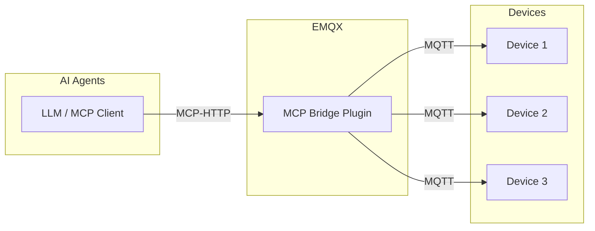
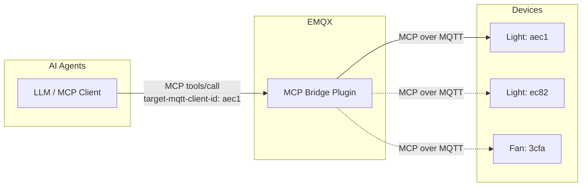
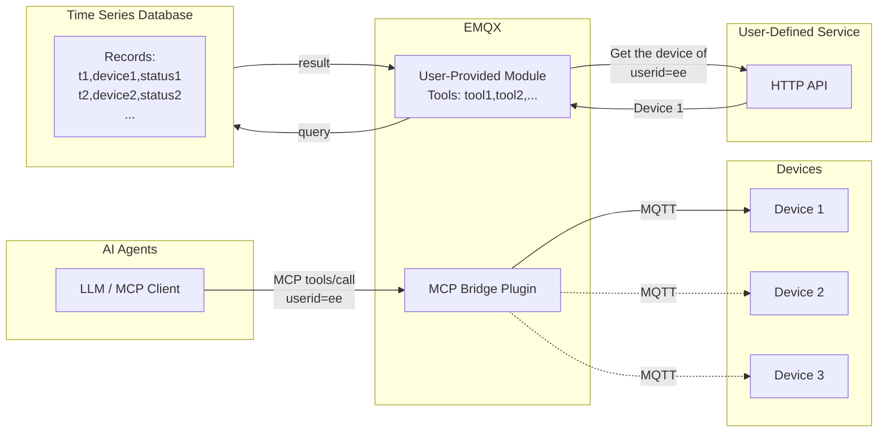

# MCP ブリッジプラグイン

<<<<<<< HEAD
[EMQX MCP ブリッジプラグイン](https://github.com/emqx/emqx_mcp_bridge) は、EMQX と MCP（Model Context Protocol）対応デバイスを統合するためのプラグインです。このプラグインを使うことで、ユーザーは MCP 対応の大規模言語モデルや AI エージェントを用いて IoT デバイスにアクセスし、制御できます。
=======
[EMQX MCP ブリッジプラグイン](https://github.com/emqx/emqx_mcp_bridge) は、EMQX と MCP（Model Context Protocol）対応デバイスを統合するためのプラグインです。このプラグインを使用することで、ユーザーは MCP 対応の大規模言語モデルや AI エージェントを使って IoT デバイスにアクセスし、制御することができます。
>>>>>>> origin/release-5.10

## MCP ブリッジプラグインの仕組み

MCP ブリッジプラグインは EMQX 内にインストールされて動作します。起動後、Streamable HTTP または SSE に基づく MCP 接続を MQTT プロトコルに変換する HTTP エンドポイントを公開します。

IoT デバイスは MQTT を使って EMQX ブローカーに接続し、MCP 対応の大規模モデルや AI エージェントは MCP ブリッジプラグインが公開する HTTP エンドポイントに接続します。

<<<<<<< HEAD
## MCP over MQTT を使ったデバイスへのアクセス

デバイス側は MCP over MQTT プロトコルを使用して MCP サーバーとして動作し、自身のツールや機能を直接公開できます。プラグインはデバイスが登録したツールをツールタイプごとに集約します。MCP ブリッジプラグインでは、MCP over MQTT プロトコルの Server Name の概念をツールタイプにマッピングしています。

つまり、同じタイプの複数デバイスが登録したツールは、ブリッジプラグインによって単一の論理ツールとして集約され、MCP クライアントから呼び出せるようになります。

この方式は、スマートホームや産業制御システム、音声対応玩具など、単一または少数のデバイスにアクセスするクライアント向けのシナリオに適しています。これらのシナリオでは、ユーザーは大規模なデバイス群を管理するのではなく、自身のデバイスにのみアクセスすることが一般的です。

同じタイプの複数デバイスのツールを単一の論理ツールに集約するため、MCP ブリッジプラグインはツール定義に必須パラメータとして `target-mqtt-client-id` を注入します。AI エージェントがツールを呼び出す際は、ビジネスロジックに基づいて対象デバイスの ID を特定し、このパラメータで指定する必要があります。これにより MCP リクエストが特定のデバイスにルーティングされます。
=======
## MCP over MQTT を使ったデバイスアクセス

デバイス側では、MCP over MQTT プロトコルを使用して MCP サーバーとして動作し、自身のツールや機能を直接公開できます。プラグインはデバイスが登録したツールをツールタイプごとに集約します。MCP ブリッジプラグインでは、MCP over MQTT プロトコルの Server Name の概念をツールタイプにマッピングしています。

つまり、同じタイプの複数デバイスが登録したツールは、ブリッジプラグインによって単一の論理的なツールに集約され、MCP クライアントから呼び出せるようになります。

この方式は、スマートホーム、産業制御システム、音声対応玩具など、単一または少数のデバイスにクライアントがアクセスするシナリオに適しています。これらのシナリオでは、ユーザーは大規模なデバイス群を管理するのではなく、自分のデバイスにのみアクセスできれば十分です。

同じタイプの複数デバイスのツールを単一の論理ツールに集約しているため、MCP ブリッジプラグインはツール定義に `target-mqtt-client-id` という必須パラメータを注入します。AI エージェントがツールを呼び出す際は、ビジネスロジックに基づいて対象デバイスの ID を特定し、このパラメータで指定する必要があります。これにより MCP リクエストは特定のデバイスへルーティングされます。
>>>>>>> origin/release-5.10

<<<<<<< HEAD
## 標準 MQTT を使ったデバイスへのアクセス

デバイスは MCP over MQTT ではなく標準 MQTT プロトコルを使って EMQX に接続することも可能です。この場合、ユーザーは MCP ブリッジプラグイン内で MCP ツールを直接実装し、通常の MQTT デバイスに間接的にアクセスできます。

この方式は、スマートシティ、コネクテッドビークル、産業用 IoT など、より柔軟なデバイスアクセスが求められるシナリオに適しています。MCP ブリッジプラグイン内では、ユーザー定義の外部サービスや API へのアクセス、外部データベースからのデバイス報告データの取得など、任意のビジネスロジックを実装可能です。

MCP ツールをコードで実装する方法の例については、[Create Custom MCP Tools](https://github.com/emqx/emqx_mcp_bridge?tab=readme-ov-file#create-custom-mcp-tools) を参照してください。
=======
## 標準 MQTT を使ったデバイスアクセス

デバイスは MCP over MQTT の代わりに標準 MQTT プロトコルを使って EMQX に接続することも可能です。この場合、ユーザーは MCP ブリッジプラグイン内で MCP ツールを直接実装し、これらの通常の MQTT デバイスに間接的にアクセスできます。

この方式は、スマートシティ、コネクテッドビークル、産業用 IoT など、より柔軟なデバイスアクセスが求められるシナリオに適しています。MCP ブリッジプラグイン内では、ユーザー定義の外部サービスや API へのアクセス、外部データベースからのデバイス報告データの取得など、任意のビジネスロジックを実装できます。

MCP ツールのコード実装例については、[Create Custom MCP Tools](https://github.com/emqx/emqx_mcp_bridge?tab=readme-ov-file#create-custom-mcp-tools) を参照してください。
>>>>>>> origin/release-5.10

